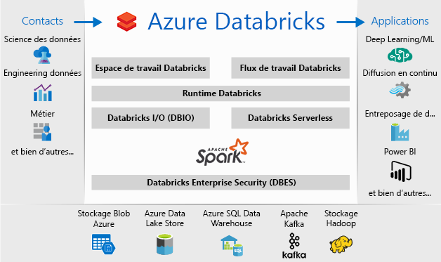
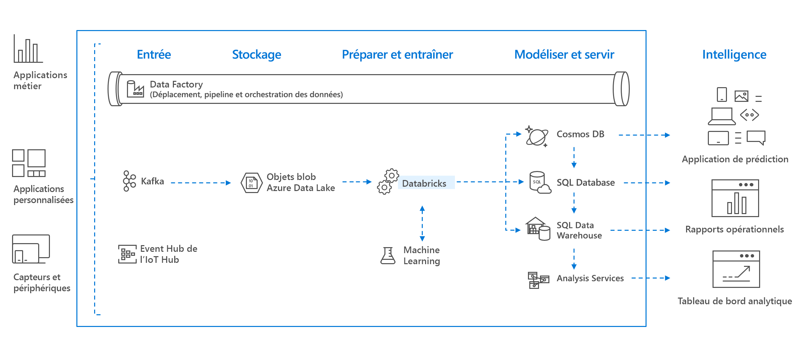

# Présentation d’Azure Databricks

Azure Databricks est une plateforme d’analytique basée sur Apache Spark et optimisée pour la plateforme de services cloud Microsoft Azure. Conçu avec les créateurs d’Apache Spark, Databricks est intégré dans Azure pour offrir une configuration en un clic, des workflows simplifiés et un espace de travail interactif permettant aux scientifiques des données, aux ingénieurs des données et aux analystes métier de collaborer.

Azure Databricks est un service d’analyse rapide, simple et collaboratif basé sur Apache Spark. Pour un pipeline de Big Data, les données (brutes ou structurées) sont ingérées en lots dans Azure par le biais d’Azure Data Factory ou diffusées en continu en quasi temps réel avec Kafka, Event Hub ou IoT Hub. Elles aboutissent dans un lac de données en vue d’un stockage persistant à long terme, dans le Stockage Blob Azure ou Azure Data Lake Storage. Dans le cadre de votre workflow analytique, utilisez Azure Databricks pour lire des données issues de plusieurs sources de données, comme le [Stockage Blob Azure](../storage/blobs/storage-blobs-introduction.md), [Azure Data Lake Storage](../data-lake-store/index.md), [Azure Cosmos DB](../cosmos-db/index.yml) ou [Azure SQL Data Warehouse](../sql-data-warehouse/index.yml), et les transformer en insights novateurs avec Spark.

## Plateforme d’analytique basée sur Apache Spark

Azure Databricks comprend toutes les technologies et fonctionnalités du cluster Apache Spark open source. Spark dans Azure Databricks inclut les composants suivants :

* **Spark SQL et DataFrames** : Spark SQL est le module Spark permettant d’utiliser des données structurées. Une trame de données est une collection distribuée de données organisées en colonnes nommées. D’un point de vue conceptuel, elle équivaut à une table d’une base de données relationnelle ou à une trame de données dans R/Python.

* **Streaming** : Traitement et analyse des données en temps réel pour des applications analytiques et interactives. S’intègre à HDFS, Flume et Kafka.

* **MLlib** : Bibliothèque de Machine Learning constituée d’utilitaires et d’algorithmes d’apprentissage courants, notamment la classification, la régression, le clustering, le filtrage collaboratif, la réduction de la dimensionnalité, ainsi que les primitives d’optimisation sous-jacentes.

* **GraphX** : Graphes et calcul de graphes pour des cas d’usage très divers qui vont de l’analytique cognitive à l’exploration de données.

* **API Spark Core** : Inclut la prise en charge de R, SQL, Python, Scala et Java.

## Apache Spark dans Azure Databricks

Azure Databricks s’appuie sur les fonctionnalités de Spark en fournissant une plateforme cloud sans administration, qui inclut :

- Des clusters Spark entièrement gérés
- Un espace de travail interactive pour l’exploration et la visualisation
- Une plateforme pour tirer parti de vos applications Spark favorites

### Des clusters Apache Spark entièrement gérés dans le cloud

Azure Databricks a un environnement de production sécurisé et fiable dans le cloud, géré et pris en charge par des experts Spark. Vous pouvez :

* Créer des clusters en quelques secondes.
* Mettre à l’échelle dynamiquement des clusters, notamment des clusters serverless, et les partager entre plusieurs équipes. 
* Utiliser des clusters par programmation avec les API REST. 
* Utiliser les fonctionnalités d’intégration des données sécurisées s’appuyant sur Spark, qui vous permettent d’unifier vos données sans centralisation. 
* Accéder immédiatement aux dernières fonctionnalités d’Apache Spark avec chaque version.

### Runtime Databricks
Le runtime Databricks s’appuie sur Apache Spark et est conçu nativement pour le cloud Azure. 

Avec l’option **Serverless**, Azure Databricks masque complètement la complexité de l’infrastructure et vous évite de devoir recourir à une expertise spécialisée pour installer et configurer votre infrastructure de données. Cette option permet aux scientifiques des données d’itérer rapidement dans le cadre d’une équipe.

Pour les ingénieurs des données, qui sont concernés par les performances des travaux de production, Azure Databricks fournit un moteur Spark qui est plus rapide et performant grâce à différentes optimisations au niveau de la couche des E/S et de la couche de traitement (E/S Databricks).

### Espace de travail pour la collaboration

Via un environnement collaboratif et intégré, Azure Databricks simplifie le processus d’exploration des données, de prototypage et d’exécution des applications pilotées par les données dans Spark.

* Déterminez comment utiliser les données avec une exploration des données facilitée.
* Documentez votre progression dans des notebooks en R, Python, Scala ou SQL.
* Visualisez les données en quelques clics et utilisez des outils répandus comme Matplotlib, ggplot ou d3.
* Utilisez des tableaux de bord interactifs pour créer des rapports dynamiques.
* Utilisez Spark et interagissez avec les données simultanément.

## Sécurité d’entreprise

Azure Databricks offre une sécurité Azure de niveau entreprise, notamment l’intégration d’Azure Active Directory, des contrôles basés sur les rôles et des contrats SLA qui protègent vos données et votre entreprise.

* L’intégration à Azure Active Directory vous permet d’appliquer des solutions Azure complètes avec Azure Databricks.
* L’accès basé sur les rôles d’Azure Databricks permet de définir des autorisations utilisateur précises sur les notebooks, les clusters, les travaux et les données.
* Contrats SLA de niveau entreprise. 

## Intégration aux services Azure

Azure Databricks s’intègre en profondeur aux magasins et aux bases de données Azure : SQL Data Warehouse, Cosmos DB, Data Lake Store et Stockage Blob. 

## Intégration avec Power BI
Grâce à une intégration étroite avec Power BI, Azure Databricks vous permet de découvrir et de partager de manière simple et rapide des insights importants. Vous pouvez aussi utiliser d’autres outils décisionnels, comme les logiciels de Tableau Software, via des points de terminaison de cluster JDBC/ODBC.

## Étapes suivantes

* [Démarrage rapide : Exécuter un travail Spark sur Azure Databricks](quickstart-create-databricks-workspace-portal.md)
* [Utiliser des clusters Spark](/azure/databricks/clusters/index)
* [Utiliser des notebooks](/azure/databricks/notebooks/index)
* [Créer des travaux Spark](/azure/databricks/jobs)

 

