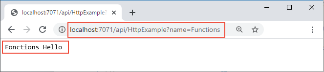

# <a name="quickstart-create-a-python-function-in-azure-from-the-command-line"></a>Démarrage rapide : Créer une fonction Python dans Azure à partir de la ligne de commande

> [!div class="op_single_selector" title1="Sélectionnez votre langage de fonction : "]
> - [Python](create-first-function-cli-python.md)
> - [C#](create-first-function-cli-csharp.md)
> - [Java](create-first-function-cli-java.md)
> - [JavaScript](create-first-function-cli-node.md)
> - [PowerShell](create-first-function-cli-powershell.md)
> - [TypeScript](create-first-function-cli-typescript.md)

Dans cet article, vous utilisez des outils en ligne de commande pour créer une fonction Python qui répond à des requêtes HTTP. Après avoir testé le code localement, vous le déployez dans l’environnement <abbr title="Environnement informatique de runtime dans lequel tous les détails du serveur sont transparents pour les développeurs d’applications, ce qui simplifie le processus de déploiement et de gestion du code.">serverless</abbr> d’ <abbr title="Service Azure qui fournit un environnement informatique serverless à faible coût pour les applications.">Azure Functions</abbr>.

Le fait de suivre ce guide de démarrage rapide entraîne une faible dépense de quelques cents USD tout au plus dans votre compte Azure.

Si vous souhaitez consulter une version de cet article adaptée à Visual Studio Code, [cliquez ici](create-first-function-vs-code-python.md).

## <a name="1-configure-your-environment"></a>1. Configurer votre environnement

Avant de commencer la lecture cet article, vous devez disposer des éléments suivants :

+ Un <abbr title="Profil qui gère les informations de facturation pour l’utilisation d’Azure.">account</abbr> avec un <abbr title="Structure organisationnelle de base dans laquelle vous gérez les ressources dans Azure, généralement associée à une personne ou à un service au sein d’une organisation.">subscription</abbr>. [Créez un compte gratuitement](https://azure.microsoft.com/free/?ref=microsoft.com&utm_source=microsoft.com&utm_medium=docs&utm_campaign=visualstudio).

+ [Azure Functions Core Tools](functions-run-local.md#v2) version 3.x. 
  
+ Interface <abbr title="Ensemble d’outils en ligne de commande multiplateformes permettant d’utiliser des ressources Azure à partir de votre ordinateur de développement local comme alternative à l’utilisation du portail Azure.">Azure CLI</abbr> ou <abbr title="Module PowerShell qui fournit des commandes permettant d’utiliser des ressources Azure à partir de votre ordinateur de développement local comme alternative à l’utilisation du portail Azure.">Azure PowerShell</abbr> pour la création de ressources Azure :

    + [Azure CLI](/cli/azure/install-azure-cli) version 2.4 ou ultérieure.

    + [Azure PowerShell](/powershell/azure/install-az-ps) version 5.0 ou ultérieure.

+ [Python 3.8 (64 bits)](https://www.python.org/downloads/release/python-382/), [Python 3.7 (64 bits)](https://www.python.org/downloads/release/python-375/), [Python 3.6 (64 bits)](https://www.python.org/downloads/release/python-368/), qui sont tous pris en charge par la version 3.x. d’Azure Functions.

### <a name="11-prerequisite-check"></a>1.1 Vérification des prérequis

Vérifiez vos prérequis, selon que vous utilisez Azure CLI ou Azure PowerShell pour créer des ressources Azure :

# <a name="azure-cli"></a>[Azure CLI](#tab/azure-cli)

+ Dans une fenêtre de terminal ou de commande, exécutez `func --version` pour vérifier que vous disposez d’ <abbr title="Ensemble d’outils en ligne de commande permettant d’utiliser Azure Functions sur votre ordinateur local.">Azure Functions Core Tools</abbr> version 3.x.

+ Exécutez `az --version` pour vérifier que vous disposez d’Azure CLI version 2.4 ou ultérieure.

+ Exécutez `az login` pour vous connecter à Azure et vérifier que l’abonnement est actif.

+ Exécutez `python --version` (Linux/macOS) ou `py --version` (Windows) pour vérifier que vous disposez de Python version 3.8.x, 3.7.x ou 3.6.x.

# <a name="azure-powershell"></a>[Azure PowerShell](#tab/azure-powershell)

+ Dans une fenêtre de terminal ou de commande, exécutez `func --version` pour vérifier que vous disposez d’ <abbr title="Ensemble d’outils en ligne de commande permettant d’utiliser Azure Functions sur votre ordinateur local.">Azure Functions Core Tools</abbr> version 3.x.

+ Exécutez `(Get-Module -ListAvailable Az).Version` et vérifiez la version 5.0 ou ultérieure. 

+ Exécutez `Connect-AzAccount` pour vous connecter à Azure et vérifier que l’abonnement est actif.

+ Exécutez `python --version` (Linux/macOS) ou `py --version` (Windows) pour vérifier que vous disposez de Python version 3.8.x, 3.7.x ou 3.6.x.

---

<br/>

---

## <a name="2-create-and-activate-a-virtual-environment"></a>2. <a name="create-venv"></a>Créer et activer un environnement virtuel

Dans le dossier approprié, exécutez les commandes suivantes pour créer et activer un environnement virtuel nommé `.venv`. Veillez à utiliser Python 3.8, 3.7 ou 3.6, qui sont pris en charge par Azure Functions.

# <a name="bash"></a>[bash](#tab/bash)

```bash
python -m venv .venv
```

```bash
source .venv/bin/activate
```

Si Python n’a pas installé le package venv sur votre distribution Linux, exécutez la commande suivante :

```bash
sudo apt-get install python3-venv
```

# <a name="powershell"></a>[PowerShell](#tab/powershell)

```powershell
py -m venv .venv
```

```powershell
.venv\scripts\activate
```

# <a name="cmd"></a>[Cmd](#tab/cmd)

```cmd
py -m venv .venv
```

```cmd
.venv\scripts\activate
```

---

Vous devez exécuter toutes les commandes suivantes dans cet environnement virtuel activé. 

<br/>

---

## <a name="3-create-a-local-function-project"></a>3. Créer un projet de fonction local

Dans cette section, vous allez créer un <abbr title="Conteneur logique pour une ou plusieurs fonctions individuelles qui peuvent être déployées et gérées ensemble.">projet Azure Functions</abbr> local dans Python. Chaque fonction du projet répond à un <abbr title="Type d’événement qui appelle le code de la fonction, par exemple une requête HTTP, un message de file d’attente ou une heure spécifique.">déclencheur</abbr>.

1. Exécutez la commande `func init` pour créer un projet Functions dans un dossier nommé *LocalFunctionProj* avec le runtime spécifié :  

    ```console
    func init LocalFunctionProj --python
    ```

1. Accédez au dossier du projet :

    ```console
    cd LocalFunctionProj
    ```
    
    <br/>
    <details>
    <summary><strong>Qu’est-ce qui est créé dans le dossier LocalFunctionProj ?</strong></summary>
    
    Ce dossier contient divers fichiers pour le projet, notamment des fichiers config nommés [local.settings.json](functions-run-local.md#local-settings-file) et [host.json](functions-host-json.md). Dans la mesure où *local.settings.json* peut contenir des secrets téléchargés à partir d’Azure, le fichier est exclu du contrôle de code source par défaut dans le fichier *.gitignore*.
    </details>

1. Ajoutez une fonction à votre projet en utilisant la commande suivante :

    ```console
    func new --name HttpExample --template "HTTP trigger" --authlevel "anonymous"
    ```   
    L’argument `--name` est le nom unique de votre fonction (HttpExample).

    L’argument `--template` spécifie le déclencheur de la fonction (HTTP).
    
    `func new` crée un sous-dossier correspondant au nom de la fonction qui contient un fichier *\_\_init\_\_.py* avec le code de la fonction et un fichier de configuration nommé *function.json*.

    <br/>    
    <details>
    <summary><strong>Code pour __init__.py</strong></summary>
    
    *\_\_init\_\_.py* contient une fonction Python `main()`, qui se déclenche selon la configuration définie dans *function.json*.
    
    :::code language="python" source="~/functions-quickstart-templates/Functions.Templates/Templates/HttpTrigger-Python/__init__.py":::
    
    Pour un déclencheur HTTP, la fonction reçoit les données de requête dans la variable `req`, tel que cela est défini dans *function.json*. `req` est une instance de la [classe azure.functions.HttpRequest](/python/api/azure-functions/azure.functions.httprequest). L’objet retourné, défini comme `$return` dans *function.json*, est une instance de la [classe azure.functions.HttpResponse](/python/api/azure-functions/azure.functions.httpresponse). Pour en savoir plus, voir [Déclencheurs et liaisons HTTP Azure Functions](./functions-bindings-http-webhook.md?tabs=python).
    </details>

    <br/>
    <details>
    <summary><strong>Code pour function.json</strong></summary>

    *function.json* est un fichier de configuration qui définit les <abbr title="Connexions déclaratives entre une fonction et d’autres ressources. Une liaison d’entrée fournit des données à la fonction ; une liaison de sortie fournit des données de la fonction à d’autres ressources.">liaisons d’entrée et de sortie</abbr> pour la fonction, y compris le type de déclencheur.
    
    Vous pouvez changer `scriptFile` pour appeler un autre fichier Python, si vous le souhaitez.
    
    :::code language="json" source="~/functions-quickstart-templates/Functions.Templates/Templates/HttpTrigger-Python/function.json":::
    
    Chaque liaison nécessite une direction, un type et un nom unique. Le déclencheur HTTP comporte une liaison d’entrée de type [`httpTrigger`](functions-bindings-http-webhook-trigger.md) et une liaison de sortie de type [`http`](functions-bindings-http-webhook-output.md).    
    </details>

<br/>

---

## <a name="4-run-the-function-locally"></a>4. Exécuter la fonction localement

1. Exécutez votre fonction en démarrant l’hôte du runtime d’Azure Functions local à partir du dossier *LocalFunctionProj* :

    ```
    func start
    ```

    Vers la fin de la sortie, les lignes suivantes doivent s’afficher : 
    
    <pre class="is-monospace is-size-small has-padding-medium has-background-tertiary has-text-tertiary-invert">
    ...
    
    Now listening on: http://0.0.0.0:7071
    Application started. Press Ctrl+C to shut down.
    
    Http Functions:
    
            HttpExample: [GET,POST] http://localhost:7071/api/HttpExample
    ...
    
    </pre>
    
    <br/>
    <details>
    <summary><strong>Je ne vois pas HttpExample dans la sortie</strong></summary>

    Si HttpExample n’apparaît pas, vous avez probablement démarré l’hôte à partir d’un emplacement situé en dehors du dossier racine du projet. Dans ce cas, utilisez <kbd>Ctrl+C</kbd> pour arrêter l’hôte, accédez au dossier racine du projet, puis réexécutez la commande précédente.
    </details>

1. Copiez dans un navigateur l’URL de votre fonction **HttpExample** à partir de cette sortie, puis ajoutez la chaîne de requête **?name=<YOUR_NAME>** , pour obtenir une URL complète semblable à **http://localhost:7071/api/HttpExample?name=Functions** . Le navigateur doit afficher un message similaire à **Hello Functions** :

    

1. Le terminal dans lequel vous avez démarré votre projet affiche également une sortie de journal quand vous effectuez des requêtes.

1. Quand vous avez terminé, utilisez <kbd>Ctrl+C</kbd> et choisissez <kbd>y</kbd> pour arrêter l’hôte Functions.

<br/>

---

## <a name="5-create-supporting-azure-resources-for-your-function"></a>5. Créer des ressources Azure de prise en charge pour votre fonction

Avant de déployer le code de votre fonction dans Azure, vous devez créer un <abbr title="Conteneur logique pour des ressources Azure associées que vous pouvez gérer en tant qu’unité.">groupe de ressources</abbr>, un <abbr title="Compte qui contient tous vos objets de données de Stockage Azure. Le compte de stockage fournit un espace de noms unique pour vos données de stockage.">compte de stockage</abbr>et une <abbr title="Ressource cloud qui héberge des fonctions serverless dans Azure et qui fournit l’environnement de calcul sous-jacent dans lequel les fonctions s’exécutent.">application de fonction</abbr> en utilisant les commande suivantes :

1. Si vous ne l’avez pas déjà fait, connectez-vous à Azure :

    # <a name="azure-cli"></a>[Azure CLI](#tab/azure-cli)
    ```azurecli
    az login
    ```

    La commande [az login](/cli/azure/reference-index#az_login) vous connecte à votre compte Azure.

    # <a name="azure-powershell"></a>[Azure PowerShell](#tab/azure-powershell) 
    ```azurepowershell
    Connect-AzAccount
    ```

    L’applet de commande [Connect-AzAccount](/powershell/module/az.accounts/connect-azaccount) vous connecte à votre compte Azure.

    ---

1. Créez un groupe de ressources nommé `AzureFunctionsQuickstart-rg` dans la région `westeurope`. 

    # <a name="azure-cli"></a>[Azure CLI](#tab/azure-cli)
    
    ```azurecli
    az group create --name AzureFunctionsQuickstart-rg --location westeurope
    ```
 
    La commande [az group create](/cli/azure/group#az_group_create) crée un groupe de ressources. Vous créez généralement votre groupe de ressources et les ressources dans une <abbr title="Référence géographique à un centre de données Azure spécifique dans lequel des ressources sont allouées.">region</abbr> proche de chez vous, en utilisant une région disponible retournée par la commande `az account list-locations`.

    # <a name="azure-powershell"></a>[Azure PowerShell](#tab/azure-powershell)

    ```azurepowershell
    New-AzResourceGroup -Name AzureFunctionsQuickstart-rg -Location westeurope
    ```

    La commande [New-AzResourceGroup](/powershell/module/az.resources/new-azresourcegroup) crée un groupe de ressources. Vous créez généralement votre groupe de ressources et vos ressources dans une région près de chez vous, en utilisant une région disponible retournée par l’applet de commande [Get-AzLocation](/powershell/module/az.resources/get-azlocation).

    ---

    Vous ne pouvez pas héberger des applications Linux et Windows dans le même groupe de ressources. Si vous disposez d’un groupe de ressources existant nommé `AzureFunctionsQuickstart-rg` avec une application de fonction Windows ou une application web, vous devez utiliser un autre groupe de ressources.

1. Créez un compte de Stockage Azure universel dans votre groupe de ressources et votre région :

    # <a name="azure-cli"></a>[Azure CLI](#tab/azure-cli)

    ```azurecli
    az storage account create --name <STORAGE_NAME> --location westeurope --resource-group AzureFunctionsQuickstart-rg --sku Standard_LRS
    ```

    La commande [az storage account create](/cli/azure/storage/account#az_storage_account_create) crée le compte de stockage. 

    # <a name="azure-powershell"></a>[Azure PowerShell](#tab/azure-powershell)

    ```azurepowershell
    New-AzStorageAccount -ResourceGroupName AzureFunctionsQuickstart-rg -Name <STORAGE_NAME> -SkuName Standard_LRS -Location westeurope
    ```

    L’applet de commande [New-AzStorageAccount](/powershell/module/az.storage/new-azstorageaccount) crée le compte de stockage.

    ---

    Remplacez `<STORAGE_NAME>` par un nom qui vous convient et qui est <abbr title="Ce nom doit être unique pour tous les comptes de stockage utilisés par tous les clients Azure à l’échelle mondiale. Par exemple, vous pouvez utiliser une combinaison de votre nom personnel ou du nom de votre entreprise, du nom de l’application et d’un identificateur numérique, comme dans contosobizappstorage20.">unique dans le Stockage Azure</abbr>. Les noms doivent contenir entre 3 et 24 caractères, et comporter uniquement des lettres minuscules. `Standard_LRS` spécifie un compte universel, qui est [pris en charge par Functions](storage-considerations.md#storage-account-requirements).
    
    Le compte de stockage n’engendre que quelques centimes (USD) de dépense dans ce guide de démarrage rapide.

1. Créer l’application de fonction dans Azure :

    # <a name="azure-cli"></a>[Azure CLI](#tab/azure-cli)
        
    ```azurecli
    az functionapp create --resource-group AzureFunctionsQuickstart-rg --consumption-plan-location westeurope --runtime python --runtime-version 3.8 --functions-version 3 --name <APP_NAME> --storage-account <STORAGE_NAME> --os-type linux
    ```
    
    La commande [az functionapp create](/cli/azure/functionapp#az_functionapp_create) crée l’application de fonction dans Azure. Si vous utilisez Python 3.7 ou 3.6, remplacez `--runtime-version` par `3.7` ou `3.6`, respectivement.
    
    # <a name="azure-powershell"></a>[Azure PowerShell](#tab/azure-powershell)
    
    ```azurepowershell
    New-AzFunctionApp -Name <APP_NAME> -ResourceGroupName AzureFunctionsQuickstart-rg -StorageAccount <STORAGE_NAME> -FunctionsVersion 3 -RuntimeVersion 3.8 -Runtime python -Location 'West Europe'
    ```
    
    L’applet de commande [New-AzFunctionApp](/powershell/module/az.functions/new-azfunctionapp) crée l’application de fonction dans Azure. Si vous utilisez Python 3.7 ou 3.6, remplacez `-RuntimeVersion` par `3.7` ou `3.6`, respectivement.

    ---
    
    Remplacez `<STORAGE_NAME>` par le nom du compte que vous avez utilisé à l’étape précédente.

    Remplacez `<APP_NAME>` par un <abbr title="Nom qui doit être unique pour tous les clients Azure à l’échelle mondiale. Par exemple, vous pouvez utiliser une combinaison de votre nom personnel ou du nom de votre organisation, du nom de l’application et d’un identificateur numérique, comme dans contoso-bizapp-func-20.">nom global unique qui vous convient</abbr>. `<APP_NAME>` représente également le domaine DNS par défaut pour l’application de fonction. 
    
    <br/>
    <details>
    <summary><strong>Quel est le coût des ressources provisionnées sur Azure ?</strong></summary>

    Cette commande crée une application de fonction qui s’exécute dans votre runtime de langage spécifié dans le [Plan Consommation Azure Functions](functions-scale.md#overview-of-plans), qui est gratuit pour l’utilisation faite ici. La commande provisionne également une instance d’Azure Application Insights associée dans le même groupe de ressources, avec laquelle vous pouvez superviser votre application de fonction et visualiser les journaux. Pour plus d’informations, consultez [Surveiller l’exécution des fonctions Azure](functions-monitoring.md). L’instance n’entraîne aucun coût tant que vous ne l’activez pas.
    </details>

<br/>

---

## <a name="6-deploy-the-function-project-to-azure"></a>6. Déployer le projet de fonction sur Azure

Après avoir créé votre application de fonction dans Azure, vous êtes prêt à **déployer votre projet Functions local** à l’aide de la commande [func azure functionapp publish](functions-run-local.md#project-file-deployment).  

Dans l’exemple suivant, remplacez `<APP_NAME>` par le nom de votre application.

```console
func azure functionapp publish <APP_NAME>
```

La commande `publish` affiche des résultats similaires à la sortie suivante (tronquée pour rester simple) :

<pre class="is-monospace is-size-small has-padding-medium has-background-tertiary has-text-tertiary-invert">
...

Getting site publishing info...
Creating archive for current directory...
Performing remote build for functions project.

...

Deployment successful.
Remote build succeeded!
Syncing triggers...
Functions in msdocs-azurefunctions-qs:
    HttpExample - [httpTrigger]
        Invoke url: https://msdocs-azurefunctions-qs.azurewebsites.net/api/httpexample
</pre>

<br/>

---

## <a name="7-invoke-the-function-on-azure"></a>7. Appeler la fonction sur Azure

Dans la mesure où votre fonction utilise un déclencheur HTTP, vous l’appelez en adressant une requête HTTP à son URL dans le navigateur ou à l’aide d’un outil semblable à <abbr title="Outil en ligne de commande permettant de générer des requêtes HTTP sur une URL ; voir https://curl.se/">curl</abbr>. 

# <a name="browser"></a>[Browser](#tab/browser)

Copiez l’**URL d’appel** complète affichée dans la sortie de la commande `publish` dans la barre d’adresse d’un navigateur, en ajoutant le paramètre de requête **&name=Functions**. Le navigateur doit afficher une sortie similaire à celle générée au moment de l’exécution locale de la fonction.


# <a name="curl"></a>[curl](#tab/curl)

Exécutez [`curl`](https://curl.haxx.se/) avec l’**URL d’appel**, en ajoutant le paramètre **&name=Functions**. La sortie de la commande doit correspondre au texte « Hello Functions ».


---

### <a name="71-view-real-time-streaming-logs"></a>7.1 Afficher les journaux de streaming en temps réel

Exécutez la commande suivante pour afficher en temps quasi-réel les [journaux de streaming](functions-run-local.md#enable-streaming-logs) dans Application Insights du portail Azure :

```console
func azure functionapp logstream <APP_NAME> --browser
```

Remplacez `<APP_NAME>` par le nom de votre application de fonction.

Dans une fenêtre de terminal distincte ou dans le navigateur, appelez à nouveau la fonction distante. Un journal détaillé de l’exécution de la fonction dans Azure est affiché dans le terminal. 

<br/>

---

## <a name="8-clean-up-resources"></a>8. Nettoyer les ressources

Si vous passez à l’[étape suivante](#next-steps) et que vous ajoutez une <abbr title="Moyen d’associer une fonction à une file d’attente de stockage, afin qu’elle puisse créer des messages dans la file d’attente. ">liaison de sortie de file d’attente Azure Storage</abbr>, gardez toutes vos ressources en place pour tirer parti de ce que vous avez déjà fait.

Sinon, utilisez la commande suivante pour supprimer le groupe de ressources et toutes les ressources qu’il contient afin d’éviter les coûts supplémentaires.

 # <a name="azure-cli"></a>[Azure CLI](#tab/azure-cli)

```azurecli
az group delete --name AzureFunctionsQuickstart-rg
```

# <a name="azure-powershell"></a>[Azure PowerShell](#tab/azure-powershell)

```azurepowershell
Remove-AzResourceGroup -Name AzureFunctionsQuickstart-rg
```

<br/>

---

## <a name="next-steps"></a>Étapes suivantes

> [!div class="nextstepaction"]
> [Se connecter à une file d’attente Stockage Azure](functions-add-output-binding-storage-queue-cli.md?pivots=programming-language-python)

[Vous rencontrez des problèmes ? Faites-le nous savoir.](https://aka.ms/python-functions-qs-survey)
