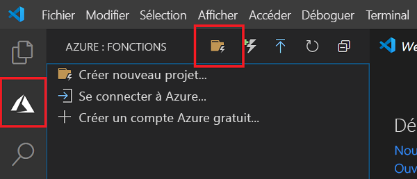
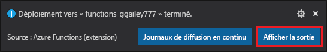

# Démarrage rapide : Créer une fonction C# dans Azure à l’aide de Visual Studio Code

> [!div class="op_single_selector" title1="Sélectionnez votre langage de fonction : "]
> - [C#](create-first-function-vs-code-csharp.md)
> - [Java](create-first-function-vs-code-java.md)
> - [JavaScript](create-first-function-vs-code-node.md)
> - [PowerShell](create-first-function-vs-code-powershell.md)
> - [Python](create-first-function-vs-code-python.md)
> - [TypeScript](create-first-function-vs-code-typescript.md)
> - [Autres (Go/Rust)](create-first-function-vs-code-other.md)

Dans cet article, vous allez utiliser Visual Studio Code pour créer une fonction basée sur une bibliothèque de classes C# qui répond aux requêtes HTTP. Après avoir testé le code localement, vous le déployez dans l’environnement <abbr title="Environnement informatique de runtime dans lequel tous les détails du serveur sont transparents pour les développeurs d’applications, ce qui simplifie le processus de déploiement et de gestion du code.">Serverless</abbr> d’ <abbr title="Service Azure qui fournit un environnement informatique serverless à faible coût pour les applications.">Azure Functions</abbr>.

Le fait de suivre ce guide de démarrage rapide entraîne une petite dépense de quelques cents USD tout au plus dans votre compte Azure.

Il existe également une [version basée sur l’interface CLI](create-first-function-cli-csharp.md) de cet article.
    
## 1. Configurer votre environnement

Avant de commencer, veillez à disposer des éléments suivants :

+ Un <abbr title="Profil qui gère les informations de facturation pour l’utilisation d’Azure.">account</abbr> avec un <abbr title="Structure organisationnelle de base dans laquelle vous gérez les ressources dans Azure, généralement associée à une personne ou à un service au sein d’une organisation.">subscription</abbr>. [Créez un compte gratuitement](https://azure.microsoft.com/free/?ref=microsoft.com&utm_source=microsoft.com&utm_medium=docs&utm_campaign=visualstudio).

+ [Azure Functions Core Tools](functions-run-local.md#install-the-azure-functions-core-tools) version 3.x.

+ [Visual Studio Code](https://code.visualstudio.com/) sur l’une des [plateformes prises en charge](https://code.visualstudio.com/docs/supporting/requirements#_platforms).

+ [Extension C#](https://marketplace.visualstudio.com/items?itemName=ms-dotnettools.csharp) pour Visual Studio Code.  

+ [Extension Azure Functions](https://marketplace.visualstudio.com/items?itemName=ms-azuretools.vscode-azurefunctions) pour Visual Studio Code.

## 2. Créer votre projet local

Dans cette section, vous utilisez Visual Studio Code pour créer un <abbr title="Conteneur logique pour une ou plusieurs fonctions individuelles qui peuvent être déployées et gérées ensemble.">projet Azure Functions</abbr> local en C#. Plus loin dans cet article, vous allez publier votre code de fonction sur Azure.

1. Choisissez l’icône Azure dans la <abbr title="Groupe vertical d’icônes sur le côté gauche de la fenêtre de Visual Studio Code.">Barre d’activité</abbr>, puis, dans la zone **Azure : Fonctions**, sélectionnez l’icône **Créer un projet...**

    

1. Choisissez un emplacement de répertoire pour votre espace de travail de projet et optez pour **Sélectionner**.

    > [!NOTE]
    > Ces étapes ont été conçues pour être terminées en dehors d’un espace de travail. Dans ce cas, ne sélectionnez pas de dossier de projet qui fait partie d’un espace de travail.

1. Quand vous y êtes invité, indiquez les informations suivantes :

    + **Sélectionner un langage pour votre projet de fonction** : Choisissez `C#`.

    + **Sélectionner un modèle pour la première fonction de votre projet** : Choisissez `HTTP trigger`.

    + **Fournir un nom de fonction** : Tapez `HttpExample`.

    + **Fournir un espace de noms** : Tapez `My.Functions`.

    + **Niveau d’autorisation** : Choisissez l’option `Anonymous`, qui permet à quiconque d’appeler le point de terminaison de votre fonction. Pour en savoir plus sur les niveaux d’autorisation, consultez [Clés d’autorisation](functions-bindings-http-webhook-trigger.md#authorization-keys).

    + **Sélectionner la façon dont vous souhaitez ouvrir votre projet** : Choisissez `Add to workspace`.

1. À l’aide de ces informations, Visual Studio Code génère un projet Azure Functions avec un <abbr title="Type d’événement qui appelle le code de la fonction, par exemple une requête HTTP, un message de file d’attente ou une heure spécifique.">déclencheur</abbr>. Vous pouvez voir les fichiers de projet locaux dans l’Explorateur. Pour en savoir plus sur les fichiers créés, consultez [Fichiers projet générés](functions-develop-vs-code.md#generated-project-files).

[!INCLUDE [functions-run-function-test-local-vs-code](../../includes/functions-run-function-test-local-vs-code.md)]

Après avoir vérifié que la fonction s’exécute correctement sur votre ordinateur local, il est temps d’utiliser Visual Studio Code pour publier le projet directement sur Azure.

[!INCLUDE [functions-sign-in-vs-code](../../includes/functions-sign-in-vs-code.md)]

## 5. Publication du projet sur Azure

Dans cette section, vous créez une application de fonction et les ressources associées dans votre abonnement Azure, puis vous déployez votre code. 

> [!IMPORTANT]
> La publication sur une application de fonction existante remplace le contenu de cette application dans Azure. 

1. Choisissez l’icône Azure dans la barre d’activité, puis dans la zone **Azure : Fonctions**, choisissez le bouton **Déployer sur une application de fonction**.

    

1. Quand vous y êtes invité, indiquez les informations suivantes :

    + **Sélectionnez le dossier** : choisissez un dossier dans votre espace de travail ou accédez à un dossier qui contient votre application de fonction. Vous ne verrez pas ceci si vous avez déjà ouvert une application de fonction valide.

    + **Sélectionnez l’abonnement** : choisissez l’abonnement à utiliser. Vous ne verrez pas ceci si vous n’avez qu’un seul abonnement.

    + **Sélectionnez une application de fonction dans Azure** : Choisissez `+ Create new Function App`. (Ne choisissez pas l’option `Advanced`, qui n’est pas abordée dans cet article.)

    + **Entrer un nom global unique pour l’application de fonction** : Tapez un nom valide dans un chemin d’URL. Le nom que vous tapez est validé pour s’assurer qu’il est <abbr title="Ce nom doit être unique pour tous les projets de fonctions utilisés par tous les clients Azure à l’échelle mondiale. En règle générale, vous utilisez une combinaison de votre nom personnel ou du nom de votre entreprise, du nom de l’application et d’un identificateur numérique, comme dans contoso-bizapp-func-20.">unique dans Azure Functions</abbr>. 

    + **Sélectionnez un emplacement pour les nouvelles ressources** :  Pour de meilleures performances, choisissez une [région](https://azure.microsoft.com/regions/) proche de vous.

    L’extension montre l’état des ressources individuelles au fur et à mesure de leur création dans Azure, au sein de la zone de notification.

    :::image type="content" source="../../includes/media/functions-publish-project-vscode/resource-notification.png" alt-text="Notification de création de ressources Azure":::

1. Quand vous avez terminé, les ressources Azure suivantes sont créées dans votre abonnement et leurs noms reposent sur le nom de votre application de fonction :

    + Un **groupe de ressources**, qui est un conteneur logique pour les ressources associées.
    + Un **compte Stockage Azure** standard, qui conserve l’état et d’autres informations spécifiques à vos projets.
    + Un **plan de consommation**, qui définit l’hôte sous-jacent pour votre application de fonction serverless. 
    + Une **application de fonction**, qui fournit l’environnement d’exécution de votre code de fonction. Une application de fonction vous permet de regrouper des fonctions en une unité logique pour faciliter la gestion, le déploiement et le partage des ressources au sein du même plan d’hébergement.
    + Une **instance Application Insights** connectée à l’application de fonction, qui effectue le suivi de l’utilisation de votre fonction serverless.

    Une notification s’affiche après que votre application de fonction a été créée et que le package de déploiement a été appliqué. 

    > [!TIP]
    > Par défaut, les ressources Azure nécessaires à votre application de fonction sont créées d’après le nom d’application de fonction que vous indiquez. Par défaut, elles sont également créées dans le même nouveau groupe de ressources avec l’application de fonction. Si vous souhaitez personnaliser les noms de ces ressources ou réutiliser des ressources existantes, vous devez plutôt [publier le projet à l’aide des options de création avancées](functions-develop-vs-code.md#enable-publishing-with-advanced-create-options).

1. Sélectionnez **Afficher la sortie de** dans cette notification pour afficher les résultats de la création et du déploiement, y compris les ressources Azure que vous avez créées. Si vous manquez la notification, sélectionnez l’icône de cloche dans le coin inférieur droit pour la voir de nouveau.

    

## 6. Exécuter la fonction dans Azure

1. Dans la zone **Azure : Fonctions** de la barre latérale, développez votre abonnement, votre nouvelle application de fonction et **Fonctions**. Cliquez avec le bouton droit (Windows) ou faites <kbd>Ctrl -</kbd> clic (macOS) sur la fonction `HttpExample`, puis choisissez **Exécuter la fonction maintenant...** .

    :::image type="content" source="../../includes/media/functions-vs-code-run-remote/execute-function-now.png" alt-text="Exécuter la fonction maintenant dans Azure à partir de Visual Studio Code":::

1. Dans **Entrer le corps de la demande** figure la valeur `{ "name": "Azure" }` pour le corps du message de la demande.

    Appuyez sur Entrée pour envoyer ce message de demande à votre fonction.  

1. Quand la fonction s’exécute dans Azure et retourne une réponse, une notification est générée dans Visual Studio Code.

## 5. Nettoyer les ressources

Quand vous passez à l’[étape suivante](#next-steps) et que vous ajoutez une <abbr title="Moyen d’associer une fonction à une file d’attente de stockage, afin qu’elle puisse créer des messages dans la file d’attente."> Liaison de sortie de file d’attente Azure Storage</abbr> à votre fonction, vous devez maintenir en place toutes vos ressources pour tirer parti de ce que vous avez déjà fait.

Sinon, vous pouvez utiliser les étapes suivantes pour supprimer l’application de fonction et ses ressources connexes afin d’éviter des coûts supplémentaires.

[!INCLUDE [functions-cleanup-resources-vs-code-inner.md](../../includes/functions-cleanup-resources-vs-code-inner.md)]

Pour en savoir plus sur les coûts de Functions, consultez [Estimation des coûts d’un plan Consommation](functions-consumption-costs.md).

## Étapes suivantes

Vous avez utilisé Visual Studio Code pour créer une application de fonction à l’aide d’une fonction HTTP simple déclenchée via HTTP. Dans le prochain article, vous développez cette fonction en ajoutant une <abbr title="Connexion déclarative entre une fonction et d’autres ressources. Une liaison d’entrée fournit des données à la fonction ; une liaison de sortie fournit des données de la fonction à d’autres ressources.">binding</abbr>. Cette liaison écrit la chaîne de la requête HTTP dans un message dans une file d’attente de Stockage File d’attente Azure. 

> [!div class="nextstepaction"]
> [Se connecter à une file d’attente Stockage Azure](functions-add-output-binding-storage-queue-vs-code.md?pivots=programming-language-csharp)

[Azure Functions Core Tools]: functions-run-local.md
[Azure Functions extension for Visual Studio Code]: https://marketplace.visualstudio.com/items?itemName=ms-azuretools.vscode-azurefunctions
