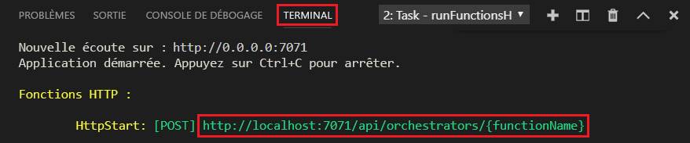
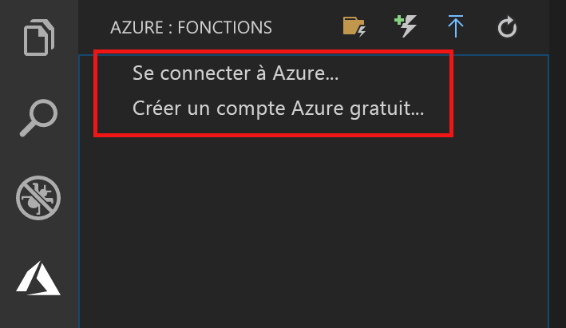
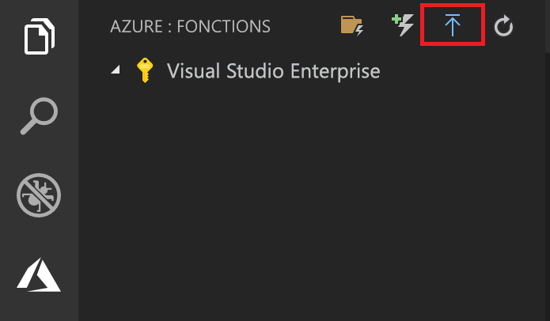
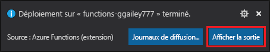

# Démarrage rapide : Créer une fonction Java dans Azure avec Visual Studio Code

[!INCLUDE [functions-language-selector-quickstart-vs-code](../../includes/functions-language-selector-quickstart-vs-code.md)]

Utilisez Visual Studio Code pour créer une fonction Java qui répond aux requêtes HTTP. Testez le code localement, puis déployez-le dans l’environnement serverless d’Azure Functions.

Le suivi de ce guide de démarrage rapide génère une dépense de quelques cents USD tout au plus dans votre <abbr title="Profil qui gère les informations de facturation pour l’utilisation d’Azure.">Compte Azure</abbr>.

Si Visual Studio Code n’est pas votre outil de développement préféré, consultez nos tutoriels similaires destinés aux développeurs Java utilisant [Maven](create-first-function-cli-java.md), [Gradle](./functions-create-first-java-gradle.md) et [IntelliJ IDEA](/azure/developer/java/toolkit-for-intellij/quickstart-functions).

## 1. Préparation de votre environnement

Avant de commencer, veillez à disposer des éléments suivants :

+ Un compte Azure avec un <abbr title="Structure organisationnelle de base dans laquelle vous gérez les ressources dans Azure, généralement associée à une personne ou à un service au sein d’une organisation.">abonnement</abbr>. [Créez un compte gratuitement](https://azure.microsoft.com/free/?ref=microsoft.com&utm_source=microsoft.com&utm_medium=docs&utm_campaign=visualstudio).

+ [Java Developer Kit (JDK)](/azure/developer/java/fundamentals/java-jdk-long-term-support) version 8 ou 11.

+ [Apache Maven](https://maven.apache.org) version 3.0 ou ultérieure.

+ [Visual Studio Code](https://code.visualstudio.com/) sur l’une des [plateformes prises en charge](https://code.visualstudio.com/docs/supporting/requirements#_platforms).

+ [Pack d’extension Java](https://marketplace.visualstudio.com/items?itemName=vscjava.vscode-java-pack).  

+ [Extension Azure Functions](https://marketplace.visualstudio.com/items?itemName=ms-azuretools.vscode-azurefunctions) pour Visual Studio Code.

 

## 2. Créer votre projet Azure Functions local

1. Choisissez l’icône Azure dans la **barre d’activité**, puis, dans la zone **Azure : Fonctions**, sélectionnez l’icône **Créer un projet...**

    

1. **Choisissez un emplacement de répertoire** pour votre espace de travail de projet, puis choisissez **Sélectionner**.

1. Quand vous y êtes invité, indiquez les informations suivantes :

    + **Sélectionner un langage pour votre projet de fonction** : Choisissez `Java`.

    + **Sélectionnez une version de Java** : Choisissez `Java 8` ou `Java 11`, la version de Java sur laquelle vos fonctions s’exécutent dans Azure. Choisissez une version de Java que vous avez vérifiée localement.

    + **Fournir un ID de groupe** : Choisissez `com.function`.

    + **Fournir un ID d’artefact** : Choisissez `myFunction`.

    + **Fournir une version** : Choisissez `1.0-SNAPSHOT`.

    + **Fournir un nom de package** : Choisissez `com.function`.

    + **Fournir un nom d’application** : Choisissez `myFunction-12345`.

    + **Niveau d’autorisation** : Choisissez l’option `Anonymous`, qui permet à quiconque d’appeler le point de terminaison de votre fonction.

    + **Sélectionner la façon dont vous souhaitez ouvrir votre projet** : Choisissez `Add to workspace`.

 

<strong>Impossible de créer un projet de fonction ?</strong>

Les problèmes les plus courants à résoudre lors de la création d’un projet Azure Functions local sont les suivants :
* L’extension Azure Functions n’est pas installée. 

 

## 3. Exécuter la fonction localement

1. Appuyez sur <kbd>F5</kbd> pour démarrer le projet d’application de fonction.

1. Dans le **terminal**, observez le point de terminaison d’URL de votre fonction en cours d’exécution localement.

    

1. Une fois Core Tools en cours d’exécution, accédez à la zone **Azure : Functions**. Sous **Fonctions**, développez **Projet local** > **Fonctions**. Cliquez avec le bouton droit (Windows) ou effectuez <kbd>Ctrl-clic</kbd> (macOS) sur la fonction `HttpExample`, puis choisissez **Exécuter la fonction maintenant**.

    :::image type="content" source="../../includes/media/functions-run-function-test-local-vs-code/execute-function-now.png" alt-text="Exécuter la fonction maintenant dans Visual Studio Code":::

1. Dans **Entrer le corps de la requête**, vous pouvez voir la valeur du corps du message de requête pour `{ "name": "Azure" }`. Appuyez sur <kbd>Entrée</kbd> pour envoyer ce message de demande à votre fonction.  

1. Quand la fonction s’exécute localement et retourne une réponse, une notification est générée dans Visual Studio Code. Les informations relatives à l’exécution de la fonction sont affichées dans le panneau **Terminal**.

1. Appuyez sur <kbd>Ctrl+C</kbd> pour arrêter Core Tools et déconnecter le débogueur.

 

<strong>Impossible d’exécuter la fonction localement ?</strong>

Les problèmes les plus courants à résoudre lors de l’exécution d’un projet Azure Functions local sont les suivants :
* Les outils Core Tools ne sont pas installés. 
*  Si vous rencontrez des problèmes d’exécution sur Windows, veillez à ce que l’interpréteur de commandes de terminal par défaut pour Visual Studio Code ne soit pas défini sur WSL Bash. 

 

## 4. Connexion à Azure

Pour publier votre application, connectez-vous à Azure. Si vous êtes déjà connecté, passez à la section suivante.

1. Choisissez l’icône Azure dans la barre d’activité, puis, dans la zone **Azure : Fonctions**, choisissez **Se connecter à Azure...**

    

1. Quand vous y êtes invité dans le navigateur, **choisissez votre compte Azure** et **connectez-vous** à l’aide de vos informations d’identification de compte Azure.

1. Une fois connecté, fermez la nouvelle fenêtre de navigateur et revenez à Visual Studio Code.

 

## 5. Publication du projet sur Azure

Le premier déploiement de votre code inclut la création d’une ressource de fonction dans votre abonnement Azure.

1. Choisissez l’icône Azure dans la barre d’activité, puis dans la zone **Azure : Fonctions**, choisissez le bouton **Déployer sur une application de fonction**.

    

1. Quand vous y êtes invité, indiquez les informations suivantes :

    + **Sélectionnez le dossier** : Choisissez le dossier qui contient votre application de fonction. 

    + **Sélectionnez l’abonnement** : choisissez l’abonnement à utiliser. Vous ne verrez pas ceci si vous n’avez qu’un seul abonnement.

    + **Sélectionnez une application de fonction dans Azure** : Choisissez `Create new Function App`.

    + **Entrez un nom global unique pour l’application de fonction** : Tapez un nom unique dans Azure dans un chemin d’URL. L’unicité globale du nom que vous tapez est vérifiée pour que ce nom soit validé.

    - **Sélectionnez un emplacement pour les nouvelles ressources** :  Pour de meilleures performances, choisissez une [région](https://azure.microsoft.com/regions/) proche de vous.

1. Une notification s’affiche après que votre application de fonction a été créée et que le package de déploiement a été appliqué. Sélectionnez **Afficher la sortie** pour afficher les résultats de la création et du déploiement.

    

 

<strong>Impossible de publier la fonction ?</strong>

Cette section a créé les ressources Azure et déployé votre code local dans l’application de fonction. Si cela a échoué :

* Passez en revue la sortie et recherchez des informations d’erreur. L’icône en forme de cloche dans le coin inférieur droit est une autre façon d’afficher la sortie. 
* Avez-vous publié dans une application de fonction existante ? Cette action remplace le contenu de cette application dans Azure.

 

<strong>Quelles ressources ont-elles été créées ?</strong>

Quand vous avez terminé, les ressources Azure suivantes sont créées dans votre abonnement et leurs noms reposent sur le nom de votre application de fonction :

* **Groupe de ressources** : Un groupe de ressources est un conteneur logique pour des ressources associées dans une même région.
* **Compte de stockage Azure** : Une ressource de stockage conserve l’état et d’autres informations relatives à votre projet.
* **Plan de consommation** : Un plan de consommation définit l’hôte sous-jacent pour votre application de fonction serverless.
* **Application de fonction** : Une application de fonction fournit l’environnement pour l’exécution de votre code de fonction et des fonctions de groupe en tant qu’unité logique.
* **Application Insights** : Application Insights effectue le suivi de l’utilisation de votre fonction serverless.

 

## 6. Exécuter la fonction dans Azure

1. Dans la zone **Azure : Fonctions** de la barre latérale, développez votre abonnement, votre nouvelle application de fonction et **Fonctions**. Cliquez avec le bouton droit (Windows) ou faites <kbd>Ctrl -</kbd> clic (macOS) sur la fonction `HttpExample`, puis choisissez **Exécuter la fonction maintenant...** .

    :::image type="content" source="../../includes/media/functions-vs-code-run-remote/execute-function-now.png" alt-text="Exécuter la fonction maintenant dans Azure à partir de Visual Studio Code":::

1. Dans **Entrer le corps de la demande** figure la valeur `{ "name": "Azure" }` pour le corps du message de la demande. Appuyez sur Entrée pour envoyer ce message de demande à votre fonction.  

1. Quand la fonction s’exécute dans Azure et retourne une réponse, une notification est générée dans Visual Studio Code.

 

## 7. Nettoyer les ressources

Si vous n’envisagez pas de passer à l’[étape suivante](#next-steps), supprimez l’application de fonction et ses ressources afin d’éviter des coûts supplémentaires.

1. Dans Visual Studio Code, sélectionnez l’icône Azure dans la barre d’activité, puis sélectionnez la zone Fonctions dans la barre latérale.
1. Sélectionnez l’application de fonction, puis effectuez un clic droit et sélectionnez **Supprimer l’application de fonction...**

 

## Étapes suivantes

Développez la fonction en ajoutant une <abbr title="Dans le Stockage Azure, moyen d’associer une fonction à une file d’attente de stockage, afin qu’elle puisse créer des messages dans la file d’attente.">liaison de sortie</abbr>. Cette liaison écrit la chaîne de la requête HTTP dans un message dans une file d’attente de Stockage File d’attente Azure.

> [!div class="nextstepaction"]
> [Se connecter à une file d’attente Stockage Azure](functions-add-output-binding-storage-queue-vs-code.md?pivots=programming-language-java)
