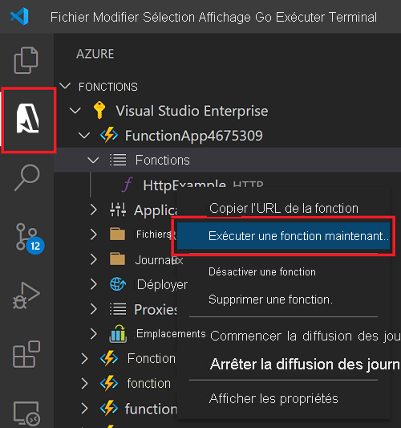

# Démarrage rapide : Créer une fonction JavaScript dans Azure à l’aide de Visual Studio Code

> [!div class="op_single_selector" title1="Sélectionnez votre langage de fonction : "]
> - [JavaScript](create-first-function-vs-code-node.md)
> - [C#](create-first-function-vs-code-csharp.md)
> - [Java](create-first-function-vs-code-java.md)
> - [PowerShell](create-first-function-vs-code-powershell.md)
> - [Python](create-first-function-vs-code-python.md)
> - [TypeScript](create-first-function-vs-code-typescript.md)
> - [Autres (Go/Rust)](create-first-function-vs-code-other.md)

Utilisez Visual Studio Code pour créer une fonction JavaScript qui répond aux requêtes HTTP. Testez le code localement, puis déployez-le dans l’environnement serverless d’Azure Functions.

Le suivi de ce guide de démarrage rapide génère une dépense de quelques cents USD tout au plus dans votre <abbr title="Le compte Azure est une entité unique globale qui vous permet d’accéder aux services Azure et à vos abonnements Azure.">Compte Azure</abbr>.

## 1. Préparation de votre environnement

Avant de commencer, veillez à disposer des éléments suivants :

+ Un compte Azure avec un <abbr title="Un abonnement Azure est un conteneur logique utilisé pour provisionner des ressources dans Azure. Il contient les détails de toutes les ressources, parmi lesquelles les machines virtuelles, les bases de données, etc.">abonnement actif</abbr>. [Créez un compte gratuitement](https://azure.microsoft.com/free/?ref=microsoft.com&utm_source=microsoft.com&utm_medium=docs&utm_campaign=visualstudio).

+ [Node.js 10.14.1+](https://nodejs.org/)

+ [Visual Studio Code](https://code.visualstudio.com/)

+ [Extension Azure Functions](https://marketplace.visualstudio.com/items?itemName=ms-azuretools.vscode-azurefunctions) pour Visual Studio Code.

+ [Azure Functions Core Tools](functions-run-local.md?tabs=linux%2Ccsharp%2Cbash#install-the-azure-functions-core-tools)

 

## 2. Créer votre projet Azure Functions local

1. Choisissez l’icône Azure dans la <abbr title="">Barre d’activité</abbr>, puis, dans la zone **Azure : Fonctions**, sélectionnez l’icône **Créer un projet...**

    

1. **Choisissez un emplacement de répertoire** pour votre espace de travail de projet, puis choisissez **Sélectionner**. 

1. Quand vous y êtes invité, indiquez les informations suivantes :

    + **Sélectionner un langage pour votre projet de fonction** : Choisissez `JavaScript`.

    + **Sélectionner un modèle pour la première fonction de votre projet** : Choisissez `HTTP trigger`.

    + **Fournir un nom de fonction** : Tapez `HttpExample`.

    + **Niveau d’autorisation** : Choisissez l’option `Anonymous`, qui permet à quiconque d’appeler le point de terminaison de votre fonction.

    + **Sélectionner la façon dont vous souhaitez ouvrir votre projet** : Choisissez `Add to workspace`.

 

<strong>Impossible de créer un projet de fonction ?</strong>

Les problèmes les plus courants à résoudre lors de la création d’un projet Azure Functions local sont les suivants :
* L’extension Azure Functions n’est pas installée. 

 

## 3. Exécuter la fonction localement

1. Appuyez sur <kbd>F5</kbd> pour démarrer le projet d’application de fonction. 

1. Dans le **terminal**, observez le point de terminaison d’URL de votre fonction en cours d’exécution localement.

    

1. Copiez l’URL suivante, collez-la dans un navigateur web et appuyez sur Entrée.

    `http://localhost:7071/api/HttpExample?name=Functions`

1. Affichez la réponse renvoyée.

    

1. Dans le panneau **Terminal**, affichez les informations sur la demande.

    

1. Appuyez sur <kbd>Ctrl+C</kbd> pour arrêter Core Tools et déconnecter le débogueur.

 

<strong>Impossible d’exécuter la fonction localement ?</strong>

Les problèmes les plus courants à résoudre lors de l’exécution d’un projet Azure Functions local sont les suivants :
* Les outils Core Tools ne sont pas installés. 
*  Si vous rencontrez des problèmes d’exécution sur Windows, veillez à ce que l’interpréteur de commandes de terminal par défaut pour Visual Studio Code ne soit pas défini sur WSL Bash. 

 

## 4. Connexion à Azure

Pour publier votre application, connectez-vous à Azure. Si vous êtes déjà connecté, passez à la section suivante.

1. Choisissez l’icône Azure dans la barre d’activité, puis, dans la zone **Azure : Fonctions**, choisissez **Se connecter à Azure...**

    

1. Quand vous y êtes invité dans le navigateur, **choisissez votre compte Azure** et **connectez-vous** à l’aide de vos informations d’identification de compte Azure.

1. Une fois connecté, fermez la nouvelle fenêtre de navigateur et revenez à Visual Studio Code. 

 

## 5. Publication du projet sur Azure

Le premier déploiement de votre code inclut la création d’une ressource de fonction dans votre abonnement Azure. 

1. Choisissez l’icône Azure dans la barre d’activité, puis dans la zone **Azure : Fonctions**, choisissez le bouton **Déployer sur une application de fonction**.

    

1. Quand vous y êtes invité, indiquez les informations suivantes :

    + **Sélectionnez le dossier** : Choisissez le dossier qui contient votre application de fonction. 

    + **Sélectionnez l’abonnement** : choisissez l’abonnement à utiliser. Vous ne verrez pas ceci si vous n’avez qu’un seul abonnement.

    + **Sélectionnez une application de fonction dans Azure** : Choisissez `+ Create new Function App`.

    + **Entrez un nom global unique pour l’application de fonction** : Tapez un nom unique dans Azure dans un chemin d’URL. L’unicité globale du nom que vous tapez est vérifiée pour que ce nom soit validé.

    + **Sélectionnez un runtime** : Choisissez la version de Node.js que vous avez exécutée localement. Vous pouvez utiliser la commande `node --version` pour vérifier votre version.

    + **Sélectionnez un emplacement pour les nouvelles ressources** :  Pour de meilleures performances, choisissez une [région](https://azure.microsoft.com/regions/) proche de vous. 

1. Une notification s’affiche après que votre application de fonction a été créée et que le package de déploiement a été appliqué. Sélectionnez **Afficher la sortie** pour afficher les résultats de la création et du déploiement. 
    
    

 

<strong>Impossible de publier la fonction ?</strong>

Cette section a créé les ressources Azure et déployé votre code local dans l’application de fonction. Si cela a échoué :

* Passez en revue la sortie et recherchez des informations d’erreur. L’icône en forme de cloche dans le coin inférieur droit est une autre façon d’afficher la sortie. 
* Avez-vous publié dans une application de fonction existante ? Cette action remplace le contenu de cette application dans Azure.

 

<strong>Quelles ressources ont-elles été créées ?</strong>

Quand vous avez terminé, les ressources Azure suivantes sont créées dans votre abonnement et leurs noms reposent sur le nom de votre application de fonction : 
* **Groupe de ressources** : Un groupe de ressources est un conteneur logique pour des ressources associées dans une même région.
* **Compte de stockage Azure** : Une ressource de stockage conserve l’état et d’autres informations relatives à votre projet.
* **Plan de consommation** : Un plan de consommation définit l’hôte sous-jacent pour votre application de fonction serverless.
* **Application de fonction** : Une application de fonction fournit l’environnement pour l’exécution de votre code de fonction et des fonctions de groupe en tant qu’unité logique.
* **Application Insights** : Application Insights effectue le suivi de l’utilisation de votre fonction serverless.

 

## 6. Exécuter la fonction dans Azure
1. Dans la barre latérale **Azure : Fonctions**, développez la nouvelle application de fonction. 
1. Développez **Fonctions**, cliquez avec le bouton droit sur **HttpExample**, puis choisissez **Exécuter la fonction maintenant...**

    

1. **Appuyez sur Entrée** pour envoyer un message de demande par défaut à votre fonction. 

1. Une notification est générée dans Visual Studio Code quand l’exécution de votre fonction se termine.

 

<strong>Vous n’avez pas pu exécuter l’application de fonction basée sur le cloud ?</strong>

* Avez-vous pensé à ajouter la chaîne de requête à la fin de l’URL ?

 

## 7. Nettoyer les ressources

Supprimez l’application de fonction et ses ressources afin d’éviter des coûts supplémentaires.

1. Dans Visual Studio Code, sélectionnez l’icône Azure dans la barre d’activité, puis sélectionnez la zone Fonctions dans la barre latérale. 
1. Sélectionnez l’application de fonction, puis effectuez un clic droit et sélectionnez **Supprimer l’application de fonction...**

 

## Étapes suivantes

Développez la fonction en ajoutant une <abbr title="Effectuer une liaison à une fonction est une façon de connecter de manière déclarative une autre ressource à la fonction.">liaison de sortie</abbr>. Cette liaison écrit la chaîne de la requête HTTP dans un message dans une file d’attente de Stockage File d’attente Azure. 

> [!div class="nextstepaction"]
> [Se connecter à une file d’attente Stockage Azure](functions-add-output-binding-storage-queue-vs-code.md?pivots=programming-language-javascript)

[Azure Functions Core Tools]: functions-run-local.md
[Azure Functions extension for Visual Studio Code]: https://marketplace.visualstudio.com/items?itemName=ms-azuretools.vscode-azurefunctions
