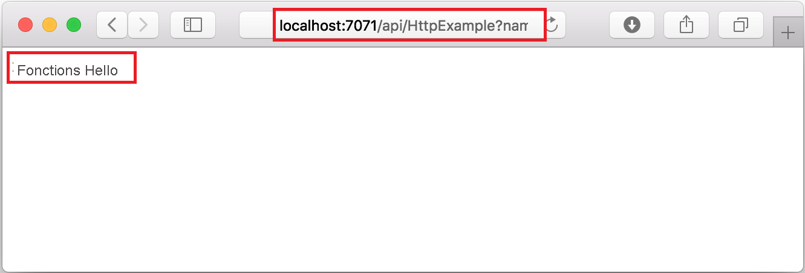
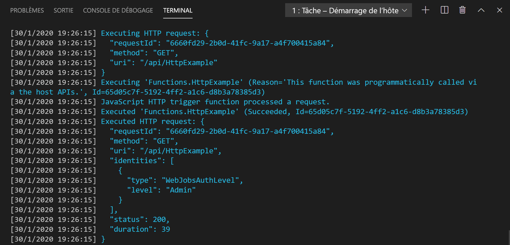
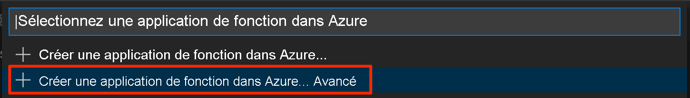

# <a name="quickstart-create-a-go-or-rust-function-in-azure-using-visual-studio-code"></a>Démarrage rapide : Créer une fonction Go ou Rust dans Azure à l’aide de Visual Studio Code

[!INCLUDE [functions-language-selector-quickstart-vs-code](../../includes/functions-language-selector-quickstart-vs-code.md)]

Dans cet article, vous allez utiliser Visual Studio Code pour créer une fonction de [gestionnaire personnalisé](functions-custom-handlers.md) qui répond aux requêtes HTTP. Après avoir testé le code localement, vous le déployez dans l’environnement serverless d’Azure Functions.

Les gestionnaires personnalisés peuvent être utilisés pour créer des fonctions dans n’importe quel langage ou runtime en exécutant un processus serveur HTTP. Cet article prend en charge à la fois [Go](create-first-function-vs-code-other.md?tabs=go) et [Rust](create-first-function-vs-code-other.md?tabs=rust).

Le fait de suivre ce guide de démarrage rapide entraîne une petite dépense de quelques cents USD tout au plus dans votre compte Azure.

## <a name="configure-your-environment"></a>Configurer votre environnement

Avant de commencer, veillez à disposer des éléments suivants :

# <a name="go"></a>[Go](#tab/go)

+ Compte Azure avec un abonnement actif. [Créez un compte gratuitement](https://azure.microsoft.com/free/?ref=microsoft.com&utm_source=microsoft.com&utm_medium=docs&utm_campaign=visualstudio).

+ [Visual Studio Code](https://code.visualstudio.com/) sur l’une des [plateformes prises en charge](https://code.visualstudio.com/docs/supporting/requirements#_platforms).

+ [Extension Azure Functions](https://marketplace.visualstudio.com/items?itemName=ms-azuretools.vscode-azurefunctions) pour Visual Studio Code.

+ [Azure Functions Core Tools](./functions-run-local.md#v2) version 3.x. Utilisez la commande `func --version` pour vérifier si elle est correctement installée.

+ [Go](https://golang.org/doc/install), version la plus récente recommandée. Utilisez la commande `go version` pour vérifier la version que vous utilisez.

# <a name="rust"></a>[Rust](#tab/rust)

+ Compte Azure avec un abonnement actif. [Créez un compte gratuitement](https://azure.microsoft.com/free/?ref=microsoft.com&utm_source=microsoft.com&utm_medium=docs&utm_campaign=visualstudio).

+ [Visual Studio Code](https://code.visualstudio.com/) sur l’une des [plateformes prises en charge](https://code.visualstudio.com/docs/supporting/requirements#_platforms).

+ [Extension Azure Functions](https://marketplace.visualstudio.com/items?itemName=ms-azuretools.vscode-azurefunctions) pour Visual Studio Code.

+ [Azure Functions Core Tools](./functions-run-local.md#v2) version 3.x. Utilisez la commande `func --version` pour vérifier si elle est correctement installée.

+ Chaîne d’outils Rust avec [rustup](https://www.rust-lang.org/tools/install). Utilisez la commande `rustc --version` pour vérifier la version que vous utilisez.

---

## <a name="create-your-local-project"></a><a name="create-an-azure-functions-project"></a>Créer votre projet local

Dans cette section, vous allez utiliser Visual Studio Code pour créer un projet de gestionnaires personnalisés Azure Functions local. Plus loin dans cet article, vous allez publier votre code de fonction sur Azure.

1. Choisissez l’icône Azure dans la barre d’activité, puis dans la zone **Azure : Fonctions**, sélectionnez l’icône **Créer un projet**.

    

1. Choisissez un emplacement de répertoire pour votre espace de travail de projet et optez pour **Sélectionner**.

    > [!NOTE]
    > Ces étapes ont été conçues pour être terminées en dehors d’un espace de travail. Dans ce cas, ne sélectionnez pas de dossier de projet qui fait partie d’un espace de travail.

1. Quand vous y êtes invité, indiquez les informations suivantes :

    + **Sélectionner un langage pour votre projet de fonction** : Choisissez `Custom`.

    + **Sélectionner un modèle pour la première fonction de votre projet** : Choisissez `HTTP trigger`.

    + **Fournir un nom de fonction** : Tapez `HttpExample`.

    + **Niveau d’autorisation** : Choisissez l’option `Anonymous`, qui permet à quiconque d’appeler le point de terminaison de votre fonction. Pour en savoir plus sur le niveau d’autorisation, consultez [Clés d’autorisation](functions-bindings-http-webhook-trigger.md#authorization-keys).

    + **Sélectionner la façon dont vous souhaitez ouvrir votre projet** : Choisissez `Add to workspace`.

1. À l’aide de ces informations, Visual Studio Code génère un projet Azure Functions avec une fonction de déclencheur HTTP. Vous pouvez voir les fichiers de projet locaux dans l’Explorateur. Pour en savoir plus sur les fichiers créés, consultez [Fichiers projet générés](functions-develop-vs-code.md#generated-project-files). 

## <a name="create-and-build-your-function"></a>Créer et générer votre fonction

Le fichier *function.json* dans le dossier *HttpExample* déclare une fonction de déclencheur HTTP. Vous terminez la fonction en ajoutant un gestionnaire et en le compilant en un exécutable.

# <a name="go"></a>[Go](#tab/go)

1. Appuyez sur <kbd>Ctrl+N</kbd> (<kbd>Cmd+N</kbd> sur macOS) pour créer un fichier. Enregistrez-le comme *handler.go* dans la racine de l’application de fonction (dans le même dossier que *host.json*).

1. Dans *handler.go*, ajoutez le code suivant et enregistrez le fichier. Il s’agit de votre gestionnaire personnalisé Go.

    ```go
    package main

    import (
        "fmt"
        "log"
        "net/http"
        "os"
    )

    func helloHandler(w http.ResponseWriter, r *http.Request) {
        message := "This HTTP triggered function executed successfully. Pass a name in the query string for a personalized response.\n"
        name := r.URL.Query().Get("name")
        if name != "" {
            message = fmt.Sprintf("Hello, %s. This HTTP triggered function executed successfully.\n", name)
        }
        fmt.Fprint(w, message)
    }

    func main() {
        listenAddr := ":8080"
        if val, ok := os.LookupEnv("FUNCTIONS_CUSTOMHANDLER_PORT"); ok {
            listenAddr = ":" + val
        }
        http.HandleFunc("/api/HttpExample", helloHandler)
        log.Printf("About to listen on %s. Go to https://127.0.0.1%s/", listenAddr, listenAddr)
        log.Fatal(http.ListenAndServe(listenAddr, nil))
    }
    ```

1. Appuyez sur <kbd>Ctrl+Maj+'</kbd> ou sélectionnez *Nouveau terminal* dans le menu *Terminal* pour ouvrir un nouveau terminal intégré dans VS Code.

1. Compilez votre gestionnaire personnalisé à l’aide de la commande suivante. Un fichier exécutable nommé `handler` (`handler.exe` sur Windows) est généré dans le dossier racine de l’application de fonction.

    ```bash
    go build handler.go
    ```

    

# <a name="rust"></a>[Rust](#tab/rust)

1. Appuyez sur <kbd>Ctrl+Maj+'</kbd> ou sélectionnez *Nouveau terminal* dans le menu *Terminal* pour ouvrir un nouveau terminal intégré dans VS Code.

1. Dans la racine de l’application de fonction (le même dossier que *host.json*), initialisez un projet Rust nommé `handler`.

    ```bash
    cargo init --name handler
    ```

1. Dans *Cargo.toml*, ajoutez les dépendances suivantes nécessaires pour suivre ce guide de démarrage rapide. L’exemple utilise le framework de serveur web [warp](https://docs.rs/warp/).

    ```toml
    [dependencies]
    warp = "0.2"
    tokio = { version = "0.2", features = ["full"] }
    ```

1. Dans *src/main.rs*, ajoutez le code suivant et enregistrez le fichier. Il s’agit de votre gestionnaire personnalisé Rust.

    ```rust
    use std::collections::HashMap;
    use std::env;
    use std::net::Ipv4Addr;
    use warp::{http::Response, Filter};

    #[tokio::main]
    async fn main() {
        let example1 = warp::get()
            .and(warp::path("api"))
            .and(warp::path("HttpExample"))
            .and(warp::query::<HashMap<String, String>>())
            .map(|p: HashMap<String, String>| match p.get("name") {
                Some(name) => Response::builder().body(format!("Hello, {}. This HTTP triggered function executed successfully.", name)),
                None => Response::builder().body(String::from("This HTTP triggered function executed successfully. Pass a name in the query string for a personalized response.")),
            });

        let port_key = "FUNCTIONS_CUSTOMHANDLER_PORT";
        let port: u16 = match env::var(port_key) {
            Ok(val) => val.parse().expect("Custom Handler port is not a number!"),
            Err(_) => 3000,
        };

        warp::serve(example1).run((Ipv4Addr::UNSPECIFIED, port)).await
    }
    ```

1. Compilez un fichier binaire pour votre gestionnaire personnalisé. Un fichier exécutable nommé `handler` (`handler.exe` sur Windows) est généré dans le dossier racine de l’application de fonction.

    ```bash
    cargo build --release
    cp target/release/handler .
    ```

    

---

## <a name="configure-your-function-app"></a>Configurer votre application de fonction

L’hôte de la fonction doit être configuré pour exécuter le fichier binaire de votre gestionnaire personnalisé au démarrage.

1. Ouvrez *host.json*.

1. Dans la section `customHandler.description`, définissez la valeur de `defaultExecutablePath` sur `handler` (sur Windows, définissez-la sur `handler.exe`).

1. Dans la section `customHandler`, ajoutez une propriété nommée `enableForwardingHttpRequest` et définissez sa valeur sur `true`. Pour les fonctions composées uniquement d’un déclencheur HTTP, ce paramètre simplifie la programmation en vous permettant d’utiliser une requête HTTP classique au lieu de la [charge utile des demandes](functions-custom-handlers.md#request-payload) du gestionnaire personnalisé.

1. Vérifiez que la section `customHandler` ressemble à cet exemple. Enregistrez le fichier.

    ```
    "customHandler": {
      "description": {
        "defaultExecutablePath": "handler",
        "workingDirectory": "",
        "arguments": []
      },
      "enableForwardingHttpRequest": true
    }
    ```

L’application de fonction est configurée pour démarrer l’exécutable de votre gestionnaire personnalisé.

## <a name="run-the-function-locally"></a>Exécuter la fonction localement

Vous pouvez exécuter ce projet sur votre ordinateur de développement local avant de publier sur Azure.

1. Dans le terminal intégré, démarrez l’application de fonction en utilisant Azure Functions Core Tools.

    ```bash
    func start
    ```

1. Avec Core Tools en cours d’exécution, accédez à l’URL suivante pour exécuter une requête GET, qui inclut la chaîne de requête `?name=Functions`.

    `http://localhost:7071/api/HttpExample?name=Functions`

1. Une réponse est retournée, semblable à celle-ci dans un navigateur :

    

1. Les informations relatives à la requête s’affichent dans le panneau **Terminal**.

    

1. Appuyez sur <kbd>Ctrl+C</kbd> pour arrêter Core Tools.

Après avoir vérifié que la fonction s’exécute correctement sur votre ordinateur local, il est temps d’utiliser Visual Studio Code pour publier le projet directement sur Azure.

[!INCLUDE [functions-sign-in-vs-code](../../includes/functions-sign-in-vs-code.md)]

## <a name="compile-the-custom-handler-for-azure"></a>Compiler le gestionnaire personnalisé pour Azure

Dans cette section, vous allez publier votre projet sur Azure dans une application de fonction exécutant Linux. Dans la plupart des cas, vous devez recompiler votre fichier binaire et ajuster votre configuration pour qu’elle corresponde à la plateforme cible avant la publication sur Azure.

# <a name="go"></a>[Go](#tab/go)

1. Dans le terminal intégré, compilez le gestionnaire en Linux/x64. Un fichier binaire nommé `handler` est créé dans la racine de l’application de fonction.

    # <a name="macos"></a>[macOS](#tab/macos)

    ```bash
    GOOS=linux GOARCH=amd64 go build handler.go
    ```

    # <a name="linux"></a>[Linux](#tab/linux)

    ```bash
    GOOS=linux GOARCH=amd64 go build handler.go
    ```

    # <a name="windows"></a>[Windows](#tab/windows)
    ```cmd
    set GOOS=linux
    set GOARCH=amd64
    go build handler.go
    ```

    Modifiez `defaultExecutablePath` dans *host.json* en remplaçant `handler.exe` par `handler`. Cela indique à l’application de fonction d’exécuter le binaire Linux.
    
    ---

# <a name="rust"></a>[Rust](#tab/rust)

1. Créez un fichier au niveau de *.cargo/config*. Ajoutez le contenu suivant et enregistrez le fichier.

    ```
    [target.x86_64-unknown-linux-musl]
    linker = "rust-lld"
    ```

1. Dans le terminal intégré, compilez le gestionnaire en Linux/x64. Un fichier binaire nommé `handler` est créé. Copiez-le dans la racine de l’application de fonction.

    ```bash
    rustup target add x86_64-unknown-linux-musl
    cargo build --release --target=x86_64-unknown-linux-musl
    cp target/x86_64-unknown-linux-musl/release/handler .
    ```

1. Si vous utilisez Windows, modifiez `defaultExecutablePath` dans *host.json* en remplaçant `handler.exe` par `handler`. Cela indique à l’application de fonction d’exécuter le binaire Linux.

1. Ajoutez la ligne suivante au fichier *.funcignore* :

    ```
    target
    ```

    Cela empêche la publication du contenu du dossier *cible*.

---

## <a name="publish-the-project-to-azure"></a>Publication du projet sur Azure

Dans cette section, vous créez une application de fonction et les ressources associées dans votre abonnement Azure, puis vous déployez votre code. 

> [!IMPORTANT]
> La publication sur une application de fonction existante remplace le contenu de cette application dans Azure. 


1. Choisissez l’icône Azure dans la barre d’activité, puis dans la zone **Azure : Fonctions**, choisissez le bouton **Déployer sur une application de fonction**.

    

1. Quand vous y êtes invité, indiquez les informations suivantes :

    + **Sélectionnez le dossier** : choisissez un dossier dans votre espace de travail ou accédez à un dossier qui contient votre application de fonction. Vous ne verrez pas ceci si vous avez déjà ouvert une application de fonction valide.

    + **Sélectionnez l’abonnement** : choisissez l’abonnement à utiliser. Vous ne verrez pas ceci si vous n’avez qu’un seul abonnement.

    + **Sélectionnez une application de fonction dans Azure** : Choisissez `+ Create new Function App (advanced)`. 
    
        > [!IMPORTANT]
        > L’option `advanced` vous permet de choisir le système d’exploitation spécifique sur lequel s’exécute votre application de fonction dans Azure, qui est dans ce cas Linux.

        

    + **Entrer un nom global unique pour l’application de fonction** : Tapez un nom valide dans un chemin d’URL. Le système vérifie que le nom que vous tapez est unique dans Azure Functions.

    + **Sélectionner une pile d’exécution** : Choisissez `Custom Handler`.

    + **Sélectionner un système d’exploitation** : Choisissez `Linux`.

    + **Sélectionner un plan d’hébergement** : Choisissez `Consumption`.

    + **Sélectionner un groupe de ressources** : Choisissez `+ Create new resource group`. Entrez un nom pour le groupe de ressources. Ce nom doit être unique dans votre abonnement Azure. Vous pouvez utiliser le nom suggéré dans l’invite.

    + **Sélectionner un compte de stockage** : Choisissez `+ Create new storage account`. Ce nom doit être globalement unique dans Azure. Vous pouvez utiliser le nom suggéré dans l’invite.

    + **Sélectionner une ressource Application Insights** : Choisissez `+ Create Application Insights resource`. Ce nom doit être globalement unique dans Azure. Vous pouvez utiliser le nom suggéré dans l’invite.

    + **Sélectionnez un emplacement pour les nouvelles ressources** :  Pour de meilleures performances, choisissez une [région](https://azure.microsoft.com/regions/) proche de chez vous. L’extension affiche l’état des ressources individuelles au fur et à mesure de leur création dans Azure, au sein de la zone de notification.

    :::image type="content" source="../../includes/media/functions-publish-project-vscode/resource-notification.png" alt-text="Notification de création de ressources Azure":::

1. Quand vous avez terminé, les ressources Azure suivantes sont créées dans votre abonnement :

    [!INCLUDE [functions-vs-code-created-resources](../../includes/functions-vs-code-created-resources.md)]

    Une notification s’affiche après que votre application de fonction a été créée et que le package de déploiement a été appliqué. 

4. Sélectionnez **Afficher la sortie de** dans cette notification pour afficher les résultats de la création et du déploiement, y compris les ressources Azure que vous avez créées. Si vous manquez la notification, sélectionnez l’icône de cloche dans le coin inférieur droit pour la voir de nouveau.

    

[!INCLUDE [functions-vs-code-run-remote](../../includes/functions-vs-code-run-remote.md)]

[!INCLUDE [functions-cleanup-resources-vs-code.md](../../includes/functions-cleanup-resources-vs-code.md)]

## <a name="next-steps"></a>Étapes suivantes

> [!div class="nextstepaction"]
> [En savoir plus sur les gestionnaires personnalisés Azure Functions](functions-custom-handlers.md)
