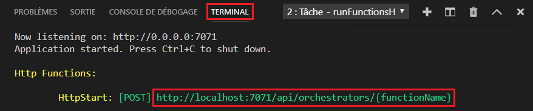

# Démarrage rapide : Créer une fonction dans Azure avec Python avec Visual Studio Code

> [!div class="op_single_selector" title1="Sélectionnez votre langage de fonction : "]
> - [Python](create-first-function-vs-code-python.md)
> - [C#](create-first-function-vs-code-csharp.md)
> - [Java](create-first-function-vs-code-java.md)
> - [JavaScript](create-first-function-vs-code-node.md)
> - [PowerShell](create-first-function-vs-code-powershell.md)
> - [TypeScript](create-first-function-vs-code-typescript.md)
> - [Autres (Go/Rust)](create-first-function-vs-code-other.md)

Dans cet article, vous allez utiliser Visual Studio Code pour créer une fonction Python qui répond aux requêtes HTTP. Après avoir testé le code localement, vous le déployez dans l’environnement <abbr title="Environnement informatique de runtime dans lequel tous les détails du serveur sont transparents pour les développeurs d’applications, ce qui simplifie le processus de déploiement et de gestion du code.">serverless</abbr> d’ <abbr title="Service Azure qui fournit un environnement informatique serverless à faible coût pour les applications.">Azure Functions</abbr>.

Le fait de suivre ce guide de démarrage rapide entraîne une petite dépense de quelques cents USD tout au plus dans votre compte Azure.

Il existe également une [version basée sur l’interface CLI](create-first-function-cli-python.md) de cet article.

## 1. Préparation de votre environnement

Avant de commencer, veillez à disposer des éléments suivants :

+ Un <abbr title="Profil qui gère les informations de facturation pour l’utilisation d’Azure.">compte Azure</abbr> avec un <abbr title="Structure organisationnelle de base dans laquelle vous gérez les ressources dans Azure, généralement associée à une personne ou à un service au sein d’une organisation.">abonnement</abbr>actif. [Créez un compte gratuitement](https://azure.microsoft.com/free/?ref=microsoft.com&utm_source=microsoft.com&utm_medium=docs&utm_campaign=visualstudio).

+ [Azure Functions Core Tools](functions-run-local.md#install-the-azure-functions-core-tools) version 3.x.

+ [Python 3.8](https://www.python.org/downloads/release/python-381/), [Python 3.7](https://www.python.org/downloads/release/python-375/) et [Python 3.6](https://www.python.org/downloads/release/python-368/) sont pris en charge par Azure Functions (x64).

+ [Visual Studio Code](https://code.visualstudio.com/) sur l’une des [plateformes prises en charge](https://code.visualstudio.com/docs/supporting/requirements#_platforms).

+ [Extension Python](https://marketplace.visualstudio.com/items?itemName=ms-python.python) pour Visual Studio Code.  

+ [Extension Azure Functions](https://marketplace.visualstudio.com/items?itemName=ms-azuretools.vscode-azurefunctions) pour Visual Studio Code.

 

## 2. Créer votre projet local

1. Choisissez l’icône Azure dans la <abbr title="Groupe vertical d’icônes sur le côté gauche de la fenêtre de Visual Studio Code.">barre d’activité</abbr>, puis dans la zone **Azure : Fonctions**, sélectionnez l’icône **Créer un projet...**

    

1. Choisissez un emplacement de répertoire pour votre espace de travail de projet et optez pour **Sélectionner**.

    > [!NOTE]
    > Ces étapes ont été conçues pour être terminées en dehors d’un espace de travail. Dans ce cas, ne sélectionnez pas de dossier de projet qui fait partie d’un espace de travail.

1. Quand vous y êtes invité, indiquez les informations suivantes :

    + **Sélectionner un langage pour votre projet de fonction** : Choisissez `Python`.

    + **Sélectionner un alias Python pour créer un environnement virtuel** : Choisissez l’emplacement de votre interpréteur Python. Si l’emplacement n’est pas affiché, tapez le chemin complet de votre fichier binaire Python.  

    + **Sélectionner un modèle pour la première fonction de votre projet** : Choisissez `HTTP trigger`.

    + **Fournir un nom de fonction** : Tapez `HttpExample`.

    + **Niveau d’autorisation** : Choisissez l’option `Anonymous`, qui permet à quiconque d’appeler le point de terminaison de votre fonction. Pour en savoir plus sur les niveaux d’autorisation, consultez [Clés d’autorisation](functions-bindings-http-webhook-trigger.md#authorization-keys).

    + **Sélectionner la façon dont vous souhaitez ouvrir votre projet** : Choisissez `Add to workspace`.

 

<strong>Impossible de créer un projet de fonction ?</strong>

Les problèmes les plus courants à résoudre lors de la création d’un projet Azure Functions local sont les suivants :
* L’extension Azure Functions n’est pas installée. 

 

## Exécuter la fonction localement

1. Appuyez sur <kbd>F5</kbd> pour démarrer le projet d’application de fonction.

1. Dans le panneau **Terminal**, observez le point de terminaison d’URL de votre fonction en cours d’exécution localement.

    

1. Une fois Core Tools en cours d’exécution, accédez à la zone **Azure : Functions**. Sous **Fonctions**, développez **Projet local** > **Fonctions**. Cliquez avec le bouton droit (Windows) ou effectuez <kbd>Ctrl-clic</kbd> (macOS) sur la fonction `HttpExample`, puis choisissez **Exécuter la fonction maintenant**.

    :::image type="content" source="../../includes/media/functions-run-function-test-local-vs-code/execute-function-now.png" alt-text="Exécuter la fonction maintenant dans Visual Studio Code":::

1. Dans **Entrer le corps de la requête**, vous pouvez voir la valeur du corps du message de requête pour `{ "name": "Azure" }`. Appuyez sur Entrée pour envoyer ce message de requête à votre fonction.  

1. Quand la fonction s’exécute localement et retourne une réponse, une notification est générée dans Visual Studio Code. Les informations relatives à l’exécution de la fonction sont affichées dans le panneau **Terminal**.

1. Appuyez sur <kbd>Ctrl+C</kbd> pour arrêter Core Tools et déconnecter le débogueur.

 

<strong>Impossible d’exécuter la fonction localement ?</strong>

Les problèmes les plus courants à résoudre lors de l’exécution d’un projet Azure Functions local sont les suivants :
* Les outils Core Tools ne sont pas installés. 
*  Si vous rencontrez des problèmes d’exécution sur Windows, veillez à ce que l’interpréteur de commandes de terminal par défaut pour Visual Studio Code ne soit pas défini sur **WSL Bash**. 

 

## 4. Connexion à Azure

Pour publier votre application, connectez-vous à Azure. Si vous êtes déjà connecté, passez à la section suivante.

1. Choisissez l’icône Azure dans la barre d’activité, puis dans la zone **Azure : Fonctions**, choisissez **Se connecter à Azure...**

    

1. Quand vous y êtes invité dans le navigateur, **choisissez votre compte Azure** et **connectez-vous** avec vos informations d’identification de compte Azure.

1. Une fois connecté, fermez la nouvelle fenêtre de navigateur et revenez à Visual Studio Code. 

 

## 5. Publication du projet sur Azure

Le premier déploiement de votre code inclut la création d’une ressource de fonction dans votre abonnement Azure.

1. Choisissez l’icône Azure dans la barre d’activité, puis dans la zone **Azure : Fonctions**, choisissez le bouton **Déployer sur une application de fonction**.

    

1. Quand vous y êtes invité, indiquez les informations suivantes :

    + **Sélectionnez le dossier** : Choisissez le dossier qui contient votre application de fonction.

    + **Sélectionnez l’abonnement** : choisissez l’abonnement à utiliser. Vous ne verrez pas ceci si vous n’avez qu’un seul abonnement.

    + **Sélectionnez une application de fonction dans Azure** : Choisissez `+ Create new Function App`.

    + **Entrer un nom global unique pour l’application de fonction** : Tapez un nom valide dans un chemin d’URL. Le nom que vous tapez est validé pour s’assurer qu’il est <abbr title="Le nom doit être unique pour tous les clients Azure à l’échelle mondiale. Par exemple, vous pouvez utiliser une combinaison de votre nom personnel ou du nom de votre organisation, du nom de l’application et d’un identificateur numérique, comme dans contoso-bizapp-func-20.">unique dans Azure</abbr>. 

    + **Sélectionnez un runtime** : Choisissez la version de Python que vous avez exécutée localement. Vous pouvez utiliser la commande `python --version` pour vérifier votre version.

    + **Sélectionnez un emplacement pour les nouvelles ressources** : Pour de meilleures performances, choisissez une [région](https://azure.microsoft.com/regions/) proche de vous.

    L’extension montre l’état des ressources individuelles au fur et à mesure de leur création dans Azure, au sein de la zone de notification.

    :::image type="content" source="../../includes/media/functions-publish-project-vscode/resource-notification.png" alt-text="Notification de création de ressources Azure":::

1. Une notification s’affiche après que votre application de fonction a été créée et que le package de déploiement a été appliqué. Sélectionnez **Afficher la sortie** pour voir les résultats de la création et du déploiement. 

    

 

<strong>Impossible de publier la fonction ?</strong>

Cette section a créé les ressources Azure et déployé votre code local dans l’application de fonction. Si cela a échoué :

* Passez en revue la sortie et recherchez des informations d’erreur. L’icône en forme de cloche en bas à droite est un autre moyen d’afficher la sortie. 
* Avez-vous publié dans une application de fonction existante ? Cette action remplace le contenu de cette application dans Azure.

 

<strong>Quelles ressources ont été créées ?</strong>

Quand vous avez terminé, les ressources Azure suivantes sont créées dans votre abonnement et leurs noms reposent sur le nom de votre application de fonction : 
* **Groupe de ressources** : Un groupe de ressources est un conteneur logique pour des ressources associées dans une même région.
* **Compte de stockage Azure** : Une ressource de stockage conserve l’état et d’autres informations relatives à votre projet.
* **Plan de consommation** : Un plan de consommation définit l’hôte sous-jacent pour votre application de fonction serverless.
* **Application de fonction** : Une application de fonction fournit l’environnement pour l’exécution de votre code de fonction et des fonctions de groupe en tant qu’unité logique.
* **Application Insights** : Application Insights effectue le suivi de l’utilisation de votre fonction serverless.

 

## 6. Exécuter la fonction dans Azure

1. De retour dans la barre latérale **Azure : Fonctions**, développez la nouvelle application de fonction.
1. Développez **Fonctions**, cliquez avec le bouton droit (Windows) ou effectuez <kbd>Ctrl-clic</kbd> (macOS) sur la fonction `HttpExample`, puis choisissez **Exécuter la fonction maintenant...**

    :::image type="content" source="../../includes/media/functions-vs-code-run-remote/execute-function-now.png" alt-text="Exécuter la fonction maintenant dans Azure à partir de Visual Studio Code":::

1. Dans **Entrer le corps de la demande** figure la valeur `{ "name": "Azure" }` pour le corps du message de la demande.

    Appuyez sur Entrée pour envoyer ce message de demande à votre fonction.  

1. Quand la fonction s’exécute dans Azure et retourne une réponse, une notification est générée dans Visual Studio Code.

## 7. Nettoyer les ressources

Quand vous passez à l’[étape suivante](#next-steps) et que vous ajoutez une <abbr title="Moyen d’associer une fonction à une file d’attente de stockage, afin qu’elle puisse créer des messages dans la file d’attente.">liaison de sortie de file d’attente Azure Storage</abbr> à votre fonction, vous devez maintenir en place toutes vos ressources pour tirer parti de ce que vous avez déjà fait.

Sinon, vous pouvez utiliser les étapes suivantes pour supprimer l’application de fonction et ses ressources connexes afin d’éviter des coûts supplémentaires.

[!INCLUDE [functions-cleanup-resources-vs-code-inner.md](../../includes/functions-cleanup-resources-vs-code-inner.md)]

Pour en savoir plus sur les coûts de Functions, consultez [Estimation des coûts d’un plan Consommation](functions-consumption-costs.md).

## Étapes suivantes

Développez cette fonction en ajoutant une <abbr title="Connexion déclarative entre une fonction et d’autres ressources. Une liaison d’entrée fournit des données à la fonction ; une liaison de sortie fournit des données de la fonction à d’autres ressources.">liaison de sortie</abbr>. Cette liaison écrit la chaîne de la requête HTTP dans un message dans une file d’attente de Stockage File d’attente Azure. 

> [!div class="nextstepaction"]
> [Se connecter à une file d’attente Stockage Azure](functions-add-output-binding-storage-queue-vs-code.md?pivots=programming-language-python)

[Vous rencontrez des problèmes ? Faites-le nous savoir.](https://aka.ms/python-functions-qs-survey)

[Azure Functions Core Tools]: functions-run-local.md
[Azure Functions extension for Visual Studio Code]: https://marketplace.visualstudio.com/items?itemName=ms-azuretools.vscode-azurefunctions
