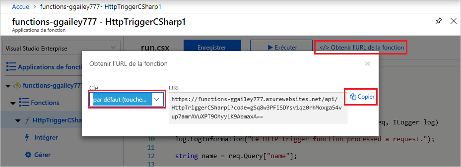
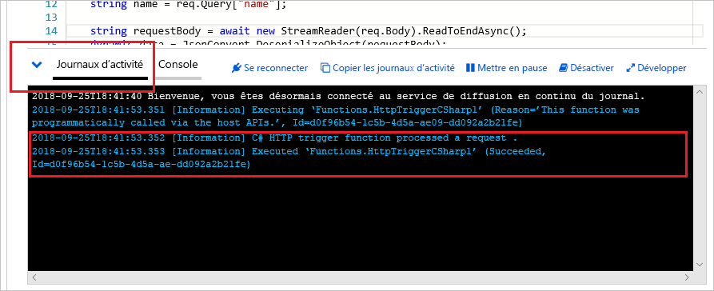

# Créer une application de fonction dans un plan App Service sur Linux

Azure Functions vous permet d’héberger vos fonctions sur Linux dans un conteneur Azure App Service par défaut. Cet article vous montre comment utiliser le [portail Azure](https://portal.azure.com) pour créer une application de fonction Linux dans Azure, qui s’exécute dans un [plan App Service](dedicated-plan.md). Vous pouvez également [apporter votre propre conteneur personnalisé](functions-create-function-linux-custom-image.md).

[!INCLUDE [functions-in-portal-editing-note](../../includes/functions-in-portal-editing-note.md)] 

[!INCLUDE [quickstarts-free-trial-note](../../includes/quickstarts-free-trial-note.md)]

## Connexion à Azure

Connectez-vous au portail Azure sur <https://portal.azure.com> avec votre compte Azure.

## Créer une application de fonction

Vous devez disposer d’une application de fonction pour héberger l’exécution de vos fonctions sur Linux. L’application de fonction fournit un environnement pour l’exécution de votre code de fonction. Elle vous permet de regrouper les fonctions en une unité logique pour faciliter la gestion, le déploiement, la mise à l’échelle et le partage des ressources. Dans cet article, vous créez un plan App Service lorsque vous créez votre application de fonction.

1. Dans le menu du portail Azure ou dans la page **Accueil**, sélectionnez **Créer une ressource**.

1. Dans la page **Nouveau**, sélectionnez **Calcul** > **Application de fonction**.

    :::image type="content" source="./media/create-function-app-linux-app-service-plan/function-app-create-flow.png" alt-text="Créer une application de fonction sur le Portail Azure":::

1. Dans la page **De base**, utilisez les paramètres d’application de fonction comme indiqué dans le tableau ci-dessous.

    | Paramètre      | Valeur suggérée  | Description |
    | ------------ | ---------------- | ----------- |
    | **Abonnement** | Votre abonnement | Abonnement sous lequel est créée cette nouvelle application de fonction. |
    | **[Groupe de ressources](../azure-resource-manager/management/overview.md)** |  *myResourceGroup* | Nom du nouveau groupe de ressources dans lequel créer votre Function App. |
    | **Nom de l’application de fonction** | Nom globalement unique | Nom qui identifie votre nouvelle Function App. Les caractères valides sont `a-z` (insensible à la casse), `0-9`et `-`.  |
    |**Publier**| **Code** (par défaut) | Option permettant de publier des fichiers de code ou un conteneur Docker. |
    | **Pile d’exécution** | Langage préféré | Choisissez un runtime qui prend en charge votre langage de programmation de fonction favori. Choisissez **.NET Core** pour les fonctions C# et F#. |
    |**Version**| Numéro de version | Choisissez la version de votre runtime installé.  |
    |**Région**| Région recommandée | Choisissez une [région](https://azure.microsoft.com/regions/) près de chez vous ou près d’autres services auxquels ont accès vos fonctions. |

    :::image type="content" source="./media/create-function-app-linux-app-service-plan/function-app-create-basics-linux.png" alt-text="Page De base":::

1. Sélectionnez **Suivant : Hébergement**. Dans la page **Hébergement**, entrez les paramètres suivants.

    | Paramètre      | Valeur suggérée  | Description |
    | ------------ | ---------------- | ----------- |
    | **[Compte de stockage](../storage/common/storage-account-create.md)** |  Nom globalement unique |  Créez un compte de stockage utilisé par votre application de fonction. Les noms des comptes de stockage doivent comporter entre 3 et 24 caractères, uniquement des lettres minuscules et des chiffres. Vous pouvez également utiliser un compte existant qui doit répondre aux [exigences relatives aux comptes de stockage](../azure-functions/storage-considerations.md#storage-account-requirements). |
    |**Système d’exploitation**| **Linux** | Un système d’exploitation est présélectionné pour vous en fonction de la sélection de votre pile d’exécution, mais vous pouvez modifier le paramètre si nécessaire. |
    | **[Plan](../azure-functions/functions-scale.md)** | **Consommation (serverless)** | Plan d’hébergement qui définit la façon dont les ressources sont allouées à votre Function App. Dans le plan de **Consommation** par défaut, les ressources sont ajoutées dynamiquement en fonction des besoins de vos fonctions. Avec cet hébergement [serverless](https://azure.microsoft.com/overview/serverless-computing/), vous payez uniquement pour la durée d’exécution de vos fonctions. Si vous exécutez dans un plan App Service, vous devez gérer la [mise à l’échelle de votre application de fonction](../azure-functions/functions-scale.md).  |

    :::image type="content" source="./media/create-function-app-linux-app-service-plan/function-app-create-hosting-linux.png" alt-text="Page Hébergement":::

1. Sélectionnez **Suivant : Supervision**. Dans la page **Supervision**, entrez les paramètres suivants.

    | Paramètre      | Valeur suggérée  | Description |
    | ------------ | ---------------- | ----------- |
    | **[Application Insights](../azure-functions/functions-monitoring.md)** | **Oui** (par défaut) | Crée une ressource Application Insights avec le même *nom de l’application* dans la région prise en charge la plus proche. En développant ce paramètre ou en sélectionnant **Créer nouveau**, vous pouvez modifier le nom Application Insights ou choisir une autre région dans une [zone géographique Azure](https://azure.microsoft.com/global-infrastructure/geographies/) où vous souhaitez stocker vos données. |

   :::image type="content" source="./media/create-function-app-linux-app-service-plan/function-app-create-monitoring-linux.png" alt-text="Page Surveillance":::

1. Sélectionnez **Vérifier + créer** pour passer en revue les sélections de configuration d’application.

1. Dans la page **Vérifier + créer**, vérifiez vos paramètres, puis sélectionnez **Créer** pour provisionner et déployer l’application de fonction.

1. Cliquez sur l’icône **Notifications** en haut à droite du portail pour voir le message **Le déploiement a été effectué**.

1. Sélectionnez **Accéder à la ressource** pour afficher votre nouvelle application de fonction. Vous pouvez également sélectionner **Épingler au tableau de bord**. L’épinglage permet de revenir plus facilement à cette ressource d’application de fonction à partir de votre tableau de bord.

    

    Même une fois votre application de fonction disponible, il peut s’écouler quelques minutes avant qu’elle ne soit entièrement initialisée.

Créez ensuite une fonction dans la nouvelle Function App.

## Créer une fonction de déclencheur HTTP

Cette section vous montre comment créer une fonction dans votre nouvelle application de fonction dans le portail.

> [!NOTE]
> L’expérience de développement du portail peut être utile pour tester Azure Functions. Pour la plupart des scénarios, envisagez de développer vos fonctions localement et de publier le projet dans votre application de fonction à l’aide de [Visual Studio Code](./create-first-function-vs-code-csharp.md#create-an-azure-functions-project) ou d’[Azure Functions Core Tools](functions-run-local.md#create-a-local-functions-project).  

1. Dans le menu de gauche de la fenêtre **Fonctions**, sélectionnez **Fonctions**, puis **Ajouter** dans le menu supérieur. 
 
1. Dans la fenêtre **Nouvelle fonction**, sélectionnez **Déclencheur http**.

    

1. Dans la fenêtre **Nouvelle fonction**, acceptez le nom par défaut pour la **Nouvelle fonction** ou entrez un nouveau nom. 

1. Choisissez **Anonyme** dans la liste déroulante **Niveau d’autorisation**, puis sélectionnez **Créer une fonction**.

    Azure crée la fonction de déclencheur HTTP. Vous pouvez maintenant exécuter la nouvelle fonction en envoyant une requête HTTP.

## Tester la fonction

1. Dans votre nouvelle fonction de déclencheur HTTP, sélectionnez **Code + test** dans le menu de gauche, puis sélectionnez **Obtenir l’URL de la fonction** dans le menu supérieur.

    

1. Dans la boîte de dialogue **Obtenir l’URL de la fonction**, sélectionnez **Par défaut** dans la liste déroulante, puis choisissez l’icône **Copier dans le Presse-papiers.** . 

    

1. Collez l’URL de fonction dans la barre d’adresse de votre navigateur. Ajoutez la valeur de la chaîne de requête `?name=<your_name>` à la fin de cette URL, puis appuyez sur la touche Entrée pour exécuter la requête. 

    L’exemple suivant montre la réponse dans le navigateur :

    

    L’URL de demande inclut une clé qui est requise, par défaut, pour accéder à votre fonction sur HTTP.

1. Lorsque votre fonction s’exécute, des informations de suivi sont écrites dans les journaux d’activité. Pour afficher la sortie de suivi, revenez à la page **Code + test** dans le portail, puis développez la flèche **Journaux** en bas de la page.

   

## Nettoyer les ressources

[!INCLUDE [Clean-up resources](../../includes/functions-quickstart-cleanup.md)]

## Étapes suivantes

Vous avez créé une application de fonction avec une simple fonction de déclencheur HTTP.  

[!INCLUDE [Next steps note](../../includes/functions-quickstart-next-steps.md)]

Pour plus d’informations, consultez [Liaisons HTTP Azure Functions](functions-bindings-http-webhook.md).
