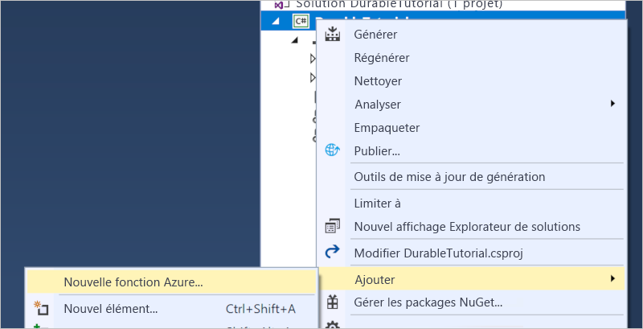

# <a name="create-your-first-durable-function-in-c"></a>Créer votre première fonction durable dans C\#

*Durable Functions* est une extension d’[Azure Functions](../functions-overview.md) qui vous permet d’écrire des fonctions avec état dans un environnement serverless. L’extension gère l’état, les points de contrôle et les redémarrages à votre place.

[!INCLUDE [v1-note](../../../includes/functions-durable-v1-tutorial-note.md)]

Cet article explique comment utiliser Visual Studio 2019 pour créer et tester en local une fonction durable « Hello World ».  Cette fonction orchestre et chaîne des appels à d’autres fonctions. Vous allez ensuite publier le code de la fonction dans Azure. Ces outils sont disponibles dans le cadre de la charge de travail de développement Azure dans Visual Studio 2019.


## <a name="prerequisites"></a>Conditions préalables requises

Pour suivre ce tutoriel :

* Installez [Visual Studio 2019](https://visualstudio.microsoft.com/vs/). Vérifiez que la charge de travail de **développement Azure** est également installée. Visual Studio 2017 prend également en charge le développement de fonctions durables, mais l’interface utilisateur et les étapes diffèrent.

* Vérifiez que l’[émulateur de stockage Azure](../../storage/common/storage-use-emulator.md) est installé et démarré.

[!INCLUDE [quickstarts-free-trial-note](../../../includes/quickstarts-free-trial-note.md)]

## <a name="create-a-function-app-project"></a>Créer un projet d’application de fonction

Le modèle Azure Functions crée un projet qui peut être publié dans une application de fonction dans Azure. Une application de fonctions vous permet de regrouper des fonctions en une unité logique pour faciliter la gestion, le déploiement et le partage des ressources.

1. Dans Visual Studio, sélectionnez **Nouveau** > **Projet** dans le menu **Fichier**.

1. Dans la boîte de dialogue **Ajouter un nouveau projet**, recherchez `functions`, choisissez le modèle **Azure Functions**, puis sélectionnez **Suivant**. 

    

1. Entrez un **Nom du projet**, puis sélectionnez **OK**. Le nom de projet devant être valide en tant qu’espace de noms C#, n’utilisez ni traits d’union, ni traits de soulignement, ni aucun autre caractère non alphanumérique.

1. Dans **Créer une application Azure Functions**, utilisez les paramètres spécifiés dans le tableau sous l’image.

    

    | Paramètre      | Valeur suggérée  | Description                      |
    | ------------ |  ------- |----------------------------------------- |
    | **Version** | Azure Functions 2.0 <br />(.NET Core) | Crée un projet de fonction qui utilise le Runtime Azure Functions version 2.0 qui prend en charge .NET Core. La version 1.0 d’Azure Functions prend en charge .NET Framework. Pour plus d’informations, consultez [Guide pratique pour cibler la version du runtime Azure Functions](../functions-versions.md).   |
    | **Modèle** | Vide | Crée une application de fonction vide. |
    | **Compte de stockage**  | Émulateur de stockage | Un compte de stockage est nécessaire pour la gestion des états de fonction durable. |

4. Sélectionnez **Créer** pour créer un projet de fonction vide. Ce projet contient les fichiers de configuration de base nécessaires à l’exécution de vos fonctions.

## <a name="add-functions-to-the-app"></a>Ajouter des fonctions à l’application

Les étapes suivantes utilisent un modèle pour créer le code de fonction durable dans votre projet.

1. Cliquez avec le bouton droit sur le projet dans Visual Studio et sélectionnez **Ajouter** > **Nouvelle fonction Azure**.

    

1. Vérifiez qu’**Azure Function** est sélectionné dans le menu Ajouter, tapez un nom pour votre fichier C#, puis sélectionnez **Ajouter**.

1. Sélectionnez le modèle **Orchestration Durable Functions**, puis sélectionnez **OK**.

      

> [!NOTE]
> Ce modèle crée actuellement une fonction durable à l’aide d’une ancienne version 1.x de l’extension. Pour plus d’informations sur la mise à niveau vers les versions 2. x les plus récentes de Durable Functions, consultez l’article [Versions de Durable Functions](durable-functions-versions.md).

Une nouvelle fonction durable est ajoutée à l’application.  Ouvrez le nouveau fichier .cs pour afficher le contenu. Cette fonction durable est un exemple de chaînage de fonctions simple avec les méthodes suivantes :  

| Méthode | FunctionName | Description |
| -----  | ------------ | ----------- |
| **`RunOrchestrator`** | `<file-name>` | Gère l’orchestration durable. Dans ce cas, l’orchestration démarre, crée une liste et ajoute le résultat des trois appels de fonctions à la liste.  À la fin des trois appels de fonctions, elle retourne la liste. |
| **`SayHello`** | `<file-name>_Hello` | La fonction retourne « hello ». Cette fonction contient la logique métier actuellement orchestrée. |
| **`HttpStart`** | `<file-name>_HttpStart` | [Fonction déclenchée par HTTP](../functions-bindings-http-webhook.md) qui démarre une instance de l’orchestration et retourne une réponse d’état de vérification. |

Maintenant que vous avez créé un projet de fonction et une fonction durable, vous pouvez tester la fonction sur votre ordinateur local.

## <a name="test-the-function-locally"></a>Tester la fonction en local

Azure Functions Core Tools vous permet d’exécuter un projet Azure Functions sur votre ordinateur de développement local. Vous êtes invité à installer ces outils la première fois que vous démarrez une fonction dans Visual Studio.

1. Pour tester votre fonction, appuyez sur F5. Si vous y êtes invité, acceptez la requête dans Visual Studio pour télécharger et installer Azure Functions Core (CLI) Tools. Vous devrez peut-être activer une exception de pare-feu afin de permettre aux outils de prendre en charge les requêtes HTTP.

2. Copiez l’URL de votre fonction à partir de la sortie runtime Azure Functions.

    

3. Collez l’URL de la requête HTTP dans la barre d’adresse de votre navigateur et exécutez la requête. La capture d’écran suivante du navigateur montre la requête renvoyée par la fonction suite à la demande locale GET :

    

    La réponse est le résultat initial de la fonction HTTP, qui nous indique que l’orchestration durable a bien été démarrée.  Il ne s’agit pas encore du résultat final de l’orchestration.  La réponse contient plusieurs URL utiles.  Pour le moment, demandons l’état de l’orchestration.

4. Copiez la valeur de l’URL pour `statusQueryGetUri` et collez-la dans la barre d’adresse du navigateur, puis exécutez la requête.

    La requête interroge l’instance d’orchestration pour obtenir l’état. Vous obtenez une réponse éventuelle qui ressemble à l’exemple ci-dessous.  Cette sortie nous indique que l’instance est terminée. Elle contient les sorties ou résultats de la fonction durable.

    ```json
    {
        "instanceId": "d495cb0ac10d4e13b22729c37e335190",
        "runtimeStatus": "Completed",
        "input": null,
        "customStatus": null,
        "output": [
            "Hello Tokyo!",
            "Hello Seattle!",
            "Hello London!"
        ],
        "createdTime": "2019-11-02T07:07:40Z",
        "lastUpdatedTime": "2019-11-02T07:07:52Z"
    }
    ```

5. Pour arrêter le débogage, appuyez sur **MAJ + F5**.

Après avoir vérifié que la fonction s’exécute correctement sur votre ordinateur local, il est temps de publier le projet sur Azure.

## <a name="publish-the-project-to-azure"></a>Publication du projet sur Azure

Vous devez disposer d’une application de fonction dans votre abonnement Azure avant de pouvoir publier votre projet. Vous pouvez créer une application de fonction directement à partir de Visual Studio.

[!INCLUDE [Publish the project to Azure](../../../includes/functions-vstools-publish.md)]

## <a name="test-your-function-in-azure"></a>Tester votre fonction dans Azure

1. Copiez l’URL de base de l’application de fonction à partir de la page de profil de publication. Remplacez la partie `localhost:port` de l’URL que vous avez utilisée lors du test en local de la fonction par la nouvelle URL de base.

    L’URL qui appelle le déclencheur HTTP de la fonction durable doit être au format suivant :

        http://<APP_NAME>.azurewebsites.net/api/<FUNCTION_NAME>_HttpStart

2. Collez cette nouvelle URL de requête HTTP dans la barre d’adresse de votre navigateur. Vous devez obtenir la même réponse d’état que lorsque vous avez utilisé l’application publiée.

## <a name="next-steps"></a>Étapes suivantes

Vous avez utilisé Visual Studio pour créer et publier une application de fonction durable C#.

> [!div class="nextstepaction"]
> [Découvrez maintenant les modèles courants de fonctions durables](durable-functions-overview.md#application-patterns)