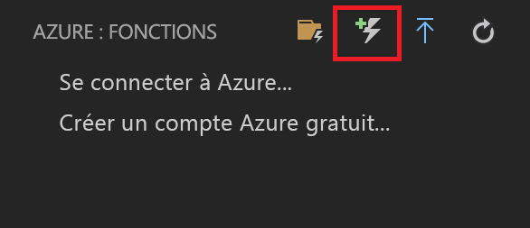
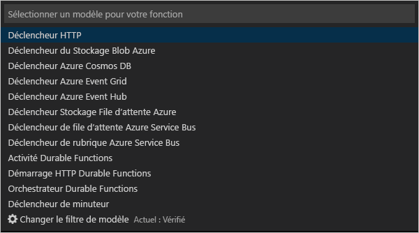
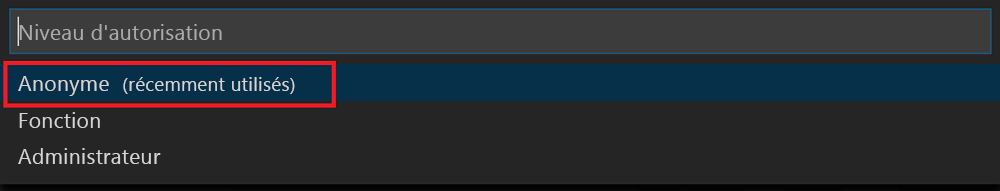

# <a name="create-your-first-durable-function-in-javascript"></a>Créer votre première fonction durable dans JavaScript

*Durable Functions* est une extension d’[Azure Functions](../functions-overview.md) qui vous permet d’écrire des fonctions avec état dans un environnement serverless. L’extension gère l’état, les points de contrôle et les redémarrages à votre place.

[!INCLUDE [v1-note](../../../includes/functions-durable-v1-tutorial-note.md)]

Dans cet article, vous allez découvrir comment utiliser l’extension Azure Functions pour Visual Studio Code afin de créer et tester localement une fonction durable appelée « Hello World ».  Cette fonction permet d’orchestrer et de chaîner des appels à d’autres fonctions. Vous allez ensuite publier le code de la fonction dans Azure.


## <a name="prerequisites"></a>Prérequis

Pour suivre ce tutoriel :

* Installez [Visual Studio Code](https://code.visualstudio.com/download).

* Vérifiez que vous disposez de la dernière version [d’Azure Functions Core Tools](../functions-run-local.md).

* Sur un ordinateur Windows, vérifiez que l’[émulateur de stockage Azure](../../storage/common/storage-use-emulator.md) est installé et démarré. Sur un ordinateur Mac ou Linux, vous devez utiliser un compte de stockage Azure actif.

* Assurez-vous d’avoir la version 8.0 ou ultérieure de [Node.js](https://nodejs.org/) installée.

[!INCLUDE [quickstarts-free-trial-note](../../../includes/quickstarts-free-trial-note.md)]

[!INCLUDE [functions-install-vs-code-extension](../../../includes/functions-install-vs-code-extension.md)]

## <a name="create-an-azure-functions-project"></a>Créer votre projet local 

Dans cette section, vous utilisez Visual Studio Code pour créer un projet Azure Functions local. 

1. Dans Visual Studio Code, appuyez sur F1 pour ouvrir la palette de commandes. Dans la palette de commandes, recherchez et sélectionnez `Azure Functions: Create new project...`.

1. Choisissez un emplacement de répertoire pour votre espace de travail de projet et optez pour **Sélectionner**.

    > [!NOTE]
    > Ces étapes ont été conçues pour être terminées en dehors d’un espace de travail. Dans ce cas, ne sélectionnez pas de dossier de projet qui fait partie d’un espace de travail.

1. En suivant les invites, fournissez les informations suivantes pour le langage souhaitée :

    | Prompt | Valeur | Description |
    | ------ | ----- | ----------- |
    | Sélectionnez un langage pour votre projet d’application de fonction | JavaScript | Créez un projet Node.js Functions local. |
    | Sélectionner une version | Azure Functions v2 | Vous voyez cette option uniquement quand les outils Core Tools ne sont pas déjà installés. Dans le cas présent, les outils Core Tools sont installés la première fois que vous exécutez l’application. |
    | Sélectionner un modèle pour la première fonction de votre projet | Déclencheur HTTP | Créez une fonction déclenchée via HTTP dans la nouvelle application de fonction. |
    | Fournir un nom de fonction | HttpTrigger | Appuyez sur Entrée pour utiliser le nom par défaut. |
    | Niveau d’autorisation | Fonction | Le niveau d’autorisation `function` vous oblige à fournir une clé d’accès au moment de l’appel du point de terminaison HTTP de la fonction. Cela rend plus difficile l’accès à un point de terminaison non sécurisé. Pour en savoir plus, consultez [Clés d’autorisation](../functions-bindings-http-webhook-trigger.md#authorization-keys).  |
    | Sélectionner la façon dont vous souhaitez ouvrir votre projet | Ajouter à l’espace de travail | Crée l’application de fonction dans l’espace de travail actuel. |

Visual Studio Code installe la solution Azure Functions Core Tools, si nécessaire. Il crée également un projet d’application de fonction dans un nouvel espace de travail. Ce projet contient les fichiers config [host.json](../functions-host-json.md) et [local.settings.json](../functions-run-local.md#local-settings-file). Il crée également un dossier HttpExample, qui contient le [fichier de définition function.json](../functions-reference-node.md#folder-structure) et le [fichier index.js](../functions-reference-node.md#exporting-a-function), un fichier Node.js qui contient le code de fonction.

Un fichier package.json est également créé dans le dossier racine.

## <a name="install-the-durable-functions-npm-package"></a>Installer le package npm Durable Functions

1. Installez le package npm `durable-functions` en exécutant `npm install durable-functions` dans le répertoire racine de l’application de fonction.

## <a name="creating-your-functions"></a>Création de vos fonctions

Nous allons maintenant créer les trois fonctions dont vous avez besoin pour commencer avec Durable Functions : un starter HTTP, un orchestrateur et une fonction d’activité. Le starter HTTP lancera l’ensemble de votre solution, et l’orchestrateur répartira le travail entre diverses fonctions d’activité.

### <a name="http-starter"></a>Starter HTTP

Tout d’abord, créez une fonction déclenchée via HTTP qui démarre une orchestration de fonction durable.

1. À partir d’*Azure : Functions*, cliquez sur l’icône **Créer une fonction**.

    

2. Sélectionnez le dossier avec votre projet d’application de fonction, puis le modèle de fonction **Starter HTTP Durable Functions**.

    

3. Conservez le nom par défaut (`DurableFunctionsHttpStart`) et appuyez sur ** **Entrée**, puis sélectionnez l’authentification **Anonyme**.

    

Nous avons maintenant créé un point d’entrée dans notre fonction durable. Ajoutons un orchestrateur.

### <a name="orchestrator"></a>Un orchestrateur

Nous allons maintenant créer un orchestrateur pour coordonner les fonctions d’activité.

1. À partir d’*Azure : Functions*, cliquez sur l’icône **Créer une fonction**.

    

2. Sélectionnez le dossier avec votre projet d’application de fonction, puis le modèle de fonction **Orchestrateur Durable Functions**. Laissez le nom par défaut, « DurableFunctionsOrchestrator »

    

Nous avons ajouté un orchestrateur pour coordonner les fonctions d’activité. Ajoutons maintenant la fonction d’activité référencée.

### <a name="activity"></a>Activité

Maintenant, nous allons créer une fonction d’activité pour réellement effectuer le travail de la solution.

1. À partir d’*Azure : Functions*, cliquez sur l’icône **Créer une fonction**.

    

2. Sélectionnez le dossier avec votre projet d’application de fonction, puis le modèle de fonction **Activité Durable Functions**. Laissez le nom par défaut, « Hello ».

    

Nous avons maintenant ajouté tous les composants nécessaires pour démarrer une orchestration et chaîner les fonctions d’activité.

## <a name="test-the-function-locally"></a>Tester la fonction en local

Azure Functions Core Tools vous permet d’exécuter un projet Azure Functions sur votre ordinateur de développement local. Vous êtes invité à installer ces outils la première fois que vous démarrez une fonction dans Visual Studio Code.

1. Sur un ordinateur Windows, démarrez l’émulateur de stockage Azure et vérifiez que la propriété **AzureWebJobsStorage** de *local.settings.json* a la valeur `UseDevelopmentStorage=true`.

    Pour l’émulateur de stockage version 5.8, la propriété **AzureWebJobsSecretStorageType** de local.settings.json doit être définie sur `files`. Sur un ordinateur Mac ou Linux, définissez la propriété **AzureWebJobsStorage** sur la chaîne de connexion d’un compte de stockage Azure existant. Vous créerez le compte de stockage plus loin dans cet article.

2. Pour tester votre fonction, définissez un point d’arrêt dans le code de fonction et appuyez sur F5 pour démarrer le projet d’application de fonction. La sortie de Core Tools est affichée dans le panneau **Terminal**. Si vous utilisez Durable Functions pour la première fois, l’extension Durable Functions est installée et la génération peut prendre plusieurs secondes.

    > [!NOTE]
    > Durable Functions JavaScript requiert la version **1.7.0** ou supérieure de l’extension **Microsoft.Azure.WebJobs.Extensions.DurableTask**. Exécutez la commande suivante à partir du dossier racine de votre application Azure Functions pour installer l’extension Durable Functions `func extensions install -p Microsoft.Azure.WebJobs.Extensions.DurableTask -v 1.7.0`

3. Dans le panneau **Terminal**, copiez le point de terminaison de l’URL de votre fonction déclenchée via HTTP.

    

4. Remplacez `{functionName}` par `DurableFunctionsOrchestrator`.

5. À l’aide d’un outil tel que [Postman](https://www.getpostman.com/) ou [cURL](https://curl.haxx.se/), envoyez une requête HTTP POST au point de terminaison de l’URL.

   La réponse est le résultat initial de la fonction HTTP, qui nous indique que l’orchestration durable a bien été démarrée. Il ne s’agit pas encore du résultat final de l’orchestration. La réponse contient plusieurs URL utiles. Pour le moment, demandons l’état de l’orchestration.

6. Copiez la valeur de l’URL pour `statusQueryGetUri`, collez-la dans la barre d’adresse du navigateur, puis exécutez la requête. Vous pouvez également continuer à utiliser Postman pour envoyer la requête GET.

   La requête interroge l’instance d’orchestration pour obtenir l’état. Une fois l’exécution de l’instance terminée, vous devez recevoir une réponse comprenant les sorties ou résultats de la fonction durable. Voici comment il se présente : 

    ```json
    {
        "instanceId": "d495cb0ac10d4e13b22729c37e335190",
        "runtimeStatus": "Completed",
        "input": null,
        "customStatus": null,
        "output": [
            "Hello Tokyo!",
            "Hello Seattle!",
            "Hello London!"
        ],
        "createdTime": "2018-11-08T07:07:40Z",
        "lastUpdatedTime": "2018-11-08T07:07:52Z"
    }
    ```

7. Pour arrêter le débogage, appuyez sur **Maj + F5** dans VS Code.

Après avoir vérifié que la fonction s’exécute correctement sur votre ordinateur local, il est temps de publier le projet sur Azure.

[!INCLUDE [functions-create-function-app-vs-code](../../../includes/functions-sign-in-vs-code.md)]

[!INCLUDE [functions-publish-project-vscode](../../../includes/functions-publish-project-vscode.md)]

## <a name="test-your-function-in-azure"></a>Tester votre fonction dans Azure

1. Copiez l’URL du déclencheur HTTP à partir du panneau **Sortie**. L’URL qui appelle la fonction déclenchée via HTTP doit être au format suivant :

        http://<functionappname>.azurewebsites.net/orchestrators/<functionname>

2. Collez cette nouvelle URL de requête HTTP dans la barre d’adresse de votre navigateur. Vous devez obtenir la même réponse d’état que lorsque vous avez utilisé l’application publiée.

## <a name="next-steps"></a>Étapes suivantes

Vous avez utilisé Visual Studio Code pour créer et publier une application de fonction durable JavaScript.

> [!div class="nextstepaction"]
> [Découvrez maintenant les modèles courants de fonctions durables](durable-functions-overview.md#application-patterns)