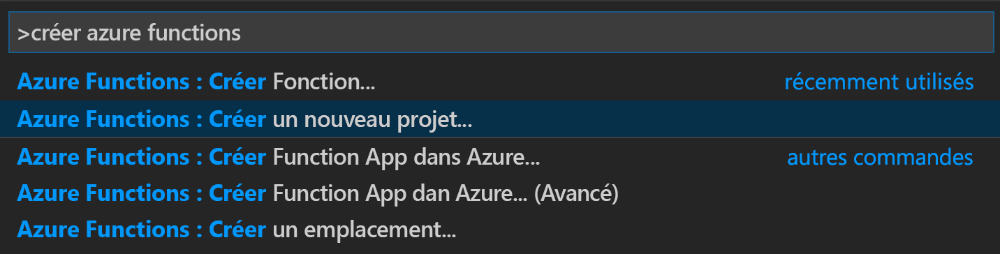
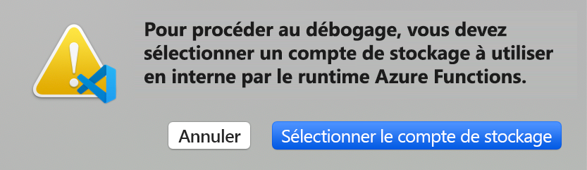
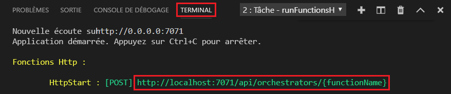

# <a name="create-your-first-durable-function-in-javascript"></a>Créer votre première fonction durable dans JavaScript

*Durable Functions* est une extension d’[Azure Functions](../functions-overview.md) qui vous permet d’écrire des fonctions avec état dans un environnement serverless. L’extension gère l’état, les points de contrôle et les redémarrages à votre place.

Dans cet article, vous allez découvrir comment utiliser l’extension Azure Functions pour Visual Studio Code afin de créer et tester localement une fonction durable appelée « Hello World ».  Cette fonction permet d’orchestrer et de chaîner des appels à d’autres fonctions. Vous allez ensuite publier le code de la fonction dans Azure.


## <a name="prerequisites"></a>Prérequis

Pour suivre ce tutoriel :

* Installez [Visual Studio Code](https://code.visualstudio.com/download).

* Installer l’extension VS Code [Azure Functions](https://marketplace.visualstudio.com/items?itemName=ms-azuretools.vscode-azurefunctions)

* Vérifiez que vous disposez de la dernière version [d’Azure Functions Core Tools](../functions-run-local.md).

* Durable Functions nécessite un compte de stockage Azure. Vous avez besoin d’un abonnement Azure.

* Assurez-vous d’avoir la version 10.x ou 12.x de [Node.js](https://nodejs.org/) installée.

[!INCLUDE [quickstarts-free-trial-note](../../../includes/quickstarts-free-trial-note.md)]

## <a name="create-your-local-project"></a><a name="create-an-azure-functions-project"></a>Créer votre projet local 

Dans cette section, vous utilisez Visual Studio Code pour créer un projet Azure Functions local. 

1. Dans Visual Studio Code, appuyez sur F1 (ou Ctrl/Cmd+Maj+P) pour ouvrir la palette de commandes. Dans la palette de commandes, recherchez et sélectionnez `Azure Functions: Create New Project...`.

    

1. Désignez un emplacement de dossier vide pour votre projet et choisissez **Sélectionner**.

1. Suivez les invites et fournissez les informations suivantes :

    | Prompt | Valeur | Description |
    | ------ | ----- | ----------- |
    | Sélectionnez un langage pour votre projet d’application de fonction | JavaScript | Créez un projet Node.js Functions local. |
    | Sélectionner une version | Azure Functions v3 | Vous voyez cette option uniquement quand les outils Core Tools ne sont pas déjà installés. Dans le cas présent, les outils Core Tools sont installés la première fois que vous exécutez l’application. |
    | Sélectionner un modèle pour la première fonction de votre projet | Ignorer pour le moment | |
    | Sélectionner la façon dont vous souhaitez ouvrir votre projet | Ouvrir dans la fenêtre active | Ouvre à nouveau VS Code dans le dossier que vous avez sélectionné. |

Visual Studio Code installe la solution Azure Functions Core Tools, si nécessaire. Il crée également un projet d’application de fonction dans un dossier. Ce projet contient les fichiers config [host.json](../functions-host-json.md) et [local.settings.json](../functions-run-local.md#local-settings-file).

Un fichier package.json est également créé dans le dossier racine.

## <a name="install-the-durable-functions-npm-package"></a>Installer le package npm Durable Functions

Pour travailler avec Durable Functions dans une application de fonction Node.js, vous utilisez une bibliothèque nommée `durable-functions`.

1. Utilisez le menu *Afficher* ou Ctrl+Maj+` pour ouvrir un nouveau terminal dans VS Code.

1. Installez le package npm `durable-functions` en exécutant `npm install durable-functions` dans le répertoire racine de l’application de fonction.

## <a name="creating-your-functions"></a>Création de vos fonctions

L’application Durable Functions la plus simple contient trois fonctions :

* La *fonction d’orchestrateur* : elle décrit un workflow qui orchestre d’autres fonctions.
* La *fonction d’activité* : appelée par la fonction d’orchestrateur, elle effectue un travail et retourne éventuellement une valeur.
* La *fonction de client* : une fonction Azure normale qui démarre une fonction d’orchestrateur. Cet exemple utilise une fonction déclenchée via HTTP.

### <a name="orchestrator-function"></a>Fonction d’orchestrateur

Vous utilisez un modèle pour créer le code de fonction durable dans votre projet.

1. Dans la palette de commandes, recherchez et sélectionnez `Azure Functions: Create Function...`.

1. Suivez les invites et fournissez les informations suivantes :

    | Prompt | Valeur | Description |
    | ------ | ----- | ----------- |
    | Sélectionner un modèle pour votre fonction | Orchestrateur Durable Functions | Créer une orchestration Durable Functions |
    | Fournir un nom de fonction | HelloOrchestrator | Nom de votre fonction durable |

Vous avez ajouté un orchestrateur pour coordonner les fonctions d’activité. Ouvrez *HelloOrchestrator/index.js* pour voir la fonction d’orchestrateur. Chaque appel à `context.df.callActivity` appelle une fonction d’activité nommée `Hello`.

Ajoutez maintenant la fonction d’activité `Hello` référencée.

### <a name="activity-function"></a>Fonction d’activité

1. Dans la palette de commandes, recherchez et sélectionnez `Azure Functions: Create Function...`.

1. Suivez les invites et fournissez les informations suivantes :

    | Prompt | Valeur | Description |
    | ------ | ----- | ----------- |
    | Sélectionner un modèle pour votre fonction | Activité Durable Functions | Créer une fonction d’activité |
    | Fournir un nom de fonction | Hello | Nom de votre fonction d’activité |

Vous avez ajouté la fonction d’activité `Hello` qui est appelée par l’orchestrateur. Ouvrez *Hello/index.js* pour voir qu’elle accepte un nom comme entrée et retourne un message d’accueil. Une fonction d’activité vous permet d’effectuer des actions, telles que le lancement d’un appel de base de données ou l’exécution d’un calcul.

Pour terminer, vous ajouterez une fonction déclenchée par HTTP qui démarrera l’orchestration.

### <a name="client-function-http-starter"></a>Fonction de client (démarrage HTTP)

1. Dans la palette de commandes, recherchez et sélectionnez `Azure Functions: Create Function...`.

1. Suivez les invites et fournissez les informations suivantes :

    | Prompt | Valeur | Description |
    | ------ | ----- | ----------- |
    | Sélectionner un modèle pour votre fonction | Démarrage HTTP Durable Functions | Créer une fonction de démarrage HTTP |
    | Fournir un nom de fonction | DurableFunctionsHttpStart | Nom de votre fonction d’activité |
    | Niveau d’autorisation | Anonyme | À des fins de démonstration, autorisez l’appel sans authentification à la fonction |

Vous avez ajouté une fonction déclenchée par HTTP qui démarre une orchestration. Ouvrez *DurableFunctionsHttpStart/index.js* pour voir qu’elle se sert de `client.startNew` pour démarrer une nouvelle orchestration. Elle utilise ensuite `client.createCheckStatusResponse` pour retourner une réponse HTTP contenant des URL qui peuvent être utilisées pour superviser et gérer la nouvelle orchestration.

Vous disposez maintenant d’une application Durable Functions qui peut être exécutée localement, et déployée sur Azure.

## <a name="test-the-function-locally"></a>Tester la fonction en local

Azure Functions Core Tools vous permet d’exécuter un projet Azure Functions sur votre ordinateur de développement local. Vous êtes invité à installer ces outils la première fois que vous démarrez une fonction dans Visual Studio Code.

1. Pour tester votre fonction, définissez un point d’arrêt dans le code de la fonction d’activité `Hello` (*Hello/index.js*). Appuyez sur F5 ou sélectionnez `Debug: Start Debugging` dans la palette de commandes pour démarrer le projet d’application de fonction. La sortie de Core Tools est affichée dans le panneau **Terminal**.

    > [!NOTE]
    > Pour plus d’informations sur le débogage, consultez [Diagnostics Durable Functions](durable-functions-diagnostics.md#debugging).

1. Durable Functions nécessite l’exécution d’un compte de stockage Azure. Lorsque VS Code vous invite à sélectionner un compte de stockage, choisissez **Sélectionner un compte de stockage**.

    

1. En suivant les invites, fournissez les informations suivantes pour créer un compte de stockage dans Azure.

    | Prompt | Valeur | Description |
    | ------ | ----- | ----------- |
    | Sélectionner un abonnement | *nom de votre abonnement* | Sélectionner votre abonnement Azure |
    | Sélectionner un compte de stockage | Création d’un nouveau compte de stockage |  |
    | Entrer le nom du nouveau compte de stockage | *nom unique* | Nom du compte de stockage à créer |
    | Sélectionner un groupe de ressources | *nom unique* | Nom du groupe de ressources à créer |
    | Sélectionner un emplacement | *region* | Sélectionner une région proche de vous |

1. Dans le panneau **Terminal**, copiez le point de terminaison de l’URL de votre fonction déclenchée via HTTP.

    

1. À l’aide de votre navigateur ou d’un outil comme [Postman](https://www.getpostman.com/) ou [cURL](https://curl.haxx.se/), envoyez une requête HTTP POST au point de terminaison de l’URL. Remplacez le dernier segment par le nom de la fonction d’orchestrateur (`HelloOrchestrator`). L’URL doit ressembler à `http://localhost:7071/api/orchestrators/HelloOrchestrator`.

   La réponse est le résultat initial provenant de la fonction HTTP, qui vous indique que l’orchestration durable a bien été démarrée. Il ne s’agit pas encore du résultat final de l’orchestration. La réponse contient plusieurs URL utiles. Pour le moment, demandons l’état de l’orchestration.

1. Copiez la valeur de l’URL pour `statusQueryGetUri`, collez-la dans la barre d’adresse du navigateur, puis exécutez la requête. Vous pouvez également continuer à utiliser Postman pour envoyer la requête GET.

   La requête interroge l’instance d’orchestration pour obtenir l’état. Une fois l’exécution de l’instance terminée, vous devez recevoir une réponse comprenant les sorties ou résultats de la fonction durable. Voici comment il se présente : 

    ```json
    {
        "name": "HelloOrchestrator",
        "instanceId": "9a528a9e926f4b46b7d3deaa134b7e8a",
        "runtimeStatus": "Completed",
        "input": null,
        "customStatus": null,
        "output": [
            "Hello Tokyo!",
            "Hello Seattle!",
            "Hello London!"
        ],
        "createdTime": "2020-03-18T21:54:49Z",
        "lastUpdatedTime": "2020-03-18T21:54:54Z"
    }
    ```

1. Pour arrêter le débogage, appuyez sur **Maj + F5** dans VS Code.

Après avoir vérifié que la fonction s’exécute correctement sur votre ordinateur local, il est temps de publier le projet sur Azure.

[!INCLUDE [functions-create-function-app-vs-code](../../../includes/functions-sign-in-vs-code.md)]

[!INCLUDE [functions-publish-project-vscode](../../../includes/functions-publish-project-vscode.md)]

## <a name="test-your-function-in-azure"></a>Tester votre fonction dans Azure

1. Copiez l’URL du déclencheur HTTP à partir du panneau **Sortie**. L’URL qui appelle la fonction déclenchée via HTTP doit se présenter sous ce format : `http://<functionappname>.azurewebsites.net/api/orchestrators/HelloOrchestrator`

2. Collez cette nouvelle URL de requête HTTP dans la barre d’adresse de votre navigateur. Vous devez obtenir la même réponse d’état que lorsque vous avez utilisé l’application publiée.

## <a name="next-steps"></a>Étapes suivantes

Vous avez utilisé Visual Studio Code pour créer et publier une application de fonction durable JavaScript.

> [!div class="nextstepaction"]
> [Découvrez maintenant les modèles courants de fonctions durables](durable-functions-overview.md#application-patterns)
