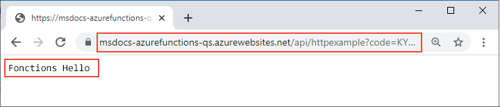

# <a name="connect-azure-functions-to-azure-storage-using-command-line-tools"></a>Connecter Azure Functions à Stockage Azure à l’aide des outils en ligne de commande

Dans cet article, vous intégrez une file d’attente Stockage Azure à la fonction et au compte de stockage que vous avez créés dans [le guide de démarrage rapide précédent](functions-create-first-azure-function-azure-cli.md). Vous effectuez cette intégration à l’aide d’une *liaison de sortie* qui écrit les données d’une requête HTTP dans un message en file d’attente. Le fait de suivre les instructions de cet article n’entraîne aucun coût supplémentaire au-delà des quelques cents USD du guide de démarrage rapide précédent. Pour en savoir plus sur les liaisons, consultez [Concepts des déclencheurs et liaisons Azure Functions](functions-triggers-bindings.md).

## <a name="configure-your-local-environment"></a>Configurer votre environnement local

Avant de commencer, vous devez terminer l’article [Démarrage rapide : Créer un projet Azure Functions à partir de la ligne de commande](functions-create-first-azure-function-azure-cli.md). Si vous avez déjà nettoyé les ressources à la fin de cet article, suivez à nouveau les étapes pour recréer l’application Functions et les ressources associées dans Azure.

[!INCLUDE [functions-cli-get-storage-connection](../../includes/functions-cli-get-storage-connection.md)]

[!INCLUDE [functions-register-storage-binding-extension-csharp](../../includes/functions-register-storage-binding-extension-csharp.md)]

[!INCLUDE [functions-add-output-binding-cli](../../includes/functions-add-output-binding-cli.md)]

::: zone pivot="programming-language-csharp"  
[!INCLUDE [functions-add-storage-binding-csharp-library](../../includes/functions-add-storage-binding-csharp-library.md)]  
::: zone-end  
::: zone pivot="programming-language-java" 
[!INCLUDE [functions-add-output-binding-java-cli](../../includes/functions-add-output-binding-java-cli.md)]
::: zone-end   

Pour plus d’informations sur les détails des liaisons, consultez [Concepts des déclencheurs et liaisons Azure Functions](functions-triggers-bindings.md) et [Configuration de la sortie de la file d’attente](functions-bindings-storage-queue-output.md#configuration).

## <a name="add-code-to-use-the-output-binding"></a>Ajouter du code pour utiliser la liaison de sortie

Avec la liaison de file d’attente définie, vous pouvez à présent mettre à jour votre fonction pour qu’elle reçoive le paramètre de sortie `msg` et écrive des messages dans la file d’attente.

::: zone pivot="programming-language-python"     
[!INCLUDE [functions-add-output-binding-python](../../includes/functions-add-output-binding-python.md)]
::: zone-end  

::: zone pivot="programming-language-javascript"  
[!INCLUDE [functions-add-output-binding-js](../../includes/functions-add-output-binding-js.md)]
::: zone-end  

::: zone pivot="programming-language-typescript"  
[!INCLUDE [functions-add-output-binding-ts](../../includes/functions-add-output-binding-ts.md)]
::: zone-end  

::: zone pivot="programming-language-powershell"  
[!INCLUDE [functions-add-output-binding-powershell](../../includes/functions-add-output-binding-powershell.md)]  
::: zone-end

::: zone pivot="programming-language-csharp"  
[!INCLUDE [functions-add-storage-binding-csharp-library-code](../../includes/functions-add-storage-binding-csharp-library-code.md)]
::: zone-end 

::: zone pivot="programming-language-java"
[!INCLUDE [functions-add-output-binding-java-code](../../includes/functions-add-output-binding-java-code.md)]

[!INCLUDE [functions-add-output-binding-java-test-cli](../../includes/functions-add-output-binding-java-test-cli.md)]
::: zone-end

Notez que vous *n’avez* pas besoin d’écrire du code pour l’authentification, l’obtention d’une référence de file d’attente ou l’écriture de données. Toutes ces tâches d’intégration sont prises en charge de manière pratique dans le runtime d’Azure Functions et la liaison de sortie de file d’attente.

[!INCLUDE [functions-run-function-test-local-cli](../../includes/functions-run-function-test-local-cli.md)]

[!INCLUDE [functions-extension-bundles-info](../../includes/functions-extension-bundles-info.md)]

## <a name="view-the-message-in-the-azure-storage-queue"></a>Voir le message dans la file d’attente Stockage Azure

[!INCLUDE [functions-add-output-binding-view-queue-cli](../../includes/functions-add-output-binding-view-queue-cli.md)]

## <a name="redeploy-the-project-to-azure"></a>Redéployer le projet sur Azure

Une fois que vous avez vérifié localement que la fonction a écrit un message dans la file d’attente Stockage Azure, vous pouvez redéployer votre projet pour mettre à jour le point de terminaison exécuté sur Azure.

::: zone pivot="programming-language-javascript,programming-language-typescript,programming-language-python,programming-language-powershell,programming-language-csharp" 
Dans le dossier *LocalFunctionsProj*, utilisez la commande [`func azure functionapp publish`](functions-run-local.md#project-file-deployment) pour redéployer le projet, en remplaçant `<APP_NAME>` par le nom de votre application.

```
func azure functionapp publish <APP_NAME>
```
::: zone-end  

::: zone pivot="programming-language-java" 

Dans le dossier de projet local, utilisez la commande Maven suivante pour republier votre projet :
```
mvn azure-functions:deploy
```
::: zone-end

## <a name="verify-in-azure"></a>Vérifier dans Azure

1. Comme dans le guide de démarrage rapide précédent, utilisez un navigateur ou CURL pour tester la fonction redéployée.

    # <a name="browser"></a>[Browser](#tab/browser)
    
    Copiez l’**URL d’appel** complète affichée au sein de la sortie de la commande de publication dans la barre d’adresse d’un navigateur, en ajoutant le paramètre de requête `&name=Functions`. Le navigateur doit afficher une sortie similaire à celle générée au moment de l’exécution locale de la fonction.

    

    # <a name="curl"></a>[curl](#tab/curl)
    
    Exécutez [`curl`](https://curl.haxx.se/) avec l’**URL d’appel**, en ajoutant le paramètre `&name=Functions`. La sortie de la commande doit correspondre au texte « Hello Functions ».
    
    

    --- 

1. Examinez à nouveau la file d’attente de stockage, comme indiqué dans la section précédente, pour vérifier qu’elle contient le nouveau message écrit.

## <a name="clean-up-resources"></a>Nettoyer les ressources

Quand vous avez terminé, utilisez la commande suivante pour supprimer le groupe de ressources et toutes les ressources qu’il contient afin d’éviter les coûts supplémentaires.

```azurecli
az group delete --name AzureFunctionsQuickstart-rg
```

## <a name="next-steps"></a>Étapes suivantes

Vous avez mis à jour votre fonction déclenchée via HTTP pour écrire des données dans une file d’attente de stockage. Pour en savoir plus sur le développement de fonctions à partir de la ligne de commande avec Core Tools et Azure CLI, consultez maintenant ces articles :

+ [Utiliser Azure Functions Core Tools](functions-run-local.md)  

::: zone pivot="programming-language-csharp"  
+ [Exemples de projets Functions complets en C#](/samples/browse/?products=azure-functions&languages=csharp).

+ [Informations de référence pour les développeurs C# sur Azure Functions](functions-dotnet-class-library.md)  
::: zone-end 
::: zone pivot="programming-language-javascript"  
+ [Exemples de projets Functions complets en JavaScript](/samples/browse/?products=azure-functions&languages=javascript).

+ [Guide des développeurs JavaScript sur Azure Functions](functions-reference-node.md)  
::: zone-end  
::: zone pivot="programming-language-typescript"  
+ [Exemples de projets Functions complets en TypeScript](/samples/browse/?products=azure-functions&languages=typescript).

+ [Guide du développeur TypeScript sur Azure Functions](functions-reference-node.md#typescript)  
::: zone-end  
::: zone pivot="programming-language-python"  
+ [Exemples de projets Functions complets en Python](/samples/browse/?products=azure-functions&languages=python)

+ [Guide du développeur Python sur Azure Functions](functions-reference-python.md)  
::: zone-end  
::: zone pivot="programming-language-powershell"  
+ [Exemples de projets Functions complets dans PowerShell](/samples/browse/?products=azure-functions&languages=azurepowershell).

+ [Guide du développeur PowerShell sur Azure Functions](functions-reference-powershell.md) 
::: zone-end
+ [Azure Functions triggers and bindings (Déclencheurs et liaisons Azure Functions)](functions-triggers-bindings.md)

+ [Page de tarification de Functions](https://azure.microsoft.com/pricing/details/functions/)

+ [Estimation des coûts d’un plan Consommation](functions-consumption-costs.md) 
