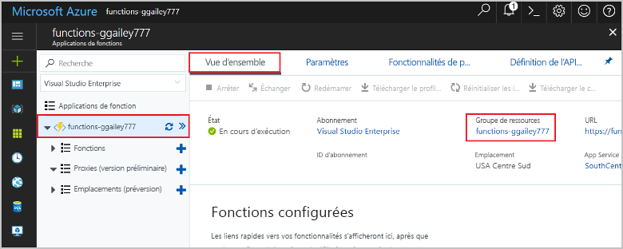

# <a name="connect-functions-to-azure-storage-using-visual-studio-code"></a>Connecter des fonctions à Stockage Azure avec Visual Studio Code

Azure Functions vous permet de connecter des fonctions à des services Azure et à d’autres ressources sans avoir à écrire votre propre code d’intégration. Ces *liaisons*, qui représentent l’entrée et la sortie, sont déclarées dans la définition de la fonction. Les données issues des liaisons sont fournies à la fonction en tant que paramètres. Un déclencheur est un type spécial de liaison d’entrée. Bien que ne pouvant avoir qu’un seul déclencheur, une fonction peut avoir plusieurs liaisons d’entrée et de sortie. Pour en savoir plus, consultez [Concepts des déclencheurs et liaisons Azure Functions](functions-triggers-bindings.md).

Cet article vous montre comment utiliser Visual Studio Code pour connecter la fonction que vous avez créée dans l’[article du guide de démarrage rapide précédent](functions-create-first-function-vs-code.md) à Stockage Azure. La liaison de sortie que vous ajoutez à cette fonction écrit des données provenant de la requête HTTP dans un message au sein de la file d’attente de Stockage File d’attente Azure. 

La plupart des liaisons requièrent une chaîne de connexion stockée que Functions utilise pour accéder au service lié. Pour simplifier, vous utilisez le compte de stockage que vous avez créé avec votre application de fonction. La connexion à ce compte est déjà stockée dans un paramètre d’application nommé `AzureWebJobsStorage`.  

## <a name="prerequisites"></a>Prérequis

Avant de commencer cet article, vous devez satisfaire aux conditions suivantes :

* Installez l’[Extension Stockage Azure pour Visual Studio Code](https://marketplace.visualstudio.com/items?itemName=ms-azuretools.vscode-azurestorage).
* Installez l’[Explorateur Stockage Azure](https://storageexplorer.com/). L’Explorateur Stockage est un outil que vous allez utiliser pour examiner les messages en file d’attente générés par votre liaison de sortie. L’Explorateur Stockage est pris en charge sur les systèmes d’exploitation macOS, Windows et Linux.
* Installez les [outils CLI .NET Core](https://docs.microsoft.com/dotnet/core/tools/?tabs=netcore2x) (projets C# uniquement).
* Suivez les étapes de la [partie 1 du guide de démarrage rapide de Visual Studio Code](functions-create-first-function-vs-code.md). 

Cet article suppose que vous êtes déjà connecté à votre abonnement Azure à partir de Visual Studio Code. Vous pouvez vous connecter en exécutant `Azure: Sign In` à partir de la palette de commandes. 

## <a name="download-the-function-app-settings"></a>Télécharger les paramètres de l’application de fonction

Dans l’[article du guide de démarrage rapide précédent](functions-create-first-function-vs-code.md), vous avez créé une application de fonction dans Azure ainsi que le compte de stockage nécessaire. La chaîne de connexion pour ce compte est stockée de manière sécurisée dans les paramètres d’application au sein d’Azure. Dans cet article, vous allez écrire des messages dans une file d’attente de stockage au sein du même compte. Pour vous connecter à votre compte de stockage lors de l’exécution de la fonction localement, vous devez télécharger les paramètres de l’application dans le fichier local.settings.json. 

1. Appuyez sur F1 pour ouvrir la palette de commandes, puis recherchez et exécutez la commande `Azure Functions: Download Remote Settings....`. 

1. Choisissez l’application de fonction que vous avez créée dans l’article précédent. Sélectionnez **Oui pour tout** pour remplacer les paramètres locaux existants. 

    > [!IMPORTANT]  
    > Comme il contient des secrets, le fichier local.settings.json n’est jamais publié et il est exclu du contrôle de code source.

1. Copiez la valeur de `AzureWebJobsStorage`, qui est la clé pour la valeur de la chaîne de connexion du compte de stockage. Cette connexion vous permet de vérifier que la liaison de sortie fonctionne comme prévu.

## <a name="register-binding-extensions"></a>Inscrire des extensions de liaison

Comme vous utilisez une liaison de sortie de Stockage File d’attente, vous devez disposer de l’extension de liaisons de Stockage avant d’exécuter le projet. 

### <a name="javascript"></a>JavaScript

[!INCLUDE [functions-extension-bundles](../../includes/functions-extension-bundles.md)]

### <a name="c-class-library"></a>Bibliothèque de classes C\#

À l’exception des déclencheurs HTTP et de minuterie, les liaisons sont implémentées sous la forme de packages d’extension. Exécutez la commande [dotnet add package](/dotnet/core/tools/dotnet-add-package) suivante dans la fenêtre de terminal pour ajouter le package d’extension de Stockage à votre projet.

```bash
dotnet add package Microsoft.Azure.WebJobs.Extensions.Storage --version 3.0.4
```

Vous pouvez maintenant ajouter la liaison de sortie de stockage à votre projet.

## <a name="add-an-output-binding"></a>Ajouter une liaison de sortie

Dans Functions, chaque type de liaison requiert la définition d’une `direction`, d’un `type` et d’un `name` unique dans le fichier function.json. La façon dont vous définissez ces attributs dépend du langage de votre application de fonction.

### <a name="javascript"></a>JavaScript

Les attributs de liaison sont définis directement dans le fichier function.json. Selon le type de liaison, des propriétés supplémentaires peuvent être requises. La [configuration de la sortie de la file d’attente](functions-bindings-storage-queue.md#output---configuration) décrit les champs requis pour une liaison de file d’attente Stockage Azure. L’extension vous permet d’ajouter facilement des liaisons au fichier function.json. 

Pour créer une liaison, cliquez avec le bouton droit (Ctrl+Clic sur macOS) sur le fichier `function.json` dans votre dossier HttpTrigger, puis choisissez **Ajouter une liaison...** . Suivez les invites pour définir les propriétés de liaison suivantes pour la nouvelle liaison :

| Prompt | Valeur | Description |
| -------- | ----- | ----------- |
| **Sélectionner le sens de la liaison** | `out` | La liaison est une liaison de sortie. |
| **Sélectionner une liaison avec un sens...** | `Azure Queue Storage` | La liaison est une liaison de file d’attente Stockage Azure. |
| **Nom utilisé pour identifier cette liaison dans votre code** | `msg` | Nom qui identifie le paramètre de liaison référencé dans votre code. |
| **File d’attente à laquelle le message sera envoyé** | `outqueue` | Nom de la file d’attente dans laquelle écrit la liaison. Si *queueName* n’existe pas, la liaison le crée à la première utilisation. |
| **Sélectionnez le paramètre dans « local.setting.json »** | `AzureWebJobsStorage` | Nom d’un paramètre d’application qui contient la chaîne de connexion du compte de stockage. Le paramètre `AzureWebJobsStorage` contient la chaîne de connexion du compte de stockage que vous avez créé avec l’application de fonction. |

Une liaison est ajoutée au tableau `bindings` dans votre fichier function.json, qui doit maintenant se présenter comme l’exemple suivant :

```json
{
   ...

  "bindings": [
    {
      "authLevel": "function",
      "type": "httpTrigger",
      "direction": "in",
      "name": "req",
      "methods": [
        "get",
        "post"
      ]
    },
    {
      "type": "http",
      "direction": "out",
      "name": "$return"
    },
    {
      "type": "queue",
      "direction": "out",
      "name": "msg",
      "queueName": "outqueue",
      "connection": "AzureWebJobsStorage"
    }
  ]
}
```

### <a name="c-class-library"></a>Bibliothèque de classes C\#

Dans un projet de bibliothèque de classes C#, les liaisons sont définies comme attributs de liaison sur la méthode de fonction. Le fichier function.json est ensuite généré automatiquement en fonction de ces attributs.

Ouvrez le fichier projet HttpTrigger.cs et ajoutez l’instruction `using` suivante :

```cs
using Microsoft.Azure.WebJobs.Extensions.Storage;
```

Ajoutez le paramètre suivant à la définition de la méthode `Run` :

```cs
[Queue("outqueue"),StorageAccount("AzureWebJobsStorage")] ICollector<string> msg
```

Le paramètre `msg` est un type `ICollector<T>`, qui représente une collection de messages écrits dans une sortie de la liaison quand la fonction se termine. Dans ce cas, la sortie est une file d’attente de stockage nommée `outqueue`. La chaîne de connexion pour le compte de stockage est définie par `StorageAccountAttribute`. Cet attribut indique le paramètre qui contient la chaîne de connexion du compte de stockage et qui peut être appliqué au niveau de la classe, de la méthode ou du paramètre. Dans ce cas, vous pourriez omettre `StorageAccountAttribute`, car vous utilisez déjà le compte de stockage par défaut.

La définition de la méthode Run doit maintenant se présenter comme ceci :  

```cs
[FunctionName("HttpTrigger")]
public static async Task<IActionResult> Run(
    [HttpTrigger(AuthorizationLevel.Function, "get", "post", Route = null)] HttpRequest req, 
    [Queue("outqueue"),StorageAccount("AzureWebJobsStorage")] ICollector<string> msg, ILogger log)
```

## <a name="add-code-that-uses-the-output-binding"></a>Ajouter le code qui utilise la liaison de sortie

Une fois que la liaison est définie, vous pouvez utiliser l’attribut `name` de la liaison pour y accéder en tant qu’attribut dans la signature de fonction. En utilisant une liaison de sortie, vous n’avez pas besoin de recourir au code du SDK Stockage Azure pour l’authentification, l’obtention d’une référence de file d’attente ou l’écriture de données. La liaison de sortie de file d’attente et le runtime Functions effectuent ces tâches.

### <a name="javascript"></a>JavaScript

Ajoutez le code qui utilise l’objet de liaison de sortie `msg` sur `context.bindings` pour créer un message de file d’attente. Ajoutez ce code avant l’instruction `context.res`.

```javascript
// Add a message to the Storage queue.
context.bindings.msg = "Name passed to the function: " + 
(req.query.name || req.body.name);
```

À ce stade, votre fonction doit se présenter comme suit :

```javascript
module.exports = async function (context, req) {
    context.log('JavaScript HTTP trigger function processed a request.');

    if (req.query.name || (req.body && req.body.name)) {
        // Add a message to the Storage queue.
        context.bindings.msg = "Name passed to the function: " + 
        (req.query.name || req.body.name);
        context.res = {
            // status: 200, /* Defaults to 200 */
            body: "Hello " + (req.query.name || req.body.name)
        };
    }
    else {
        context.res = {
            status: 400,
            body: "Please pass a name on the query string or in the request body"
        };
    }
};
```

### <a name="c"></a>C\#

Ajoutez le code qui utilise l’objet de liaison de sortie `msg` pour créer un message de file d’attente. Ajoutez ce code avant que la méthode retourne.

```cs
if (!string.IsNullOrEmpty(name))
{
    // Add a message to the output collection.
    msg.Add(string.Format("Name passed to the function: {0}", name));
}
```

À ce stade, votre fonction doit se présenter comme suit :

```cs
[FunctionName("HttpTrigger")]
public static async Task<IActionResult> Run(
    [HttpTrigger(AuthorizationLevel.Function, "get", "post", Route = null)] HttpRequest req, 
    [Queue("outqueue"),StorageAccount("AzureWebJobsStorage")] ICollector<string> msg, ILogger log)
{
    log.LogInformation("C# HTTP trigger function processed a request.");

    string name = req.Query["name"];

    string requestBody = await new StreamReader(req.Body).ReadToEndAsync();
    dynamic data = JsonConvert.DeserializeObject(requestBody);
    name = name ?? data?.name;

    if (!string.IsNullOrEmpty(name))
    {
        // Add a message to the output collection.
        msg.Add(string.Format("Name passed to the function: {0}", name));
    }
    return name != null
        ? (ActionResult)new OkObjectResult($"Hello, {name}")
        : new BadRequestObjectResult("Please pass a name on the query string or in the request body");
}
```

[!INCLUDE [functions-run-function-test-local-vs-code](../../includes/functions-run-function-test-local-vs-code.md)]

Une nouvelle file d’attente nommée **outqueue** est créée dans votre compte de stockage, par le runtime des fonctions, lorsque la liaison de sortie est utilisée pour la première fois. Vous allez utiliser l’Explorateur Stockage pour vérifier que la file d’attente a été créée ainsi que le nouveau message.

### <a name="connect-storage-explorer-to-your-account"></a>Connecter l’Explorateur Stockage à votre compte

Ignorez cette section si vous avez déjà installé l’Explorateur Stockage Azure et si vous l’avez connecté à votre compte Azure.

1. Exécutez l’outil [Azure Storage Explorer], sélectionnez l’icône de connexion sur la gauche, puis **Ajouter un compte**.

    

1. Dans la boîte de dialogue **Se connecter**, choisissez **Ajouter un compte Azure**, choisissez votre **Environnement Azure**, puis sélectionnez **Se connecter...** . 

    

Une fois connecté à votre compte, vous voyez tous les abonnements Azure associés à votre compte.

### <a name="examine-the-output-queue"></a>Analyser la file d’attente de sortie

1. Dans Visual Studio Code, appuyez sur F1 pour ouvrir la palette de commandes, puis recherchez et exécutez la commande `Azure Storage: Open in Storage Explorer`, et choisissez le nom de votre compte de stockage. Votre compte de stockage s’ouvre dans l’Explorateur Stockage Azure.  

1. Développez le nœud **Files d’attente**, puis sélectionnez la file d’attente nommée **outqueue**. 

   La file d’attente contient le message que la liaison de sortie de file d’attente a créé lors de l’exécution de la fonction déclenchée via HTTP. Si vous avez appelé la fonction avec la valeur `name` par défaut d'*Azure*, le message de la file d'attente est *Nom transmis à la fonction : Azure*.

    

1. Réexécutez la fonction et envoyez une autre demande : vous voyez alors apparaître un nouveau message dans la file d’attente.  

À présent, il est temps de republier sur Azure l’application de fonction mise à jour.

## <a name="redeploy-and-test-the-updated-app"></a>Redéployer et tester l’application mise à jour

1. Dans Visual Studio Code, appuyez sur F1 pour ouvrir la palette de commandes. Dans la palette de commandes, recherchez et sélectionnez `Azure Functions: Deploy to function app...`.

1. Choisissez l’application de fonction que vous avez créée dans le premier article. Comme vous redéployez votre projet sur la même application, sélectionnez **Déployer** pour ignorer l’avertissement sur le remplacement des fichiers.

1. Une fois le déploiement terminé, vous pouvez à nouveau utiliser cURL ou un navigateur pour tester la fonction redéployée. Ajoutez la chaîne de requête `&name=<yourname>` à l’URL, comme dans l’exemple suivant :

    ```bash
    curl https://myfunctionapp.azurewebsites.net/api/httptrigger?code=cCr8sAxfBiow548FBDLS1....&name=<yourname>
    ```

1. [Examinez à nouveau le message dans la file d’attente de stockage](#examine-the-output-queue) pour vérifier que la liaison de sortie regénère un nouveau message dans la file d’attente.

## <a name="clean-up-resources"></a>Supprimer des ressources

*Ressources* dans Azure fait référence aux applications de fonction, fonctions, comptes de stockage, etc. Elles sont rassemblées en *groupes de ressources*, et vous pouvez supprimer tous les éléments d’un groupe en supprimant le groupe.

Vous avez créé des ressources pour effectuer ces démarrages rapides. Vous pouvez être facturé pour ces ressources, en fonction de [l’état de votre compte](https://azure.microsoft.com/account/) et de la [tarification du service](https://azure.microsoft.com/pricing/). Si vous n’avez plus besoin des ressources, voici comment les supprimer :

1. Dans Visual Studio Code, appuyez sur F1 pour ouvrir la palette de commandes. Dans la palette de commandes, recherchez et sélectionnez `Azure Functions: Open in portal`.

1. Choisissez votre application de fonction et appuyez sur Entrée. La page de l’application de fonction est ouverte dans le [portail Azure](https://portal.azure.com).

1. Sous l’onglet **Vue d’ensemble**, sélectionnez le lien nommé sous **Groupe de ressources**.

    

1. Sur la page **Groupe de ressources**, passez en revue la liste des ressources incluses et vérifiez qu’elles correspondent à celles que vous souhaitez supprimer.
 
1. Sélectionnez **Supprimer le groupe de ressources** et suivez les instructions.

   Cette opération peut prendre quelques minutes. Une fois terminée, une notification s’affiche pendant quelques secondes. Vous pouvez également sélectionner l’icône représentant une cloche en haut de la page pour afficher la notification.

## <a name="next-steps"></a>Étapes suivantes

Vous avez mis à jour votre fonction déclenchée via HTTP pour écrire des données dans une file d’attente de stockage. Pour plus d’informations sur le développement de fonctions, consultez [Développer des fonctions Azure avec Visual Studio Code](functions-develop-vs-code.md).

Ensuite, vous devez activer la supervision Application Insights pour votre application de fonction :

> [!div class="nextstepaction"]
> [Activer l’intégration à Application Insights](functions-monitoring.md#manually-connect-an-app-insights-resource)

[Azure Storage Explorer]: https://storageexplorer.com/
