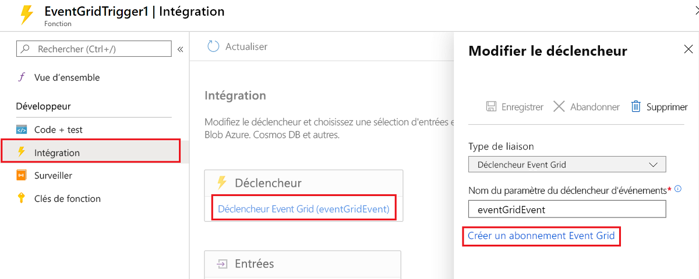
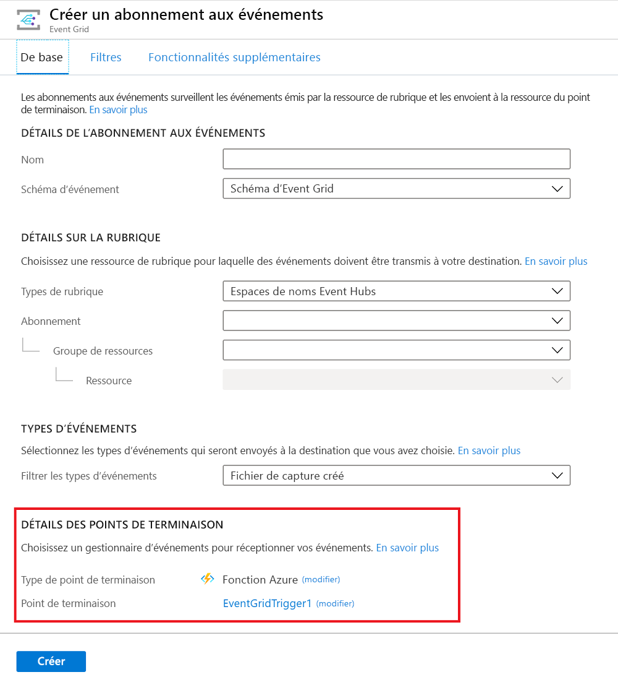

# <a name="event-grid-trigger-for-azure-functions"></a>Déclencheur Event Grid pour Azure Functions

Cet article explique comment gérer les événements [Event Grid](../event-grid/overview.md) dans Azure Functions.

Event Grid est un service Azure qui envoie des requêtes HTTP de notification au sujet des événements qui surviennent dans les *éditeurs*. L’éditeur d’un événement est le service ou la ressource qui est à l’origine de l’événement. Par exemple, un compte de Stockage Blob Azure est un éditeur, et [un chargement ou une suppression d’objet blob un événement](../storage/blobs/storage-blob-event-overview.md). [Certains services Azure intègrent la prise en charge de la publication d’événements sur Event Grid](../event-grid/overview.md#event-sources).

Les *gestionnaires* d’événements reçoivent et traitent les événements. Azure Functions est l’un des nombreux [services Azure qui intègrent la prise en charge de la gestion des événements Event Grid](../event-grid/overview.md#event-handlers). Cet article explique comment utiliser un déclencheur Event Grid pour appeler une fonction à la réception d’un événement en provenance d’Event Grid.

Si vous préférez, vous pouvez utiliser un déclencheur HTTP pour gérer les événements Event Grid ; consultez la section [Utiliser un déclencheur HTTP comme déclencheur Event Grid](#use-an-http-trigger-as-an-event-grid-trigger) dans la suite de cet article. Actuellement, vous ne pouvez pas utiliser un déclencheur Event Grid pour une application Azure Functions quand l’événement est remis dans le [schéma CloudEvents](../event-grid/cloudevents-schema.md). Utilisez à la place un déclencheur HTTP.

[!INCLUDE [intro](../../includes/functions-bindings-intro.md)]

## <a name="packages---functions-2x-and-higher"></a>Packages - Functions 2.x et ultérieur

Le déclencheur Event Grid est fourni dans le package [Microsoft.Azure.WebJobs.Extensions.EventGrid](https://www.nuget.org/packages/Microsoft.Azure.WebJobs.Extensions.EventGrid) NuGet, version 2.x. Le code source pour le package se trouve dans le référentiel [azure-functions-eventgrid-extension](https://github.com/Azure/azure-functions-eventgrid-extension/tree/v2.x) GitHub.

[!INCLUDE [functions-package-v2](../../includes/functions-package-v2.md)]

## <a name="packages---functions-1x"></a>Packages - Functions 1.x

Le déclencheur Event Grid est fourni dans le package [Microsoft.Azure.WebJobs.Extensions.EventGrid](https://www.nuget.org/packages/Microsoft.Azure.WebJobs.Extensions.EventGrid) NuGet, version 1.x. Le code source pour le package se trouve dans le référentiel [azure-functions-eventgrid-extension](https://github.com/Azure/azure-functions-eventgrid-extension/tree/master) GitHub.

[!INCLUDE [functions-package](../../includes/functions-package.md)]

## <a name="example"></a>Exemples

Consultez l’exemple de déclencheur Event Grid correspondant au langage souhaité :

* C#
* [Script C# (.csx)](#c-script-example)
* [Java](#trigger---java-examples)
* [JavaScript](#javascript-example)
* [Python](#python-example)

Vous trouverez un exemple de déclencheur HTTP dans la section [Guide pratique pour utiliser un déclencheur HTTP](#use-an-http-trigger-as-an-event-grid-trigger) dans la suite de cet article.

### <a name="c-2x-and-higher"></a>C# (2.x et ultérieur)

L’exemple suivant montre une [fonction C#](functions-dotnet-class-library.md) liée à `EventGridEvent` :

```cs
using Microsoft.Azure.EventGrid.Models;
using Microsoft.Azure.WebJobs;
using Microsoft.Azure.WebJobs.Extensions.EventGrid;
using Microsoft.Azure.WebJobs.Host;
using Microsoft.Extensions.Logging;

namespace Company.Function
{
    public static class EventGridTriggerCSharp
    {
        [FunctionName("EventGridTest")]
        public static void EventGridTest([EventGridTrigger]EventGridEvent eventGridEvent, ILogger log)
        {
            log.LogInformation(eventGridEvent.Data.ToString());
        }
    }
}
```

Pour plus d'informations, consultez Packages, [Attributs](#attributes), [Configuration](#configuration) et [Utilisation](#usage).

### <a name="c-version-1x"></a>C# (version 1.x)

L’exemple suivant montre une [fonction C#](functions-dotnet-class-library.md) Functions 1.x liée à `JObject` :

```cs
using Microsoft.Azure.WebJobs;
using Microsoft.Azure.WebJobs.Extensions.EventGrid;
using Microsoft.Azure.WebJobs.Host;
using Newtonsoft.Json;
using Newtonsoft.Json.Linq;
using Microsoft.Extensions.Logging;

namespace Company.Function
{
    public static class EventGridTriggerCSharp
    {
        [FunctionName("EventGridTriggerCSharp")]
        public static void Run([EventGridTrigger]JObject eventGridEvent, ILogger log)
        {
            log.LogInformation(eventGridEvent.ToString(Formatting.Indented));
        }
    }
}
```

### <a name="c-script-example"></a>Exemple de script C#

L’exemple suivant montre une liaison de déclencheur dans un fichier *function.json* et une [fonction de script C#](functions-reference-csharp.md) qui utilise la liaison.

Voici les données de liaison dans le fichier *function.json* :

```json
{
  "bindings": [
    {
      "type": "eventGridTrigger",
      "name": "eventGridEvent",
      "direction": "in"
    }
  ],
  "disabled": false
}
```

#### <a name="c-script-version-2x-and-higher"></a>Script C# (Version 2.x et ultérieure)

Voici un exemple qui crée une liaison avec `EventGridEvent` :

```csharp
#r "Microsoft.Azure.EventGrid"
using Microsoft.Azure.EventGrid.Models;
using Microsoft.Extensions.Logging;

public static void Run(EventGridEvent eventGridEvent, ILogger log)
{
    log.LogInformation(eventGridEvent.Data.ToString());
}
```

Pour plus d'informations, consultez Packages, [Attributs](#attributes), [Configuration](#configuration) et [Utilisation](#usage).

#### <a name="c-script-version-1x"></a>Script C# (version 1.x)

Voici le code de script C# Functions 1.x qui lie à `JObject` :

```cs
#r "Newtonsoft.Json"

using Newtonsoft.Json;
using Newtonsoft.Json.Linq;

public static void Run(JObject eventGridEvent, TraceWriter log)
{
    log.Info(eventGridEvent.ToString(Formatting.Indented));
}
```

### <a name="javascript-example"></a>Exemple JavaScript

L’exemple suivant montre une liaison de déclencheur dans un fichier *function.json* et une [fonction JavaScript](functions-reference-node.md) qui utilise la liaison.

Voici les données de liaison dans le fichier *function.json* :

```json
{
  "bindings": [
    {
      "type": "eventGridTrigger",
      "name": "eventGridEvent",
      "direction": "in"
    }
  ],
  "disabled": false
}
```

Voici le code JavaScript :

```javascript
module.exports = function (context, eventGridEvent) {
    context.log("JavaScript Event Grid function processed a request.");
    context.log("Subject: " + eventGridEvent.subject);
    context.log("Time: " + eventGridEvent.eventTime);
    context.log("Data: " + JSON.stringify(eventGridEvent.data));
    context.done();
};
```

### <a name="python-example"></a>Exemple Python

L’exemple suivant montre une liaison de déclencheur dans un fichier *function.json* et une [fonction Python](functions-reference-python.md) qui utilise la liaison.

Voici les données de liaison dans le fichier *function.json* :

```json
{
  "bindings": [
    {
      "type": "eventGridTrigger",
      "name": "event",
      "direction": "in"
    }
  ],
  "disabled": false,
  "scriptFile": "__init__.py"
}
```

Voici le code Python :

```python
import logging
import azure.functions as func


def main(event: func.EventGridEvent):
    logging.info("Python Event Grid function processed a request.")
    logging.info("  Subject: %s", event.subject)
    logging.info("  Time: %s", event.event_time)
    logging.info("  Data: %s", event.get_json())
```

### <a name="trigger---java-examples"></a>Déclencheur : exemples Java

Cette section contient les exemples suivants :

* [Déclencheur Event Grid, paramètre String](#event-grid-trigger-string-parameter-java)
* [Déclencheur Event Grid, paramètre POJO](#event-grid-trigger-pojo-parameter-java)

Les exemples suivants illustrent la liaison de déclencheur dans un fichier *function.json* et les [fonctions Java](functions-reference-java.md) qui utilisent la liaison et affichent un événement, en recevant d’abord l’événement comme ```String``` et ensuite comme un POJO.

```json
{
  "bindings": [
    {
      "type": "eventGridTrigger",
      "name": "eventGridEvent",
      "direction": "in"
    }
  ]
}
```

#### <a name="event-grid-trigger-string-parameter-java"></a>Déclencheur Event Grid, paramètre String (Java)

```java
  @FunctionName("eventGridMonitorString")
  public void logEvent(
    @EventGridTrigger(
      name = "event"
    ) 
    String content, 
    final ExecutionContext context) {
      context.getLogger().info("Event content: " + content);      
  }
```

#### <a name="event-grid-trigger-pojo-parameter-java"></a>Déclencheur Event Grid, paramètre POJO (Java)

Cet exemple utilise le POJO suivant, représentant les propriétés de niveau supérieur d’un événement Event Grid :

```java
import java.util.Date;
import java.util.Map;

public class EventSchema {

  public String topic;
  public String subject;
  public String eventType;
  public Date eventTime;
  public String id;
  public String dataVersion;
  public String metadataVersion;
  public Map<String, Object> data;

}
```

À l’arrivée, la charge utile JSON de l’événement est désérialisée dans le POJO ```EventSchema``` pour une utilisation par la fonction. Cela permet à la fonction d’accéder aux propriétés de l’événement dans une approche orientée objet.

```java
  @FunctionName("eventGridMonitor")
  public void logEvent(
    @EventGridTrigger(
      name = "event"
    ) 
    EventSchema event, 
    final ExecutionContext context) {
      context.getLogger().info("Event content: ");
      context.getLogger().info("Subject: " + event.subject);
      context.getLogger().info("Time: " + event.eventTime); // automatically converted to Date by the runtime
      context.getLogger().info("Id: " + event.id);
      context.getLogger().info("Data: " + event.data);
  }
```

Dans la [bibliothèque du runtime des fonctions Java](/java/api/overview/azure/functions/runtime), utilisez l’annotation `EventGridTrigger` sur les paramètres dont la valeur proviendrait d’EventGrid. Les paramètres ayant ces annotations entraînent l’exécution de la fonction quand un événement se produit.  Vous pouvez utiliser cette annotation avec des types Java natifs, des objets POJO ou des valeurs Null à l’aide de `Optional<T>`.

## <a name="attributes"></a>Attributs

Dans les [bibliothèques de classes C#](functions-dotnet-class-library.md), utilisez l’attribut [EventGridTrigger](https://github.com/Azure/azure-functions-eventgrid-extension/blob/master/src/EventGridExtension/TriggerBinding/EventGridTriggerAttribute.cs).

Voici un attribut `EventGridTrigger` dans une signature de méthode :

```csharp
[FunctionName("EventGridTest")]
public static void EventGridTest([EventGridTrigger] JObject eventGridEvent, ILogger log)
{
    ...
}
```

Vous trouverez un exemple complet sur la page Exemple C#.

## <a name="configuration"></a>Configuration

Le tableau suivant décrit les propriétés de configuration de liaison que vous définissez dans le fichier *function.json*. Il n’y a aucun paramètre de constructeur ni aucune propriété à définir dans l’attribut `EventGridTrigger`.

|Propriété function.json |Description|
|---------|---------|
| **type** | Obligatoire : doit être défini sur `eventGridTrigger`. |
| **direction** | Obligatoire : doit être défini sur `in`. |
| **name** | Obligatoire : nom de variable utilisé dans le code de fonction pour le paramètre qui reçoit les données de l’événement. |

## <a name="usage"></a>Usage

Pour les fonctions C# et F# dans Azure Functions 1.x, vous pouvez utiliser les types de paramètres suivants pour le déclencheur Event Grid :

* `JObject`
* `string`

Pour les fonctions C# et F# dans Azure Functions 2.x et ultérieur, vous pouvez également utiliser le type de paramètre suivant pour le déclencheur Event Grid :

* `Microsoft.Azure.EventGrid.Models.EventGridEvent`- Définit les propriétés pour les champs communs à tous les types d’événements.

> [!NOTE]
> Dans Functions v1, si vous essayez de lier à `Microsoft.Azure.WebJobs.Extensions.EventGrid.EventGridEvent`, le compilateur affiche un message « déprécié » et vous conseille d’utiliser `Microsoft.Azure.EventGrid.Models.EventGridEvent` à la place. Pour utiliser le type le plus récent, référencez le package NuGet [Microsoft.Azure.EventGrid](https://www.nuget.org/packages/Microsoft.Azure.EventGrid) et qualifiez entièrement le nom de type `EventGridEvent` en le faisant précéder de `Microsoft.Azure.EventGrid.Models`. Pour plus d’informations sur la façon de référencer des packages NuGet dans une fonction de script C#, consultez [Utiliser des packages NuGet](functions-reference-csharp.md#using-nuget-packages).

Pour les fonctions JavaScript, le paramètre nommé par la propriété *function.json* `name` comporte une référence à l’objet de l’événement.

## <a name="event-schema"></a>Schéma d’événement

Les données d’un événement Event Grid sont réceptionnées sous la forme d’un objet JSON dans le corps d’une requête HTTP, comme dans l’exemple suivant :

```json
[{
  "topic": "/subscriptions/{subscriptionid}/resourceGroups/eg0122/providers/Microsoft.Storage/storageAccounts/egblobstore",
  "subject": "/blobServices/default/containers/{containername}/blobs/blobname.jpg",
  "eventType": "Microsoft.Storage.BlobCreated",
  "eventTime": "2018-01-23T17:02:19.6069787Z",
  "id": "{guid}",
  "data": {
    "api": "PutBlockList",
    "clientRequestId": "{guid}",
    "requestId": "{guid}",
    "eTag": "0x8D562831044DDD0",
    "contentType": "application/octet-stream",
    "contentLength": 2248,
    "blobType": "BlockBlob",
    "url": "https://egblobstore.blob.core.windows.net/{containername}/blobname.jpg",
    "sequencer": "000000000000272D000000000003D60F",
    "storageDiagnostics": {
      "batchId": "{guid}"
    }
  },
  "dataVersion": "",
  "metadataVersion": "1"
}]
```

Cet exemple est un tableau comportant un seul élément. Event Grid envoie toujours un tableau et peut y inclure plusieurs événements. Le runtime appelle la fonction une fois par élément du tableau.

Les propriétés de niveau supérieur présentes dans les données JSON de l’événement sont les mêmes quel que soit le type d’événement, tandis que la valeur de la propriété `data` est propre à chaque type d’événement. L’exemple correspond à un événement de Stockage Blob.

Vous trouverez des explications sur les propriétés communes et propres aux événements dans la section [Propriétés des événements](../event-grid/event-schema.md#event-properties) de la documentation Event Grid.

Le type `EventGridEvent` définit uniquement les propriétés de niveau supérieur ; la propriété `Data` est un `JObject`.

## <a name="create-a-subscription"></a>Création d’un abonnement

Pour pouvoir recevoir des requêtes HTTP Event Grid, créez un abonnement Event Grid spécifiant l’URL de point de terminaison qui appelle la fonction.

### <a name="azure-portal"></a>Portail Azure

Pour les fonctions développées sur le Portail Azure avec le déclencheur Event Grid, sélectionnez **Ajouter un abonnement Event Grid**.



Ce lien ouvre la page **Créer un abonnement aux événements** sur le Portail, en préremplissant l’URL de point de terminaison.



Pour plus d’informations sur la création d’abonnements à l’aide du Portail Azure, consultez la section [Créer un événement personnalisé - Portail Azure](../event-grid/custom-event-quickstart-portal.md) dans la documentation Event Grid.

### <a name="azure-cli"></a>D’Azure CLI

Pour créer un abonnement avec [Azure CLI](https://docs.microsoft.com/cli/azure/get-started-with-azure-cli?view=azure-cli-latest), utilisez la commande [az eventgrid event-subscription create](https://docs.microsoft.com/cli/azure/eventgrid/event-subscription?view=azure-cli-latest#az-eventgrid-event-subscription-create).

La commande a besoin de l’URL de point de terminaison qui appelle la fonction. L’exemple suivant illustre le modèle d’URL spécifique à la version :

#### <a name="version-2x-and-higher-runtime"></a>Runtime de la version 2.x (et ultérieure)

    https://{functionappname}.azurewebsites.net/runtime/webhooks/eventgrid?functionName={functionname}&code={systemkey}

#### <a name="version-1x-runtime"></a>Runtime de la version 1.x

    https://{functionappname}.azurewebsites.net/admin/extensions/EventGridExtensionConfig?functionName={functionname}&code={systemkey}

La clé système est une clé d’autorisation qui doit être incluse dans l’URL de point de terminaison d’un déclencheur Event Grid. La section suivante explique comment l’obtenir.

Voici un exemple d’abonnement à un compte de Stockage Blob (avec un espace réservé pour la clé système) :

#### <a name="version-2x-and-higher-runtime"></a>Runtime de la version 2.x (et ultérieure)

```azurecli
az eventgrid resource event-subscription create -g myResourceGroup \
--provider-namespace Microsoft.Storage --resource-type storageAccounts \
--resource-name myblobstorage12345 --name myFuncSub  \
--included-event-types Microsoft.Storage.BlobCreated \
--subject-begins-with /blobServices/default/containers/images/blobs/ \
--endpoint https://mystoragetriggeredfunction.azurewebsites.net/runtime/webhooks/eventgrid?functionName=imageresizefunc&code=<key>
```

#### <a name="version-1x-runtime"></a>Runtime de la version 1.x

```azurecli
az eventgrid resource event-subscription create -g myResourceGroup \
--provider-namespace Microsoft.Storage --resource-type storageAccounts \
--resource-name myblobstorage12345 --name myFuncSub  \
--included-event-types Microsoft.Storage.BlobCreated \
--subject-begins-with /blobServices/default/containers/images/blobs/ \
--endpoint https://mystoragetriggeredfunction.azurewebsites.net/admin/extensions/EventGridExtensionConfig?functionName=imageresizefunc&code=<key>
```

Pour plus d’informations sur la création d’un abonnement, consultez la section [Guide de démarrage rapide sur le Stockage Blob](../storage/blobs/storage-blob-event-quickstart.md#subscribe-to-your-storage-account) ou les autres guides de démarrage rapide Event Grid.

### <a name="get-the-system-key"></a>Obtenir la clé système

Vous pouvez obtenir la clé système à l’aide de l’API suivante (HTTP GET) :

#### <a name="version-2x-and-higher-runtime"></a>Runtime de la version 2.x (et ultérieure)

```
http://{functionappname}.azurewebsites.net/admin/host/systemkeys/eventgrid_extension?code={masterkey}
```

#### <a name="version-1x-runtime"></a>Runtime de la version 1.x

```
http://{functionappname}.azurewebsites.net/admin/host/systemkeys/eventgridextensionconfig_extension?code={masterkey}
```

Il s’agit d’une API d’administration, qui a donc besoin de la [clé principale](functions-bindings-http-webhook.md#authorization-keys) de votre application de fonction. Ne confondez pas la clé système (permettant d’appeler une fonction de déclenchement Event Grid) avec la clé principale (servant à effectuer des tâches d’administration sur l’application de fonction). Veillez à utiliser la clé système pour vous abonner à une rubrique Event Grid.

Voici un exemple de réponse fournissant la clé système :

```
{
  "name": "eventgridextensionconfig_extension",
  "value": "{the system key for the function}",
  "links": [
    {
      "rel": "self",
      "href": "{the URL for the function, without the system key}"
    }
  ]
}
```

Vous pouvez obtenir la clé principale pour votre application de fonction à partir de l’onglet **Paramètres de l’application de fonction** dans le portail.

> [!IMPORTANT]
> La clé principale fournit un accès administrateur à votre application de fonction. Ne partagez pas cette clé avec des tiers et ne la distribuez pas dans les applications clientes natives.

Pour plus d’informations, consultez la section [Clés d’autorisation](functions-bindings-http-webhook.md#authorization-keys) dans l’article de référence sur les déclencheurs HTTP.

Vous pouvez également envoyer une requête HTTP PUT pour spécifier la valeur de la clé vous-même.

## <a name="local-testing-with-viewer-web-app"></a>Tests locaux avec une application web de visionneuse

Pour qu’un déclencheur Event Grid soit testé en local, les requêtes HTTP Event Grid doivent partir de leur origine dans le cloud et arriver sur l’ordinateur local. Vous pouvez pour cela capturer les requêtes en ligne et les renvoyer manuellement sur votre ordinateur local :

1. [Créez une application web de visionneuse](#create-a-viewer-web-app) qui capture les messages d’événement.
1. [Créez un abonnement Event Grid](#create-an-event-grid-subscription) qui envoie les événements à l’application de visionneuse.
1. [Générez une requête](#generate-a-request) et copiez le corps de la requête à partir de l’application de visionneuse.
1. [Publiez (POST) manuellement la requête](#manually-post-the-request) sur l’URL localhost de votre fonction de déclenchement Event Grid.

À l’issue des tests, vous pourrez utiliser le même abonnement en production en mettant à jour le point de terminaison. Utilisez la commande Azure CLI [az eventgrid event-subscription update](https://docs.microsoft.com/cli/azure/eventgrid/event-subscription?view=azure-cli-latest#az-eventgrid-event-subscription-update).

### <a name="create-a-viewer-web-app"></a>Créer une application web de visionneuse

Pour simplifier la capture des messages d’événement, vous pouvez déployer une [application web prédéfinie](https://github.com/Azure-Samples/azure-event-grid-viewer) qui affiche les messages d’événement. La solution déployée comprend un plan App Service, une offre App Service Web Apps et du code source en provenance de GitHub.

Sélectionnez **Déployer sur Azure** pour déployer la solution sur votre abonnement. Dans le portail Azure, indiquez des valeurs pour les paramètres.

<a href="https://portal.azure.com/#create/Microsoft.Template/uri/https%3A%2F%2Fraw.githubusercontent.com%2FAzure-Samples%2Fazure-event-grid-viewer%2Fmaster%2Fazuredeploy.json" target="_blank"></a>

Le déploiement peut prendre quelques minutes. Une fois le déploiement réussi, affichez votre application web pour vérifier qu’elle s’exécute. Dans un navigateur web, accédez à : `https://<your-site-name>.azurewebsites.net`

Vous voyez le site, mais aucun événement n’est encore posté sur celui-ci.


### <a name="create-an-event-grid-subscription"></a>Créer un abonnement Event Grid

Créez un abonnement Event Grid du type que vous souhaitez tester et attribuez-lui l’URL de votre application web comme point de terminaison pour la notification d’événement. Le point de terminaison de votre application web doit inclure le suffixe `/api/updates/`. L’URL complète est donc `https://<your-site-name>.azurewebsites.net/api/updates`

Pour plus d’informations sur la création d’abonnements à l’aide du portail Azure, consultez la section [Créer un événement personnalisé - Portail Azure](../event-grid/custom-event-quickstart-portal.md) dans la documentation Event Grid.

### <a name="generate-a-request"></a>Générer une requête

Déclenchez un événement qui génèrera du trafic HTTP sur le point de terminaison de votre application web.  Par exemple, si vous avez créé un abonnement au Stockage Blob, chargez ou supprimez un objet blob. Lorsqu’une requête s’affiche dans votre application web, copiez le corps de la requête.

La requête de validation d’abonnement sera reçue la première ; ignorez toutes les requêtes de validation et copiez la requête d’événement.


### <a name="manually-post-the-request"></a>Publier (POST) manuellement la requête

Exécutez votre fonction Event Grid en local.

Utilisez un outil comme [Postman](https://www.getpostman.com/) ou [curl](https://curl.haxx.se/docs/httpscripting.html) pour créer une requête HTTP POST :

* Définissez un en-tête `Content-Type: application/json`.
* Définissez un en-tête `aeg-event-type: Notification`.
* Collez les données RequestBin dans le corps de la requête.
* Publiez (POST) sur l’URL de votre fonction de déclenchement Event Grid.
  * Pour 2.x et ultérieur, utilisez le modèle suivant :

    ```
    http://localhost:7071/runtime/webhooks/eventgrid?functionName={FUNCTION_NAME}
    ```

  * Pour 1.x, utilisez :

    ```
    http://localhost:7071/admin/extensions/EventGridExtensionConfig?functionName={FUNCTION_NAME}
    ```

Le paramètre `functionName` doit être le nom spécifié dans l’attribut `FunctionName`.

Les captures d’écran suivantes montrent les en-têtes et le corps de la requête dans Postman :


La fonction de déclenchement Event Grid s’exécute et affiche des journaux d’activité de ce type :


## <a name="local-testing-with-ngrok"></a>Tests locaux avec ngrok

Une autre possibilité, pour tester un déclencheur Event Grid en local, consiste à automatiser la connexion HTTP entre Internet et l’ordinateur de développement. Vous pouvez le faire avec un outil tel que [ngrok](https://ngrok.com/) :

1. [Créez un point de terminaison ngrok](#create-an-ngrok-endpoint).
1. [Exécutez la fonction de déclenchement Event Grid](#run-the-event-grid-trigger-function).
1. [Créez un abonnement Event Grid](#create-a-subscription) qui envoie les événements au point de terminaison ngrok.
1. [Déclenchez un événement](#trigger-an-event).

À l’issue des tests, vous pourrez utiliser le même abonnement en production en mettant à jour le point de terminaison. Utilisez la commande Azure CLI [az eventgrid event-subscription update](https://docs.microsoft.com/cli/azure/eventgrid/event-subscription?view=azure-cli-latest#az-eventgrid-event-subscription-update).

### <a name="create-an-ngrok-endpoint"></a>Créer un point de terminaison ngrok

Téléchargez *ngrok.exe* sur [ngrok](https://ngrok.com/), et exécutez-le avec la commande suivante :

```
ngrok http -host-header=localhost 7071
```

Le paramètre -host-header est nécessaire, car le runtime de la fonction attend des requêtes de localhost en cas d’exécution sur localhost. 7071 est le numéro de port par défaut pour les exécutions en local.

La commande crée une sortie de ce type :

```
Session Status                online
Version                       2.2.8
Region                        United States (us)
Web Interface                 http://127.0.0.1:4040
Forwarding                    http://263db807.ngrok.io -> localhost:7071
Forwarding                    https://263db807.ngrok.io -> localhost:7071

Connections                   ttl     opn     rt1     rt5     p50     p90
                              0       0       0.00    0.00    0.00    0.00
```

Vous utiliserez l’URL `https://{subdomain}.ngrok.io` pour votre abonnement Event Grid.

### <a name="run-the-event-grid-trigger-function"></a>Exécuter la fonction de déclenchement Event Grid

L’URL ngrok ne fait l’objet d’aucun traitement spécial de la part d’Event Grid ; votre fonction doit donc être en cours d’exécution en local lors de la création de l’abonnement. À défaut, la réponse de validation ne serait pas envoyée et la création de l’abonnement échouerait.

### <a name="create-a-subscription"></a>Création d’un abonnement

Créez un abonnement Event Grid du type à tester, et donnez-lui votre point de terminaison ngrok.

Utilisez ce modèle de point de terminaison pour Functions 2.x et ultérieur :

```
https://{SUBDOMAIN}.ngrok.io/runtime/webhooks/eventgrid?functionName={FUNCTION_NAME}
```

Utilisez ce modèle de point de terminaison pour Functions 1.x :

```
https://{SUBDOMAIN}.ngrok.io/admin/extensions/EventGridExtensionConfig?functionName={FUNCTION_NAME}
```

Le paramètre `{FUNCTION_NAME}` doit être le nom spécifié dans l’attribut `FunctionName`.

Voici un exemple utilisant Azure CLI :

```azurecli
az eventgrid event-subscription create --resource-id /subscriptions/aeb4b7cb-b7cb-b7cb-b7cb-b7cbb6607f30/resourceGroups/eg0122/providers/Microsoft.Storage/storageAccounts/egblobstor0122 --name egblobsub0126 --endpoint https://263db807.ngrok.io/runtime/webhooks/eventgrid?functionName=EventGridTrigger
```

Pour plus d’informations sur la création d’abonnements, consultez la section [Créer un abonnement](#create-a-subscription) au début de cet article.

### <a name="trigger-an-event"></a>Déclencher un événement

Déclenchez un événement qui génèrera du trafic HTTP sur votre point de terminaison ngrok.  Par exemple, si vous avez créé un abonnement au Stockage Blob, chargez ou supprimez un objet blob.

La fonction de déclenchement Event Grid s’exécute et affiche des journaux d’activité de ce type :


## <a name="use-an-http-trigger-as-an-event-grid-trigger"></a>Utiliser un déclencheur HTTP comme déclencheur Event Grid

Les événements Event Grid sont reçus en tant que requêtes HTTP, ce qui permet de les gérer à l’aide d’un déclencheur HTTP au lieu d’un déclencheur Event Grid, par exemple, afin de mieux maîtriser l’URL de point de terminaison qui appelle la fonction. Ou encore lorsque vous devez recevoir des événements dans le [schéma CloudEvents](../event-grid/cloudevents-schema.md). Actuellement, le déclencheur Event Grid ne prend pas en charge le schéma CloudEvents. Les exemples de cette section présentent des solutions pour les schémas Event Grid et CloudEvents.

Si vous utilisez un déclencheur HTTP, vous devrez écrire du code pour accomplir les actions que le déclencheur Event Grid effectue automatiquement :

* Envoyer une réponse de validation à une [requête de validation d’abonnement](../event-grid/security-authentication.md#webhook-event-delivery).
* Appeler la fonction une fois par élément du tableau d’événements contenu dans le corps de la requête.

Pour plus d’informations sur l’URL à utiliser pour appeler la fonction en local ou en cas d’exécution dans Azure, consultez la [documentation de référence des liaisons de déclencheurs HTTP](functions-bindings-http-webhook.md).

### <a name="event-grid-schema"></a>Schéma Event Grid

L’exemple de code C# suivant pour un déclencheur HTTP simule le comportement d’un déclencheur Event Grid. Utilisez cet exemple pour les événements remis dans le schéma Event Grid.

```csharp
[FunctionName("HttpTrigger")]
public static async Task<HttpResponseMessage> Run(
    [HttpTrigger(AuthorizationLevel.Anonymous, "post")]HttpRequestMessage req,
    ILogger log)
{
    log.LogInformation("C# HTTP trigger function processed a request.");

    var messages = await req.Content.ReadAsAsync<JArray>();

    // If the request is for subscription validation, send back the validation code.
    if (messages.Count > 0 && string.Equals((string)messages[0]["eventType"],
        "Microsoft.EventGrid.SubscriptionValidationEvent",
        System.StringComparison.OrdinalIgnoreCase))
    {
        log.LogInformation("Validate request received");
        return req.CreateResponse<object>(new
        {
            validationResponse = messages[0]["data"]["validationCode"]
        });
    }

    // The request is not for subscription validation, so it's for one or more events.
    foreach (JObject message in messages)
    {
        // Handle one event.
        EventGridEvent eventGridEvent = message.ToObject<EventGridEvent>();
        log.LogInformation($"Subject: {eventGridEvent.Subject}");
        log.LogInformation($"Time: {eventGridEvent.EventTime}");
        log.LogInformation($"Event data: {eventGridEvent.Data.ToString()}");
    }

    return req.CreateResponse(HttpStatusCode.OK);
}
```

L’exemple de code JavaScript suivant pour un déclencheur HTTP simule le comportement d’un déclencheur Event Grid. Utilisez cet exemple pour les événements remis dans le schéma Event Grid.

```javascript
module.exports = function (context, req) {
    context.log('JavaScript HTTP trigger function processed a request.');

    var messages = req.body;
    // If the request is for subscription validation, send back the validation code.
    if (messages.length > 0 && messages[0].eventType == "Microsoft.EventGrid.SubscriptionValidationEvent") {
        context.log('Validate request received');
        var code = messages[0].data.validationCode;
        context.res = { status: 200, body: { "ValidationResponse": code } };
    }
    else {
        // The request is not for subscription validation, so it's for one or more events.
        // Event Grid schema delivers events in an array.
        for (var i = 0; i < messages.length; i++) {
            // Handle one event.
            var message = messages[i];
            context.log('Subject: ' + message.subject);
            context.log('Time: ' + message.eventTime);
            context.log('Data: ' + JSON.stringify(message.data));
        }
    }
    context.done();
};
```

Le code de gestion des événements s’intègre à la boucle par le biais du tableau `messages`.

### <a name="cloudevents-schema"></a>Schéma CloudEvents

L’exemple de code C# suivant pour un déclencheur HTTP simule le comportement d’un déclencheur Event Grid.  Utilisez cet exemple pour les événements remis dans le schéma CloudEvents.

```csharp
[FunctionName("HttpTrigger")]
public static async Task<HttpResponseMessage> Run([HttpTrigger(AuthorizationLevel.Anonymous, "get", "post", Route = null)]HttpRequestMessage req, ILogger log)
{
    log.LogInformation("C# HTTP trigger function processed a request.");

    var requestmessage = await req.Content.ReadAsStringAsync();
    var message = JToken.Parse(requestmessage);

    if (message.Type == JTokenType.Array)
    {
        // If the request is for subscription validation, send back the validation code.
        if (string.Equals((string)message[0]["eventType"],
        "Microsoft.EventGrid.SubscriptionValidationEvent",
        System.StringComparison.OrdinalIgnoreCase))
        {
            log.LogInformation("Validate request received");
            return req.CreateResponse<object>(new
            {
                validationResponse = message[0]["data"]["validationCode"]
            });
        }
    }
    else
    {
        // The request is not for subscription validation, so it's for an event.
        // CloudEvents schema delivers one event at a time.
        log.LogInformation($"Source: {message["source"]}");
        log.LogInformation($"Time: {message["eventTime"]}");
        log.LogInformation($"Event data: {message["data"].ToString()}");
    }

    return req.CreateResponse(HttpStatusCode.OK);
}
```

L’exemple de code JavaScript suivant pour un déclencheur HTTP simule le comportement d’un déclencheur Event Grid. Utilisez cet exemple pour les événements remis dans le schéma CloudEvents.

```javascript
module.exports = function (context, req) {
    context.log('JavaScript HTTP trigger function processed a request.');

    var message = req.body;
    // If the request is for subscription validation, send back the validation code.
    if (message.length > 0 && message[0].eventType == "Microsoft.EventGrid.SubscriptionValidationEvent") {
        context.log('Validate request received');
        var code = message[0].data.validationCode;
        context.res = { status: 200, body: { "ValidationResponse": code } };
    }
    else {
        // The request is not for subscription validation, so it's for an event.
        // CloudEvents schema delivers one event at a time.
        var event = JSON.parse(message);
        context.log('Source: ' + event.source);
        context.log('Time: ' + event.eventTime);
        context.log('Data: ' + JSON.stringify(event.data));
    }
    context.done();
};
```

## <a name="next-steps"></a>Étapes suivantes

> [!div class="nextstepaction"]
> [En savoir plus sur les déclencheurs et les liaisons Azure Functions](functions-triggers-bindings.md)

> [!div class="nextstepaction"]
> [En savoir plus sur Event Grid](../event-grid/overview.md)
