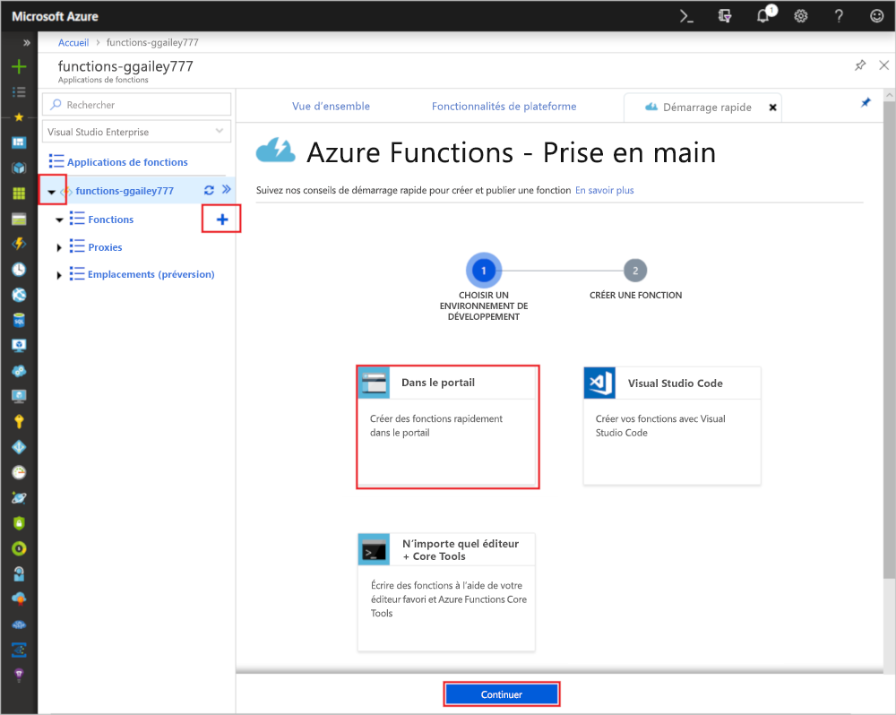
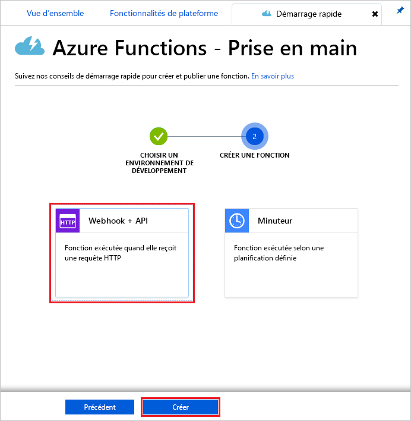
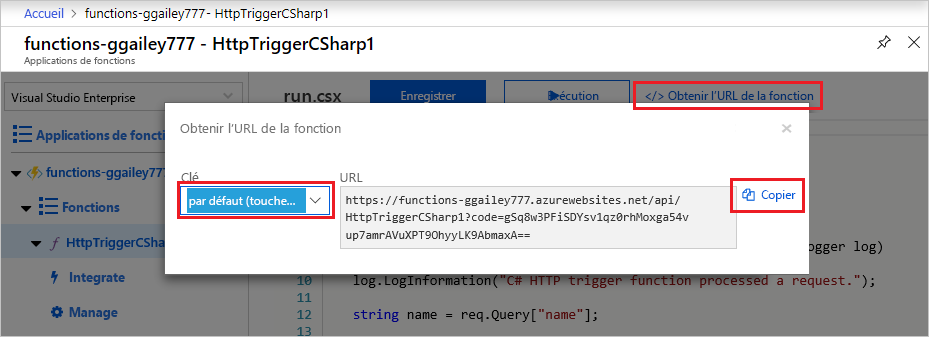
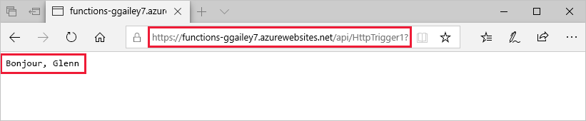
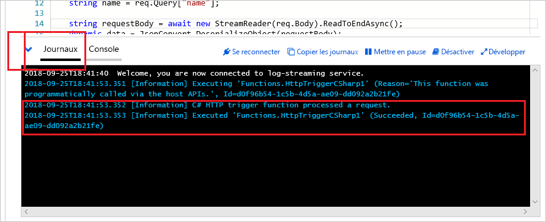

# Créer votre première fonction à l’aide du Portail Azure

Azure Functions vous permet d’exécuter votre code dans un environnement serverless, et sans avoir à créer une machine virtuelle ou à publier une application web au préalable. Dans cet article, vous allez découvrir comment utiliser Azure Functions pour créer une fonction déclenchée via HTTP, « Hello world », dans le portail Azure.

[!INCLUDE [quickstarts-free-trial-note](../../includes/quickstarts-free-trial-note.md)]

Si vous êtes développeur C#, envisagez de [créer votre première fonction dans Visual Studio 2019](functions-create-your-first-function-visual-studio.md) plutôt que dans le portail. 

## Connexion à Azure

Connectez-vous au [portail Azure](https://portal.azure.com) avec votre compte Azure.

## Créer une application de fonction

Vous devez disposer d’une Function App pour héberger l’exécution de vos fonctions. Une application de fonctions vous permet de regrouper des fonctions en une unité logique pour faciliter la gestion, le déploiement et le partage des ressources.

[!INCLUDE [Create function app Azure portal](../../includes/functions-create-function-app-portal.md)]

Créez ensuite une fonction dans la nouvelle application de fonction.

## Créer une fonction déclenchée via HTTP

1. Développez votre nouvelle application de fonction, sélectionnez le bouton **+** en regard de **Fonctions**, choisissez **Dans le portail**, puis sélectionnez **Continuer**.

    

1. Choisissez **WebHook + API**, puis sélectionnez **Créer**.

    

   Une fonction est créée à l’aide d’un modèle spécifique à une langue pour une fonction déclenchée via HTTP.

Vous pouvez maintenant exécuter la nouvelle fonction en envoyant une requête HTTP.

## Tester la fonction

1. Dans votre nouvelle fonction, sélectionnez **</> Obtenir l’URL de la fonction** en haut à droite. 

1. Dans la boîte de dialogue **Obtenir l’URL de la fonction**, sélectionnez **Par défaut (Clé de fonction)** dans la liste déroulante, puis sélectionnez **Copier**. 

    

1. Collez l’URL de fonction dans la barre d’adresse de votre navigateur. Ajoutez la valeur de la chaîne de requête `&name=<your_name>` à la fin de cette URL, puis appuyez sur la touche Entrée pour exécuter la requête. 

    L’exemple suivant montre la réponse dans le navigateur :

    

    L’URL de demande inclut une clé qui est requise, par défaut, pour accéder à votre fonction sur HTTP.

1. Lorsque votre fonction s’exécute, des informations de suivi sont écrites dans les journaux d’activité. Pour afficher la sortie de suivi de l’exécution précédente, revenez à votre fonction dans le portail et sélectionnez la flèche figurant en bas de l’écran pour développer les **Journaux**.

   

## Nettoyer les ressources

[!INCLUDE [Clean-up resources](../../includes/functions-quickstart-cleanup.md)]

## Étapes suivantes

[!INCLUDE [Next steps note](../../includes/functions-quickstart-next-steps.md)]

