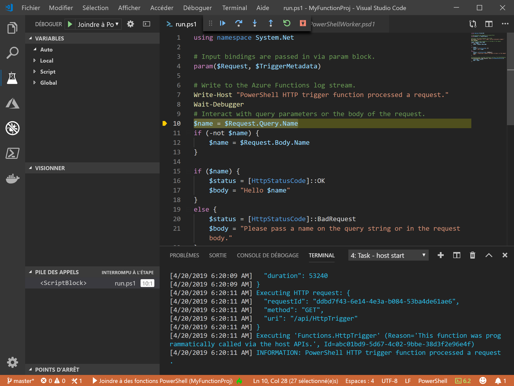

# <a name="create-your-first-powershell-function-in-azure"></a>Créer votre première fonction PowerShell dans Azure

Ce guide de démarrage rapide vous explique comment créer votre première fonction PowerShell [serverless](https://azure.com/serverless) à l’aide de Visual Studio Code.



L’[extension Azure Functions pour Visual Studio Code] vous permet de créer une fonction PowerShell localement et de la déployer dans une nouvelle application de fonction dans Azure. L’extension est actuellement en préversion. Pour plus d’informations, consultez la page d’extension [Extension Azure Functions pour Visual Studio Code].

Les étapes suivantes sont prises en charge sur les systèmes d’exploitation macOS, Windows et Linux.

## <a name="prerequisites"></a>Prérequis

Pour suivre ce guide de démarrage rapide :

* Installez [PowerShell Core](/powershell/scripting/install/installing-powershell-core-on-windows).

* Installer [Visual Studio Code](https://code.visualstudio.com/) sur l’une des [plateformes prises en charge](https://code.visualstudio.com/docs/supporting/requirements#_platforms). 

* Installez l’[extension PowerShell pour Visual Studio Code](https://marketplace.visualstudio.com/items?itemName=ms-vscode.PowerShell).

* Installez le [SDK .NET Core 2.2+](https://www.microsoft.com/net/download) (requis par Azure Functions Core Tools et disponible sur toutes les plateformes prises en charge).

* Installez la version 2.x d’[Azure Functions Core Tools](functions-run-local.md#v2).

* Vous avez également besoin d’un abonnement Azure actif.

[!INCLUDE [quickstarts-free-trial-note](../../includes/quickstarts-free-trial-note.md)]

[!INCLUDE [functions-install-vs-code-extension](../../includes/functions-install-vs-code-extension.md)] 

## <a name="create-a-function-app-project"></a>Créer un projet d’application de fonction

Le modèle de projet Azure Functions dans Visual Studio Code crée un projet qui peut être publié dans une application de fonction sur Azure. Une application de fonctions vous permet de regrouper des fonctions en une unité logique pour faciliter la gestion, le déploiement et le partage des ressources.

1. Dans Visual Studio Code, sélectionnez le logo Azure pour afficher la zone **Azure : Fonctions**, puis sélectionnez l’icône Créer un projet.

    

1. Choisissez un emplacement pour votre espace de travail de projet Functions et optez pour **Sélectionner**.

    > [!NOTE]
    > Cet article a été conçu pour être terminé en dehors d’un espace de travail. Dans ce cas, ne sélectionnez pas de dossier de projet qui fait partie d’un espace de travail.

1. Sélectionnez **Powershell** comme langage de votre projet d’application de fonction, puis **Azure Functions v2**.

1. Choisissez **Déclencheur HTTP** comme modèle pour votre première fonction, utilisez `HTTPTrigger` comme nom de fonction, puis choisissez le niveau d’autorisation **Fonction**.

    > [!NOTE]
    > Le niveau d’autorisation **Fonction** nécessite une valeur de [clé de fonction](functions-bindings-http-webhook-trigger.md#authorization-keys) lors de l’appel du point de terminaison de la fonction dans Azure. Il est donc plus difficile pour un utilisateur d’appeler votre fonction.

1. Lorsque vous y êtes invité, choisissez **ajouter à l’espace de travail**.

Visual Studio Code crée le projet d’application de fonction PowerShell dans un nouvel espace de travail. Ce projet contient les fichiers de configuration [host.json](functions-host-json.md) et [local.settings.json](functions-run-local.md#local-settings-file) qui s’appliquent à toutes les fonctions du projet. Ce [projet PowerShell](functions-reference-powershell.md#folder-structure) est identique à une application de fonction s’exécutant dans Azure.

[!INCLUDE [functions-run-function-test-local-vs-code-ps](../../includes/functions-run-function-test-local-vs-code-ps.md)]

[!INCLUDE [functions-publish-project-vscode](../../includes/functions-publish-project-vscode.md)]

## <a name="test"></a>Exécuter la fonction dans Azure

Pour vérifier que votre fonction publiée s’exécute dans Azure, exécutez la commande PowerShell suivante en remplaçant le paramètre `Uri` par l’URL de la fonction HTTPTrigger copiée à l’étape précédente. Ajoutez la chaîne de requête `&name=<yourname>` à l’URL, comme dans l’exemple suivant :

```powershell
PS > Invoke-WebRequest -Method Get -Uri "https://glengatest-vscode-powershell.azurewebsites.net/api/HttpTrigger?code=nrY05eZutfPqLo0som...&name=PowerShell"

StatusCode        : 200
StatusDescription : OK
Content           : Hello PowerShell
RawContent        : HTTP/1.1 200 OK
                    Content-Length: 16
                    Content-Type: text/plain; charset=utf-8
                    Date: Thu, 25 Apr 2019 16:01:22 GMT

                    Hello PowerShell
Forms             : {}
Headers           : {[Content-Length, 16], [Content-Type, text/plain; charset=utf-8], [Date, Thu, 25 Apr 2019 16:01:22 GMT]}
Images            : {}
InputFields       : {}
Links             : {}
ParsedHtml        : mshtml.HTMLDocumentClass
RawContentLength  : 16
```

## <a name="next-steps"></a>Étapes suivantes

Vous avez utilisé Visual Studio Code pour créer une application de fonction PowerShell avec une fonction simple déclenchée par HTTP. Si vous le souhaitez, vous pouvez en apprendre davantage sur le [débogage local d’une fonction PowerShell](functions-debug-powershell-local.md) à l’aide d’Azure Functions Core Tools. Consultez le [guide du développeur de fonctions Azure avec PowerShell](functions-reference-powershell.md).

> [!div class="nextstepaction"]
> [Activer l’intégration à Application Insights](functions-monitoring.md#manually-connect-an-app-insights-resource)

[Azure portal]: https://portal.azure.com
[Azure Functions Core Tools]: functions-run-local.md
[Extension Azure Functions pour Visual Studio Code]: https://marketplace.visualstudio.com/items?itemName=ms-azuretools.vscode-azurefunctions
[`Wait-Debugger`]: /powershell/module/microsoft.powershell.utility/wait-debugger?view=powershell-6
