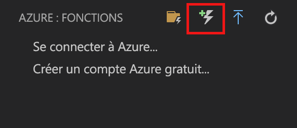
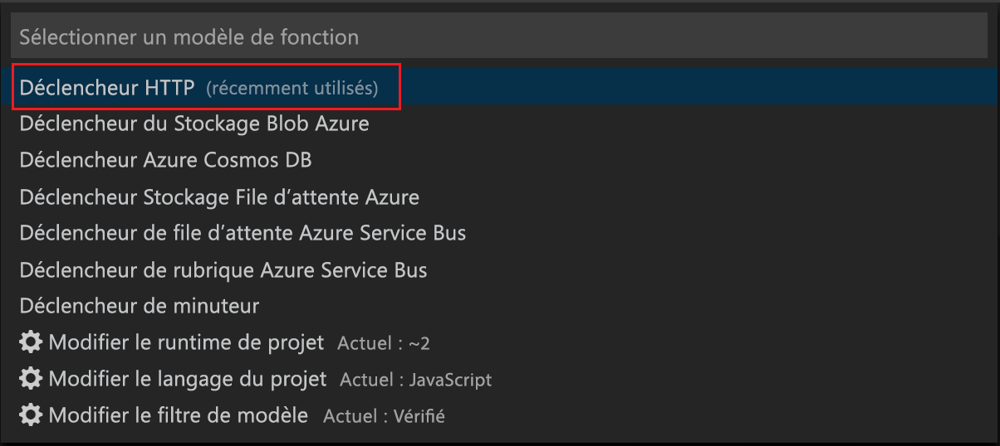

# Créer votre première fonction à l’aide de Visual Studio Code

Azure Functions vous permet d’exécuter votre code dans un environnement [sans serveur](https://azure.microsoft.com/solutions/serverless/) et sans avoir à créer une machine virtuelle ou à publier une application web au préalable.

Dans cet article, vous allez apprendre à utiliser l’extension [Extension Azure Functions pour Visual Studio Code] pour créer et tester une fonction « hello world » sur votre ordinateur local à l’aide de Microsoft Visual Studio Code. Vous allez ensuite publier le code de la fonction dans Azure à partir de Visual Studio Code.

Actuellement, l’extension prend entièrement en charge les fonctions en C#, JavaScript et Java, et prend en charge Python en préversion. Les étapes décrites dans cet article peuvent varier selon le langage choisi pour votre projet Azure Functions. L’extension est actuellement en préversion. Pour plus d’informations, consultez la page d’extension [Extension Azure Functions pour Visual Studio Code].

## Prérequis

Pour suivre ce guide de démarrage rapide :

* Installer [Visual Studio Code](https://code.visualstudio.com/) sur l’une des [plateformes prises en charge](https://code.visualstudio.com/docs/supporting/requirements#_platforms). Cet article a été développé et testé sur un appareil exécutant macOS (High Sierra).

* Installer la version 2.x d’[Azure Functions Core Tools](functions-run-local.md#v2), qui est toujours en préversion.

* Installer les exigences spécifiques pour le langage choisi :

    | Langage | Extension |
    | -------- | --------- |
    | **C#** | [C# pour Visual Studio Code](https://marketplace.visualstudio.com/items?itemName=ms-vscode.csharp) [Outils CLI .NET Core](https://docs.microsoft.com/dotnet/core/tools/?tabs=netcore2x)*   |
    | **Java** | [Débogueur pour Java](https://marketplace.visualstudio.com/items?itemName=vscjava.vscode-java-debug) [Java 8](https://aka.ms/azure-jdks) [Maven 3+](https://maven.apache.org/) |
    | **JavaScript** | [Node 8.0+](https://nodejs.org/)  |

    \* Également requis par Core Tools.

[!INCLUDE [quickstarts-free-trial-note](../../includes/quickstarts-free-trial-note.md)]

[!INCLUDE [functions-install-vs-code-extension](../../includes/functions-install-vs-code-extension.md)]

[!INCLUDE [functions-create-function-app-vs-code](../../includes/functions-create-function-app-vs-code.md)]

## Créer une fonction déclenchée via HTTP

1. À partir d’**Azure : Functions**, cliquez sur l’icône Créer une fonction.

    

1. Sélectionnez le dossier avec votre projet d’application de fonction, puis le modèle de fonction **Déclencheur HTTP**.

    

1. Tapez `HTTPTrigger` pour le nom de fonction et appuyez sur Entrée, puis sélectionnez l’authentification **Anonyme**.

    

    Une fonction est créée dans le langage que vous avez choisi à l’aide du modèle de fonction déclenchée via HTTP.

    

Vous pouvez ajouter des liaisons d’entrée et de sortie à votre fonction en modifiant le fichier function.json. Pour plus d’informations, consultez [Concepts des déclencheurs et liaisons Azure Functions](functions-triggers-bindings.md).

Maintenant que vous avez créé un projet de fonction et une fonction déclenchée via HTTP, vous pouvez la tester sur votre ordinateur local.

## Tester la fonction en local

Azure Functions Core Tools vous permet d’exécuter un projet Azure Functions sur votre ordinateur de développement local. Vous êtes invité à installer ces outils la première fois que vous démarrez une fonction dans Visual Studio Code.  

1. Pour tester votre fonction, définissez un point d’arrêt dans le code de fonction et appuyez sur F5 pour démarrer le projet d’application de fonction. La sortie de Core Tools est affichée dans le panneau **Terminal**.

1. Dans le panneau **Terminal**, copiez le point de terminaison de l’URL de votre fonction déclenchée via HTTP.

    

1. Collez l’URL de la demande HTTP dans la barre d’adresses de votre navigateur. Ajoutez la chaîne de requête `?name=<yourname>` à cette URL et exécutez la demande. L’exécution est suspendue lorsque le point d’arrêt est atteint.

    

1. Lorsque vous continuez l’exécution, la capture d’écran suivante du navigateur montre la réponse à la requête GET :

    

1. Pour arrêter le débogage, appuyez sur MAJ + F5.

Après avoir vérifié que la fonction s’exécute correctement sur votre ordinateur local, il est temps de publier le projet sur Azure.

[!INCLUDE [functions-sign-in-vs-code](../../includes/functions-sign-in-vs-code.md)]

[!INCLUDE [functions-publish-project-vscode](../../includes/functions-publish-project-vscode.md)]

## Tester votre fonction dans Azure

1. Copiez l’URL du déclencheur HTTP à partir du panneau **Sortie**. Comme auparavant, veillez à ajouter la chaîne de requête `?name=<yourname>` à la fin de cette URL et exécutez la requête.

    L’URL qui appelle la fonction déclenchée via HTTP doit être au format suivant :

        http://<functionappname>.azurewebsites.net/api/<functionname>?name=<yourname> 

1. Collez cette nouvelle URL de requête HTTP dans la barre d’adresse de votre navigateur. La capture d’écran suivante du navigateur montre la requête renvoyée par la fonction suite à la demande distante GET : 

    

## Étapes suivantes

Vous avez utilisé Visual Studio Code pour créer une application de fonction à l’aide d’une fonction HTTP simple déclenchée via HTTP. Ensuite, vous souhaiterez peut-être en savoir plus sur les [tests locaux et sur le débogage à partir du terminal ou de l’invite de commandes](functions-run-local.md) avec Azure Functions Core Tools.

> [!div class="nextstepaction"]
> [Activer l’intégration à Application Insights](functions-monitoring.md#manually-connect-an-app-insights-resource)

[Azure Functions Core Tools]: functions-run-local.md
[Extension Azure Functions pour Visual Studio Code]: https://marketplace.visualstudio.com/items?itemName=ms-azuretools.vscode-azurefunctions
