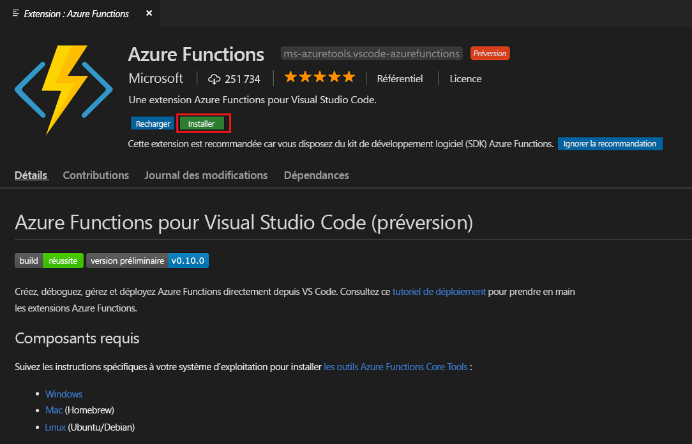
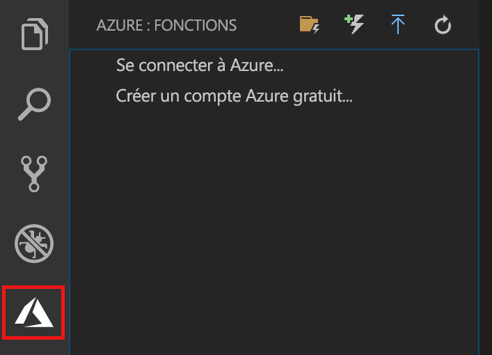
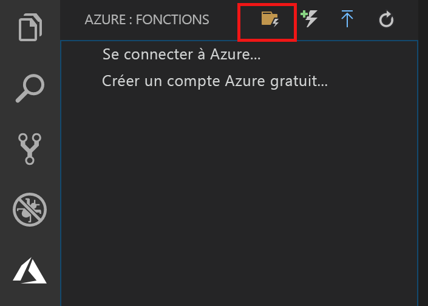
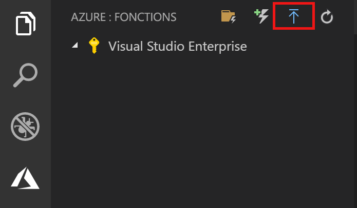
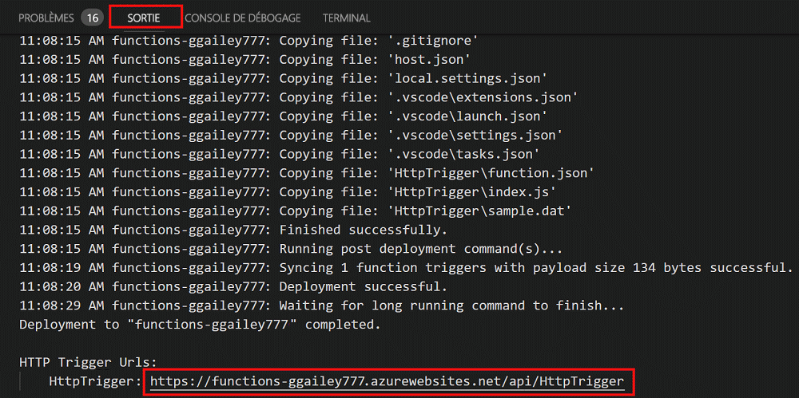

# Créer votre première fonction à l’aide de Visual Studio Code

Azure Functions vous permet d’exécuter votre code dans un environnement [sans serveur](https://azure.microsoft.com/solutions/serverless/) et sans avoir à créer une machine virtuelle ou à publier une application web au préalable.

Dans cet article, vous allez apprendre à utiliser l’extension [Extension Azure Functions pour Visual Studio Code] pour créer et tester une fonction « hello world » sur votre ordinateur local à l’aide de Microsoft Visual Studio Code. Vous allez ensuite publier le code de la fonction dans Azure à partir de Visual Studio Code.

L’extension prend actuellement en charge les fonctions C#, JavaScript et Java. Les étapes décrites dans cet article peuvent varier selon le langage choisi pour votre projet Azure Functions. L’extension est actuellement en préversion. Pour plus d’informations, consultez la page d’extension [Extension Azure Functions pour Visual Studio Code].

## Prérequis

Pour suivre ce guide de démarrage rapide :

* Installer [Visual Studio Code](https://code.visualstudio.com/) sur l’une des [plateformes prises en charge](https://code.visualstudio.com/docs/supporting/requirements#_platforms). Cet article a été développé et testé sur un appareil exécutant macOS (High Sierra).

* Installer la version 2.x d’[Azure Functions Core Tools](functions-run-local.md#v2), qui est toujours en préversion.

* Installer les exigences spécifiques pour le langage choisi :

    | Langage | Extension |
    | -------- | --------- |
    | **C#** | [C# pour Visual Studio Code](https://marketplace.visualstudio.com/items?itemName=ms-vscode.csharp) [Outils CLI .NET Core](https://docs.microsoft.com/dotnet/core/tools/?tabs=netcore2x)*   |
    | **Java** | [Débogueur pour Java](https://marketplace.visualstudio.com/items?itemName=vscjava.vscode-java-debug) [JDK 1.8](http://www.oracle.com/technetwork/java/javase/downloads/index.html) [Maven 3+](https://maven.apache.org/) |
    | **JavaScript** | [Node 8.0+](https://nodejs.org/)  |

    \* Également requis par Core Tools.

[!INCLUDE [quickstarts-free-trial-note](../../includes/quickstarts-free-trial-note.md)]

## Installer l’extension Azure Functions

L’extension Azure Functions est utilisée pour créer, tester et déployer des fonctions sur Azure.

1. Dans Visual Studio Code, ouvrez **Extensions** et recherchez `azure functions`, ou [ouvrez ce lien dans Visual Studio Code](vscode:extension/ms-azuretools.vscode-azurefunctions).

1. Sélectionnez **Installer** pour installer l’extension dans Visual Studio Code. 

    

1. Redémarrez Visual Studio Code, puis sélectionnez l’icône Azure dans la barre d’activités. Vous devriez voir une zone Azure Functions dans la barre latérale.

    

## Créer un projet Azure Functions

Le modèle de projet Azure Functions dans Visual Studio Code crée un projet qui peut être publié dans une application de fonction sur Azure. Une application de fonctions vous permet de regrouper les fonctions dans une unité logique pour la gestion, le déploiement et le partage des ressources.

1. Dans Visual Studio Code, sélectionnez le logo Azure pour afficher la zone **Azure : Functions**, puis sélectionnez l’icône Créer un projet.

    

1. Choisissez un emplacement pour votre espace de travail de projet et optez pour **Sélectionner**.

    > [!NOTE]
    > Cet article a été conçu pour être terminé en dehors d’un espace de travail. Dans ce cas, ne sélectionnez pas de dossier de projet qui fait partie d’un espace de travail.

1. Sélectionnez le langage pour votre projet d’application de fonction. Dans cet article, JavaScript est utilisé.
    

1. Lorsque vous y êtes invité, choisissez **ajouter à l’espace de travail**.

Visual Studio Code crée le projet d’application de fonction dans un nouvel espace de travail. Ce projet contient les fichiers de configuration [host.json](functions-host-json.md) et [local.settings.json](functions-run-local.md#local-settings-file), ainsi que des fichiers de projet spécifiques au langage. Vous obtenez également un nouveau référentiel Git dans le dossier du projet.

## Créer une fonction déclenchée via HTTP

1. À partir d’**Azure : Functions**, cliquez sur l’icône de Créer une fonction.

    

1. Sélectionnez le dossier avec votre projet d’application de fonction, puis le modèle de fonction **Déclencheur HTTP**.

    

1. Tapez `HTTPTrigger` pour le nom de fonction et appuyez sur Entrée, puis sélectionnez l’authentification **Anonyme**.

    

    Une fonction est créée dans le langage que vous avez choisi à l’aide du modèle de fonction déclenchée via HTTP.

    

Vous pouvez ajouter des liaisons d’entrée et de sortie à votre fonction en modifiant le fichier function.json. Pour plus d’informations, consultez [Concepts des déclencheurs et liaisons Azure Functions](functions-triggers-bindings.md).

Maintenant que vous avez créé un projet de fonction et une fonction déclenchée via HTTP, vous pouvez la tester sur votre ordinateur local.

## Tester la fonction en local

Azure Functions Core Tools vous permet d’exécuter un projet Azure Functions sur votre ordinateur de développement local. Vous êtes invité à installer ces outils la première fois que vous démarrez une fonction dans Visual Studio Code.  

1. Pour tester votre fonction, définissez un point d’arrêt dans le code de fonction et appuyez sur F5 pour démarrer le projet d’application de fonction. La sortie de Core Tools est affichée dans le panneau **Terminal**.

1. Dans le panneau **Terminal**, copiez le point de terminaison de l’URL de votre fonction déclenchée via HTTP.

    

1. Collez l’URL de la demande HTTP dans la barre d’adresses de votre navigateur. Ajoutez la chaîne de requête `?name=<yourname>` à cette URL et exécutez la demande. L’exécution est suspendue lorsque le point d’arrêt est atteint.

    

1. Lorsque vous continuez l’exécution, la capture d’écran suivante du navigateur montre la réponse à la requête GET :

    

1. Pour arrêter le débogage, appuyez sur Maj + F1.

Après avoir vérifié que la fonction s’exécute correctement sur votre ordinateur local, il est temps de publier le projet sur Azure.

## Connexion à Azure

Avant de pouvoir publier votre application, vous devez vous connecter à Azure.

1. Dans la zone **Azure : Functions**, choisissez **Se connecter à Azure...**. Si vous ne l’avez pas encore fait, vous pouvez **Créer un compte Azure gratuit**.

    

1. Lorsque vous y êtes invité, sélectionnez **Copier et ouvrir**, ou copiez le code affiché et ouvrez <https://aka.ms/devicelogin> dans votre navigateur.

1. Collez le code copié sur la page **Connexion à l’appareil**, vérifiez la connexion à Visual Studio Code, puis sélectionnez **Continuer**.  

1. Finalisez la connexion à l’aide des informations d’identification de votre compte Azure. Une fois connecté, vous pouvez fermer le navigateur.

## Publication du projet sur Azure

Visual Studio Code vous permet de publier votre projet de fonctions directement sur Azure. Pendant le processus, vous créez une application de fonction et les ressources associées dans votre abonnement Azure. L’application de fonction fournit un contexte d'exécution pour vos fonctions. Le projet est empaqueté et déployé sur la nouvelle application de fonction dans votre abonnement Azure. 

Cet article suppose que vous créez une nouvelle application de fonction. La publication sur une application de fonction existante remplace le contenu de cette application dans Azure.

1. Dans la zone **Azure : Functions**, sélectionnez l’icône Déployer sur Function App.

    

1. Choisissez le dossier du projet, qui est votre espace de travail actuel.

1. Si vous avez plusieurs abonnements, choisissez celui où vous souhaitez héberger votre application de fonction, puis choisissez **+ Créer une application de fonction**.

1. Tapez un nom global unique qui identifie votre application de fonction et appuyez sur Entrée. Les caractères valides pour un nom d’application de fonction sont `a-z`, `0-9` et `-`.

1. Choisissez **+ Créer un groupe de ressources**, tapez un nom de groupe de ressources, par exemple `myResourceGroup`, et appuyez sur Entrée. Vous pouvez également utiliser un groupe de ressources existant.

1. Choisissez **+ Créer un compte de stockage**, tapez un nom global unique du nouveau compte de stockage utilisé par votre application de fonction et appuyez sur Entrée. Les noms des comptes de stockage doivent comporter entre 3 et 24 caractères, uniquement des lettres minuscules et des chiffres. Vous pouvez également utiliser un compte existant.

1. Choisissez également un emplacement dans une [région](https://azure.microsoft.com/regions/) proche de chez vous, ou proche d’autres services auxquels vos fonctions ont accès.

    La création d’applications de fonction démarre une fois que vous avez choisi votre emplacement. Une notification s’affiche après que votre application de fonction a été créée et que le package de déploiement a été appliqué.

1. Sélectionnez **Afficher la sortie de** dans les notifications pour afficher les résultats de la création et du déploiement, y compris les ressources Azure que vous avez créées.

    

1. Notez l’URL de la nouvelle application de fonction dans Azure. Vous l’utiliserez pour tester votre fonction une fois que le projet aura été publié sur Azure.

    

1. En revenant dans la zone **Azure : Functions**, vous voyez la nouvelle application de fonction affichée sous votre abonnement. Lorsque vous développez ce nœud, vous voyez les fonctions dans l’application de fonction, ainsi que les paramètres d’application et les proxys de fonction.

    

    À partir du nœud de votre application de fonction, tapez Ctrl et cliquez (clic droit) pour choisir d’effectuer diverses tâches de gestion et de configuration relatives à l’application de fonction dans Azure. Vous pouvez également choisir d’afficher l’application de fonction dans le portail Azure.

## Tester votre fonction dans Azure

1. Copiez l’URL du déclencheur HTTP à partir du panneau **Sortie**. Comme auparavant, veillez à ajouter la chaîne de requête `?name=<yourname>` à la fin de cette URL et exécutez la requête.

    L’URL qui appelle la fonction déclenchée via HTTP doit être au format suivant :

        http://<functionappname>.azurewebsites.net/api/<functionname>?name=<yourname> 

1. Collez cette nouvelle URL de requête HTTP dans la barre d’adresse de votre navigateur. La capture d’écran suivante du navigateur montre la requête renvoyée par la fonction suite à la demande distante GET : 

    

## Étapes suivantes

Vous avez utilisé Visual Studio Code pour créer une application de fonction à l’aide d’une fonction HTTP simple déclenchée via HTTP. Pour en savoir plus sur le développement de fonctions dans un langage spécifique, consultez les guides de référence de langage pour [JavaScript](functions-reference-node.md), [.NET](functions-dotnet-class-library.md) ou [Java](functions-reference-java.md).

Ensuite, vous souhaiterez peut-être en savoir plus sur les tests locaux et sur le débogage à partir du terminal ou de l’invite de commandes avec Azure Functions Core Tools.

> [!div class="nextstepaction"]
> [Coder et tester localement](functions-run-local.md)

[Azure Functions Core Tools]: functions-run-local.md
[Extension Azure Functions pour Visual Studio Code]: https://marketplace.visualstudio.com/items?itemName=ms-azuretools.vscode-azurefunctions
