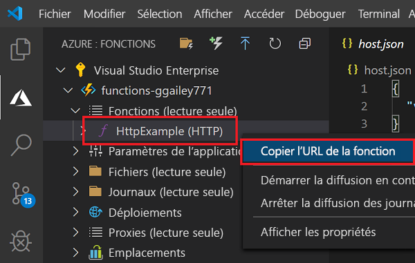
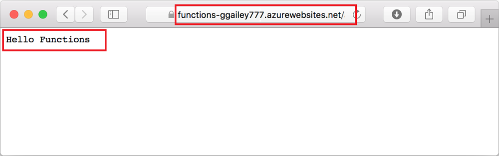

# <a name="quickstart-create-a-function-in-azure-using-visual-studio-code"></a>Démarrage rapide : Créer une fonction dans Azure à l’aide de Visual Studio Code

::: zone pivot="programming-language-csharp"  
Dans cet article, vous allez utiliser Visual Studio Code pour créer une fonction basée sur une bibliothèque de classes C# qui répond aux requêtes HTTP. Après avoir testé le code localement, vous le déployez dans l’environnement serverless d’Azure Functions. 
::: zone-end  
::: zone pivot="programming-language-javascript"
Dans cet article, vous allez utiliser Visual Studio Code pour créer une fonction JavaScript qui répond aux requêtes HTTP. Après avoir testé le code localement, vous le déployez dans l’environnement serverless d’Azure Functions. 
::: zone-end
::: zone pivot="programming-language-typescript"
Dans cet article, vous allez utiliser Visual Studio Code pour créer une fonction TypeScript qui répond aux requêtes HTTP. Après avoir testé le code localement, vous le déployez dans l’environnement serverless d’Azure Functions. 
::: zone-end   
::: zone pivot="programming-language-powershell"
Dans cet article, vous allez utiliser Visual Studio Code pour créer une fonction PowerShell qui répond aux requêtes HTTP. Après avoir testé le code localement, vous le déployez dans l’environnement serverless d’Azure Functions. 
::: zone-end  
::: zone pivot="programming-language-python" 
Dans cet article, vous allez utiliser Visual Studio Code pour créer une fonction Python qui répond aux requêtes HTTP. Après avoir testé le code localement, vous le déployez dans l’environnement serverless d’Azure Functions. 
::: zone-end  
::: zone pivot="programming-language-java" 
Dans cet article, vous allez utiliser Visual Studio Code pour créer une fonction Java qui répond aux requêtes HTTP. Après avoir testé le code localement, vous le déployez dans l’environnement serverless d’Azure Functions. 
::: zone-end

Le fait de suivre ce guide de démarrage rapide entraîne une petite dépense de quelques cents USD tout au plus dans votre compte Azure. 

::: zone pivot="programming-language-csharp,programming-language-javascript,programming-language-typescript,programming-language-powershell,programming-language-python"
Il existe également une [version basée sur l’interface CLI](functions-create-first-azure-function-azure-cli.md) de cet article.
::: zone-end
::: zone pivot="programming-language-java"  
> [!NOTE]
> Si Visual Studio Code n’est pas votre outil de développement préféré, consultez nos tutoriels similaires destinés aux développeurs Java utilisant [Maven](./functions-create-first-azure-function-azure-cli.md?pivots=programming-language-java), [Gradle](./functions-create-first-java-gradle.md) et [IntelliJ IDEA](/azure/developer/java/toolkit-for-intellij/quickstart-functions).
::: zone-end  

## <a name="configure-your-environment"></a>Configurer votre environnement

Avant de commencer, veillez à disposer des éléments suivants :

+ Compte Azure avec un abonnement actif. [Créez un compte gratuitement](https://azure.microsoft.com/free/?ref=microsoft.com&utm_source=microsoft.com&utm_medium=docs&utm_campaign=visualstudio).

::: zone pivot="programming-language-csharp,programming-language-powershell,programming-language-python"  
+ [Node.js](https://nodejs.org/), requis par Windows pour npm. Uniquement les [versions Active LTS et Maintenance LTS](https://nodejs.org/about/releases/). Utilisez la commande `node --version` pour vérifier la version que vous utilisez.
    Non obligatoire pour le développement local sur macOS et Linux.   
::: zone-end   
::: zone pivot="programming-language-javascript,programming-language-typescript"  
+ [Node.js](https://nodejs.org/), Active LTS et Maintenance LTS (version 10.14.1 recommandée). Utilisez la commande `node --version` pour vérifier la version que vous utilisez.  
::: zone-end  
::: zone pivot="programming-language-python"
+ [Python 3.8](https://www.python.org/downloads/release/python-381/), [Python 3.7](https://www.python.org/downloads/release/python-375/) et [Python 3.6](https://www.python.org/downloads/release/python-368/) sont pris en charge par Azure Functions (x64).
::: zone-end   
::: zone pivot="programming-language-powershell"
+ [PowerShell 7](/powershell/scripting/install/installing-powershell-core-on-windows)

+ [.NET Core 3.1](https://www.microsoft.com/net/download) et [.NET Core 2.1](https://dotnet.microsoft.com/download/dotnet-core/2.2)  
::: zone-end  
::: zone pivot="programming-language-java"  
+ [Java Developer Kit (JDK)](https://aka.ms/azure-jdks) version 8.

+ [Apache Maven](https://maven.apache.org) version 3.0 ou ultérieure.
::: zone-end  
+ [Visual Studio Code](https://code.visualstudio.com/) sur l’une des [plateformes prises en charge](https://code.visualstudio.com/docs/supporting/requirements#_platforms).    
::: zone pivot="programming-language-csharp"  
+ [Extension C#](https://marketplace.visualstudio.com/items?itemName=ms-dotnettools.csharp) pour Visual Studio Code.  
::: zone-end  
::: zone pivot="programming-language-python"  
+ [Extension Python](https://marketplace.visualstudio.com/items?itemName=ms-python.python) pour Visual Studio Code.  
::: zone-end  
::: zone pivot="programming-language-powershell"  
+ [Extension PowerShell pour Visual Studio Code](https://marketplace.visualstudio.com/items?itemName=ms-vscode.PowerShell).  
::: zone-end  
::: zone pivot="programming-language-java"   
+ [Pack d’extension Java](https://marketplace.visualstudio.com/items?itemName=vscjava.vscode-java-pack).  
::: zone-end  

+ [Extension Azure Functions](https://marketplace.visualstudio.com/items?itemName=ms-azuretools.vscode-azurefunctions) pour Visual Studio Code. 

## <a name="create-your-local-project"></a><a name="create-an-azure-functions-project"></a>Créer votre projet local 

Dans cette section, vous utilisez Visual Studio Code pour créer un projet Azure Functions local dans le langage de votre choix. Plus loin dans cet article, vous allez publier votre code de fonction sur Azure. 

1. Choisissez l’icône Azure dans la barre d’activité, puis dans la zone **Azure : Fonctions**, sélectionnez l’icône **Créer un projet**.

    

1. Choisissez un emplacement de répertoire pour votre espace de travail de projet et optez pour **Sélectionner**.

    > [!NOTE]
    > Ces étapes ont été conçues pour être terminées en dehors d’un espace de travail. Dans ce cas, ne sélectionnez pas de dossier de projet qui fait partie d’un espace de travail.

1. Quand vous y êtes invité, indiquez les informations suivantes :

    ::: zone pivot="programming-language-csharp"
    + **Sélectionner un langage pour votre projet de fonction** : Choisissez `C#`.
    ::: zone-end
    ::: zone pivot="programming-language-javascript"
    + **Sélectionner un langage pour votre projet de fonction** : Choisissez `JavaScript`.
    ::: zone-end
    ::: zone pivot="programming-language-typescript"
    + **Sélectionner un langage pour votre projet de fonction** : Choisissez `TypeScript`.
    ::: zone-end
    ::: zone pivot="programming-language-powershell"
    + **Sélectionner un langage pour votre projet de fonction** : Choisissez `PowerShell`.
    ::: zone-end
    ::: zone pivot="programming-language-python"
    + **Sélectionner un langage pour votre projet de fonction** : Choisissez `Python`.

    + **Sélectionner un alias Python pour créer un environnement virtuel** : Choisissez l’emplacement de votre interpréteur Python. Si l’emplacement n’est pas affiché, tapez le chemin complet de votre fichier binaire Python.  
    ::: zone-end

    ::: zone pivot="programming-language-java"  
    + **Sélectionner un langage pour votre projet de fonction** : Choisissez `Java`.

    + **Sélectionnez une version de Java** : Choisissez `Java 8` ou `Java 11 (preview)`, sur laquelle vos fonctions s’exécutent dans Azure. Choisissez une version de Java que vous avez vérifiée localement.

    + **Fournir un ID de groupe** : Choisissez `com.function`.

    + **Fournir un ID d’artefact** : Choisissez `myFunction`.

    + **Fournir une version** : Choisissez `1.0-SNAPSHOT`.

    + **Fournir un nom de package** : Choisissez `com.function`.

    + **Fournir un nom d’application** : Choisissez `myFunction-12345`.
    ::: zone-end  
    ::: zone pivot="programming-language-csharp,programming-language-javascript,programming-language-typescript,programming-language-powershell,programming-language-python"
    + **Sélectionner un modèle pour la première fonction de votre projet** : Choisissez `HTTP trigger`.
    
    + **Fournir un nom de fonction** : Tapez `HttpExample`.
    ::: zone-end  
    ::: zone pivot="programming-language-csharp"
    + **Fournir un espace de noms** : Tapez `My.Functions`. 
    ::: zone-end  
    ::: zone pivot="programming-language-csharp,programming-language-javascript,programming-language-typescript,programming-language-powershell,programming-language-python"
    + **Niveau d’autorisation** : Choisissez l’option `Anonymous`, qui permet à quiconque d’appeler le point de terminaison de votre fonction. Pour en savoir plus sur le niveau d’autorisation, consultez [Clés d’autorisation](functions-bindings-http-webhook-trigger.md#authorization-keys).
    ::: zone-end  
    + **Sélectionner la façon dont vous souhaitez ouvrir votre projet** : Choisissez `Add to workspace`.

1. À l’aide de ces informations, Visual Studio Code génère un projet Azure Functions avec un déclencheur HTTP. Vous pouvez voir les fichiers de projet locaux dans l’Explorateur. Pour en savoir plus sur les fichiers créés, consultez [Fichiers projet générés](functions-develop-vs-code.md#generated-project-files). 

::: zone pivot="programming-language-csharp,programming-language-javascript,programming-language-python,programming-language-java"

[!INCLUDE [functions-run-function-test-local-vs-code](../../includes/functions-run-function-test-local-vs-code.md)]

::: zone-end

::: zone pivot="programming-language-powershell"

[!INCLUDE [functions-run-function-test-local-vs-code-ps](../../includes/functions-run-function-test-local-vs-code-ps.md)]

::: zone-end

Après avoir vérifié que la fonction s’exécute correctement sur votre ordinateur local, il est temps d’utiliser Visual Studio Code pour publier le projet directement sur Azure. 

[!INCLUDE [functions-sign-in-vs-code](../../includes/functions-sign-in-vs-code.md)]

[!INCLUDE [functions-publish-project-vscode](../../includes/functions-publish-project-vscode.md)]

## <a name="run-the-function-in-azure"></a>Exécuter la fonction dans Azure

1. Dans la zone **Azure : Fonctions** de la barre latérale, développez la nouvelle application de fonction sous votre abonnement. Développez **Fonctions**, cliquez avec le bouton droit (Windows) ou appuyez sur Ctrl + clic (macOS) sur **HttpExample**, puis choisissez **Copier l’URL de la fonction**.

    

1. Collez cette URL pour la requête HTTP dans la barre d’adresse de votre navigateur, ajoutez la chaîne de requête `name` sous la forme `?name=Functions` à la fin de cette URL, puis exécutez la requête. L’URL qui appelle la fonction déclenchée via HTTP doit être au format suivant :

    ```http
    http://<functionappname>.azurewebsites.net/api/httpexample?name=Functions
    ```
        
    L’exemple suivant montre la réponse dans le navigateur à la requête GET distante retournée par la fonction : 

    

## <a name="clean-up-resources"></a>Nettoyer les ressources

Quand vous passerez à l’étape suivante, [Ajouter une liaison de file d’attente Stockage Azure à votre fonction](functions-add-output-binding-storage-queue-vs-code.md), vous devrez conserver toutes vos ressources en place, car vous allez tirer parti de ce que vous avez déjà fait.

Sinon, vous pouvez utiliser les étapes suivantes pour supprimer l’application de fonction et ses ressources connexes afin d’éviter des coûts supplémentaires.

[!INCLUDE [functions-cleanup-resources-vs-code.md](../../includes/functions-cleanup-resources-vs-code.md)]

Pour en savoir plus sur les coûts de Functions, consultez [Estimation des coûts d’un plan Consommation](functions-consumption-costs.md).

## <a name="next-steps"></a>Étapes suivantes

Vous avez utilisé Visual Studio Code pour créer une application de fonction à l’aide d’une fonction HTTP simple déclenchée via HTTP. Dans le prochain article, vous développez cette fonction en ajoutant une liaison de sortie. Cette liaison écrit la chaîne de la requête HTTP dans un message dans une file d’attente de Stockage File d’attente Azure. 

> [!div class="nextstepaction"]
> [Ajouter une liaison de file d’attente Stockage Azure à votre fonction](functions-add-output-binding-storage-queue-vs-code.md)

[Azure Functions Core Tools]: functions-run-local.md
[Azure Functions extension for Visual Studio Code]: https://marketplace.visualstudio.com/items?itemName=ms-azuretools.vscode-azurefunctions
