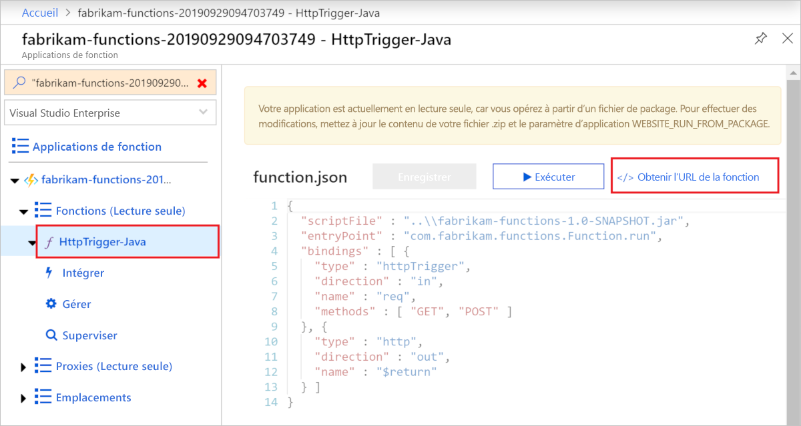

# <a name="quickstart-use-java-and-maven-to-create-and-publish-a-function-to-azure"></a>Démarrage rapide : Utiliser Java et Maven pour créer et publier une fonction sur Azure

Cet article montre comment générer et publier une fonction Java sur Azure Functions avec l’outil en ligne de commande Maven. Quand vous avez terminé, votre code de fonction s’exécute dans Azure dans un [plan d’hébergement serverless](functions-scale.md#consumption-plan) et est déclenché par une requête HTTP.

<!--
> [!NOTE] 
> You can also create a Kotlin-based Azure Functions project by using the azure-functions-kotlin-archetype instead. Visit the [GitHub repository](https://github.com/microsoft/azure-maven-archetypes/tree/develop/azure-functions-kotlin-archetype) for more information.
-->

## <a name="prerequisites"></a>Conditions préalables requises

Pour développer des fonctions avec Java, les éléments suivants doivent être installés :

- [Java Developer Kit (JDK)](https://aka.ms/azure-jdks), version 8
- [Apache Maven](https://maven.apache.org), version 3.0 ou ultérieure
- [Azure CLI]
- [Azure Functions Core Tools](./functions-run-local.md#v2) version 2.6.666 ou ultérieure

Vous avez également besoin d’un abonnement Azure actif. [!INCLUDE [quickstarts-free-trial-note](../../includes/quickstarts-free-trial-note.md)]


> [!IMPORTANT]
> Pour pouvoir effectuer ce démarrage rapide, vous devez définir la variable d’environnement JAVA_HOME sur l’emplacement d’installation du JDK.

## <a name="generate-a-new-functions-project"></a>Générer un nouveau projet Functions

Dans un dossier vide, exécutez la commande suivante pour générer le projet Functions à partir d’un [archétype Maven](https://maven.apache.org/guides/introduction/introduction-to-archetypes.html).

### <a name="linuxmacos"></a>Linux/macOS

```bash
mvn archetype:generate \
    -DarchetypeGroupId=com.microsoft.azure \
    -DarchetypeArtifactId=azure-functions-archetype 
```

> [!NOTE]
> Si vous rencontrez des problèmes avec l’exécution d’une commande, jetez un coup d’œil à la version `maven-archetype-plugin` utilisée. Étant donné que vous exécutez la commande dans un répertoire vide dépourvu de fichier `.pom`, celle-ci essaie peut-être d’utiliser un plug-in de l’ancienne version à partir de `~/.m2/repository/org/apache/maven/plugins/maven-archetype-plugin` si vous avez mis à niveau Maven à partir d’une version antérieure. Dans ce cas, essayez de supprimer le répertoire `maven-archetype-plugin` et de réexécuter la commande.

### <a name="windows"></a>Windows

```powershell
mvn archetype:generate `
    "-DarchetypeGroupId=com.microsoft.azure" `
    "-DarchetypeArtifactId=azure-functions-archetype"
```

```cmd
mvn archetype:generate ^
    "-DarchetypeGroupId=com.microsoft.azure" ^
    "-DarchetypeArtifactId=azure-functions-archetype"
```

Maven vous invite à entrer les valeurs nécessaires pour terminer la génération du projet lors du déploiement. Fournissez les valeurs suivantes à l’invite :

| Valeur | Description |
| ----- | ----------- |
| **groupId** | Valeur qui identifie de façon unique votre projet parmi tous les projets, avec respect des [règles de nommage de package](https://docs.oracle.com/javase/specs/jls/se6/html/packages.html#7.7) pour Java. Les exemples de ce guide de démarrage rapide utilisent `com.fabrikam.functions`. |
| **artifactId** | Valeur qui correspond au nom du fichier jar, sans numéro de version. Les exemples de ce guide de démarrage rapide utilisent `fabrikam-functions`. |
| **version** | Choisissez la valeur par défaut `1.0-SNAPSHOT`. |
| **package** | Valeur qui correspond au package Java pour le code de fonction généré. Utilisez la valeur par défaut. Les exemples de ce guide de démarrage rapide utilisent `com.fabrikam.functions`. |
| **appName** | Nom global unique qui identifie votre nouvelle application de fonction dans Azure. Utilisez la valeur par défaut, qui est l’_artifactId_ auquel est ajouté un nombre aléatoire. Prenez note de cette valeur ; vous en aurez besoin plus tard. |
| **appRegion** | Choisissez une [région](https://azure.microsoft.com/regions/) près de chez vous ou près d’autres services auxquels ont accès vos fonctions. Par défaut, il s’agit de `westus`. Exécutez cette commande [Azure CLI] pour obtenir une liste de toutes les régions :<br/>`az account list-locations --query '[].{Name:name}' -o tsv` |
| **resourceGroup** | Nom du nouveau [groupe de ressources](../azure-resource-manager/management/overview.md) dans lequel créer votre application de fonction. Utilisez `myResourceGroup`, qui est utilisé par les exemples de ce guide de démarrage rapide. Un groupe de ressources doit être unique dans votre abonnement Azure.|

Tapez `Y` ou appuyez sur Entrée pour confirmer.

Maven crée les fichiers projet dans un nouveau dossier avec le nom d’_artifactId_, qui est `fabrikam-functions` dans cet exemple. 

Ouvrez le nouveau fichier Function.java à partir du chemin *src/main/java* dans un éditeur de texte et passez en revue le code généré. Ce code est une fonction [déclenchée par HTTP](functions-bindings-http-webhook.md) qui renvoie le corps de la requête. 

> [!div class="nextstepaction"]
> [J’ai rencontré un problème](https://www.research.net/r/javae2e?tutorial=functions-maven-quickstart&step=generate-project)

## <a name="run-the-function-locally"></a>Exécuter la fonction localement

Exécutez la commande suivante, qui remplace le répertoire par le dossier du projet nouvellement créé, puis génère et exécute le projet de fonction :

```console
cd fabrikam-function
mvn clean package 
mvn azure-functions:run
```

Une sortie semblable à celle-ci est retournée par Azure Functions Core Tools quand vous exécutez le projet localement :

```Output
...

Now listening on: http://0.0.0.0:7071
Application started. Press Ctrl+C to shut down.

Http Functions:

    HttpTrigger-Java: [GET,POST] http://localhost:7071/api/HttpTrigger-Java
...
```

Déclenchez la fonction à partir de la ligne de commande en utilisant cURL dans une nouvelle fenêtre de terminal :

```CMD
curl -w "\n" http://localhost:7071/api/HttpTrigger-Java --data AzureFunctions
```

```Output
Hello AzureFunctions!
```
La [clé de fonction](functions-bindings-http-webhook.md#authorization-keys) n’est pas nécessaire lors de l’exécution locale. Utilisez `Ctrl+C` dans le terminal pour arrêter le code de la fonction.

> [!div class="nextstepaction"]
> [J’ai rencontré un problème](https://www.research.net/r/javae2e?tutorial=functions-maven-quickstart&step=local-run)

## <a name="deploy-the-function-to-azure"></a>Déployer la fonction sur Azure

Une application de fonction et les ressources associées sont créées dans Azure lors du déploiement initial de votre application de fonction. Avant de procéder au déploiement, utilisez la commande Azure CLI [az login](/cli/azure/authenticate-azure-cli) pour vous connecter à votre abonnement Azure. 

```azurecli
az login
```

> [!TIP]
> Si votre compte peut accéder à plusieurs abonnements, utilisez [az account set](/cli/azure/account#az-account-set) pour définir l’abonnement par défaut pour cette session. 

Utilisez la commande Maven suivante pour déployer votre projet vers une nouvelle application de fonction. 

```azurecli
mvn azure-functions:deploy
```

Cette cible Maven `azure-functions:deploy` crée les ressources suivantes dans Azure :

+ Groupe de ressources. Nommé avec le _resourceGroup_ que vous avez fourni.
+ Compte de stockage. Requis par les fonctions. Le nom est généré de façon aléatoire en fonction des exigences du nom de compte de stockage.
+ Plan App Service. Hébergement serverless pour votre application de fonction dans l’_appRegion_ spécifiée. Le nom est généré de façon aléatoire.
+ Application de fonction. Une application de fonction est l’unité de déploiement et d’exécution de vos fonctions. Le nom est l’_appName_, auquel est ajouté un numéro généré de façon aléatoire. 

Le déploiement empaquette également les fichiers projet et les déploie dans la nouvelle application de fonction à l’aide de [zip deployment](functions-deployment-technologies.md#zip-deploy), en activant le mode d’exécution à partir du package.

Une fois le déploiement terminé, vous voyez l’URL que vous pouvez utiliser pour accéder aux points de terminaison de votre application de fonction. Étant donné que le déclencheur HTTP que nous avons publié utilise `authLevel = AuthorizationLevel.FUNCTION`, vous devez obtenir la clé de fonction pour appeler le point de terminaison de fonction sur HTTP. Le moyen le plus simple d’obtenir la clé de fonction consiste à passer par le [Azure portal].

> [!div class="nextstepaction"]
> [J’ai rencontré un problème](https://www.research.net/r/javae2e?tutorial=functions-maven-quickstart&step=deploy)

## <a name="get-the-http-trigger-url"></a>Obtient l’URL du déclencheur HTTP

<!--- We can updates this to remove portal dependency after the Maven archetype returns the full URLs with keys on publish (https://github.com/microsoft/azure-maven-plugins/issues/571). -->

Vous pouvez obtenir l’URL requise pour déclencher votre fonction, avec la clé de fonction, à partir du portail Azure. 

1. Accédez au [Azure portal], connectez-vous, tapez l’_appName_ de votre application de fonction dans **Rechercher** en haut de la page, puis appuyez sur Entrée.
 
1. Dans votre application de fonction, développez **Fonctions (Lecture seule)** , choisissez votre fonction, puis sélectionnez **</> Obtenir l’URL de fonction** en haut à droite. 

    

1. Choisissez **par défaut (Clé de fonction)** et sélectionnez **Copier**. 

Vous pouvez maintenant utiliser l’URL copiée pour accéder à votre fonction.

## <a name="verify-the-function-in-azure"></a>Vérifier la fonction dans Azure

Pour vérifier que l’application de fonction s’exécute sur Azure à l’aide de `cURL`, remplacez l’URL de l’exemple ci-dessous par celle que vous avez copiée à partir du portail.

```azurecli
curl -w "\n" https://fabrikam-functions-20190929094703749.azurewebsites.net/api/HttpTrigger-Java?code=zYRohsTwBlZ68YF.... --data AzureFunctions
```

Cela envoie une requête POST au point de terminaison de fonction avec `AzureFunctions` dans le corps de la requête. Vous obtenez la réponse suivante.

```Output
Hello AzureFunctions!
```

> [!div class="nextstepaction"]
> [J’ai rencontré un problème](https://www.research.net/r/javae2e?tutorial=functions-maven-quickstart&step=verify-deployment)

## <a name="next-steps"></a>Étapes suivantes

Vous avez créé un projet de fonctions Java avec une fonction déclenchée par HTTP, vous l’avez exécuté sur votre ordinateur local et vous l’avez déployée sur Azure. À présent, étendez votre fonction en effectuant un...

> [!div class="nextstepaction"]
> [Ajout de liaison de sortie de file d’attente Stockage Azure](functions-add-output-binding-storage-queue-java.md)


[Azure CLI]: /cli/azure
[Azure portal]: https://portal.azure.com
