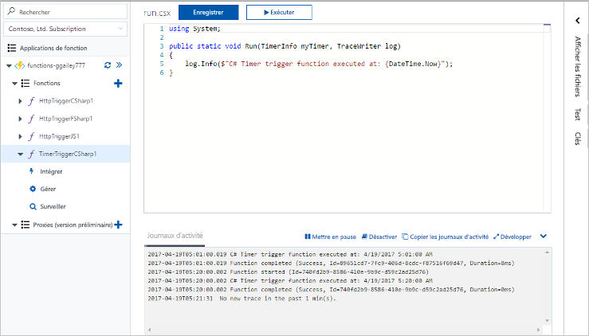
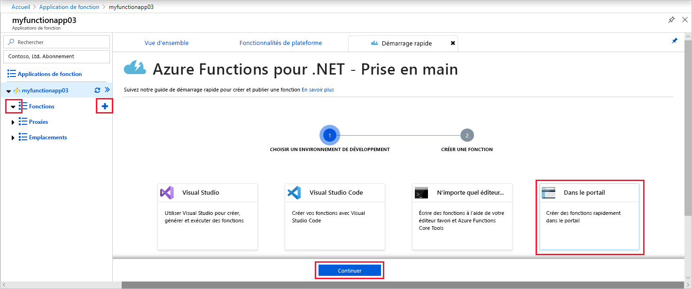
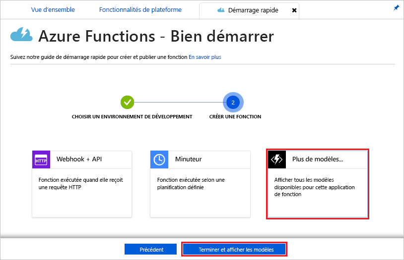
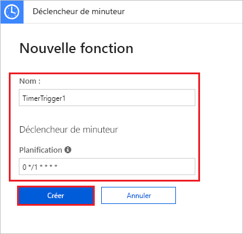
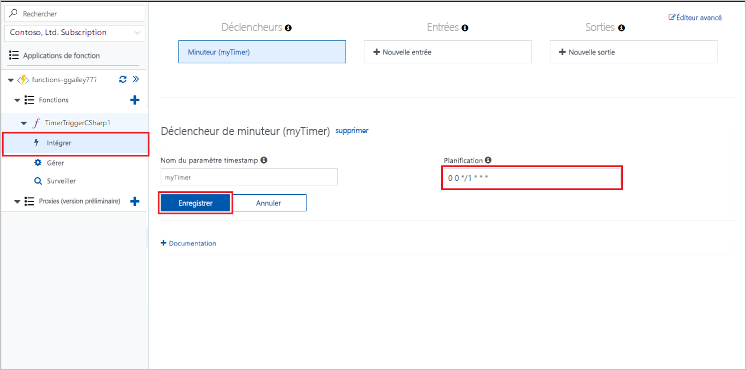

# Créez une fonction dans Azure, qui est déclenchée par un minuteur

Apprenez à utiliser Azure Functions pour créer une fonction [serverless](https://azure.microsoft.com/solutions/serverless/) qui s’exécute selon une planification que vous définissez.

## Conditions préalables requises

Pour suivre ce tutoriel :

+ Si vous n’avez pas d’abonnement Azure, créez un [compte gratuit](https://azure.microsoft.com/free/?WT.mc_id=A261C142F) avant de commencer.

## Création d’une application Azure Function

[!INCLUDE [Create function app Azure portal](../../includes/functions-create-function-app-portal.md)]

Créez ensuite une fonction dans la nouvelle Function App.

## Créer une fonction déclenchée par un minuteur

1. Développez votre Function App, puis cliquez sur le bouton **+** en regard de **Fonctions**. S’il s’agit de la première fonction de votre application de fonction, sélectionnez **Dans le portail**, puis **Continuer**. Sinon, passez à l’étape 3.

   

2. Choisissez **Autres modèles**, puis **Terminer et afficher les modèles**.

    

3. Dans le champ de recherche, tapez `timer`, puis configurez le nouveau déclencheur avec les paramètres spécifié dans le tableau situé sous l’image.

    

    | Paramètre | Valeur suggérée | Description |
    |---|---|---|
    | **Nom** | Default | Définit le nom de votre fonction déclenchée par minuteur. |
    | **Planification** | 0 \*/1 \* \* \* \* | Un champ de six [expressions CRON](functions-bindings-timer.md#ncrontab-expressions) qui planifie l’exécution de votre fonction chaque minute. |

4. Cliquez sur **Créer**. Une fonction est créée dans le langage que vous avez choisi et s’exécute toutes les minutes, à la minute pile.

5. Vérifiez l’exécution en consultant les informations de traçage écrites dans les journaux d’activité.

    

À présent, vous pouvez modifier la planification de la fonction afin qu’elle s’exécute une fois par heure plutôt que toutes les minutes.

## Mise à jour de la planification du minuteur

1. Développez votre fonction et cliquez sur **Intégrer**. Il s’agit de l’endroit où vous définissez les liaisons d’entrée et de sortie pour votre fonction, et où vous configurez la planification. 

2. Entrez une nouvelle valeur horaire de **Planification** de `0 0 */1 * * *`, puis cliquez sur **Enregistrer**.  

Vous disposez maintenant d’une fonction qui s’exécute toutes les heures, à l’heure pile.

## Nettoyer les ressources

[!INCLUDE [Next steps note](../../includes/functions-quickstart-cleanup.md)]

## Étapes suivantes

Vous avez créé une fonction qui s’exécute selon une planification. Pour plus d’informations sur les déclencheurs de minuteur, consultez [Planifier l’exécution de code avec Azure Functions](functions-bindings-timer.md).

[!INCLUDE [Next steps note](../../includes/functions-quickstart-next-steps.md)]
