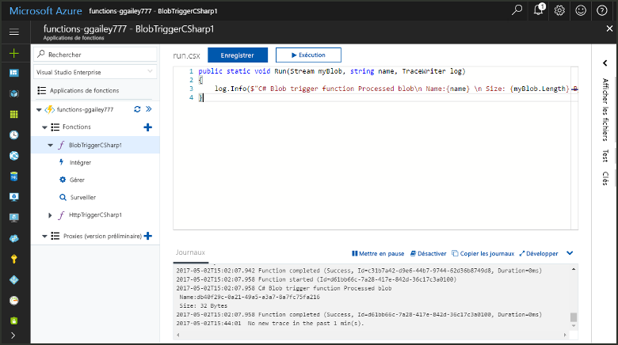
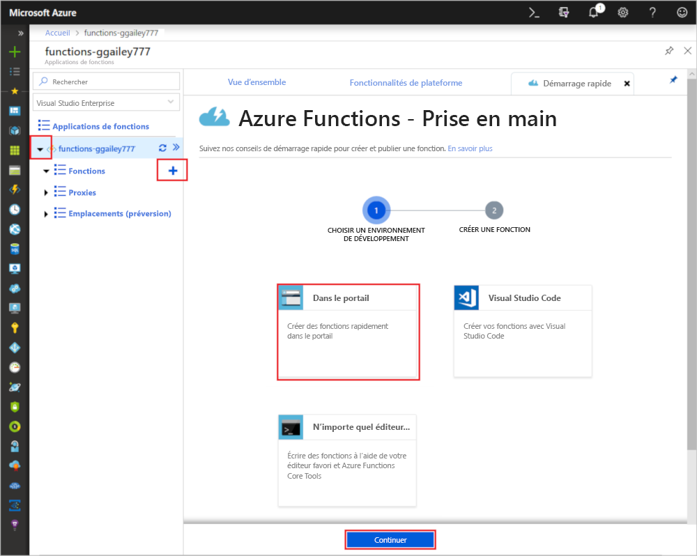
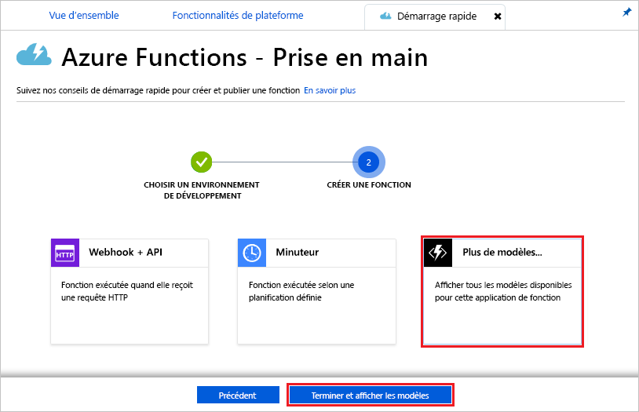
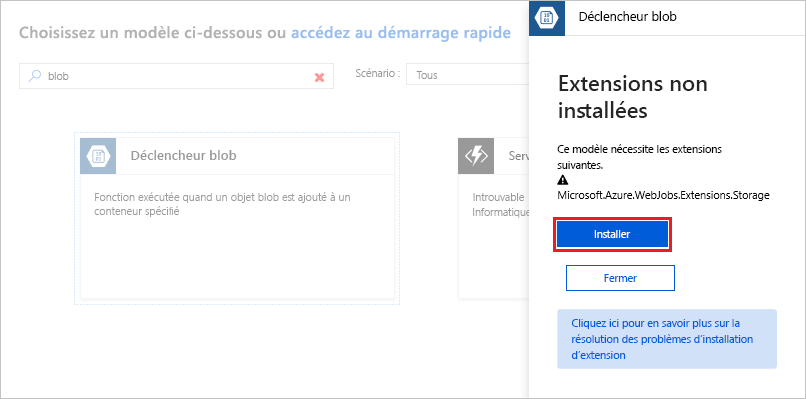
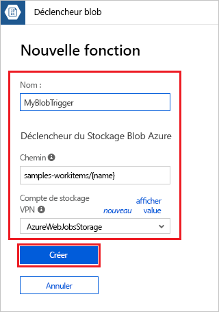
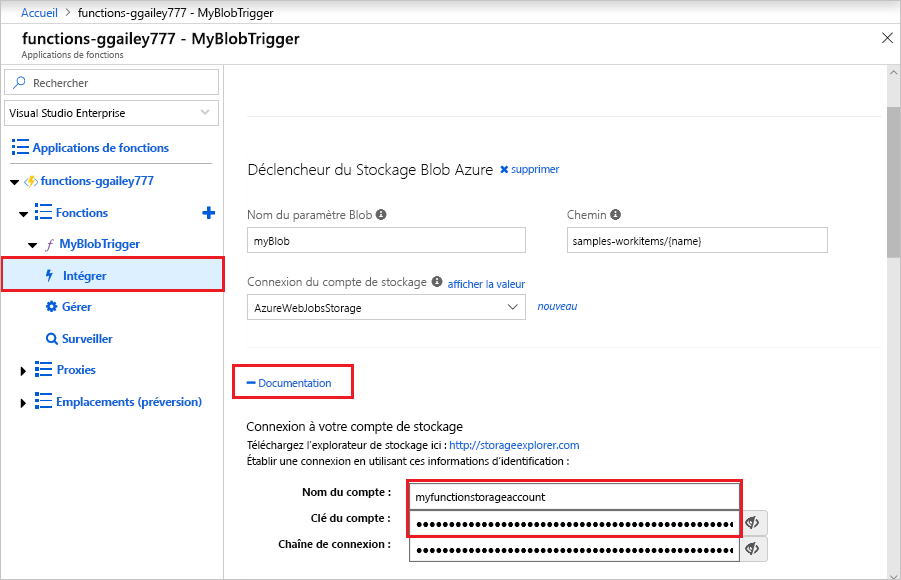
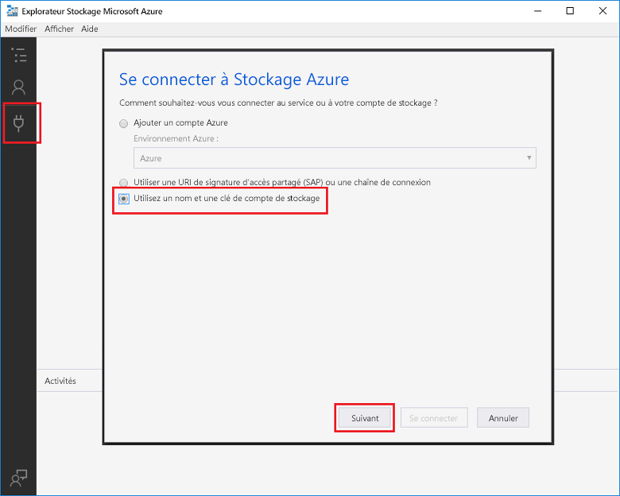
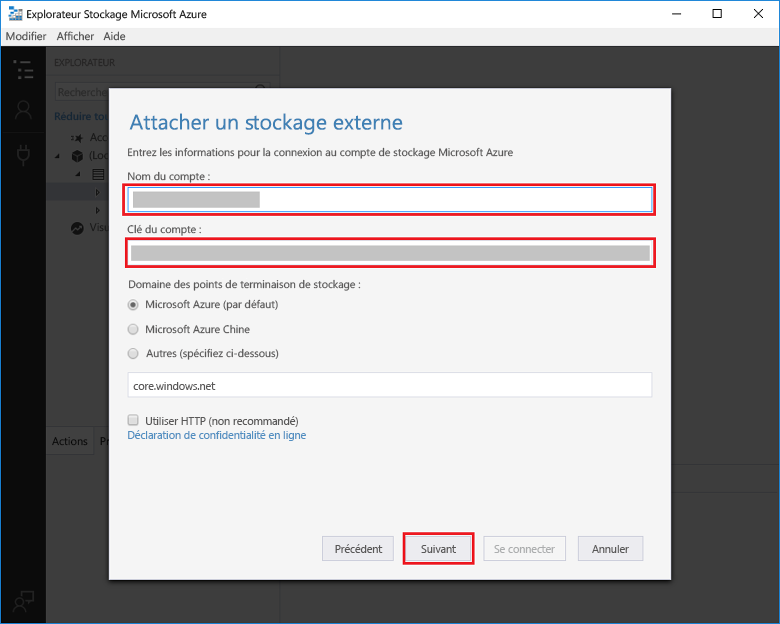
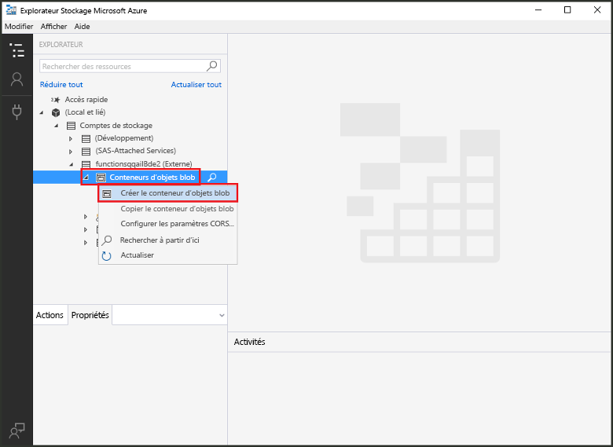
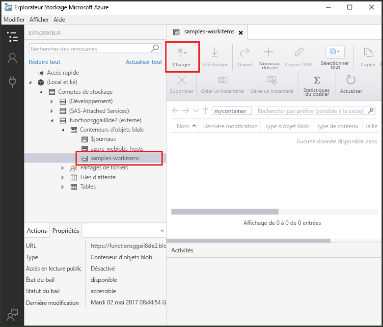

# Créer une fonction déclenchée par un stockage Blob Azure

Apprenez à créer une fonction déclenchée lorsque des fichiers sont chargés dans ou mis à jour dans le stockage Blob Azure.

## Conditions préalables requises

+ Télécharger et installer l’[Explorateur de Stockage Microsoft Azure](https://storageexplorer.com/).
+ Un abonnement Azure. Si vous n’en avez pas, créez un [compte gratuit](https://azure.microsoft.com/free/?WT.mc_id=A261C142F) avant de commencer.

## Création d’une application Azure Function

[!INCLUDE [Create function app Azure portal](../../includes/functions-create-function-app-portal.md)]

Créez ensuite une fonction dans la nouvelle Function App.

## Créer une fonction déclenchée par le stockage Blob

1. Développez votre Function App, puis cliquez sur le bouton **+** en regard de **Fonctions**. S’il s’agit de la première fonction de votre application de fonction, sélectionnez **Dans le portail**, puis **Continuer**. Sinon, passez à l’étape 3.

   

1. Choisissez **Autres modèles**, puis **Terminer et afficher les modèles**.

    

1. Dans le champ Rechercher, tapez `blob`, puis choisissez le modèle **Déclencheur d’objet blob**.

1. Si vous y êtes invité, sélectionnez **Installer** pour installer l’extension Stockage Azure et toutes les dépendances dans l’application de fonction. Une fois l’installation réussie, sélectionnez **Continuer**.

    

1. Utilisez les paramètres spécifiés dans le tableau sous l’image.

    

    | Paramètre | Valeur suggérée | Description |
    |---|---|---|
    | **Nom** | Unique dans votre Function App | Nom de cette fonction déclenchée par l’objet Blob. |
    | **Chemin d’accès**   | samples-workitems/{name}    | Emplacement du stockage Blob analysé. Le nom de fichier de l’objet Blob est transmis dans la liaison en tant que paramètre _name_.  |
    | **Connexion au compte de stockage** | AzureWebJobsStorage | Vous pouvez utiliser la connexion de compte de stockage qui est déjà utilisée par votre application de fonction, ou créez-en une.  |

1. Cliquez sur **Créer** pour créer votre fonction.

Ensuite, vous vous connectez à votre compte Stockage Azure et créez le conteneur **samples-workitems**.

## Créer le conteneur

1. Dans votre fonction, cliquez sur **Intégrer**, développez **Documentation** et copiez le **Nom du compte** et la **Clé du compte**. Vous utilisez ces informations d’identification pour vous connecter au compte de stockage. Si vous avez déjà connecté votre compte de stockage, passez à l’étape 4.

    

1. Exécutez [l’Explorateur de stockage Microsoft Azure](https://storageexplorer.com/), cliquez sur l’icône de connexion située sur la gauche, choisissez **Utiliser un nom et une clé de compte de stockage**, puis cliquez sur **Suivant**.

    

1. Saisissez le **Nom du compte** et la **Clé du compte** récupérés à l’étape 1, puis cliquez sur **Suivant** et sur **Connexion**. 

    

1. Développez le compte de stockage attaché, cliquez avec le bouton droit sur **Conteneurs d’objets blob**, cliquez sur **Créer un conteneur d’objets blob**, tapez `samples-workitems` et appuyez sur Entrée.

    

Une fois que vous avez un conteneur d’objets blob, vous pouvez tester la fonction en chargeant un fichier dans le conteneur.

## Tester la fonction

1. Dans le portail Azure, accédez à votre fonction, développez les **Journaux d’activité** en bas de la page et vérifiez que la diffusion de journaux d’activité n’est pas suspendue.

1. Dans l’Explorateur Stockage, développez votre compte de stockage, **Conteneurs d’objets blob** et **samples-workitems**. Cliquez sur **Charger**, puis sur **Charger des fichiers...** .

    

1. Dans la boîte de dialogue **Charger des fichiers**, cliquez sur le champ **Fichiers**. Accédez à un fichier sur votre ordinateur local, par exemple un fichier image, sélectionnez-le, puis cliquez sur **Ouvrir** et sur **Charger**.

1. Revenez à vos journaux d’activité de fonction et vérifiez que l’objet blob a été lu.

   

    >[!NOTE]
    > Lorsque votre Function App s’exécute dans le plan de consommation par défaut, il peut s’écouler un délai de plusieurs minutes entre l’ajout ou la mise à jour de l’objet blob et le déclenchement de la fonction. Si vous exigez une faible latence pour vos fonctions déclenchées par des objets Blob, exécutez plutôt votre Function App dans un plan App Service.

## Nettoyer les ressources

[!INCLUDE [Next steps note](../../includes/functions-quickstart-cleanup.md)]

## Étapes suivantes

Vous avez créé une fonction qui s’exécute lorsqu’un objet blob est ajouté ou mis à jour dans le stockage Blob. Pour plus d’informations sur les déclencheurs de stockage Blob, consultez [Liaisons de stockage Blob Azure Functions](functions-bindings-storage-blob.md).

[!INCLUDE [Next steps note](../../includes/functions-quickstart-next-steps.md)]
