# Créer une fonction déclenchée par une file d’attente de stockage Azure

Découvrez comment créer une fonction qui est déclenchée lorsque des messages sont envoyés à une file d’attente de stockage Azure.

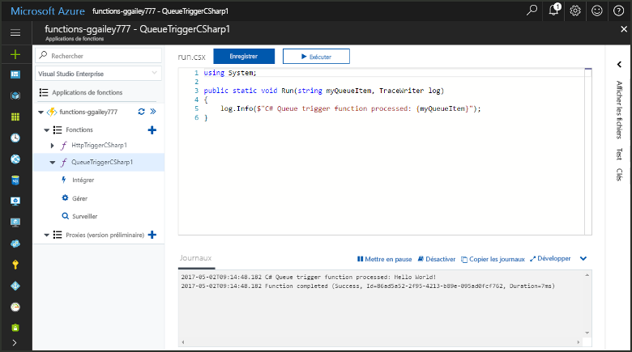

## Conditions préalables requises

- Télécharger et installer l’[Explorateur de Stockage Microsoft Azure](https://storageexplorer.com/).

- Un abonnement Azure. Si vous n’en avez pas, créez un [compte gratuit](https://azure.microsoft.com/free/?WT.mc_id=A261C142F) avant de commencer.

## Création d’une application Azure Function

[!INCLUDE [Create function app Azure portal](../../includes/functions-create-function-app-portal.md)]

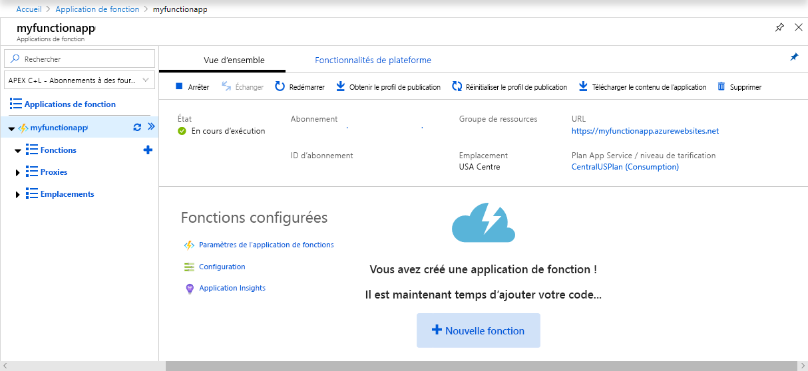

Créez ensuite une fonction dans la nouvelle Function App.

## Créer une fonction déclenchée par une file d’attente

1. Développez votre Function App, puis cliquez sur le bouton **+** en regard de **Fonctions**. S’il s’agit de la première fonction de votre application de fonction, sélectionnez **Dans le portail**, puis **Continuer**. Sinon, passez à l’étape 3.

   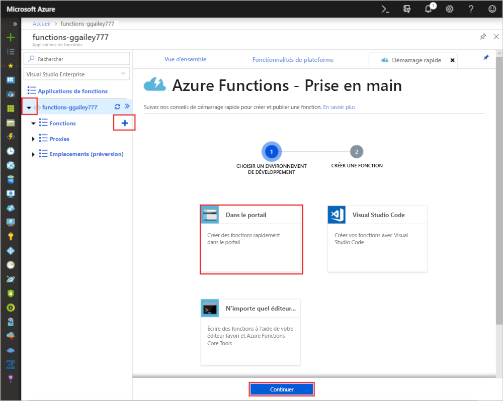

1. Choisissez **Autres modèles**, puis **Terminer et afficher les modèles**.

    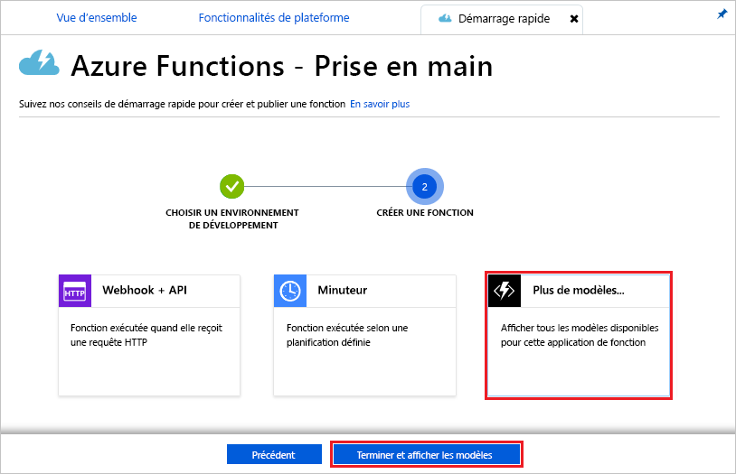

1. Dans le champ Rechercher, tapez `queue`, puis choisissez le modèle **Déclencheur de file d’attente**.

1. Si vous y êtes invité, sélectionnez **Installer** pour installer l’extension Stockage Azure et toutes les dépendances dans l’application de fonction. Une fois l’installation réussie, sélectionnez **Continuer**.

    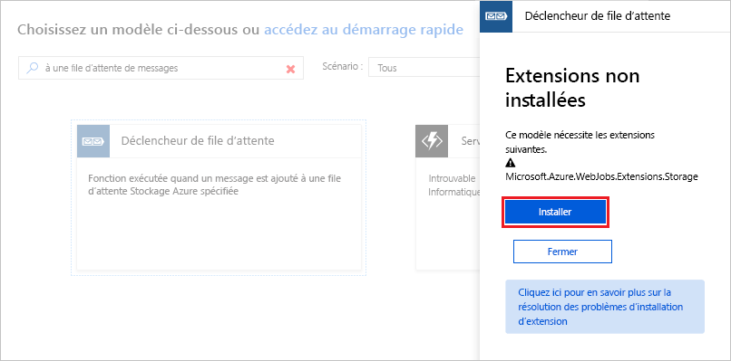

1. Utilisez les paramètres spécifiés dans le tableau sous l’image.

    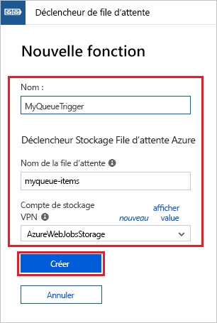

    | Paramètre | Valeur suggérée | Description |
    |---|---|---|
    | **Nom** | Unique dans votre Function App | Nom de cette fonction déclenchée par la file d’attente. |
    | **Nom de la file d’attente**   | éléments myqueue    | Le nom de la file d’attente à connecter à votre compte de stockage. |
    | **Connexion au compte de stockage** | AzureWebJobsStorage | Vous pouvez utiliser la connexion de compte de stockage qui est déjà utilisée par votre application de fonction, ou créez-en une.  |    

1. Cliquez sur **Créer** pour créer votre fonction.

Ensuite, connectez-vous à votre compte de stockage Azure et créez la file d’attente de stockage **myqueue-items**.

## Créer la file d’attente

1. Dans votre fonction, cliquez sur **Intégrer**, développez **Documentation** et copiez le **Nom du compte** et la **Clé du compte**. Vous utilisez ces informations d’identification pour vous connecter au compte de stockage dans l’Explorateur Stockage Azure. Si vous avez déjà connecté votre compte de stockage, passez à l’étape 4.

    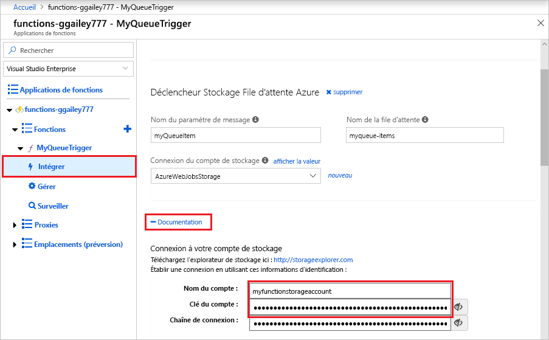

1. Exécutez [l’Explorateur de stockage Microsoft Azure](https://storageexplorer.com/), cliquez sur l’icône de connexion située sur la gauche, choisissez **Utiliser un nom et une clé de compte de stockage**, puis cliquez sur **Suivant**.

    

1. Saisissez le **Nom du compte** et la **Clé du compte** récupérés à l’étape 1, puis cliquez sur **Suivant** et sur **Connexion**.

    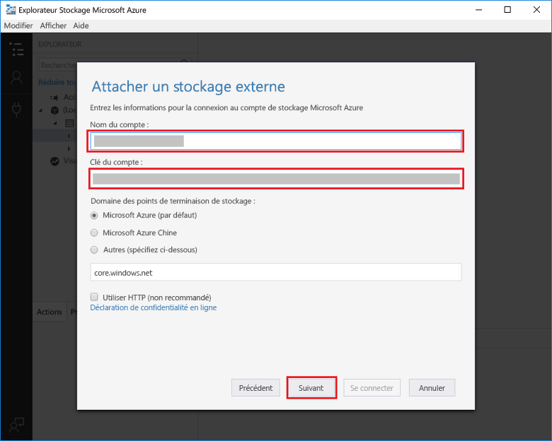

1. Développez le compte de stockage attaché, cliquez avec le bouton droit sur **Files d’attente**, cliquez sur **Créer une file d’attente**, saisissez `myqueue-items` et appuyez sur Entrée.

    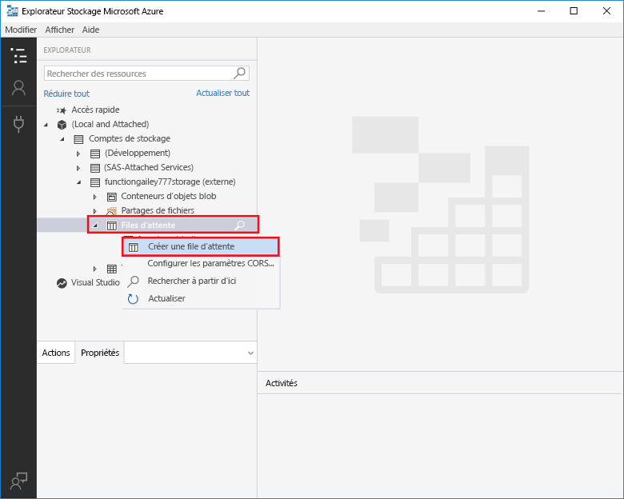

Maintenant que vous disposez d’une file d’attente de stockage, vous pouvez tester la fonction en ajoutant un message à la file d’attente.

## Tester la fonction

1. Dans le portail Azure, accédez à votre fonction, développez les **Journaux d’activité** en bas de la page et vérifiez que la diffusion de journaux d’activité n’est pas suspendue.

1. Dans l’Explorateur Stockage, développez votre compte de stockage, **Files d’attente** et **myqueue-items**, puis cliquez sur **Ajouter un message**.

    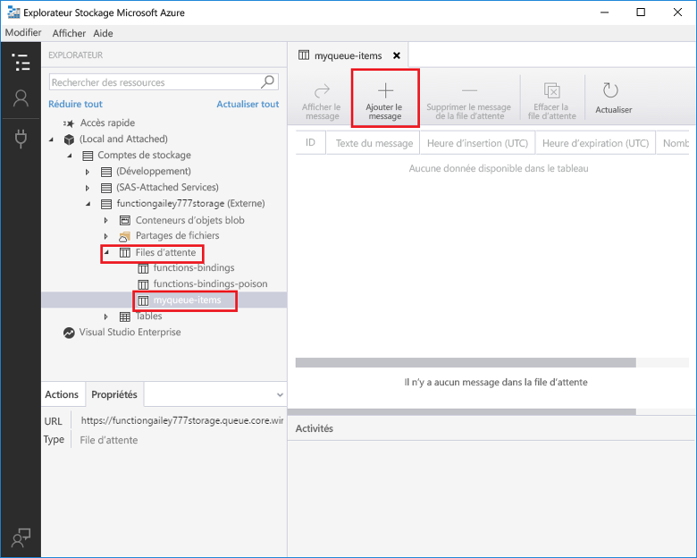

1. Saisissez le message « Hello World ! » dans **Texte du message** et cliquez sur **OK**.

1. Attendez quelques secondes, puis retournez à vos journaux d’activité de fonction et vérifiez que le nouveau message a été lu à partir de la file d’attente.

    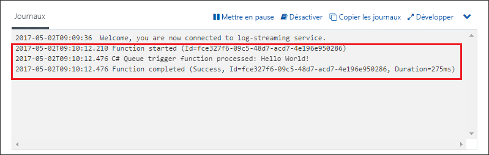

1. Dans l’Explorateur de stockage, cliquez sur **Actualiser** et vérifiez que le message a été traité et qu’il ne se trouve plus dans la file d’attente.

## Nettoyer les ressources

[!INCLUDE [Next steps note](../../includes/functions-quickstart-cleanup.md)]

## Étapes suivantes

Vous avez créé une fonction qui s’exécute lorsqu’un message est ajouté à une file d’attente de stockage. Pour en savoir plus sur les déclencheurs de stockage en file d’attente, consultez la page [Liaisons de file d’attente de stockage Azure Functions](functions-bindings-storage-queue.md).

Maintenant que vous avez créé votre première fonction, nous allons ajouter une liaison de sortie à la fonction qui écrit un message dans une autre file d’attente.

> [!div class="nextstepaction"]
> [Ajouter des messages à une file d’attente de stockage Azure à l’aide de Functions](functions-integrate-storage-queue-output-binding.md)
