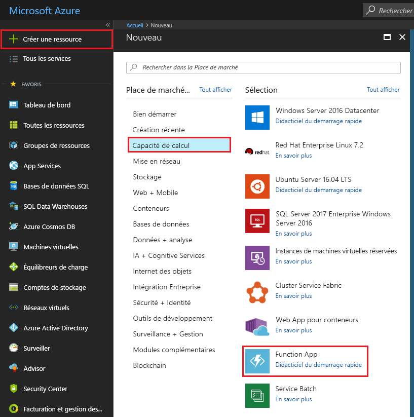
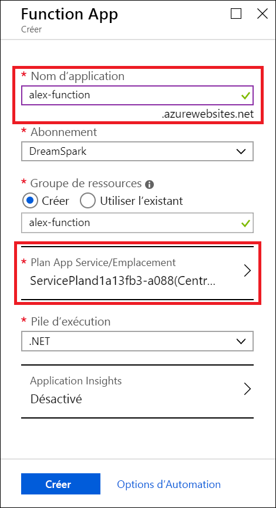
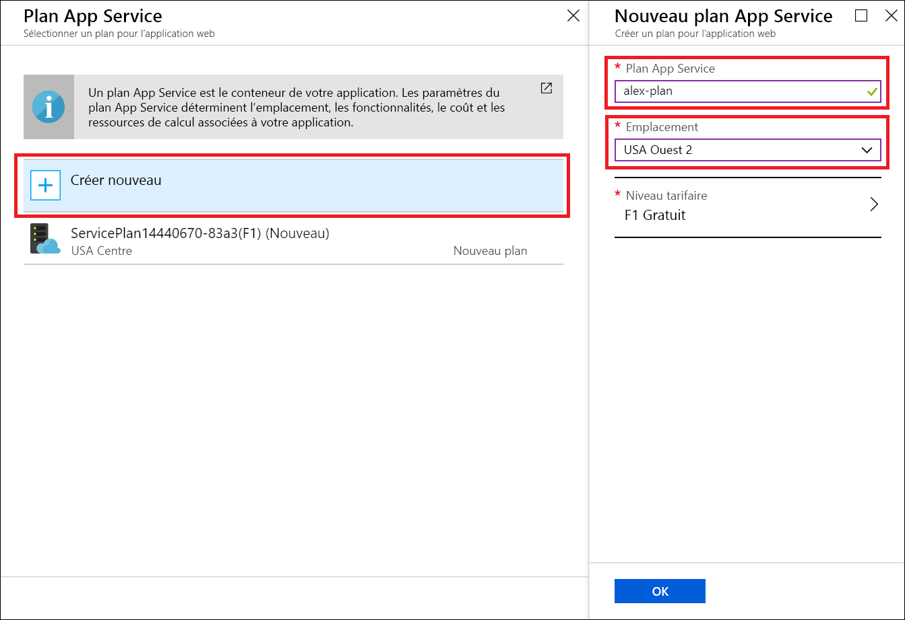
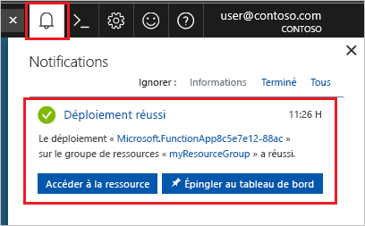
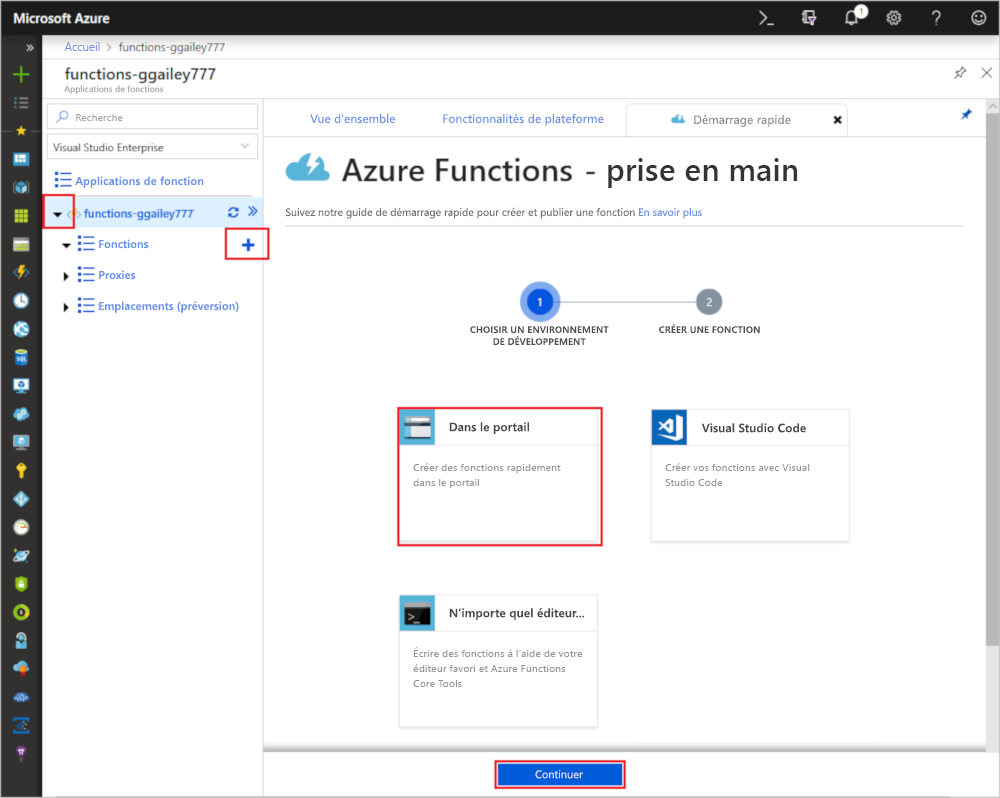

# Créer une fonction à l’aide de Microsoft Azure for Students Starter

Dans ce tutoriel, nous allons créer une fonction HTTP hello world dans un abonnement Microsoft Azure for Students Starter. Nous allons également aborder ce qui est disponible dans Azure Functions dans ce type d’abonnement.

Microsoft *Azure for Students Starter* vous aide gratuitement à bien démarrer avec les produits Azure dont vous avez besoin pour développer dans le cloud. [En savoir plus sur cette offre ici.](https://azure.microsoft.com/offers/ms-azr-0144p/)

Azure Functions vous permet d’exécuter votre code dans un environnement [sans serveur](https://azure.microsoft.com/solutions/serverless/) et sans avoir à créer une machine virtuelle ou à publier une application web au préalable. [En savoir plus sur Azure Functions.](./functions-overview.md)

## Créer une fonction

 Dans cette rubrique, vous allez découvrir comment utiliser Functions pour créer une fonction « hello world » déclenchée par HTTP dans le portail Azure.

## Connexion à Azure

Connectez-vous au portail Azure sur <https://portal.azure.com> avec votre compte Azure.

## Créer une application de fonction

Vous devez disposer d’une Function App pour héberger l’exécution de vos fonctions. Une Function App vous permet de regrouper les fonctions en une unité logique pour faciliter la gestion, le déploiement et le partage des ressources. 

1. Cliquez sur le bouton **Nouveau** en haut à gauche du portail Azure, puis sélectionnez **Calcul** > **Application de fonction**.

    

2. Utilisez les paramètres d’application de fonction comme indiqué dans le tableau sous l’image.

    

    | Paramètre      | Valeur suggérée  | Description                                        |
    | ------------ |  ------- | -------------------------------------------------- |
    | **Nom de l’application** | Nom globalement unique | Nom qui identifie votre nouvelle Function App. Les caractères valides sont `a-z`, `0-9` et `-`.  | 
    | **Abonnement** | Votre abonnement | Abonnement sous lequel est créée cette nouvelle application de fonction. | 
    | **[Groupe de ressources](../azure-resource-manager/resource-group-overview.md)** |  myResourceGroup | Nom du nouveau groupe de ressources dans lequel créer votre Function App. |
   | **[Plan/lieu App Service](./functions-scale.md)** | Nouveau | Le plan d’hébergement qui contrôle la région sur laquelle votre application de fonction est déployée et la densité de vos ressources. Toutes les applications de fonction déployées sur le même plan partagent la même instance gratuite unique. Il s’agit d’une restriction du plan Student Starter. Les options complètes d’hébergement sont [expliquées ici.](./functions-scale.md)|
    | **Pile d’exécution** | Langage préféré | Choisissez un runtime qui prend en charge votre langage de programmation de fonction favori. Choisissez **.NET** pour les fonctions C# et F#. |
    |**[Application Insights](./functions-monitoring.md)**| activé | Application Insights est utilisé pour stocker et analyser les journaux de votre application de fonction. Si vous choisissez un emplacement qui prend en charge Application Insights, il est activé par défaut. Application Insights peuvent être activé pour n’importe quelle fonction, en choisissant manuellement une région proche pour déployer Application Insights. Sans Application Insights, vous serez uniquement en mesure d’afficher les journaux de diffusion en continu en direct.

3. Sélectionnez **Plan/lieu App Service** ci-dessus pour choisir un autre emplacement

4. Sélectionnez **Créer** et donnez un nom unique à votre plan.

5. Sélectionnez l’emplacement le plus proche de vous. [Voir une carte complète des régions Azure ici.](https://azure.microsoft.com/global-infrastructure/regions/) 

    

6. Sélectionnez **Créer** pour configurer et déployer l’application de fonction.

    

7. Cliquez sur l’icône Notification en haut à droite du portail pour voir le message **Le déploiement a été effectué**.

    

8. Sélectionnez **Accéder à la ressource** pour afficher votre nouvelle application de fonction.

Créez ensuite une fonction dans la nouvelle Function App.

## Créer une fonction déclenchée via HTTP

1. Développez votre nouvelle application de fonction, puis sélectionnez le bouton **+** en regard de **Fonctions**, choisissez **Dans le portail** et sélectionnez **Continuer**.

    

1. Choisissez **WebHook + API**, puis sélectionnez **Créer**.

    

Une fonction est créée à l’aide d’un modèle spécifique à une langue pour une fonction déclenchée via HTTP.

Vous pouvez maintenant exécuter la nouvelle fonction en envoyant une requête HTTP.

## Tester la fonction

1. Dans votre nouvelle fonction, cliquez sur **</> Obtenir l’URL de la fonction** en haut à droite, sélectionnez **par défaut (touche de fonction)** , puis cliquez sur **Copier**. 

    

2. Collez l’URL de fonction dans la barre d’adresse de votre navigateur. Ajoutez la valeur de la chaîne de requête `&name=<yourname>` à la fin de cette URL et appuyez sur la touche `Enter` de votre clavier pour exécuter la requête. Vous devez voir la réponse renvoyée par la fonction affichée dans le navigateur.  

    L’exemple suivant montre la réponse dans le navigateur :

    

    L’URL de demande inclut une clé qui est requise, par défaut, pour accéder à votre fonction sur HTTP.

3. Lorsque votre fonction s’exécute, des informations de suivi sont écrites dans les journaux d’activité. Pour afficher la sortie de suivi de l’exécution précédente, revenez à votre fonction dans le portail et cliquez sur la flèche figurant en bas de l’écran pour développer **Journaux d’activité**.

   

## Supprimer des ressources

[!INCLUDE [Clean-up resources](../../includes/functions-quickstart-cleanup.md)]

## Fonctionnalités prises en charge dans Microsoft Azure for Students Starter

Dans Azure for Students Starter, vous avez accès à la plupart des fonctionnalités du runtime Azure Functions, avec plusieurs limitations clés répertoriées ci-dessous :

* Le déclencheur HTTP est le seul type de déclencheur pris en charge.
    * Toutes les liaisons d’entrée et de sortie sont prises en charge ! [La liste complète est disponible ici.](functions-triggers-bindings.md)
* Langues prises en charge : 
    * C# (.NET Core 2)
    * Javascript (Node.js 8 et 10)
    * F# (.NET Core 2)
    * [Découvrez les langues prises en charge dans les autres plans ici](supported-languages.md)
* Windows est le seul système d’exploitation pris en charge.
* La mise à l’échelle est limitée à [une seule instance de niveau gratuit](https://azure.microsoft.com/pricing/details/app-service/windows/) 60 minutes par jour au maximum. Vous serez passerez de 0 à 1 instance automatiquement lorsque le trafic HTTP arrive, mais pas au-delà.
* Seules les [versions 2.x et ultérieures](functions-versions.md) du runtime Functions sont prises en charge.
* Tous les outils de développement sont pris en charge pour les fonctions d’édition et de publication. Ceci comprend VS Code, Visual Studio, l’interface Azure CLI et le portail Azure. Si vous souhaitez utiliser autre chose que le portail, vous devez tout d’abord créer une application dans le portail, puis choisir cette application comme une cible de déploiement dans votre outil préféré.

## Étapes suivantes

Vous avez créé une application de fonction avec une simple fonction déclenchée via HTTP. Vous pouvez maintenant explorer les outils locaux, plus de langages, la surveillance et les intégrations.

 * [Créer votre première fonction à l’aide de Visual Studio](./functions-create-your-first-function-visual-studio.md)
 * [Créer votre première fonction à l’aide de Visual Studio Code](./functions-create-first-function-vs-code.md)
 * [Guide des développeurs JavaScript sur Azure Functions](./functions-reference-node.md)
 * [Utiliser Azure Functions pour se connecter à une base de données Azure SQL Database](./functions-scenario-database-table-cleanup.md)
 * [Apprenez-en plus sur Azure Functions](./functions-bindings-http-webhook.md).
 * [Surveiller l’exécution d’Azure Functions](./functions-monitoring.md)
