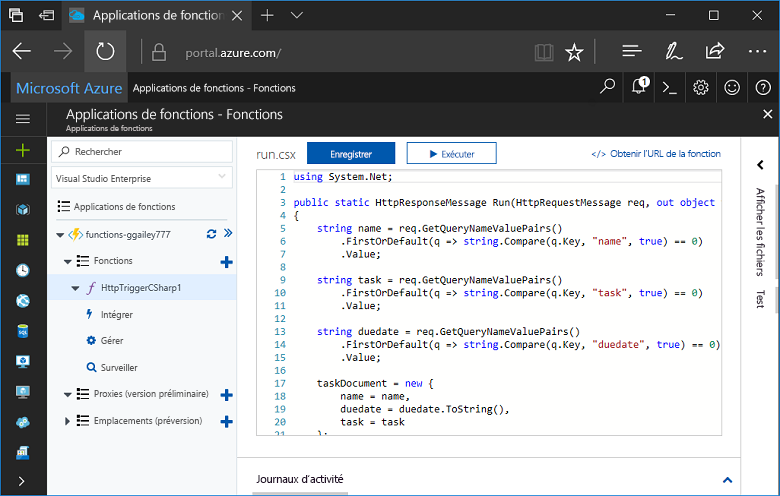
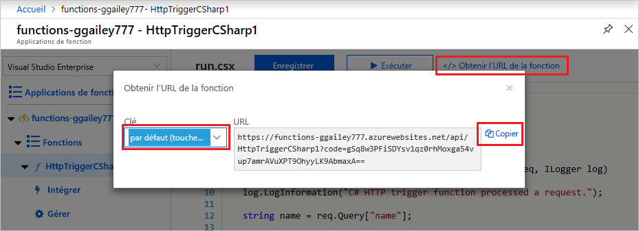
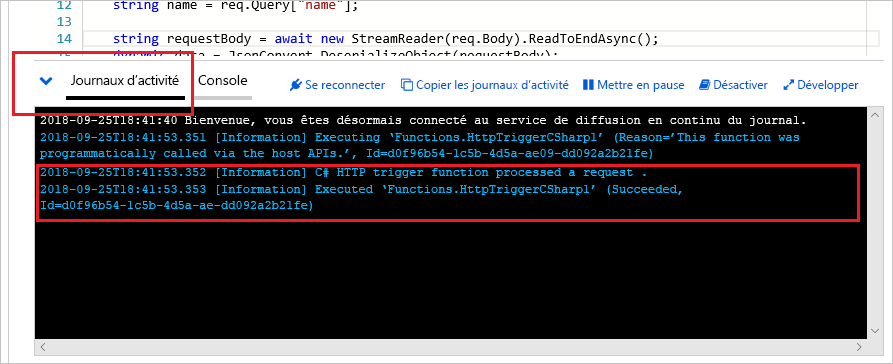

# Créer une fonction à l’aide d’Azure for Students Starter

Dans ce tutoriel, nous allons créer une fonction HTTP « hello world » dans un abonnement Azure for Students Starter. Nous allons également aborder ce qui est disponible dans Azure Functions dans ce type d’abonnement.

Microsoft *Azure for Students Starter* vous aide gratuitement à bien démarrer avec les produits Azure dont vous avez besoin pour développer dans le cloud. [En savoir plus sur cette offre ici.](https://azure.microsoft.com/offers/ms-azr-0144p/)

Azure Functions vous permet d’exécuter votre code dans un environnement [sans serveur](https://azure.microsoft.com/solutions/serverless/) et sans avoir à créer une machine virtuelle ou à publier une application web au préalable. [En savoir plus sur Azure Functions.](./functions-overview.md)

[!INCLUDE [quickstarts-free-trial-note](../../includes/quickstarts-free-trial-note.md)]

## Créer une fonction

 Dans cet article, vous allez découvrir comment utiliser Azure Functions pour créer une fonction de déclencheur via HTTP, « Hello world », dans le portail Azure.

## Connexion à Azure

Connectez-vous au [portail Azure](https://portal.azure.com) avec votre compte Azure.

## Créer une application de fonction

Vous devez disposer d’une Function App pour héberger l’exécution de vos fonctions. Une application de fonctions vous permet de regrouper des fonctions en une unité logique pour faciliter la gestion, le déploiement et le partage des ressources.

[!INCLUDE [Create function app Azure portal](../../includes/functions-create-function-app-portal.md)]

Créez ensuite une fonction dans la nouvelle Function App.

## Créer une fonction de déclencheur HTTP

1. Dans le menu de gauche de la fenêtre **Fonctions**, sélectionnez **Fonctions**, puis **Ajouter** dans le menu supérieur. 
 
1. Dans la fenêtre **Nouvelle fonction**, sélectionnez **Déclencheur http**.

    

1. Dans la fenêtre **Nouvelle fonction**, acceptez le nom par défaut pour la **Nouvelle fonction** ou entrez un nouveau nom. 

1. Choisissez **Anonyme** dans la liste déroulante **Niveau d’autorisation**, puis sélectionnez **Créer une fonction**.

    Azure crée la fonction de déclencheur HTTP. Vous pouvez maintenant exécuter la nouvelle fonction en envoyant une requête HTTP.

## Tester la fonction

1. Dans votre nouvelle fonction de déclencheur HTTP, sélectionnez **Code + test** dans le menu de gauche, puis sélectionnez **Obtenir l’URL de la fonction** dans le menu supérieur.

    

1. Dans la boîte de dialogue **Obtenir l’URL de la fonction**, sélectionnez **Par défaut** dans la liste déroulante, puis choisissez l’icône **Copier dans le Presse-papiers.** . 

    

1. Collez l’URL de fonction dans la barre d’adresse de votre navigateur. Ajoutez la valeur de la chaîne de requête `?name=<your_name>` à la fin de cette URL, puis appuyez sur la touche Entrée pour exécuter la requête. 

    L’exemple suivant montre la réponse dans le navigateur :

    

    L’URL de demande inclut une clé qui est requise, par défaut, pour accéder à votre fonction sur HTTP.

1. Lorsque votre fonction s’exécute, des informations de suivi sont écrites dans les journaux d’activité. Pour afficher la sortie de suivi, revenez à la page **Code + test** dans le portail, puis développez la flèche **Journaux** en bas de la page.

   

## Nettoyer les ressources

[!INCLUDE [Clean-up resources](../../includes/functions-quickstart-cleanup.md)]

## Fonctionnalités prises en charge dans Azure for Students Starter

Dans Azure for Students Starter, vous avez accès à la plupart des fonctionnalités du runtime Azure Functions, avec plusieurs limitations importantes décrites ci-dessous :

* Le déclencheur HTTP est le seul type de déclencheur pris en charge.
    * Toutes les liaisons d’entrée et de sortie sont prises en charge ! [La liste complète est disponible ici.](functions-triggers-bindings.md)
* Langues prises en charge : 
    * C# (.NET Core 2)
    * JavaScript (Node.js 8 et 10)
    * F# (.NET Core 2)
    * [Découvrez les langues prises en charge dans les autres plans ici](supported-languages.md)
* Windows est le seul système d’exploitation pris en charge.
* La mise à l’échelle est limitée à [une seule instance de niveau gratuit](https://azure.microsoft.com/pricing/details/app-service/windows/) 60 minutes par jour au maximum. Vous passez de 0 à 1 instance automatiquement lorsque le trafic HTTP arrive, mais pas au-delà.
* Seules les [versions 2.x et ultérieures](functions-versions.md) du runtime Functions sont prises en charge.
* Tous les outils de développement sont pris en charge pour les fonctions d’édition et de publication. Ceci comprend VS Code, Visual Studio, l’interface Azure CLI et le portail Azure. Si vous souhaitez utiliser autre chose que le portail, vous devez tout d’abord créer une application dans le portail, puis choisir cette application comme une cible de déploiement dans votre outil préféré.

## Étapes suivantes

Vous avez créé une application de fonction avec une simple fonction de déclencheur HTTP. Vous pouvez maintenant explorer les outils locaux, plus de langages, la surveillance et les intégrations.

 * [Créer votre première fonction à l’aide de Visual Studio](./functions-create-your-first-function-visual-studio.md)
 * [Créer votre première fonction à l’aide de Visual Studio Code](./functions-create-first-function-vs-code.md)
 * [Guide des développeurs JavaScript sur Azure Functions](./functions-reference-node.md)
 * [Utiliser Azure Functions pour se connecter à une base de données Azure SQL Database](./functions-scenario-database-table-cleanup.md)
 * [Apprenez-en plus sur Azure Functions](./functions-bindings-http-webhook.md).
 * [Surveiller l’exécution d’Azure Functions](./functions-monitoring.md)
