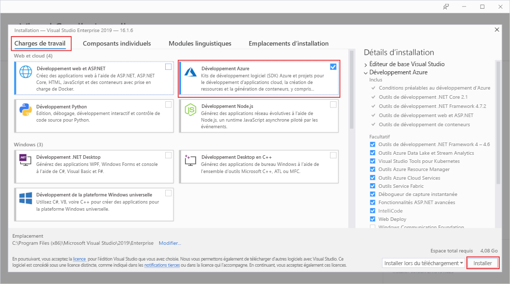

# Démarrage rapide : Créer votre première fonction dans Azure à l’aide de Visual Studio

Dans cet article, vous utilisez Visual Studio pour créer une fonction basée sur une bibliothèque de classes C# qui répond aux demandes HTTP. Après avoir testé le code localement, vous le déployez dans l’environnement <abbr title="Environnement informatique de runtime dans lequel tous les détails du serveur sont transparents pour les développeurs d’applications, ce qui simplifie le processus de déploiement et de gestion du code.">serverless</abbr> d’ <abbr title="Service Azure qui fournit un environnement informatique serverless à faible coût pour les applications.">Azure Functions</abbr>.

Le suivi de ce guide de démarrage rapide génère une dépense de quelques cents USD tout au plus dans votre <abbr title="Profil qui gère les informations de facturation pour l’utilisation d’Azure.">Compte Azure</abbr>.

## 1. Préparation de votre environnement

+ Créez un <abbr title="Profil qui gère les informations de facturation pour l’utilisation d’Azure.">compte Azure</abbr> avec un <abbr title="Structure organisationnelle de base dans laquelle vous gérez les ressources dans Azure, généralement associée à une personne ou à un service au sein d’une organisation.">abonnement</abbr>actif. [Créez un compte gratuitement](https://azure.microsoft.com/free/?ref=microsoft.com&utm_source=microsoft.com&utm_medium=docs&utm_campaign=visualstudio).

+ Installez [Visual Studio 2019](https://azure.microsoft.com/downloads/) et sélectionnez la charge de travail **Développement Azure** lors de l’installation. 

 

<strong>Utilisez plutôt un projet Azure Functions</strong>

Si vous souhaitez créer un <abbr title="Conteneur logique pour une ou plusieurs fonctions individuelles qui peuvent être déployées et gérées ensemble.">projet Azure Functions</abbr> en utilisant Visual Studio 2017 à la place, vous devez d’abord installer les [derniers outils Azure Functions](functions-develop-vs.md#check-your-tools-version).

## 2. Créer un projet d’application de fonction

1. Dans le menu de Visual Studio, sélectionnez **Fichier** > **Nouveau** > **Projet**.

1. Dans **Créer un projet**, entrez *functions* dans la zone de recherche, choisissez le modèle **Azure Functions**, puis sélectionnez  **Suivant**.

1. Dans **Configurer votre nouveau projet**, entrez un **<abbr title="Le nom d’application de la fonction doit être valide en tant qu’espace de noms C#, afin de ne pas utiliser des traits d’union, des traits de soulignement ou d’autres caractères non alphanumériques.">Nom du projet</abbr>** pour votre projet, puis sélectionnez **Créer**. 

1. Fournissez les informations suivantes pour les paramètres **Créer une nouvelle application Azure Functions** :

    + Sélectionnez **<abbr title=" Cette valeur crée un projet de fonction qui utilise la version 3.x du runtime Azure Functions, qui prend en charge .NET Core 3.x. La version 1.x d’Azure Functions prend en charge le .NET Framework.">Azure Functions v3 (.NET Core)</abbr>** à partir de la liste déroulante de runtimes de Functions. (Pour plus d’informations, consultez [Vue d’ensemble des versions de runtime Azure Functions](functions-versions.md).)
    
    + Sélectionnez **<abbr title="Cette valeur crée une fonction déclenchée par une requête HTTP.">Déclencheur HTTP</abbr>** comme modèle de fonction.
    
    + Sélectionnez **<abbr title="Étant donné qu’une fonction Azure nécessite un compte de stockage, celui-ci est attribué ou créé quand vous publiez votre projet sur Azure. Un déclencheur HTTP n’utilise pas de chaîne de connexion de compte Stockage Azure ; tous les autres types de déclencheurs nécessitent une chaîne de connexion de compte Stockage Azure valide.">Émulateur de stockage</abbr>** à partir de la liste déroulante des comptes de stockage.
        
    + Sélectionnez **Anonyme** dans la liste déroulante <abbr title="La fonction créée peut être déclenchée par n’importe quel client sans fournir une clé. Ce paramètre d’autorisation facilite le test de votre nouvelle fonction.">Niveau d’autorisation</abbr> . (Pour plus d’informations sur les clés et autorisations, consultez [Clés d’autorisation](functions-bindings-http-webhook-trigger.md#authorization-keys) et [Liaisons HTTP et webhook](functions-bindings-http-webhook.md).)

    + Sélectionnez **Créer**
        
## 3. Renommer la fonction

L’attribut de méthode `FunctionName` définit le nom de la fonction qui, par défaut, est `Function1`. Comme les outils ne vous permettent pas de remplacer le nom de fonction par défaut quand vous créez votre projet, prenez une minute pour créer un nom plus approprié pour la classe de fonction, le fichier et les métadonnées.

1. Dans l’**Explorateur de fichiers**, cliquez avec le bouton droit sur le fichier Function1.cs et renommez-le *HttpExample.cs*.

1. Dans le code, renommez la classe Function1 en « HttpExample ».

1. Dans la méthode `HttpTrigger` nommée `Run`, renommez l’attribut de méthode `FunctionName` en `HttpExample`.

## 4. Exécuter la fonction localement

1. Pour exécuter votre fonction, appuyez sur <kbd>F5</kbd> dans Visual Studio.

1. Copiez l’URL de votre fonction à partir de la sortie runtime Azure Functions.

    

1. Collez l’URL de la demande HTTP dans la barre d’adresses de votre navigateur. Ajoutez la chaîne de requête **?name=<YOUR_NAME>** à cette URL et exécutez la demande. 

    

1. Pour arrêter le débogage, appuyez sur <kbd>Maj</kbd>+<kbd>F5</kbd> dans Visual Studio.

 

<strong>Dépannage</strong>

 Vous devez peut-être activer une exception de pare-feu afin de permettre aux outils de prendre en charge les requêtes HTTP. Les niveaux d’autorisation ne sont jamais appliqués quand vous exécutez une fonction localement.

## 5. Publication du projet sur Azure

1. Dans **l’Explorateur de solutions**, cliquez avec le bouton droit sur le projet, puis sélectionnez **Publier**.

1. Dans **Cible**, sélectionnez **Azure**

    :::image type="content" source="../../includes/media/functions-vstools-publish/functions-visual-studio-publish-profile-step-1.png" alt-text="Sélectionner la cible Azure":::

1. Dans **Cible spécifique**, sélectionnez **Application de fonction Azure (Windows)**

    :::image type="content" source="../../includes/media/functions-vstools-publish/functions-visual-studio-publish-profile-step-2.png" alt-text="Sélectionner une application de fonction Azure":::

1. Dans **Instance de fonction**, sélectionnez **Créer une instance d’Azure Functions...** , puis utilisez les valeurs spécifiées ci-après :

    + Pour **Nom**, fournissez un <abbr title="Utilisez un nom qui identifie de façon unique votre nouvelle application de fonction. Acceptez ce nom ou entrez un nouveau nom. Les caractères valides sont `a-z`, `0-9` et `-`.">nom global unique</abbr>
    
    + **Sélectionnez** un abonnement dans la liste déroulante.
    
    + **Sélectionnez** un <abbr title="Conteneur logique pour des ressources Azure associées que vous pouvez gérer en tant qu’unité.">groupe de ressources</abbr> existant dans la liste déroulante ou choisissez **Nouveau** pour créer un nouveau groupe de ressources.
    
    + **Select** <abbr title="Quand vous publiez votre projet dans une application de fonction qui s’exécute dans un Plan Consommation, vous payez uniquement pour les exécutions de votre application de fonction. D’autres plans d’hébergement occasionnent des coûts plus élevés.">Consommation</abbr> dans la liste déroulante Type de lecture. (Pour plus d’informations, consultez [Plan de consommation](consumption-plan.md).)
    
    + **Sélectionnez** un  <abbr title="Référence géographique à un centre de donnée Azure spécifique dans lequel les ressources sont allouées. Pour obtenir la liste des régions disponibles, consultez [régions](https://azure.microsoft.com/regions/).">emplacement</abbr> dans la liste déroulante.
    
    + **Sélectionnez** un <abbr="Le runtime Functions exige un compte de Stockage Azure. Sélectionnez Nouveau pour configurer un compte de stockage universel. Vous pouvez également choisir un compte existant qui répond aux exigences de compte de stockage.">compte de Stockage Azure</abbr> dans la liste déroulante

    

1. Sélectionnez **Créer** 

1. Dans **Instance de fonction**, assurez-vous que **Exécuter à partir du fichier de package** est coché. 

    :::image type="content" source="../../includes/media/functions-vstools-publish/functions-visual-studio-publish-profile-step-4.png" alt-text="Terminer la création du profil":::

     
    

    
<strong>Que fait ce paramètre ?</strong>

    Lorsque vous utilisez **Exécuter à partir d’un fichier de package**, votre application de fonction est déployée en utilisant [Zip Deploy](functions-deployment-technologies.md#zip-deploy) avec le mode [Exécuter à partir du package](run-functions-from-deployment-package.md) activé. Il s’agit de la méthode de déploiement recommandée pour votre projet fonctions, car elle offre de meilleures performances.    
    
   

1. Sélectionnez **Terminer**.

1. Dans la page Publier, sélectionnez **Publier**.

1. Dans la page Publier, examinez l’URL racine de l’application de fonction.

1. Sous l’onglet Publier, choisissez **Gérer dans <abbr title="Cloud Explorer vous permet d’utiliser Visual Studio pour afficher le contenu du site, démarrer et arrêter l’application de fonction, et accéder directement aux ressources de l’application de fonction sur Azure et dans le portail Azure.">Cloud Explorer</abbr>** .
    
    :::image type="content" source="../../includes/media/functions-vstools-publish/functions-visual-studio-publish-complete.png" alt-text="Publier un message de réussite":::
    

## 6. Tester votre fonction dans Azure

1. Dans Cloud Explorer, votre nouvelle application de fonction doit être sélectionnée. Si ce n’est pas le cas, développez votre abonnement, développez **App Services** et sélectionnez votre nouvelle application de fonction.

1. Cliquez avec le bouton droit sur l’application de fonction et choisissez **Ouvrir dans le navigateur**. Cela ouvre la racine de votre application de fonction dans votre navigateur web par défaut et affiche la page qui indique que votre application de fonction est en cours d’exécution. 

    :::image type="content" source="media/functions-create-your-first-function-visual-studio/function-app-running-azure.png" alt-text="Application de fonction en cours d’exécution":::

1. Dans la barre d’adresses du navigateur, ajoutez la chaîne **/api/HttpExample?name=Functions** à l’URL de base et exécutez la demande.

    L’URL qui appelle la fonction à déclencheur HTTP est au format suivant :

    `http://<APP_NAME>.azurewebsites.net/api/HttpExample?name=Functions`

2. Accédez à cette URL pour voir dans le navigateur une réponse à la demande GET distante retournée par la fonction, qui ressemble à l’exemple suivant :

    :::image type="content" source="media/functions-create-your-first-function-visual-studio/functions-create-your-first-function-visual-studio-browser-azure.png" alt-text="Réponse de la fonction dans le navigateur":::

## 7. Nettoyer les ressources

Supprimez l’application de fonction et ses ressources afin d’éviter des coûts supplémentaires.

1. Dans Cloud Explorer, développez votre abonnement, développez **App Services**, cliquez avec le bouton droit sur votre application de fonction et choisissez **Ouvrir dans le portail**. 

1. Dans la page de l’application de fonction, sélectionnez l’onglet **Vue d’ensemble**, puis le lien sous **Groupe de ressources**.

   :::image type="content" source="media/functions-create-your-first-function-visual-studio/functions-app-delete-resource-group.png" alt-text="Sélectionner le groupe de ressources à supprimer dans la page de l’application de fonction":::

1. Dans la page **Groupe de ressources**, passez en revue la liste des ressources incluses et vérifiez qu’elles correspondent à celles que vous souhaitez supprimer.
 
1. Sélectionnez **Supprimer le groupe de ressources** et suivez les instructions.

    Cette opération peut prendre quelques minutes. Une fois terminée, une notification s’affiche pendant quelques secondes. Vous pouvez également sélectionner l’icône représentant une cloche en haut de la page pour afficher la notification.

## Étapes suivantes

Passez à l’article suivant pour savoir comment ajouter une <abbr title="Moyen d’associer une fonction à une file d’attente de stockage, afin qu’elle puisse créer des messages dans la file d’attente. Les liaisons sont des connexions déclaratives entre une fonction et d’autres ressources. Une liaison d’entrée fournit des données à la fonction ; une liaison de sortie fournit des données de la fonction à d’autres ressources.">liaison de sortie de file d’attente Azure Storage</abbr> à votre fonction :

> [!div class="nextstepaction"]
> [Ajouter une liaison de file d’attente Stockage Azure à votre fonction](functions-add-output-binding-storage-queue-vs.md)
