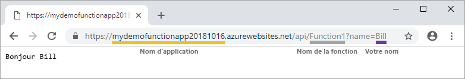

# Démarrage rapide : Créer votre première fonction dans Azure à l’aide de Visual Studio

Azure Functions vous permet d’exécuter votre code dans un environnement serverless, et sans avoir à créer une machine virtuelle ou à publier une application web au préalable.

Dans ce guide de démarrage rapide, vous allez découvrir comment utiliser Visual Studio 2019 pour créer et tester en local une application de fonction C# déclenchée par HTTP, « Hello world », avant de la publier sur Azure. 

Ce guide de démarrage rapide est conçu pour Visual Studio 2019. 

## Prérequis

Pour suivre ce tutoriel, commencez par installer [Visual Studio 2019](https://azure.microsoft.com/downloads/). Assurez-vous de sélectionner la charge de travail **Développement Azure** lors de l’installation. Si vous préférez créer un projet Azure Functions avec Visual Studio 2017, vous devez commencer par installer les tout [derniers outils Azure Functions](functions-develop-vs.md#check-your-tools-version).

[!INCLUDE [quickstarts-free-trial-note](../../includes/quickstarts-free-trial-note.md)]

## Créer un projet d’application de fonction

[!INCLUDE [Create a project using the Azure Functions template](../../includes/functions-vstools-create.md)]

Visual Studio crée un projet et une classe qui contient un code réutilisable pour le type de fonction de déclencheur HTTP. L’attribut de méthode `FunctionName` définit le nom de la fonction qui, par défaut, est `Function1`. L’attribut `HttpTrigger` spécifie que l’exécution de la fonction est déclenchée par une requête HTTP. Le code réutilisable envoie une réponse HTTP qui inclut une valeur de la chaîne de requête ou du corps de requête.

Étendez les capacités de votre fonction à l’aide de liaisons d’entrée et de sortie en appliquant les attributs appropriés à la méthode. Pour plus d’informations, voir la section [Déclencheurs et liaisons](functions-dotnet-class-library.md#triggers-and-bindings) de l’article [Informations de référence pour les développeurs C# sur Azure Functions](functions-dotnet-class-library.md).

Maintenant que vous avez créé un projet de fonction et une fonction déclenchée via HTTP, vous pouvez la tester sur votre ordinateur local.

## Exécuter la fonction localement

Visual Studio s’intègre à Azure Functions Core Tools pour vous permettre de tester vos fonctions en local avec le runtime Azure Functions complet.  

[!INCLUDE [functions-run-function-test-local-vs](../../includes/functions-run-function-test-local-vs.md)]

Après avoir vérifié que la fonction s’exécute correctement sur votre ordinateur local, il est temps de publier le projet sur Azure.

## Publication du projet sur Azure

Avant de pouvoir publier votre projet, vous devez disposer d’une application de fonction dans votre abonnement Azure. La publication Visual Studio crée une application de fonction pour vous la première fois que vous publiez votre projet.

[!INCLUDE [Publish the project to Azure](../../includes/functions-vstools-publish.md)]

## Tester votre fonction dans Azure

1. Copiez l’URL de base de l’application de fonction à partir de la page de profil **Publier**. Remplacez la partie `localhost:port` de l’URL que vous avez utilisée pour tester en local la fonction par la nouvelle URL de base. Ajoutez la chaîne de requête `?name=<YOUR_NAME>` à cette URL et exécutez la demande.

    L’URL qui appelle la fonction déclenchée via HTTP est au format suivant :

    `http://<APP_NAME>.azurewebsites.net/api/<FUNCTION_NAME>?name=<YOUR_NAME>`

2. Collez cette nouvelle URL de requête HTTP dans la barre d’adresse de votre navigateur. L’image suivante montre dans le navigateur la requête retournée par la fonction suite à la demande distante GET :

    

## Nettoyer les ressources

[!INCLUDE [Clean-up resources](../../includes/functions-quickstart-cleanup.md)]

## Étapes suivantes

Dans ce guide de démarrage rapide, vous avez utilisé Visual Studio pour créer et publier une application de fonction C# dans Azure à l’aide d’une simple fonction déclenchée via HTTP. 

Passez à l’article suivant pour savoir comment ajouter une liaison de file d’attente de stockage Azure à votre fonction :
> [!div class="nextstepaction"]
> [Ajouter une liaison de file d’attente Stockage Azure à votre fonction](functions-add-output-binding-storage-queue-vs.md)

