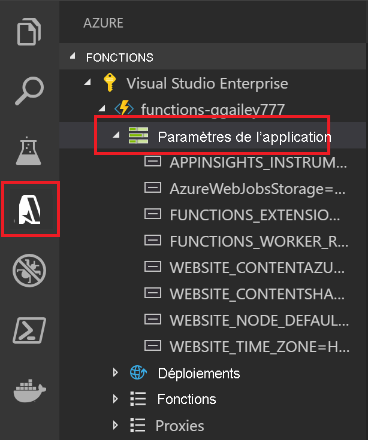

# <a name="develop-azure-functions-by-using-visual-studio-code"></a>Développer Azure Functions avec Visual Studio Code

L’[extension Azure Functions pour Visual Studio Code] vous permet de développer localement des fonctions, et de les déployer sur Azure. S’il s’agit de votre première expérience avec Azure Functions, vous pouvez en apprendre davantage dans l’article [Présentation d’Azure Functions](functions-overview.md).

L’extension Azure Functions présente ces avantages :

* Modifier, générer et exécuter des fonctions sur votre ordinateur de développement local.
* Publier votre projet Azure Functions directement sur Azure.
* Écrire vos fonctions dans différents langages tout en bénéficiant des avantages du développement Visual Studio Code.

L’extension peut être utilisée avec les langages suivants, qui sont pris en charge par le runtime Azure Functions à partir de la version 2.x :

* [C# compiled](functions-dotnet-class-library.md)
* [C# script](functions-reference-csharp.md)<sup>*</sup>
* [JavaScript](functions-reference-node.md)
* [Java](functions-reference-java.md)
* [PowerShell](functions-reference-powershell.md)
* [Python](functions-reference-python.md)

<sup>*</sup>Nécessite que vous [définissiez C# script comme langage de projet par défaut](#c-script-projects).

Dans cet article, des exemples sont disponibles uniquement pour les fonctions de bibliothèque de classes JavaScript (Node.js) et C#.  

Cet article fournit des informations sur le développement et la publication sur Azure de fonctions, à l’aide de l’extension Azure Functions. Avant de lire cet article, vous devez [créer votre première fonction en utilisant Visual Studio Code](./create-first-function-vs-code-csharp.md).

> [!IMPORTANT]
> Ne mélangez pas un développement local avec un développement de portail pour une même application de fonction. Quand vous publiez à partir d’un projet local dans une application de fonction, le processus de déploiement remplace toutes les fonctions que vous avez développées dans le portail.

## <a name="prerequisites"></a>Prérequis

Avant que vous puissiez installer et exécuter l’[extension Azure Functions][Extension Azure Functions pour Visual Studio Code], ces conditions doivent être remplies :

* [Visual Studio Code](https://code.visualstudio.com/) doit être installé sur l’une des [plateformes prises en charge](https://code.visualstudio.com/docs/supporting/requirements#_platforms).

* Un abonnement Azure actif.

[!INCLUDE [quickstarts-free-trial-note](../../includes/quickstarts-free-trial-note.md)]

Les autres ressources dont vous avez besoin, tel qu’un compte de stockage Azure, sont créées dans votre abonnement lors du processus de [publication avec Visual Studio Code](#publish-to-azure). 

### <a name="run-local-requirements"></a>Conditions requises pour une exécution locale

Ces conditions préalables sont requises uniquement pour [exécuter et déboguer vos fonctions localement](#run-functions-locally). Elles ne sont pas requises pour créer ou publier des projets dans Azure Functions.

# <a name="c"></a>[C\#](#tab/csharp)

+ [Azure Functions Core Tools](functions-run-local.md#install-the-azure-functions-core-tools) version 2.x ou ultérieure. Le package Core Tools est téléchargé et installé automatiquement lorsque vous démarrez le projet en local. Ce package inclut l’intégralité du runtime Azure Functions. Par conséquent, son téléchargement et son installation peuvent prendre un certain temps.

+ [Extension C#](https://marketplace.visualstudio.com/items?itemName=ms-dotnettools.csharp) pour Visual Studio Code. 

+ [Outils CLI .NET Core](/dotnet/core/tools/?tabs=netcore2x).  

# <a name="java"></a>[Java](#tab/java)

+ [Azure Functions Core Tools](functions-run-local.md#install-the-azure-functions-core-tools) version 2.x ou ultérieure. Le package Core Tools est téléchargé et installé automatiquement lorsque vous démarrez le projet en local. Ce package inclut l’intégralité du runtime Azure Functions. Par conséquent, son téléchargement et son installation peuvent prendre un certain temps.

+ [Extension de débogueur pour Java](https://marketplace.visualstudio.com/items?itemName=vscjava.vscode-java-debug).

+ [Java 8](/azure/developer/java/fundamentals/java-support-on-azure) recommandé. Pour les autres versions prises en charge, consultez [Versions Java](functions-reference-java.md#java-versions).

+ [Maven 3 ou version ultérieure](https://maven.apache.org/)

# <a name="javascript"></a>[JavaScript](#tab/nodejs)

+ [Azure Functions Core Tools](functions-run-local.md#install-the-azure-functions-core-tools) version 2.x ou ultérieure. Le package Core Tools est téléchargé et installé automatiquement lorsque vous démarrez le projet en local. Ce package inclut l’intégralité du runtime Azure Functions. Par conséquent, son téléchargement et son installation peuvent prendre un certain temps.

+ [Node.js](https://nodejs.org/), Active LTS et Maintenance LTS (version 10.14.1 recommandée). Utilisez la commande `node --version` pour vérifier la version que vous utilisez. 

# <a name="powershell"></a>[PowerShell](#tab/powershell)

+ [Azure Functions Core Tools](functions-run-local.md#install-the-azure-functions-core-tools) version 2.x ou ultérieure. Le package Core Tools est téléchargé et installé automatiquement lorsque vous démarrez le projet en local. Ce package inclut l’intégralité du runtime Azure Functions. Par conséquent, son téléchargement et son installation peuvent prendre un certain temps.

+ [PowerShell 7](/powershell/scripting/install/installing-powershell-core-on-windows) recommandé. Pour plus d’informations sur la version, consultez [Versions PowerShell](functions-reference-powershell.md#powershell-versions).

+ À la fois le [runtime .NET Core 3.1](https://dotnet.microsoft.com/download) et le [runtime .NET Core 2.1](https://dotnet.microsoft.com/download/dotnet/2.1)  

+ [Extension PowerShell pour Visual Studio Code](https://marketplace.visualstudio.com/items?itemName=ms-vscode.PowerShell).  

# <a name="python"></a>[Python](#tab/python)

+ [Azure Functions Core Tools](functions-run-local.md#install-the-azure-functions-core-tools) version 2.x ou ultérieure. Le package Core Tools est téléchargé et installé automatiquement lorsque vous démarrez le projet en local. Ce package inclut l’intégralité du runtime Azure Functions. Par conséquent, son téléchargement et son installation peuvent prendre un certain temps.

+ [Python 3.x](https://www.python.org/downloads/). Pour plus d’informations sur la version, consultez [Versions Python](functions-reference-python.md#python-version) par le runtime d’Azure Functions.

+ [Extension Python](https://marketplace.visualstudio.com/items?itemName=ms-python.python) pour Visual Studio Code.

---

[!INCLUDE [functions-install-vs-code-extension](../../includes/functions-install-vs-code-extension.md)]

## <a name="create-an-azure-functions-project"></a>Créer un projet Azure Functions

L’extension Functions vous permet de créer un projet d’application de fonction, ainsi que votre première fonction. Les étapes suivantes expliquent comment créer une fonction déclenchée via HTTP dans un nouveau projet Functions. Le [Déclencheur HTTP](functions-bindings-http-webhook.md) est le modèle de déclencheur de fonction le plus simple à expliquer.

1. À partir d’**Azure : Functions**, sélectionnez l’icône **Créer une fonction** :

    

1. Sélectionnez le dossier de votre projet d’application de fonction, puis **sélectionnez un langage pour votre projet de fonction**.

1. Sélectionnez le modèle de fonction **Déclencheur HTTP**, sinon vous pouvez sélectionner **Ignorer pour le moment** et créer un projet sans fonction. Vous pourrez toujours [ajouter une fonction à votre projet](#add-a-function-to-your-project) ultérieurement.

    

1. Tapez **HttpExample** comme nom de fonction. Sélectionnez ensuite Entrée, puis l’autorisation **Fonction**. Avec ce niveau d’autorisation, vous devez fournir une [clé de fonction](functions-bindings-http-webhook-trigger.md#authorization-keys) lorsque vous appelez le point de terminaison de la fonction.

    

    Une fonction est créée dans le langage que vous avez choisi, et dans le modèle d’une fonction déclenchée via HTTP.

    

### <a name="generated-project-files"></a>Fichiers projet générés

Le modèle de projet crée un projet dans le langage choisi, et installe les dépendances voulues. Pour tous les langages, le nouveau projet comporte ces fichiers :

* **host.json** : vous permet de configurer l’hôte Functions. Ces paramètres s’appliquent lorsque vous exécutez des fonctions localement, et lorsque vous les exécutez dans Azure. Pour plus d’informations, consultez l’article de référence sur [host.json](functions-host-json.md).

* **local.settings.json** : maintient à jour les paramètres utilisés lorsque vous exécutez des fonctions localement. Ces paramètres sont utilisés uniquement lorsque vous exécutez des fonctions localement. Pour en savoir plus, voir [Fichier de paramètres locaux](#local-settings).

    >[!IMPORTANT]
    >Étant donné que le fichier local.settings.json peut contenir des secrets, vous devez l’exclure du contrôle de code source du projet.

Selon votre langage de programmation, ces autres fichiers sont créés :

# <a name="c"></a>[C\#](#tab/csharp)

* Un [fichier bibliothèque de classes HttpExample.cs](functions-dotnet-class-library.md#functions-class-library-project), qui implémente la fonction.

# <a name="java"></a>[Java](#tab/java)

+ Un fichier pom.xml dans le dossier racine qui définit les paramètres de projet et de déploiement, y compris les dépendances de projet et la [version Java](functions-reference-java.md#java-versions). Le fichier pom.xml contient également des informations sur les ressources Azure créées pendant un déploiement.   

+ Un fichier [Functions.java](functions-reference-java.md#triggers-and-annotations) dans votre chemin SRC qui implémente la fonction.

# <a name="javascript"></a>[JavaScript](#tab/nodejs)

* Un fichier package.json dans le dossier racine.

* Un dossier HttpExample, qui contient le [fichier de définition function.json](functions-reference-node.md#folder-structure) et le [fichier index.js](functions-reference-node.md#exporting-a-function), un fichier Node.js qui contient le code de fonction.

# <a name="powershell"></a>[PowerShell](#tab/powershell)

* Un dossier HttpExample, qui contient le [fichier de définition function.json](functions-reference-powershell.md#folder-structure), et le fichier run.ps1, qui contient le code de fonction.
 
# <a name="python"></a>[Python](#tab/python)
    
* Un fichier requirements.txt au niveau du projet, qui liste les packages nécessaires à Functions.
    
* Un dossier HttpExample, qui contient le [fichier de définition function.json](functions-reference-python.md#folder-structure), et le fichier \_\_init\_\_.py, qui contient le code de fonction.

---

À ce stade, vous pouvez [ajouter des liaisons d’entrée et de sortie](#add-input-and-output-bindings) à votre fonction. Vous pouvez également [ajouter une fonction à votre projet](#add-a-function-to-your-project).

## <a name="install-binding-extensions"></a>Installer des extensions de liaison

À l’exception des déclencheurs HTTP et de minuteur, les liaisons sont implémentées dans des packages d’extension. Vous devez installer les packages d’extension pour les déclencheurs et les liaisons qui en ont besoin. La façon dont vous devez installer les extensions de liaison dépend du langage de votre projet.

# <a name="c"></a>[C\#](#tab/csharp)

Exécutez la commande [dotnet add package](/dotnet/core/tools/dotnet-add-package) dans la fenêtre de terminal pour installer les packages d’extension dont vous avez besoin dans votre projet. La commande suivante permet d’installer l’extension de stockage Azure, qui implémente des liaisons pour le stockage d’objets blob, de files d’attente et de tables.

```bash
dotnet add package Microsoft.Azure.WebJobs.Extensions.Storage --version 3.0.4
```

# <a name="java"></a>[Java](#tab/java)

[!INCLUDE [functions-extension-bundles](../../includes/functions-extension-bundles.md)]

# <a name="javascript"></a>[JavaScript](#tab/nodejs)

[!INCLUDE [functions-extension-bundles](../../includes/functions-extension-bundles.md)]

# <a name="powershell"></a>[PowerShell](#tab/powershell)

[!INCLUDE [functions-extension-bundles](../../includes/functions-extension-bundles.md)]

# <a name="python"></a>[Python](#tab/python)

[!INCLUDE [functions-extension-bundles](../../includes/functions-extension-bundles.md)]

---

## <a name="add-a-function-to-your-project"></a>Ajouter une fonction à votre projet

Vous pouvez ajouter une nouvelle fonction à un projet existant à l’aide de l’un des modèles de déclencheur Functions prédéfinis. Pour ajouter un nouveau déclencheur de fonction, sélectionnez F1 pour ouvrir la palette de commandes, puis recherchez et exécutez la commande **Azure Functions: Create Function**. Suivez les invites pour choisir le type de déclencheur et définir les attributs requis de ce dernier. Si votre déclencheur nécessite une clé d’accès ou une chaîne de connexion pour se connecter à un service, préparez-la avant de créer le déclencheur de fonction.

Les résultats de cette action varient selon le langage de votre projet :

# <a name="c"></a>[C\#](#tab/csharp)

Un nouveau fichier de bibliothèque de classes C# (.cs) est ajouté à votre projet.

# <a name="java"></a>[Java](#tab/java)

Un nouveau fichier Java (.java) est ajouté à votre projet.

# <a name="javascript"></a>[JavaScript](#tab/nodejs)

Un dossier est créé dans le projet. Il contient un nouveau fichier function.json et le nouveau fichier de code JavaScript.

# <a name="powershell"></a>[PowerShell](#tab/powershell)

Un dossier est créé dans le projet. Il contient un nouveau fichier function.json et le nouveau fichier de code PowerShell.

# <a name="python"></a>[Python](#tab/python)

Un dossier est créé dans le projet. Il contient un nouveau fichier function.json et le nouveau fichier de code Python.

---

## <a name="connect-to-services"></a><a name="add-input-and-output-bindings"></a>Se connecter à des services

Vous pouvez connecter votre fonction à d’autres services Azure en utilisant des liaisons d’entrée et de sortie. Les liaisons connectent votre fonction à d’autres services sans avoir à écrire le code de connexion. La façon dont vous devez ajouter les liaisons dépend du langage de votre projet. Pour en savoir plus sur les liaisons, consultez [Concepts des déclencheurs et liaisons Azure Functions](functions-triggers-bindings.md).

Les exemples suivants permettent de se connecter à une file d’attente de stockage nommée `outqueue`, où la chaîne de connexion pour le compte de stockage est définie le paramètre d’application `MyStorageConnection` du fichier local.settings.json.

# <a name="c"></a>[C\#](#tab/csharp)

Mettez à jour la méthode de la fonction et ajoutez le paramètre suivant à la définition de la méthode `Run` :

:::code language="csharp" source="~/functions-docs-csharp/functions-add-output-binding-storage-queue-cli/HttpExample.cs" range="17":::

Le paramètre `msg` est un type `ICollector<T>`, qui représente une collection de messages écrits dans une liaison de sortie quand la fonction se termine. Le code suivant ajoute un message à la collection :

:::code language="csharp" source="~/functions-docs-csharp/functions-add-output-binding-storage-queue-cli/HttpExample.cs" range="30-31":::

 Ces messages sont envoyés à la file d’attente lorsque la fonction se termine.

Pour en savoir plus, consultez l’article de référence [Liaison de sortie de stockage de file d’attente](functions-bindings-storage-queue-output.md?tabs=csharp). Pour en savoir plus sur les liaisons qui peuvent être ajoutées à une fonction, consultez [Ajouter des liaisons à une fonction existante dans Azure Functions](add-bindings-existing-function.md?tabs=csharp). 

# <a name="java"></a>[Java](#tab/java)

Mettez à jour la méthode de la fonction et ajoutez le paramètre suivant à la définition de la méthode `Run` :

:::code language="java" source="~/functions-quickstart-java/functions-add-output-binding-storage-queue/src/main/java/com/function/Function.java" range="20-21":::

Le paramètre `msg` est un type `OutputBinding<T>`, où `T` est une chaîne écrite dans une liaison de sortie quand la fonction se termine. Le code suivant définit le message dans la liaison de sortie :

:::code language="java" source="~/functions-quickstart-java/functions-add-output-binding-storage-queue/src/main/java/com/function/Function.java" range="33-34":::

Ce message est envoyé à la file d’attente lorsque la fonction se termine.

Pour en savoir plus, consultez l’article de référence [Liaison de sortie de stockage de file d’attente](functions-bindings-storage-queue-output.md?tabs=java). Pour en savoir plus sur les liaisons qui peuvent être ajoutées à une fonction, consultez [Ajouter des liaisons à une fonction existante dans Azure Functions](add-bindings-existing-function.md?tabs=java). 

# <a name="javascript"></a>[JavaScript](#tab/nodejs)

[!INCLUDE [functions-add-output-binding-vs-code](../../includes/functions-add-output-binding-vs-code.md)]

Dans le code de votre fonction, la liaison `msg` est accessible à partir du `context`, comme dans cet exemple :

:::code language="javascript" range="5-7" source="~/functions-docs-javascript/functions-add-output-binding-storage-queue-cli/HttpExample/index.js":::

Ce message est envoyé à la file d’attente lorsque la fonction se termine.

Pour en savoir plus, consultez l’article de référence [Liaison de sortie de stockage de file d’attente](functions-bindings-storage-queue-output.md?tabs=javascript). Pour en savoir plus sur les liaisons qui peuvent être ajoutées à une fonction, consultez [Ajouter des liaisons à une fonction existante dans Azure Functions](add-bindings-existing-function.md?tabs=javascript). 

# <a name="powershell"></a>[PowerShell](#tab/powershell)

[!INCLUDE [functions-add-output-binding-vs-code](../../includes/functions-add-output-binding-vs-code.md)]

:::code language="powershell" range="18-19" source="~/functions-docs-powershell/functions-add-output-binding-storage-queue-cli/HttpExample/run.ps1":::

Ce message est envoyé à la file d’attente lorsque la fonction se termine.

Pour en savoir plus, consultez l’article de référence [Liaison de sortie de stockage de file d’attente](functions-bindings-storage-queue-output.md?tabs=powershell). Pour en savoir plus sur les liaisons qui peuvent être ajoutées à une fonction, consultez [Ajouter des liaisons à une fonction existante dans Azure Functions](add-bindings-existing-function.md?tabs=powershell). 

# <a name="python"></a>[Python](#tab/python)

[!INCLUDE [functions-add-output-binding-vs-code](../../includes/functions-add-output-binding-vs-code.md)]

Mettez à jour la définition de `Main` pour ajouter un paramètre de sortie `msg: func.Out[func.QueueMessage]` afin que la définition ressemble à l’exemple suivant :

:::code language="python" range="6" source="~/functions-docs-python/functions-add-output-binding-storage-queue-cli/HttpExample/__init__.py":::

Le code suivant ajoute des données de chaîne de la demande à la file d’attente de sortie :

:::code language="python" range="18" source="~/functions-docs-python/functions-add-output-binding-storage-queue-cli/HttpExample/__init__.py":::

Ce message est envoyé à la file d’attente lorsque la fonction se termine.

Pour en savoir plus, consultez l’article de référence [Liaison de sortie de stockage de file d’attente](functions-bindings-storage-queue-output.md?tabs=python). Pour en savoir plus sur les liaisons qui peuvent être ajoutées à une fonction, consultez [Ajouter des liaisons à une fonction existante dans Azure Functions](add-bindings-existing-function.md?tabs=python). 

---

[!INCLUDE [functions-sign-in-vs-code](../../includes/functions-sign-in-vs-code.md)]

## <a name="publish-to-azure"></a>Publication dans Azure

Visual Studio Code vous permet de publier votre projet Functions directement sur Azure. Pendant le processus, vous créez une application de fonction et les ressources associées dans votre abonnement Azure. L’application de fonction fournit un contexte d'exécution pour vos fonctions. Le projet est empaqueté et déployé sur la nouvelle application de fonction dans votre abonnement Azure.

Lorsque vous publiez à partir de Visual Studio Code vers une nouvelle application de fonction dans Azure, vous pouvez choisir soit un chemin de création rapide d’application de fonction utilisant des valeurs par défaut, soit un chemin avancé, où vous avez plus de contrôle sur les ressources distantes créées. 

En publiant à partir de Visual Studio code, vous bénéficiez de la technologie [Zip deploy](functions-deployment-technologies.md#zip-deploy). 

### <a name="quick-function-app-create"></a>Création d’application de fonction rapide

Quand vous choisissez **+ Créer une application de fonction dans Azure...** , l’extension génère automatiquement les valeurs des ressources Azure nécessaires à votre application de fonction. Ces valeurs sont basées sur le nom de l’application de fonction que vous choisissez. Vous obtenez un exemple d’utilisation des valeurs par défaut pour publier votre projet vers une nouvelle application de fonction dans Azure en consultant l’article sur le [démarrage rapide de Visual Studio Code](./create-first-function-vs-code-csharp.md#publish-the-project-to-azure).

Si vous souhaitez fournir des noms explicites pour les ressources créées, vous devez opter pour le chemin de création avancé.

### <a name="publish-a-project-to-a-new-function-app-in-azure-by-using-advanced-options"></a><a name="enable-publishing-with-advanced-create-options"></a>Publier un projet sur une nouvelle application de fonction dans Azure à l’aide des options avancées

Les étapes suivantes permettent de publier votre projet dans une nouvelle application de fonction créée avec les options de création avancées.

1. Dans la palette de commandes, entrez **Azure Functions : Deploy to function app**.

1. Si vous n’êtes pas connecté, vous êtes invité à le faire avec **Se connecter à Azure**. Vous pouvez également **créer un compte Azure gratuit**. Une fois la connexion établie à partir du navigateur, revenez à Visual Studio Code.

1. Si vous disposez de plusieurs abonnements, **Sélectionnez un abonnement** pour l’application de fonction, puis sélectionnez **+ Créer une application de fonction dans Azure... _Avancé_**. Cette option _Avancé_ vous donne plus de contrôle sur les ressources que vous créez dans Azure. 

1. Suivez les invites et fournissez ces informations :

    | Prompt | Valeur | Description |
    | ------ | ----- | ----------- |
    | Sélectionnez une application de fonction dans Azure | Créer une application de fonction dans Azure | À l’invite suivante, tapez un nom global unique identifiant votre nouvelle application de fonction et sélectionnez Entrée. Les caractères valides pour un nom d’application de fonction sont `a-z`, `0-9` et `-`. |
    | Sélectionner un système d’exploitation | Windows | L’application de fonction s’exécute sur Windows. |
    | Sélectionner un plan d’hébergement | Plan de consommation | [L’hébergement dans un plan de consommation](consumption-plan.md) serverless est utilisé. |
    | Sélectionner un runtime pour votre nouvelle application | Langage de votre projet | Le runtime doit correspondre au projet que vous publiez. |
    | Sélectionner un groupe de ressources pour les nouvelles ressources | Créer un groupe de ressources | À l’invite suivante, tapez un nom de groupe de ressources, comme `myResourceGroup`, et sélectionnez Entrée. Vous pouvez également sélectionner un groupe de ressources existant. |
    | Sélectionner un compte de stockage | Créer un nouveau compte de stockage | À l’invite suivante, tapez le nom global unique du nouveau compte de stockage utilisé par votre application de fonction et sélectionnez Entrée. Les noms des comptes de stockage doivent comporter entre 3 et 24 caractères, et contenir uniquement des lettres minuscules et des chiffres. Vous pouvez également sélectionner un compte existant. |
    | Sélectionner l’emplacement des nouvelles ressources | region | Sélectionnez un emplacement dans une [région](https://azure.microsoft.com/regions/) proche de chez vous, ou proche d’autres services auxquels vos fonctions ont accès. |

    Une notification s’affiche après que votre application de fonction a été créée et que le package de déploiement a été appliqué. Sélectionnez **Afficher la sortie de** dans cette notification pour afficher les résultats de la création et du déploiement, y compris les ressources Azure que vous avez créées.

### <a name="get-the-url-of-an-http-triggered-function-in-azure"></a><a name="get-the-url-of-the-deployed-function"></a>Récupérer l’URL d’une fonction déclenchée via HTTP dans Azure

Pour appeler une fonction déclenchée via HTTP à partir d’un client, vous avez besoin de l’URL de la fonction lorsqu’elle est déployée dans votre application de fonction. Cette URL inclut les clés de fonction requises. Vous pouvez utiliser l’extension pour obtenir les URL de vos fonctions déployées. Si vous souhaitez simplement exécuter la fonction distante dans Azure, [utilisez la fonctionnalité « Exécuter la fonction maintenant »](#run-functions-in-azure) de l’extension.

1. Sélectionnez F1 pour ouvrir la palette de commandes, puis recherchez et exécutez la commande **Azure Functions : Copier l’URL de la fonction**.

1. Suivez les invites pour sélectionner votre application de fonction dans Azure, puis le déclencheur HTTP particulier que vous souhaitez appeler.

L’URL de la fonction est copiée dans le Presse-papiers, ainsi que les clés éventuelles exigées, transmises par le paramètre de requête `code`. Utilisez un outil HTTP pour envoyer des requêtes POST, ou un navigateur pour les requêtes GET envoyées à la fonction à distance.  

Lorsqu’elle récupère l’URL des fonctions dans Azure, l’extension utilise votre compte Azure pour récupérer automatiquement les clés dont elle a besoin pour démarrer la fonction. [En savoir plus sur les clés d’accès aux fonctions](security-concepts.md#function-access-keys). Le démarrage de fonctions non déclenchées via HTTP requiert l’utilisation de la clé administrateur.

## <a name="republish-project-files"></a>Republier les fichiers du projet

Lorsque vous configurez un [déploiement continu](functions-continuous-deployment.md), votre application de fonction dans Azure est mise à jour lorsque vous mettez à jour les fichiers sources à l’emplacement source connecté. Nous conseillons de suivre cette pratique de déploiement continu, mais vous pouvez également republier les mises à jour des fichiers de votre projet à partir de Visual Studio Code.

> [!IMPORTANT]
> La publication sur une application de fonction existante remplace le contenu de cette application dans Azure.

[!INCLUDE [functions-republish-vscode](../../includes/functions-republish-vscode.md)]

## <a name="run-functions"></a>Exécuter des fonctions

L’extension d’Azure Functions vous permet d’exécuter des fonctions individuelles dans votre projet sur votre ordinateur de développement local ou dans votre abonnement Azure. 

Pour les fonctions déclenchées via HTTP, l’extension appelle le point de terminaison HTTP. Pour les autres types de déclencheurs, elle appelle les API d’administrateur pour démarrer la fonction. Le corps du message de la demande envoyée à la fonction dépend du type de déclencheur. Lorsqu’un déclencheur requiert des données de test, vous êtes invité à entrer des données dans un format JSON spécifique.

### <a name="run-functions-in-azure"></a>Exécuter des fonctions dans Azure

Pour exécuter une fonction dans Azure à partir de Visual Studio Code : 

1. Dans la palette de commandes, entrez **Azure Functions : Exécuter la fonction maintenant** et choisissez votre abonnement Azure. 

1. Dans la liste, choisissez votre application de fonction dans Azure. Si vous ne voyez pas votre application de fonction, assurez-vous que vous êtes connecté au bon abonnement. 

1. Choisissez la fonction que vous souhaitez exécuter dans la liste et saisissez le corps du message de la demande dans **Entrez le corps de la demande**. Appuyez sur Entrée pour envoyer ce message de demande à votre fonction. Le texte par défaut dans **Entrez le corps de la demande** doit indiquer le format du corps. Si votre application de fonction n’a pas de fonctions, une notification d’erreur s’affiche avec cette erreur. 

1. Quand la fonction s’exécute dans Azure et retourne une réponse, une notification est générée dans Visual Studio Code.
 
Vous pouvez également exécuter votre fonction à partir de la zone **Azure : Fonctions** en cliquant avec le bouton droit (Ctrl + clic sur Mac) sur la fonction que vous souhaitez exécuter à partir de votre application de fonction dans votre abonnement Azure et en choisissant **Exécuter la fonction maintenant…**

Lors de l’exécution de fonctions dans Azure, l’extension utilise votre compte Azure pour récupérer automatiquement les clés dont elle a besoin pour démarrer la fonction. [En savoir plus sur les clés d’accès aux fonctions](security-concepts.md#function-access-keys). Le démarrage de fonctions non déclenchées via HTTP requiert l’utilisation de la clé administrateur.

### <a name="run-functions-locally"></a>Exécuter des fonctions localement

Le runtime local est le même runtime que celui qui héberge votre application de fonction dans Azure. Les paramètres locaux sont lus à partir du [fichier local.settings.json](#local-settings). Pour exécuter votre projet Functions localement, vous devez vous conformer à des [exigences supplémentaires](#run-local-requirements).

#### <a name="configure-the-project-to-run-locally"></a>Configurer le projet pour une exécution locale

Le runtime Functions utilise un compte de stockage Azure en interne pour tous les types de déclencheurs autres que HTTP et webhooks. Autrement dit, vous devez définir la clé **Values.AzureWebJobsStorage** sur une chaîne de connexion de compte de stockage Azure valide.

Cette section utilise l’[extension Stockage Azure pour Visual Studio Code](https://marketplace.visualstudio.com/items?itemName=ms-azuretools.vscode-azurestorage) avec l’[Explorateur Stockage Azure](https://storageexplorer.com/) pour vous connecter à la chaîne de connexion de stockage et la récupérer.

Pour définir la chaîne de connexion de compte de stockage :

1. Dans Visual Studio, ouvrez **Cloud Explorer**, développez **Compte de stockage** > **Votre compte de stockage**, puis sélectionnez **Propriétés** et copiez la valeur de **Chaîne de connexion principale**.

2. Dans votre projet, ouvrez le fichier local.settings.json et définissez la valeur de la clé **AzureWebJobsStorage** sur la chaîne de connexion que vous avez copiée.

3. Répétez l’étape précédente pour ajouter des clés uniques au tableau **Valeurs** pour les autres connexions requises par vos fonctions.

Pour en savoir plus, voir [Fichier de paramètres locaux](#local-settings).

#### <a name="debug-functions-locally"></a><a name="debugging-functions-locally"></a>Déboguer les fonctions localement  

Pour déboguer vos fonctions, sélectionnez F5. Si vous n’avez pas encore téléchargé [Core Tools][Azure Functions Core Tools], vous êtes invité à le faire. Lorsque Core Tools est installé et en cours d’exécution, la sortie est affichée dans le terminal. Cela revient à exécuter la commande Core Tools `func host start` dans le terminal, mais avec des tâches de génération supplémentaires et un débogueur attaché.  

Lorsque le projet est en cours d’exécution, vous pouvez utiliser la fonctionnalité **Exécuter la fonction maintenant…** de l’extension pour déclencher vos fonctions comme vous le feriez dans le projet déployé sur Azure. Lorsque le projet s’exécute en mode débogage, les points d’arrêt sont atteints dans Visual Studio Code comme prévu. 

1. Dans la palette de commandes, entrez **Azure Functions : Exécuter la fonction maintenant** et choisissez **Projet local**. 

1. Choisissez la fonction que vous souhaitez exécuter dans votre projet et saisissez le corps du message de la demande dans **Entrez le corps de la demande**. Appuyez sur Entrée pour envoyer ce message de demande à votre fonction. Le texte par défaut dans **Entrez le corps de la demande** doit indiquer le format du corps. Si votre application de fonction n’a pas de fonctions, une notification d’erreur s’affiche avec cette erreur. 

1. Lorsque la fonction s’exécute localement et après la réception de la réponse, une notification est générée dans Visual Studio Code. Les informations relatives à l’exécution de la fonction s’affichent dans le panneau **Terminal**.

L’exécution locale des fonctions ne nécessite pas l’utilisation de clés. 

[!INCLUDE [functions-local-settings-file](../../includes/functions-local-settings-file.md)]

Par défaut, ces paramètres ne sont pas migrés automatiquement lorsque le projet est publié dans Azure. Une fois la publication terminée, vous pouvez publier les paramètres du fichier local.settings.json sur votre application de fonction dans Azure. Pour plus d’informations, consultez [Publier les paramètres de l’application](#publish-application-settings).

Les valeurs dans **ConnectionStrings** ne sont jamais publiées.

Ces valeurs de paramètres d’application de fonction peuvent aussi être lues dans votre code en tant que variables d’environnement. Pour plus d’informations, consultez les sections Variables d’environnement de ces rubriques de référence propres à un langage :

* [C# précompilé](functions-dotnet-class-library.md#environment-variables)
* [Script C# (.csx)](functions-reference-csharp.md#environment-variables)
* [Java](functions-reference-java.md#environment-variables)
* [JavaScript](functions-reference-node.md#environment-variables)
* [PowerShell](functions-reference-powershell.md#environment-variables)
* [Python](functions-reference-python.md#environment-variables)

## <a name="application-settings-in-azure"></a>Paramètres d’application dans Azure

Les paramètres du fichier local.settings.json de votre projet doivent être les mêmes que les paramètres de l’application de fonction dans Azure. Les paramètres que vous ajoutez au fichier local.settings.json doivent être également ajoutés à l’application de fonction dans Azure. Ces paramètres ne sont pas chargés automatiquement quand vous publiez le projet. De même, tous les paramètres que vous créez dans votre application de fonction [dans le portail](functions-how-to-use-azure-function-app-settings.md#settings) doivent être téléchargés dans votre projet local.

### <a name="publish-application-settings"></a>Publier les paramètres de l’application

Le moyen le plus simple de publier les paramètres obligatoires sur votre application de fonction dans Azure consiste à utiliser le lien **Charger les paramètres** qui apparaît une fois votre projet publié :


Vous pouvez également publier des paramètres au moyen de la commande **Azure Functions : Upload Local Setting** dans la palette de commandes. Vous pouvez ajouter des paramètres individuels aux paramètres de l’application dans Azure en utilisant la commande **Azure Functions: Add New Setting**.

> [!TIP]
> Veillez à enregistrer votre fichier local.settings.json avant de le publier.

Si le fichier local est chiffré, il est déchiffré, publié et chiffré à nouveau. Si des paramètres comportent des valeurs conflictuelles dans les deux emplacements, vous êtes invité à choisir la procédure à suivre.

Affichez les paramètres d’une application existante dans la zone **Azure : Functions** en développant votre abonnement, votre application de fonction et **Paramètres de l’application**.



### <a name="download-settings-from-azure"></a>Télécharger les paramètres depuis Azure

Si vous avez créé des paramètres d’application dans Azure, vous pouvez les télécharger dans votre fichier local.settings.json au moyen de la commande **Azure Functions: Télécharger les paramètres distants**.

Tout comme dans le cas du chargement, si le fichier local est chiffré, il est déchiffré, publié et chiffré à nouveau. Si des paramètres comportent des valeurs conflictuelles dans les deux emplacements, vous êtes invité à choisir la procédure à suivre.

## <a name="monitoring-functions"></a>Surveillance des fonctions

En cas d’[exécution locale de fonctions](#run-functions-locally), les données de journal sont diffusées en continu vers la console de terminal. Vous pouvez également obtenir les données de journal lorsque votre projet Functions est en cours d’exécution dans une application de fonction sur Azure. Soit vous pouvez vous connecter aux journaux diffusés en continu dans Azure pour voir les données de journal quasiment en temps réel, soit vous pouvez activer Application Insights pour une compréhension plus complète des comportements de votre application de fonction.

### <a name="streaming-logs"></a>Diffusion de journaux d’activité

Lorsque vous développez une application, il est souvent utile de visualiser des informations de journalisation en temps quasi réel. Vous pouvez afficher le flux de fichiers journaux générés par vos fonctions. Cette sortie est un exemple de journaux diffusés en continu pour une requête faite à une fonction déclenchée via HTTP :


Pour en savoir plus, consultez la section [Journaux en continu](functions-monitoring.md#streaming-logs).

[!INCLUDE [functions-enable-log-stream-vs-code](../../includes/functions-enable-log-stream-vs-code.md)]

> [!NOTE]
> Les journaux de diffusion en continu ne prennent en charge qu'une seule instance de l’hôte Functions. Lorsque votre fonction est mise à l’échelle sur plusieurs instances, les données des autres instances ne s’affichent pas dans le flux du journal. Dans Application Insights, le [Flux de métriques temps réel](../azure-monitor/app/live-stream.md) prend en charge plusieurs instances. Également en quasi temps réel, l’analytique de diffusion en continue repose sur des [données échantillonnées](configure-monitoring.md#configure-sampling).

### <a name="application-insights"></a>Application Insights

Nous vous conseillons de superviser l’exécution de vos fonctions en intégrant votre application de fonction à Application Insights. Lorsque vous créez une application de fonction dans le portail Azure, cette intégration s’effectue par défaut. Lorsque vous créez votre application de fonction pendant la publication de Visual Studio, vous devez intégrer Application Insights vous-même. Pour découvrir comment, consultez [Activer l’intégration à Application Insights](configure-monitoring.md#enable-application-insights-integration).

Pour en savoir plus sur la surveillance à l’aide d’Application Insights, consultez [Surveiller l’exécution des fonctions Azure](functions-monitoring.md).

## <a name="c-script-projects"></a>Projets en C\# script

Par défaut, tous les projets C# sont créés sous forme de [projets de bibliothèque de classes C# compiled](functions-dotnet-class-library.md). Si vous préférez travailler sur des projets C# script, vous devez sélectionner C# script comme langage par défaut dans les paramètres d’extension Azure Functions :

1. Sélectionnez **Fichier** > **Préférences** > **Paramètres**.

1. Accédez à **Paramètres utilisateur** > **Extensions** > **Azure Functions**.

1. Sélectionnez **C#Script** dans **Azure Function : Langage du projet**.

Après avoir effectué ces étapes, les appels émis vers le package Core Tools sous-jacent incluent l’option `--csx` qui génère et publie les fichiers de projet C# script (.csx). Lorsque vous avez précisé ce langage par défaut, tous les projets que vous créez sont des projets C# script par défaut. Vous n’êtes pas invité à choisir un langage de projet lorsqu’une valeur par défaut est définie. Pour créer des projets dans d’autres langages, vous devez modifier ce paramètre ou le supprimer du fichier utilisateur settings.json. Une fois ce paramètre supprimé, vous êtes de nouveau invité à choisir votre langage lors de la création d’un projet.

## <a name="command-palette-reference"></a>Référence pour la palette de commandes

L’extension Azure Functions fournit une interface graphique utile dans la zone pour interagir avec vos applications de fonction dans Azure. La même fonctionnalité est également disponible sous forme de commande dans la palette de commandes (F1). Ces commandes Azure Functions sont disponibles :

|Commande Azure Functions  | Description  |
|---------|---------|
|**Add New Settings**  |  Crée un nouveau paramètre d’application dans Azure. Pour plus d’informations, consultez [Publier les paramètres de l’application](#publish-application-settings). Vous devrez peut-être également [télécharger ce paramètre dans vos paramètres locaux](#download-settings-from-azure). |
| **Configure Deployment Source** | Connecte votre application de fonction dans Azure à un dépôt Git local. Pour plus d’informations, consultez [Déploiement continu pour Azure Functions](functions-continuous-deployment.md). |
| **Connect to GitHub Repository** | Connecte votre application de fonction à un dépôt GitHub. |
| **Copy Function URL** | Obtient l’URL distante d’une fonction déclenchée via HTTP qui est exécutée dans Azure. Pour plus d’informations, consultez [Obtenir l’URL de la fonction déployée](#get-the-url-of-the-deployed-function). |
| **Create function app in Azure** | Crée une application de fonction sur votre abonnement dans Azure. Pour plus d’informations, consultez la section sur la façon de [Publier vers une nouvelle application de fonction dans Azure](#publish-to-azure).        |
| **Decrypt Settings** | Déchiffre les [paramètres locaux](#local-settings) qui ont été chiffrés par **Azure Functions: Encrypt Settings**.  |
| **Delete Function App** | Supprime une application de fonction de votre abonnement dans Azure. Lorsqu’il n’y a aucune autre application dans le plan App Service, vous avez la possibilité de le supprimer également. Les autres ressources, comme les comptes de stockage et les groupes de ressources, ne sont pas supprimées. Pour supprimer toutes les ressources, vous devez utiliser la commande [Supprimer le groupe de ressources](functions-add-output-binding-storage-queue-vs-code.md#clean-up-resources). Votre projet local n’est pas affecté. |
|**Delete Function**  | Supprime une fonction existante à partir d’une application de fonction dans Azure. Étant donné que cette suppression n’affecte pas votre projet local, envisagez de supprimer la fonction en local, puis [republiez votre projet](#republish-project-files). |
| **Delete Proxy** | Supprime un proxy d’Azure Functions de votre application de fonction dans Azure. Pour en savoir plus sur les proxys, consultez [Utilisation d’Azure Functions Proxies](functions-proxies.md). |
| **Delete Setting** | Supprime un paramètre d’application de fonction dans Azure. Cette suppression n’affecte pas les paramètres de votre fichier local.settings.json. |
| **Disconnect from Repo**  | Supprime la connexion de [déploiement continu](functions-continuous-deployment.md) entre une application de fonction dans Azure et un dépôt de contrôle de code source. |
| **Download Remote Settings** | Télécharge les paramètres de l’application de fonction choisie dans Azure dans votre fichier local.settings.json. Si le fichier local est chiffré, il est déchiffré, mis à jour et chiffré à nouveau. Si des paramètres comportent des valeurs conflictuelles dans les deux emplacements, vous êtes invité à choisir la procédure à suivre. Veillez à enregistrer les modifications dans votre fichier local.settings.json avant d’exécuter cette commande. |
| **Edit settings** | Modifie la valeur d’un paramètre d’application de fonction existant dans Azure. Cette commande n’affecte pas les paramètres de votre fichier local.settings.json.  |
| **Encrypt settings** | Chiffre les éléments individuels du tableau `Values` des [paramètres locaux](#local-settings). Dans ce fichier, `IsEncrypted` est également défini sur `true`, ce qui indique que le runtime local déchiffre les paramètres avant de les utiliser. Chiffrez les paramètres locaux pour réduire le risque de fuite d’informations précieuses. Dans Azure, les paramètres d’application sont toujours stockés chiffrés. |
| **Execute Function Now** | Démarre manuellement une fonction à l’aide des API d’administrateur. Cette commande est utilisée à des fins de test, à la fois localement pendant le débogage et sur les fonctions qui s’exécutent dans Azure. Lors du déclenchement d’une fonction dans Azure, l’extension obtient d’abord automatiquement une clé d’administrateur, qu’elle utilise pour appeler les API d’administrateur distante qui démarrent les fonctions dans Azure. Le corps du message envoyé à l’API dépend du type de déclencheur. Les déclencheurs de minuteur ne vous obligent pas à transmettre de données. |
| **Initialize Project for Use with VS Code** | Ajoute les fichiers de projet Visual Studio Code requis à un projet Functions existant. Cette commande permet de travailler sur un projet que vous avez créé à l’aide du package Core Tools. |
| **Install ou Update Azure Functions Core Tools** | Installe ou met à jour [Azure Functions Core Tools] qui est utilisé pour l’exécution de fonctions en local. |
| **Redeploy**  | Vous permet de redéployer les fichiers de projet à partir d’un référentiel Git connecté, vers un déploiement spécifique dans Azure. Pour republier les mises à jour locales à partir de Visual Studio Code, [republiez votre projet](#republish-project-files). |
| **Rename Settings** | Modifie le nom de clé d’un paramètre d’application de fonction existant dans Azure. Cette commande n’affecte pas les paramètres de votre fichier local.settings.json. Après avoir renommé les paramètres dans Azure, vous devez [télécharger ces modifications dans le projet local](#download-settings-from-azure). |
| **Restart** | Redémarre l’application de fonction dans Azure. Le déploiement de mises à jour entraîne également le redémarrage de l’application de fonction. |
| **Set AzureWebJobsStorage**| Définit la valeur du paramètre d’application `AzureWebJobsStorage`. Ce paramètre est exigé par Azure Functions. Il est défini lorsqu’une application de fonction est créée dans Azure. |
| **Start** | Démarre une application de fonction arrêtée dans Azure. |
| **Start Streaming Logs** | Démarre les journaux de diffusion en continu pour l’application de fonction dans Azure. Utilisez ces journaux lors de la résolution de problèmes à distance dans Azure si vous avez besoin d’afficher des informations de journalisation en temps quasi réel. Pour en savoir plus, consultez la section [Journaux en continu](#streaming-logs). |
| **Stop** | Arrête une application de fonction qui s’exécute dans Azure. |
| **Stop Streaming Logs** | Arrête les journaux de diffusion en continu pour l’application de fonction dans Azure. |
| **Toggle as Slot Setting** | Lorsque cette option est activée, elle permet de s’assurer qu’un paramètre d’application persiste pour un emplacement de déploiement donné. |
| **Uninstall Azure Functions Core Tools** | Supprime Azure Functions Core Tools, ce qui est exigé par l’extension. |
| **Upload Local Settings** | Charge les paramètres de votre fichier local.settings.json vers l’application de fonction choisie dans Azure. Si le fichier local est chiffré, il est déchiffré, chargé et chiffré à nouveau. Si des paramètres comportent des valeurs conflictuelles dans les deux emplacements, vous êtes invité à choisir la procédure à suivre. Veillez à enregistrer les modifications dans votre fichier local.settings.json avant d’exécuter cette commande. |
| **View Commit in GitHub** | Affiche la dernière validation dans un déploiement spécifique lorsque votre application de fonction est connectée à un référentiel. |
| **View Deployment Logs** | Affiche les journaux associés à un déploiement propre à l’application de fonction dans Azure. |

## <a name="next-steps"></a>Étapes suivantes

Pour plus d’informations sur Azure Functions Core Tools, consultez [Utiliser Azure Functions Core Tools](functions-run-local.md).

Pour en savoir plus sur le développement de fonctions en tant que bibliothèques de classes, consultez [Informations de référence pour les développeurs C# sur Azure Functions](functions-dotnet-class-library.md). Cet article fournit également des liens vers des exemples d’utilisation d’attributs pour déclarer les différents types de liaisons pris en charge par Azure Functions.

[Extension Azure Functions pour Visual Studio Code]: https://marketplace.visualstudio.com/items?itemName=ms-azuretools.vscode-azurefunctions
[Azure Functions Core Tools]: functions-run-local.md
