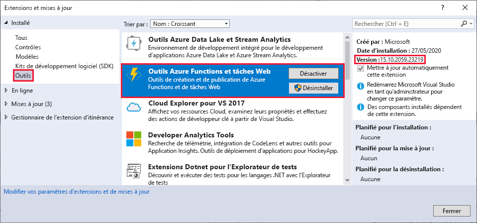
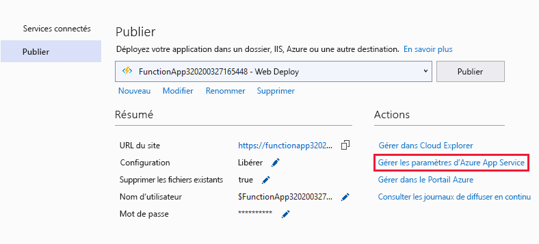
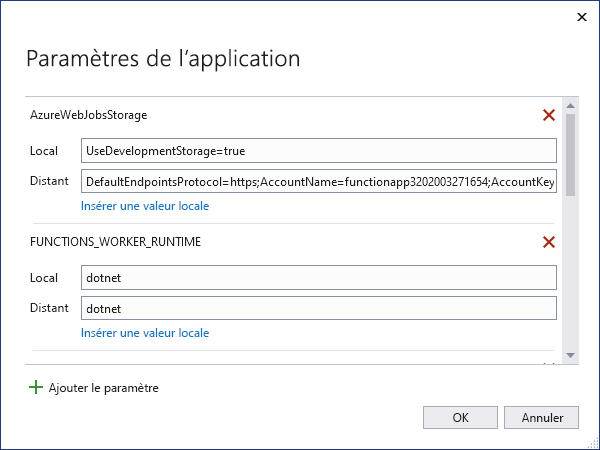

# <a name="develop-azure-functions-using-visual-studio"></a>Développer Azure Functions à l’aide de Visual Studio  

Visual Studio vous permet de développer, de tester et de déployer des fonctions de bibliothèque de classes C# dans Azure. S’il s’agit de votre première expérience avec Azure Functions, vous pouvez en apprendre davantage dans l’article [Présentation d’Azure Functions](functions-overview.md).

Visual Studio offre les avantages suivants lorsque vous développez vos fonctions : 

* Modifier, générer et exécuter des fonctions sur votre ordinateur de développement local. 
* Publiez votre projet Azure Functions directement dans Azure et créez des ressources Azure, si besoin. 
* Utilisez des attributs C# pour déclarer des liaisons de fonction directement dans le code C#.
* Développer et déployer des fonctions précompilées C#. Les fonctions précompilées offrent de meilleures performances de démarrage à froid que les fonctions basées sur un script C#. 
* Coder vos fonctions en C# tout en bénéficiant de tous les avantages du développement Visual Studio. 

Cet article fournit des informations sur l'utilisation de Visual Studio pour développer des fonctions de bibliothèque de classe C# et les publier dans Azure. Avant de lire cet article, lisez le [Démarrage rapide de Functions pour Visual Studio](functions-create-your-first-function-visual-studio.md). 

Sauf indication contraire, les procédures et exemples présentés correspondent à Visual Studio 2019. 

## <a name="prerequisites"></a>Prérequis

Azure Functions Tools est inclus dans la charge de travail de développement Azure de Visual Studio, à partir de Visual Studio 2017. Veillez à inclure la charge de travail de **développement Azure** lorsque vous installez Visual Studio.

[!INCLUDE [quickstarts-free-trial-note](../../includes/quickstarts-free-trial-note.md)]

Les autres ressources dont vous avez besoin, tel qu’un compte de stockage Azure, sont créées dans votre abonnement au cours du processus de publication.

> [!NOTE]
> Dans Visual Studio 2017, la charge de travail de développement Azure installe Azure Functions Tools en tant qu’extension distincte. Lorsque vous mettez à jour Visual Studio 2017, vérifiez également que vous utilisez la [dernière version](#check-your-tools-version) d’Azure Functions Tools. Les sections suivantes vous montrent comment vérifier et (si besoin) mettre à jour votre extension Azure Functions Tools dans Visual Studio 2017. 
>
> Veuillez passer cette section si vous utilisez Visual Studio 2019.

### <a name="check-your-tools-version"></a>Vérifier la version de vos outils dans Visual Studio 2017

1. Dans le menu **Outils**, choisissez **Extensions et mises à jour**. Développez **Installé** > **Outils** et choisissez **Outils Azure Functions et Web Jobs**.

    

1. Notez la **Version** installée. Vous pouvez comparer cette version avec la dernière, indiquée [dans les notes de publication](https://github.com/Azure/Azure-Functions/blob/master/VS-AzureTools-ReleaseNotes.md). 

1. Si votre version est antérieure, mettez à jour vos outils dans Visual Studio en suivant les instructions de la section suivante.

### <a name="update-your-tools-in-visual-studio-2017"></a>Mettre à jour vos outils dans Visual Studio 2017

1. Dans la boîte de dialogue **Extensions et mises à jour**, développez **Mises à jour** > **Visual Studio Marketplace**, choisissez **Outils Azure Functions et Web Jobs** et sélectionnez **Mettre à jour**.

       

1. Une fois la mise à jour des outils téléchargée, fermez Visual Studio pour déclencher la mise à jour des outils à l’aide du programme d’installation VSIX.

1. Dans le programme d’installation, choisissez **OK** pour démarrer, puis **Modifier** pour mettre à jour les outils. 

1. Une fois la mise à jour terminée, choisissez **Fermer** et redémarrez Visual Studio.

> [!NOTE]  
> Dans Visual Studio 2019 ou version ultérieure, l’extension Azure Functions Tools est mise à jour avec Visual Studio.  

## <a name="create-an-azure-functions-project"></a>Créer un projet Azure Functions

[!INCLUDE [Create a project using the Azure Functions](../../includes/functions-vstools-create.md)]

Le modèle de projet crée un projet C#, installe le package NuGet `Microsoft.NET.Sdk.Functions` et définit le framework cible. Le nouveau projet comporte les fichiers suivants :

* **host.json** : vous permet de configurer l’hôte Functions. Ces paramètres s’appliquent lors de l’exécution en local et dans Azure. Pour plus d’informations, consultez l’article de référence sur [host.json](functions-host-json.md).

* **local.settings.json** : tient à jour les paramètres utilisés lors de l’exécution locale des fonctions. Ces paramètres ne sont pas utilisés lors de l’exécution dans Azure. Pour en savoir plus, voir [Fichier de paramètres locaux](#local-settings-file).

    >[!IMPORTANT]
    >Étant donné que le fichier local.settings.json peut contenir des secrets, vous devez l’exclure du contrôle de code source du projet. Le paramètre **Copier dans le répertoire de sortie** de ce fichier doit toujours être **Copier si plus récent**. 

Pour plus d’informations, consultez [Projet de bibliothèque de classes Azure Functions](functions-dotnet-class-library.md#functions-class-library-project).

[!INCLUDE [functions-local-settings-file](../../includes/functions-local-settings-file.md)]

Les paramètres du fichier local.settings.json ne sont pas chargés automatiquement lorsque vous publiez le projet. Pour vous assurer que ces paramètres existent également dans votre Function App dans Azure, vous devez les charger après avoir publié votre projet. Pour en savoir plus, voir [Paramètres Function App](#function-app-settings).

Les valeurs dans **ConnectionStrings** ne sont jamais publiées.

Ces valeurs de paramètres d’application de fonction peuvent aussi être lues dans votre code en tant que variables d’environnement. Pour en savoir plus, voir [Variables d’environnement](functions-dotnet-class-library.md#environment-variables).

## <a name="configure-the-project-for-local-development"></a>Configurer le projet pour un développement local

Le runtime de Functions utilise un compte de stockage Azure en interne. Pour tous les types de déclencheur autres que HTTP et webhooks, vous devez définir la clé **Values.AzureWebJobsStorage** sur une chaîne de connexion de compte de stockage Azure valide. Votre application de fonctions peut aussi utiliser l’[émulateur de stockage Azure](../storage/common/storage-use-emulator.md) pour le paramètre de connexion **AzureWebJobsStorage** qui est nécessaire au projet. Pour utiliser l’émulateur, définissez la valeur de **AzureWebJobsStorage** sur `UseDevelopmentStorage=true`. Modifiez ce paramètre afin de lui associer une chaîne de connexion au compte de stockage réel avant le déploiement.

Pour définir la chaîne de connexion de compte de stockage :

1. Dans Visual Studio, ouvrez **Cloud Explorer**, développez **Compte de stockage** > **Votre compte de stockage**, puis dans l'onglet **Propriétés**, copiez la valeur **Chaîne de connexion principale**.

2. Dans votre projet, ouvrez le fichier local.settings.json et définissez la valeur de la clé **AzureWebJobsStorage** sur la chaîne de connexion que vous avez copiée.

3. Répétez l’étape précédente pour ajouter des clés uniques au tableau **Valeurs** pour les autres connexions requises par vos fonctions. 

## <a name="add-a-function-to-your-project"></a>Ajouter une fonction à votre projet

Dans les fonctions de bibliothèque de classes C#, les liaisons utilisées par la fonction sont définies en appliquant des attributs dans le code. Lorsque vous créez vos déclencheurs de fonction à partir des modèles fournis, les attributs des déclencheurs sont appliqués pour vous. 

1. Dans **l’Explorateur de solutions**, cliquez avec le bouton droit sur le nœud de projet et sélectionnez **Ajouter** > **Nouvel élément**. Sélectionnez **Fonction Azure**, tapez un **nom** pour la classe, puis cliquez sur **Ajouter**.

2. Choisissez votre déclencheur, définissez les propriétés de liaison, puis cliquez sur **Créer**. L’exemple suivant montre les paramètres lors de la création d’une fonction déclenchée par le stockage File d’attente. 

    

    Cet exemple de déclencheur utilise une chaîne de connexion avec une clé nommée **QueueStorage**. Ce paramètre de chaîne de connexion doit être défini dans le [fichier local.settings.json](functions-run-local.md#local-settings-file).

3. Examinez la classe qui vient d’être ajoutée. Vous voyez une méthode statique **Run**, qui est attribuée avec l’attribut **FunctionName**. Cet attribut indique que la méthode est le point d’entrée de la fonction.

    Par exemple, la classe C# suivante représente une fonction de stockage déclenchée par le stockage File d’attente :

    ```csharp
    using System;
    using Microsoft.Azure.WebJobs;
    using Microsoft.Azure.WebJobs.Host;
    using Microsoft.Extensions.Logging;

    namespace FunctionApp1
    {
        public static class Function1
        {
            [FunctionName("QueueTriggerCSharp")]
            public static void Run([QueueTrigger("myqueue-items", 
                Connection = "QueueStorage")]string myQueueItem, ILogger log)
            {
                log.LogInformation($"C# Queue trigger function processed: {myQueueItem}");
            }
        }
    }
    ```

    Un attribut spécifique à la liaison est appliqué à chaque paramètre de liaison fourni à la méthode de point d’entrée. L’attribut accepte les informations de liaison en tant que paramètres. Dans l’exemple précédent, un attribut **QueueTrigger** est appliqué au premier paramètre, indiquant ainsi la fonction déclenchée par la file d’attente. Le nom de la file d’attente et le nom du paramètre de la chaîne de connexion sont transmis en tant que paramètres à l’attribut **QueueTrigger**. Pour plus d’informations, consultez [Liaisons de stockage File d’attente Azure pour Azure Functions](functions-bindings-storage-queue-trigger.md).

Vous pouvez utiliser la procédure ci-dessus pour ajouter des fonctions à votre projet d’application de fonction. Chaque fonction dans le projet peut avoir un déclencheur différent, mais une fonction ne doit avoir qu’un seul déclencheur. Pour plus d’informations, consultez [Concepts des déclencheurs et liaisons Azure Functions](functions-triggers-bindings.md).

## <a name="add-bindings"></a>Ajouter des liaisons

Comme avec les déclencheurs, les liaisons d’entrée et de sortie sont ajoutées à votre fonction en tant qu’attributs de liaison. Ajoutez des liaisons à une fonction comme suit :

1. Vérifiez que vous avez [configuré le projet pour un développement local](#configure-the-project-for-local-development).

2. Ajoutez le package d’extension NuGet approprié pour la liaison spécifique. Pour plus d’informations, consultez [Local C# development using Visual Studio](./functions-bindings-register.md#local-csharp) (Développement C# local à l’aide de Visual Studio) dans l’article relatifs aux déclencheurs et liaisons. Les exigences de package NuGet spécifique à la liaison sont indiquées dans l’article de référence pour la liaison. Par exemple, recherchez les exigences de package pour le déclencheur Event Hubs dans l’[article de référence de la liaison Event Hubs](functions-bindings-event-hubs.md).

3. Si la liaison requiert des paramètres de l’application, ajoutez-les à la collection **Valeurs** dans le [fichier de paramètres local](functions-run-local.md#local-settings-file). Ces valeurs sont utilisées lorsque la fonction s’exécute localement. Lorsque la fonction s’exécute dans l’application de fonction dans Azure, les [paramètres de l’application de fonction](#function-app-settings) sont utilisés.

4. Ajoutez l’attribut de liaison correspondant à la signature de méthode. Dans l’exemple suivant, un message de file d’attente déclenche la fonction, et la liaison de sortie crée un nouveau message de file d’attente avec le même texte dans une autre file d’attente.

    ```csharp
    public static class SimpleExampleWithOutput
    {
        [FunctionName("CopyQueueMessage")]
        public static void Run(
            [QueueTrigger("myqueue-items-source", Connection = "AzureWebJobsStorage")] string myQueueItem, 
            [Queue("myqueue-items-destination", Connection = "AzureWebJobsStorage")] out string myQueueItemCopy,
            ILogger log)
        {
            log.LogInformation($"CopyQueueMessage function processed: {myQueueItem}");
            myQueueItemCopy = myQueueItem;
        }
    }
    ```
   La connexion au stockage de file d’attente est obtenue à partir du paramètre `AzureWebJobsStorage`. Pour plus d’informations, consultez l’article de référence pour la liaison spécifique. 

[!INCLUDE [Supported triggers and bindings](../../includes/functions-bindings.md)]

## <a name="testing-functions"></a>Tester les fonctions

Azure Functions Core Tools vous permet d’exécuter un projet Azure Functions sur votre ordinateur de développement local. Vous êtes invité à installer ces outils la première fois que vous démarrez une fonction dans Visual Studio.

Pour tester votre fonction, appuyez sur F5. Si vous y êtes invité, acceptez la requête dans Visual Studio pour télécharger et installer Azure Functions Core (CLI) Tools. Vous devrez peut-être activer une exception de pare-feu afin de permettre aux outils de prendre en charge les requêtes HTTP.

Avec le projet en cours d’exécution, vous pouvez tester votre code comme vous testeriez la fonction déployée. Pour plus d’informations, consultez [Stratégies permettant de tester votre code dans Azure Functions](functions-test-a-function.md). Lors de l’exécution en mode débogage, les points d’arrêt sont atteints dans Visual Studio comme prévu. 

<!---
For an example of how to test a queue triggered function, see the [queue triggered function quickstart tutorial](functions-create-storage-queue-triggered-function.md#test-the-function).  
-->

Pour en savoir plus sur l’utilisation d’Azure Functions Core Tools, consultez [Procédure locale de codage et de test d’Azure Functions](functions-run-local.md).

## <a name="publish-to-azure"></a>Publication dans Azure

Lors de la publication à partir de Visual Studio, l’une des deux méthodes de déploiement suivantes est utilisée :

* [Web Deploy](functions-deployment-technologies.md#web-deploy-msdeploy) : crée un package et déploie des applications Windows sur n’importe quel serveur IIS.
* [Zip Deploy avec le mode d’exécution à partir du package activé](functions-deployment-technologies.md#zip-deploy) : méthode recommandée pour les déploiements Azure Functions.

La procédure suivante vous permet de publier votre projet dans une Function App sur Azure.

[!INCLUDE [Publish the project to Azure](../../includes/functions-vstools-publish.md)]

## <a name="function-app-settings"></a>Paramètres Function App

Les paramètres que vous avez ajoutés au fichier local.settings.json doivent être également ajoutés à l’application de fonction dans Azure. Ces paramètres ne sont pas chargés automatiquement quand vous publiez le projet.

Le moyen le plus simple de charger les paramètres obligatoires sur votre application de fonctions dans Azure consiste à utiliser le lien **Gérer les paramètres d’application...** qui apparaît une fois votre projet correctement publié.



Vous accédez ainsi à la boîte de dialogue **Paramètres de l’application** de l’application de fonctions, où vous pouvez ajouter de nouveaux paramètres d’application ou modifier des paramètres existants.



**Local** représente une valeur de paramètre dans le fichier local.settings.json, et **Distant** correspond au paramètre actuel dans l’application de fonction dans Azure.  Sélectionnez **Ajouter le paramètre** pour créer un nouveau paramètre d’application. Utilisez le lien **Insérer une valeur locale** pour copier une valeur de paramètre dans le champ **Distant**. Les modifications en attente sont écrites dans le fichier de paramètres local et l’application de fonction lorsque vous sélectionnez **OK**.

> [!NOTE]
> Par défaut, le fichier local.settings.json n’est pas archivé dans le contrôle de code source. Cela signifie que lorsque vous clonez un projet Functions local à partir du contrôle de code source, le projet n’a pas de fichier local.settings.json. Dans ce cas, vous devez créer manuellement ce fichier à la racine du projet pour que la boîte de dialogue **Paramètres d’application** fonctionne comme prévu. 

Vous pouvez également gérer les paramètres d’application d’une des manières suivantes :

* [Utilisation du portail Azure](functions-how-to-use-azure-function-app-settings.md#settings).
* [Utilisation de l’option de publication `--publish-local-settings` dans Azure Functions Core Tools](functions-run-local.md#publish).
* [Utilisation de l’interface CLI Azure](/cli/azure/functionapp/config/appsettings#az-functionapp-config-appsettings-set).

## <a name="monitoring-functions"></a>Surveillance des fonctions

Il est recommandé de superviser l’exécution de vos fonctions en intégrant votre application de fonction à Azure Application Insights. Lorsque vous créez une application de fonction dans le portail Azure, cette intégration est faite pour vous par défaut. Toutefois, lorsque vous créez votre application de fonction lors de la publication avec Visual Studio, l’intégration avec votre application de fonction dans Azure n’est pas effectuée.

Pour activer Application Insights pour votre application de fonction :

[!INCLUDE [functions-connect-new-app-insights.md](../../includes/functions-connect-new-app-insights.md)]

Pour en savoir plus, consultez [Surveiller l’exécution des fonctions Azure](functions-monitoring.md).

## <a name="next-steps"></a>Étapes suivantes

Pour en savoir plus sur Azure Functions Core Tools, consultez [Procédure locale de codage et de test d’Azure Functions](functions-run-local.md).

Pour en savoir plus sur le développement de fonctions en tant que bibliothèques de classes, consultez [Informations de référence pour les développeurs C# sur Azure Functions](functions-dotnet-class-library.md). Cet article fournit également des liens vers des exemples d’utilisation d’attributs pour déclarer les différents types de liaisons pris en charge par Azure Functions.    
