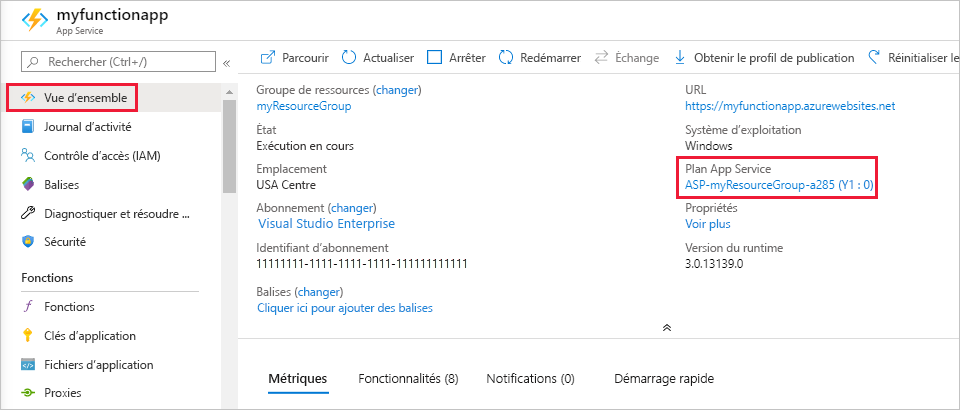

# <a name="manage-your-function-app"></a>Gérer votre application de fonction 

Dans Azure Functions, une Function App fournit le contexte d’exécution de vos fonctions individuelles. Les comportements de la Function App s’appliquent à toutes les fonctions hébergées par une Function App donnée. Toutes les fonctions d’une application de fonction doivent être exprimées dans le même [langage](supported-languages.md). 

Les fonctions individuelles dans une application de fonction sont déployées ensemble et sont mises à l’échelle ensemble. Toutes les fonctions de la même application de fonction partagent les ressources, par instance, à mesure que l’application de fonction est mise à l’échelle. 

Les chaînes de connexion, les variables d’environnement et d’autres paramètres d’application sont définis séparément pour chaque application de fonction. Toutes les données qui doivent être partagées entre les applications de fonction doivent être stockées en externe dans un magasin persistant.

## <a name="get-started-in-the-azure-portal"></a>Bien démarrer dans le portail Azure

1. Commencez par accéder au [Azure portal] et connectez-vous à votre compte Azure. Dans la barre de recherche en haut du portail, tapez le nom de votre application de fonction et sélectionnez-la dans la liste. 

2. Sous **Paramètres** dans le volet gauche, sélectionnez **Configuration**.

    :::image type="content" source="./media/functions-how-to-use-azure-function-app-settings/azure-function-app-main.png" alt-text="Vue d’ensemble de l’application de fonction dans le Portail Azure":::

Vous pouvez accéder à tout ce dont vous avez besoin pour gérer votre application de fonction à partir de la page Vue d’ensemble, en particulier les **[paramètres de l’application](#settings)** et les **[fonctionnalités de la plateforme](#platform-features)** .

## <a name="work-with-application-settings"></a><a name="settings"></a>Utilisation de paramètres d’application

Vous pouvez gérer les paramètres d’application à partir du [portail Azure](functions-how-to-use-azure-function-app-settings.md?tabs=portal#settings), ainsi qu’à l’aide d’[Azure CLI](functions-how-to-use-azure-function-app-settings.md?tabs=azurecli#settings) et d’[Azure PowerShell](functions-how-to-use-azure-function-app-settings.md?tabs=powershell#settings). Vous pouvez également gérer les paramètres d’application à partir de [Visual Studio Code](functions-develop-vs-code.md#application-settings-in-azure) et de [Visual Studio](functions-develop-vs.md#function-app-settings). 

Ces paramètres sont stockés sous forme chiffrée. Pour en savoir plus, consultez [Sécurité des paramètres d’application](security-concepts.md#application-settings).

# <a name="portal"></a>[Portail](#tab/portal)

Pour trouver les paramètres d’application, consultez [Bien démarrer dans le portail Azure](#get-started-in-the-azure-portal). 

L’onglet **Paramètres de l’application** conserve les paramètres qui sont utilisés par votre application de fonction. Vous devez sélectionner **Afficher les valeurs** pour voir les valeurs dans le portail. Pour ajouter un paramètre dans le portail, sélectionnez **Nouveau paramètre d’application** et ajoutez la nouvelle paire clé-valeur.


# <a name="azure-cli"></a>[Azure CLI](#tab/azurecli)

La commande [`az functionapp config appsettings list`](/cli/azure/functionapp/config/appsettings#az_functionapp_config_appsettings_list) retourne les paramètres d’application existants, comme dans l’exemple suivant :

```azurecli-interactive
az functionapp config appsettings list --name <FUNCTION_APP_NAME> \
--resource-group <RESOURCE_GROUP_NAME>
```

La commande [`az functionapp config appsettings set`](/cli/azure/functionapp/config/appsettings#az_functionapp_config_appsettings_set) ajoute ou met à jour un paramètre d’application. L’exemple suivant crée un paramètre avec une clé nommée `CUSTOM_FUNCTION_APP_SETTING` et la valeur `12345` :


```azurecli-interactive
az functionapp config appsettings set --name <FUNCTION_APP_NAME> \
--resource-group <RESOURCE_GROUP_NAME> \
--settings CUSTOM_FUNCTION_APP_SETTING=12345
```

# <a name="azure-powershell"></a>[Azure PowerShell](#tab/powershell)

La cmdlet [`Get-AzFunctionAppSetting`](/powershell/module/az.functions/get-azfunctionappsetting) retourne les paramètres d’application existants, comme dans l’exemple suivant : 

```azurepowershell-interactive
Get-AzFunctionAppSetting -Name <FUNCTION_APP_NAME> -ResourceGroupName <RESOURCE_GROUP_NAME>
```

La commande [`Update-AzFunctionAppSetting`](/powershell/module/az.functions/update-azfunctionappsetting) ajoute ou met à jour un paramètre d’application. L’exemple suivant crée un paramètre avec une clé nommée `CUSTOM_FUNCTION_APP_SETTING` et la valeur `12345` :

```azurepowershell-interactive
Update-AzFunctionAppSetting -Name <FUNCTION_APP_NAME> -ResourceGroupName <RESOURCE_GROUP_NAME> -AppSetting @{"CUSTOM_FUNCTION_APP_SETTING" = "12345"}
```

---

### <a name="use-application-settings"></a>Utiliser des paramètres d’application

[!INCLUDE [functions-environment-variables](../../includes/functions-environment-variables.md)]

Quand vous développez une application de fonction localement, vous devez conserver des copies locales de ces valeurs dans le fichier de projet local.settings.json. Pour plus d’informations, consultez [Fichier de paramètres locaux](functions-run-local.md#local-settings-file).

## <a name="hosting-plan-type"></a>Type de plan d’hébergement

Lorsque vous créez une application de fonction, vous créez également un plan d’hébergement dans lequel elle s’exécute. Un plan peut comporter une ou plusieurs applications de fonction. Les fonctionnalités, la mise à l’échelle et le tarif des fonctions dépendent du type de plan. Pour en savoir plus, consultez [Options d’hébergement Azure Functions](functions-scale.md).

Vous pouvez déterminer le type de plan utilisé par votre application de fonction sur le Portail Azure, avec l’API Azure CLI ou avec l’API Azure PowerShell. 

Les valeurs suivantes indiquent le type de plan :

| Type de plan | Portail | Azure CLI/PowerShell |
| --- | --- | --- |
| [Consommation](consumption-plan.md) | **Consommation** | `Dynamic` |
| [Premium](functions-premium-plan.md) | **ElasticPremium** | `ElasticPremium` |
| [Dédié (App Service)](dedicated-plan.md) | Divers | Divers |

# <a name="portal"></a>[Portail](#tab/portal)

Pour identifier le type de plan utilisé par votre application de fonction, consultez **Plan App Service** dans l’onglet **Vue d’ensemble** correspondant à l’application de fonction sur le [Portail Azure](https://portal.azure.com). Pour afficher le niveau tarifaire, sélectionnez le nom **Plan App Service**, puis sélectionnez **Propriétés** dans le volet de gauche.



# <a name="azure-cli"></a>[Azure CLI](#tab/azurecli)

Exécutez la commande Azure CLI suivante pour connaître le type de votre plan d’hébergement :

```azurecli-interactive
functionApp=<FUNCTION_APP_NAME>
resourceGroup=FunctionMonitoringExamples
appServicePlanId=$(az functionapp show --name $functionApp --resource-group $resourceGroup --query appServicePlanId --output tsv)
az appservice plan list --query "[?id=='$appServicePlanId'].sku.tier" --output tsv

```  

Dans l’exemple précédent, remplacez respectivement `<RESOURCE_GROUP>` et `<FUNCTION_APP_NAME>` par le nom du groupe de ressources et celui de l’application de fonction. 

# <a name="azure-powershell"></a>[Azure PowerShell](#tab/powershell)

Exécutez la commande Azure PowerShell suivante pour connaître le type de votre plan d’hébergement :

```azurepowershell-interactive
$FunctionApp = '<FUNCTION_APP_NAME>'
$ResourceGroup = '<RESOURCE_GROUP>'

$PlanID = (Get-AzFunctionApp -ResourceGroupName $ResourceGroup -Name $FunctionApp).AppServicePlan
(Get-AzFunctionAppPlan -Name $PlanID -ResourceGroupName $ResourceGroup).SkuTier
```
Dans l’exemple précédent, remplacez respectivement `<RESOURCE_GROUP>` et `<FUNCTION_APP_NAME>` par le nom du groupe de ressources et celui de l’application de fonction. 

---

## <a name="plan-migration"></a>Planifier la migration

Vous pouvez utiliser des commandes d’Azure CLI pour migrer une application de fonction entre un plan Consommation et un plan Premium sur Windows. Les commandes spécifiques dépendent de la direction de la migration. La migration directe vers un plan (App Service) dédié n’est pas prise en charge actuellement.

La migration n'est pas prise en charge sur Linux.

### <a name="consumption-to-premium"></a>De Consommation vers Premium

Procédez comme suit pour opérer la migration d’un plan Consommation vers un plan Premium sur Windows :

1. Exécutez la commande suivante pour créer un plan App Service (Élastique Premium) dans la même région et le même groupe de ressources que votre application de fonction existante.  

    ```azurecli-interactive
    az functionapp plan create --name <NEW_PREMIUM_PLAN_NAME> --resource-group <MY_RESOURCE_GROUP> --location <REGION> --sku EP1
    ```

1. Exécutez la commande suivante pour migrer l’application de fonction existante vers le nouveau plan Premium

    ```azurecli-interactive
    az functionapp update --name <MY_APP_NAME> --resource-group <MY_RESOURCE_GROUP> --plan <NEW_PREMIUM_PLAN>
    ```

1. Si vous n’avez plus besoin de votre plan d’application de fonction Consommation précédent, supprimez votre plan d’application de fonction d’origine après avoir vérifié que vous avez effectué la migration vers le nouveau plan. Exécutez la commande suivante pour obtenir la liste de tous les plans Consommation dans votre groupe de ressources.

    ```azurecli-interactive
    az functionapp plan list --resource-group <MY_RESOURCE_GROUP> --query "[?sku.family=='Y'].{PlanName:name,Sites:numberOfSites}" -o table
    ```

    Vous pouvez supprimer en toute sécurité le plan contenant zéro site, qui est celui à partir duquel vous avez opéré la migration.

1. Exécutez la commande suivante pour supprimer le plan Consommation à partir duquel vous avez opéré la migration.

    ```azurecli-interactive
    az functionapp plan delete --name <CONSUMPTION_PLAN_NAME> --resource-group <MY_RESOURCE_GROUP>
    ```

### <a name="premium-to-consumption"></a>De Premium vers Consommation

Utilisez la procédure suivante pour migrer un plan Premium vers un plan Consommation sur Windows :

1. Exécutez la commande suivante pour créer une application de fonction (Consommation) dans la même région et le même groupe de ressources que votre application de fonction existante. Cette commande crée également un plan Consommation dans lequel l’application de fonction s’exécute.

    ```azurecli-interactive
    az functionapp create --resource-group <MY_RESOURCE_GROUP> --name <NEW_CONSUMPTION_APP_NAME> --consumption-plan-location <REGION> --runtime dotnet --functions-version 3 --storage-account <STORAGE_NAME>
    ```

1. Exécutez la commande suivante pour migrer l’application de fonction existante vers le nouveau plan Consommation.

    ```azurecli-interactive
    az functionapp update --name <MY_APP_NAME> --resource-group <MY_RESOURCE_GROUP> --plan <NEW_CONSUMPTION_PLAN>
    ```

1. Supprimez l’application de fonction que vous avez créée à l’étape 1, car vous n’avez besoin que du plan créé pour exécuter l’application de fonction existante.

    ```azurecli-interactive
    az functionapp delete --name <NEW_CONSUMPTION_APP_NAME> --resource-group <MY_RESOURCE_GROUP>
    ```

1. Si vous n’avez plus besoin de votre plan d’application de fonction Premium précédent, supprimez votre plan d’application de fonction d’origine après avoir vérifié que vous avez effectué la migration vers le nouveau plan. Veuillez noter que si le plan n’est pas supprimé, vous serez toujours facturé pour le plan Premium. Exécutez la commande suivante pour obtenir la liste de tous les plans Premium dans votre groupe de ressources.

    ```azurecli-interactive
    az functionapp plan list --resource-group <MY_RESOURCE_GROUP> --query "[?sku.family=='EP'].{PlanName:name,Sites:numberOfSites}" -o table
    ```

1. Exécutez la commande suivante pour supprimer le plan Premium à partir duquel vous avez opéré la migration.

    ```azurecli-interactive
    az functionapp plan delete --name <PREMIUM_PLAN> --resource-group <MY_RESOURCE_GROUP>
    ```

## <a name="platform-features"></a>Fonctionnalités de la plate-forme

Les applications de fonction s’exécutent dans la plateforme Azure App Service et y sont entretenues. Par conséquent, vos Function Apps ont accès à la plupart des fonctionnalités de la plateforme d’hébergement web principale d’Azure. Dans le volet de gauche, vous pouvez accéder aux nombreuses fonctionnalités de la plateforme App Service que vous pouvez utiliser dans vos applications de fonction. 

> [!NOTE]
> Toutes les fonctionnalités App Service ne sont pas disponibles quand une Function App s’exécute dans le cadre du plan d’hébergement Consommation.

Le reste de ce article se concentre sur les fonctionnalités App Service du portail Azure qui sont utiles pour Functions :

+ [Éditeur App Service](#editor)
+ [Console](#console)
+ [Outils avancés (Kudu)](#kudu)
+ [Options de déploiement](#deployment)
+ [CORS](#cors)
+ [Authentification](#auth)

Pour plus d’informations sur l’utilisation des paramètres App Service, consultez [Configurer des applications web dans Azure App Service](../app-service/configure-common.md).

### <a name="app-service-editor"></a><a name="editor"></a>Éditeur App Service


L’éditeur App Service est un éditeur avancé intégré au portail. Vous pouvez l’utiliser pour modifier les fichiers de configuration JSON et les fichiers de code. L’activation de cette option entraîne l’ouverture d’un onglet distinct du navigateur avec un éditeur de base. Vous pouvez ainsi l’intégrer au référentiel GitHub, exécuter et déboguer du code et modifier les paramètres de Function App. Cet éditeur fournit un environnement de développement amélioré pour vos fonctions en comparaison avec l’éditeur de fonction intégré.  

Nous vous recommandons d’envisager de développer vos fonctions sur votre ordinateur local. Quand vous développez localement et publiez sur Azure, vos fichiers projet sont en lecture seule dans le portail. Pour en savoir plus, consultez [Coder et tester Azure Functions localement](functions-develop-local.md).

### <a name="console"></a><a name="console"></a>Console


La console intégrée au portail est un outil de développement idéal lorsque vous souhaitez interagir avec Function App à partir de la ligne de commande. Les commandes courantes incluent la création de fichiers et de répertoires et la navigation, ainsi que l’exécution de scripts et de fichiers de commandes. 

Quand vous développez localement, nous vous recommandons d’utiliser [Azure Functions Core Tools](functions-run-local.md) et [Azure CLI].

### <a name="advanced-tools-kudu"></a><a name="kudu"></a>Outils avancés (Kudu)


Les outils avancés pour App Service (également appelé Kudu) donnent accès aux fonctionnalités d’administration avancées de votre Function App. Dans Kudu, vous pouvez gérer les informations système, les paramètres d’application, les variables d’environnement, les extensions de site, les en-têtes HTTP et les variables de serveur. Vous pouvez également lancer **Kudu** en naviguant vers le point de terminaison SCM pour votre Function App, comme `https://<myfunctionapp>.scm.azurewebsites.net/`. 


### <a name="deployment-center"></a><a name="deployment"></a>Centre de déploiement

Quand vous utilisez une solution de contrôle de code source pour développer et gérer le code de vos fonctions, le centre de déploiement vous permet de générer et de déployer à partir du contrôle de code source. Votre projet est généré et déployé sur Azure quand vous effectuez des mises à jour. Pour plus d’informations, consultez [Technologies de déploiement dans Azure Functions](functions-deployment-technologies.md).

### <a name="cross-origin-resource-sharing"></a><a name="cors"></a>Partage des ressources cross-origin

Pour empêcher l’exécution de code malveillant sur le client, les navigateurs modernes bloquent les requêtes des applications web vers les ressources qui s’exécutent dans un domaine distinct. Le [partage des ressources cross-origin (CORS)](https://developer.mozilla.org/docs/Web/HTTP/CORS) permet à un en-tête `Access-Control-Allow-Origin` de déclarer les origines autorisées à appeler des points de terminaison sur votre application de fonction.

#### <a name="portal"></a>Portail

Quand vous configurez la liste **Origines autorisées** pour votre application de fonction, l’en-tête `Access-Control-Allow-Origin` est automatiquement ajouté à toutes les réponses des points de terminaison HTTP dans votre application de fonction. 


Quand le caractère générique (`*`) est utilisé, tous les autres domaines sont ignorés. 

Utilisez la commande [`az functionapp cors add`](/cli/azure/functionapp/cors#az_functionapp_cors_add) pour ajouter un domaine à la liste des origines autorisées. L’exemple suivant ajoute le domaine contoso.com :

```azurecli-interactive
az functionapp cors add --name <FUNCTION_APP_NAME> \
--resource-group <RESOURCE_GROUP_NAME> \
--allowed-origins https://contoso.com
```

Utilisez la commande [`az functionapp cors show`](/cli/azure/functionapp/cors#az_functionapp_cors_show) pour lister les origines autorisées actuelles.

### <a name="authentication"></a><a name="auth"></a>Authentification


Lorsque les fonctions utilisent un déclencheur HTTP, vous pouvez exiger l’authentification préalable des appels. App Service prend en charge l’authentification Azure Active Directory et la connexion avec des fournisseurs sociaux tels que Facebook, Microsoft et Twitter. Pour plus d’informations sur la configuration de fournisseurs d’authentification spécifiques, consultez [Azure App Service authentication overview](../app-service/overview-authentication-authorization.md) (Vue d’ensemble de l’authentification Azure App Service). 


## <a name="next-steps"></a>Étapes suivantes

+ [Configurer des applications web dans Azure App Service](../app-service/configure-common.md)
+ [Déploiement continu pour Azure Functions](functions-continuous-deployment.md)

[Azure CLI]: /cli/azure/
[Azure portal]: https://portal.azure.com
