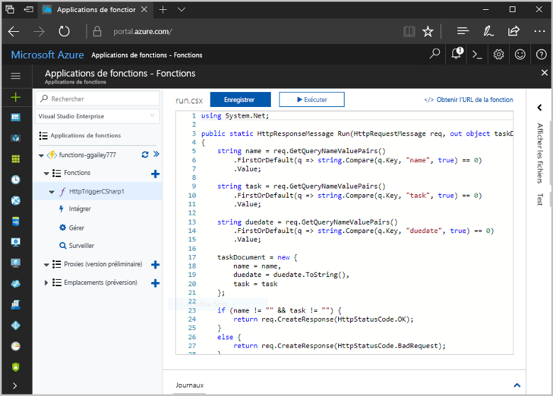
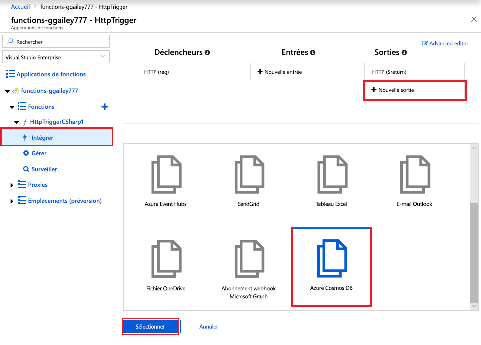
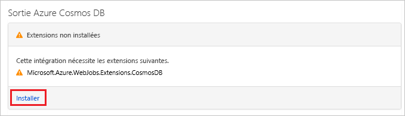
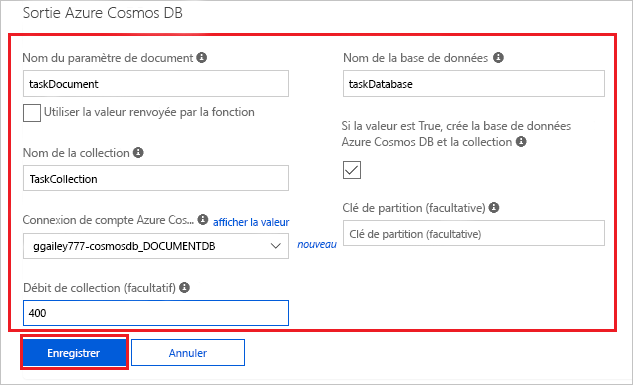
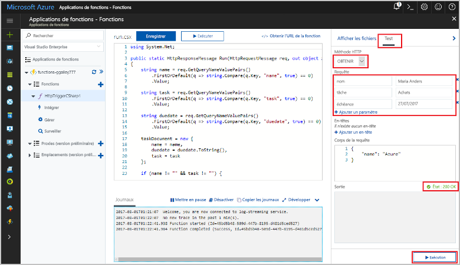
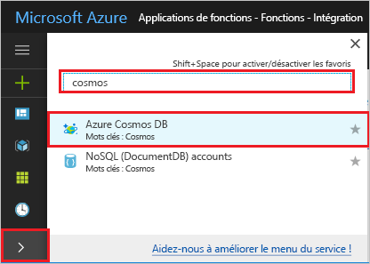
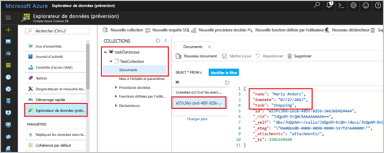

# <a name="store-unstructured-data-using-azure-functions-and-azure-cosmos-db"></a>Stocker des données non structurées à l’aide d’Azure Cosmos DB et d’Azure Functions

[Azure Cosmos DB](https://azure.microsoft.com/services/cosmos-db/) est un excellent moyen de stocker des données JSON et non structurées. Combiné à Azure Functions, Cosmos DB rend le stockage de données simple et rapide avec beaucoup moins de code que pour stocker des données dans une base de données relationnelle.

> [!NOTE]
> À l’heure actuelle, le déclencheur Azure Cosmos DB, les liaisons d’entrée et les liaisons de sortie fonctionnent uniquement avec les comptes d’API SQL et d’API Graph.

Dans Azure Functions, les liaisons d’entrée et de sortie fournissent une méthode déclarative pour se connecter à des données de service externe à partir de votre fonction. Dans cet article, découvrez comment mettre à jour une fonction existante pour ajouter une liaison de sortie qui stocke des données non structurées dans un document Azure Cosmos DB.



## <a name="prerequisites"></a>Conditions préalables requises

Pour suivre ce tutoriel :

[!INCLUDE [Previous quickstart note](../../includes/functions-quickstart-previous-topics.md)]

## <a name="create-an-azure-cosmos-db-account"></a>Création d’un compte Azure Cosmos DB

Vous devez disposer d’un compte Azure Cosmos DB qui utilise l’API SQL avant de créer la liaison de sortie.

[!INCLUDE [cosmos-db-create-dbaccount](../../includes/cosmos-db-create-dbaccount.md)]

## <a name="add-an-output-binding"></a>Ajouter une liaison de sortie

1. Dans le portail, accédez à l’application de fonction que vous avez créée précédemment, puis développez votre application de fonction et votre fonction.

1. Sélectionnez **Intégrer** et **+ Nouvelle sortie**, en haut à droite de la page. Choisissez **Azure Cosmos DB**, puis cliquez sur **Sélectionner**.

    

1. Si vous obtenez un message **Extensions non installées**, choisissez **Installer** pour installer l’extension de liaisons Azure Cosmos DB dans l’application de fonction. L’installation peut prendre une à deux minutes.

    

1. Utilisez les paramètres de la **sortie Azure Cosmos** comme spécifié dans le tableau :

    

    | Paramètre      | Valeur suggérée  | Description                                |
    | ------------ | ---------------- | ------------------------------------------ |
    | **Nom du paramètre de document** | taskDocument | Nom qui fait référence à l’objet Cosmos DB dans le code. |
    | **Nom de la base de données** | taskDatabase | Nom de la base de données pour l’enregistrement des documents. |
    | **Nom de la collection** | TaskCollection | Nom de la collection de bases de données. |
    | **Si la valeur est true, crée la collection et la base de données Cosmos DB** | Activé | La collection n’existe pas, vous devez la créer. |
    | **Connexion de compte Azure Cosmos DB** | Nouveau paramètre | Sélectionnez **Nouveau**, puis choisissez votre **Abonnement**, le **Compte de base de données** que vous avez créé précédemment, puis **Sélectionner**. Crée un paramètre d’application pour votre connexion de compte. Ce paramètre est utilisé par la liaison pour se connecter à la base de données. |
    | **Débit de collection** |400 RU| Si vous souhaitez réduire la latence, vous pourrez augmenter le débit par la suite. |

1. Sélectionnez **Enregistrer** pour créer la liaison.

## <a name="update-the-function-code"></a>Mettre à jour le code de fonction

Remplacez le code de fonction existant par le code suivant, dans le langage de votre choix :

# <a name="c"></a>[C#](#tab/csharp)

Remplacez la fonction C# existante par le code suivant :

```csharp
#r "Newtonsoft.Json"

using Microsoft.AspNetCore.Mvc;
using Microsoft.AspNetCore.Http;
using Microsoft.Extensions.Logging;

public static IActionResult Run(HttpRequest req, out object taskDocument, ILogger log)
{
    string name = req.Query["name"];
    string task = req.Query["task"];
    string duedate = req.Query["duedate"];

    // We need both name and task parameters.
    if (!string.IsNullOrEmpty(name) && !string.IsNullOrEmpty(task))
    {
        taskDocument = new
        {
            name,
            duedate,
            task
        };

        return (ActionResult)new OkResult();
    }
    else
    {
        taskDocument = null;
        return (ActionResult)new BadRequestResult();
    }
}
```

# <a name="javascript"></a>[JavaScript](#tab/javascript)

Remplacez la fonction JavaScript existante par le code suivant :

```js
module.exports = async function (context, req) {

    // We need both name and task parameters.
    if (req.query.name && req.query.task) {

        // Set the output binding data from the query object.
        context.bindings.taskDocument = req.query;

        // Success.
        context.res = {
            status: 200
        };
    }
    else {
        context.res = {
            status: 400,
            body: "The query options 'name' and 'task' are required."
        };
    }
};
```
---

Cet exemple de code lit les chaînes de requête HTTP et les assigne aux champs de l’objet `taskDocument`. La liaison `taskDocument` envoie les données d’objet de ce paramètre de liaison pour les stocker dans la base de données du document lié. La base de données est créée la première fois que la fonction s’exécute.

## <a name="test-the-function-and-database"></a>Tester la fonction et la base de données

1. Développez la fenêtre de droite et sélectionnez **Test**. Sous **Requête**, cliquez sur **+ Ajouter un paramètre** et ajoutez les paramètres suivants à la chaîne de requête :

    + `name`
    + `task`
    + `duedate`

1. Cliquez sur **Exécuter** et vérifiez que l’état 200 est renvoyé.

    

1. Sur le côté gauche du portail Azure, développez la barre d’icônes, tapez `cosmos` dans le champ de recherche, puis sélectionnez **Azure Cosmos DB**.

    

1. Sélectionnez votre compte Azure Cosmos DB, puis sélectionnez **Explorateur de données**.

1. Développez les nœuds **Collections**, sélectionnez le nouveau document et confirmez que le document contient des valeurs de votre chaîne de requête, ainsi que des métadonnées supplémentaires.

    

Vous êtes parvenu à ajouter une liaison à votre déclencheur HTTP pour stocker des données non structurées dans une base de données Azure Cosmos DB.

[!INCLUDE [Clean-up section](../../includes/clean-up-section-portal.md)]

## <a name="next-steps"></a>Étapes suivantes

Pour en savoir plus sur la liaison vers une base de données Cosmos DB, consultez la page [Liaisons Cosmos DB Azure Functions](functions-bindings-cosmosdb.md).

[!INCLUDE [functions-quickstart-next-steps](../../includes/functions-quickstart-next-steps-2.md)]
