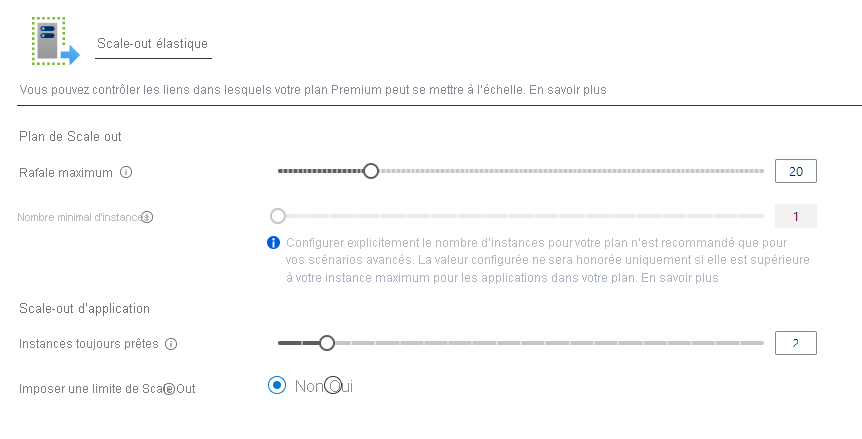

# <a name="azure-functions-premium-plan"></a>Plan Premium Azure Functions

Le plan Azure Functions Premium (parfois appelé plan Elastic Premium) est une option d'hébergement destinée aux applications de fonction. Pour d’autres options de plan d’hébergement, consultez l’[article sur le plan d’hébergement](functions-scale.md).

L’hébergement du plan Premium offre les avantages suivants à vos fonctions :

* Éviter les démarrages à froid grâce à des instances perpétuellement chaudes
* Connectivité de réseau virtuel.
* Durée d’exécution illimitée, avec 60 minutes garanties.
* Tailles d’instance premium : instances à un, deux et quatre cœurs.
* Tarification plus prévisible, comparée au plan de consommation.
* Allocation d’application à haute densité pour les plans avec plusieurs Function App.

Quand vous utilisez le plan Premium, les instances de l’hôte Azure Functions sont ajoutées et supprimées en fonction du nombre d’événements entrants, comme avec le [plan Consommation](consumption-plan.md). Plusieurs applications de fonction peuvent être déployées sur le même plan Premium, et celui-ci vous permet de configurer la taille d’instance de calcul, la taille du plan de base et taille maximale de plan. 

## <a name="billing"></a>Facturation

La facturation du plan Premium se base sur le nombre de cœurs-seconde et la mémoire utilisée sur toutes les instances. Cette facturation diffère du plan de consommation, qui est facturé en fonction de l’exécution et de la mémoire consommée. Il n’y a pas de frais d’exécution avec le plan Premium. Au moins une instance doit être allouée en permanence par plan. Il en résulte un coût mensuel minimum par plan actif, que la fonction soit active ou inactive. Gardez à l’esprit que toutes les applications de fonction d’un plan Premium partagent les instances allouées. Pour en savoir plus, consultez la [page de tarification Azure Functions](https://azure.microsoft.com/pricing/details/functions/).

## <a name="create-a-premium-plan"></a>Créer un plan Premium

Lorsque vous créez une application de fonction dans le portail Azure, le plan de consommation est sélectionné par défaut. Pour créer une application de fonction qui s’exécute dans un plan Premium, vous devez créer explicitement un plan de App Service à l’aide de l’une des références SKU _Premium élastiques_. L’application de fonction que vous créez est ensuite hébergée dans ce plan. Le portail Azure permet de créer facilement à la fois le plan Premium et l’application de fonction. Vous pouvez exécuter plusieurs applications de fonction dans le même plan Premium, mais elles s’exécutent toutes les deux sur le même système d’exploitation (Windows ou Linux). 

Les articles suivants vous montrent comment créer une application de fonction avec un plan Premium, par programmation ou dans le portail Azure :

+ [Azure portal](create-premium-plan-function-app-portal.md)
+ [Azure CLI](scripts/functions-cli-create-premium-plan.md)
+ [Modèle Azure Resource Manager](functions-infrastructure-as-code.md#deploy-on-premium-plan)

## <a name="eliminate-cold-starts"></a>Éliminer les démarrages à froid

Lorsque des événements ou des exécutions ne se produisent pas dans le plan Consommation, il se peut que votre application effectue une mise à l'échelle jusqu’à zéro instance. Quand de nouveaux événements se produisent, une nouvelle instance doit être spécialisée avec votre application s’exécutant sur celle-ci. La spécialisation d’une nouvelle instance peut prendre un certain temps en fonction de l’application. Cette latence supplémentaire du premier appel est souvent appelée _démarrage à froid_ d’application.

Le plan Premium fournit deux fonctionnalités qui opèrent ensemble pour éliminer efficacement les démarrages à froid dans vos fonctions : les _instances toujours prêtes_ et les _instances préchauffées_. 

### <a name="always-ready-instances"></a>Instances toujours prêtes

Dans le plan Premium, vous pouvez faire en sorte que votre application soit toujours prête sur un nombre spécifié d’instances. Le nombre maximal d’instances toujours prêtes est de 20. Quand l’application commence à déclencher des événements, ceux-ci sont d’abord routés vers les instances toujours prêtes. Dès que la fonction devient active, des instances supplémentaires sont initialisées en tant que mémoire tampon. Cette mémoire tampon empêche le démarrage à froid des nouvelles instances nécessaires pendant la mise à l’échelle. Ces instances mises en mémoire tampon s’appellent des [instances préchauffées](#pre-warmed-instances). L’association des instances toujours prêtes combinées à une mémoire tampon préchauffée permet en quelque sorte à votre application d’éliminer le démarrage à froid.

> [!NOTE]
> Chaque plan Premium dispose en permanence d’au moins une instance active (facturée).

# <a name="portal"></a>[Portail](#tab/portal)

Vous pouvez configurer le nombre d’instances toujours prêtes sur le portail Azure en sélectionnant votre **application de fonction**, en accédant à l’onglet **Fonctionnalités de la plateforme**, puis en sélectionnant les options **Monter en charge**. Dans la fenêtre de modification de l’application de fonction, les instances toujours prêtes sont propres à cette application.



# <a name="azure-cli"></a>[Azure CLI](#tab/azurecli)

Vous pouvez aussi configurer des instances toujours prêtes pour une application avec Azure CLI.

```azurecli-interactive
az resource update -g <resource_group> -n <function_app_name>/config/web --set properties.minimumElasticInstanceCount=<desired_always_ready_count> --resource-type Microsoft.Web/sites
```
---

### <a name="pre-warmed-instances"></a>Instances préchauffées

Les instances préchauffées correspondent aux instances initialisées en tant que mémoire tampon à l’occasion d’événements de mise à l’échelle et d’activation. Les instances préchauffées continuent d’être mises en mémoire tampon tant que la limite maximale de scale-out n’est pas atteinte. Le nombre d’instances préchauffées par défaut est de 1, et dans la plupart des scénarios, cette valeur reste à 1.

Si une application demande un long temps de préparation (comme une image de conteneur personnalisée), vous devrez peut-être augmenter la capacité de cette mémoire tampon. Une instance préchauffée ne devient active qu’après que toutes les instances actives ont été suffisamment utilisées.

Pour illustrer la façon dont les instances toujours prêtes et les instances préchauffées fonctionnent ensemble, prenons l’exemple suivant. une application de fonction Premium compte cinq instances toujours prêtes configurées et une instance préchauffée (par défaut). Quand l’application est inactive et qu’aucun événement n’est déclenché, l’application est provisionnée et s’exécute sur cinq instances. À ce stade, vous n’êtes pas facturé pour une instance préchauffée, car les instances toujours prêtes ne sont pas utilisées et aucune instance préchauffée n’est encore allouée.

Dès que le premier déclencheur intervient, les cinq instances toujours prêtes s’activent et une instance préchauffée est allouée. L’application s’exécute maintenant avec six instances provisionnées : les cinq instances toujours prêtes désormais actives et la sixième mémoire tampon préchauffée et inactive. Si le rythme des exécutions continue d’augmenter, les cinq instances actives sont finalement utilisées. Quand la plateforme décide de procéder à une mise à l’échelle au-delà de cinq instances, elle englobe l’instance préchauffée. Dans ce cas, les instances actives sont au nombre de six et une septième instance est instantanément provisionnée et remplit la mémoire tampon préchauffée. Cette séquence de mise à l’échelle et de préchauffage se poursuit tant que le nombre maximal d’instances pour l’application n’est pas atteint. Aucune instance n’est préchauffée ou activée au-delà de la valeur maximale.

Vous pouvez modifier le nombre d’instances préchauffées pour une application à partir d’Azure CLI.

```azurecli-interactive
az resource update -g <resource_group> -n <function_app_name>/config/web --set properties.preWarmedInstanceCount=<desired_prewarmed_count> --resource-type Microsoft.Web/sites
```

### <a name="maximum-function-app-instances"></a>Instances d’applications de fonction maximales

En plus du [nombre maximal d’instances du plan](#plan-and-sku-settings), vous pouvez configurer un maximum par application. La valeur maximale d’une application peut être configurée en utilisant la [limite d’échelle de l’application](./event-driven-scaling.md#limit-scale-out).

## <a name="private-network-connectivity"></a>Connectivité de réseau privé

Les applications de fonction déployées sur un plan Premium peuvent tirer parti de [l’intégration de réseau virtuel pour les applications web](../app-service/web-sites-integrate-with-vnet.md). Une fois configurée, votre application peut communiquer avec des ressources de votre réseau virtuel ou sécurisées via des points de terminaison de service. Des restrictions d’adresse IP sont également disponibles sur l’application pour limiter le trafic entrant.

Lors de l’attribution d’un sous-réseau à votre Function App dans un plan Premium, vous avez besoin d’un sous-réseau avec suffisamment d’adresses IP pour chaque instance potentielle. Nous imposons un bloc d’au moins 100 adresses IP disponibles.

Pour plus d’informations, consultez [Intégrer votre application de fonction à un réseau virtuel](functions-create-vnet.md).

## <a name="rapid-elastic-scale"></a>Mise à l’échelle élastique rapide

Des instances de calcul supplémentaires sont automatiquement ajoutées pour votre application en utilisant la même logique de mise à l’échelle rapide que le Plan Consommation. Les applications du même plan App Service sont mises à l’échelle indépendamment les unes des autres en fonction des besoins d’une application individuelle. Toutefois, les applications Functions dans le même plan App Service partagent des ressources de machine virtuelle pour aider à réduire les coûts, lorsque cela est possible. Le nombre d’applications associées à une machine virtuelle dépend de l’encombrement de chaque application et de la taille de la machine virtuelle.

Pour en savoir plus sur le fonctionnement de la mise à l’échelle, consultez [Mise à l’échelle basée sur les événements dans Azure Functions](event-driven-scaling.md).

## <a name="longer-run-duration"></a>Durée d’exécution plus longue

Azure Functions dans un Plan Consommation est limité à 10 minutes par exécution. Dans le plan Premium, la durée d’exécution par défaut est de 30 minutes pour éviter toute perte de contrôle. Cependant, vous pouvez [modifier la configuration de host.json](./functions-host-json.md#functiontimeout) afin de rendre sa durée illimitée pour les applications du plan Premium. Quand la valeur est définie sur une durée illimitée, votre application de fonction est garantie pour s’exécuter pendant au moins 60 minutes. 

## <a name="plan-and-sku-settings"></a>Paramètres du plan et de la référence SKU

Pendant la création du plan, deux paramètres de taille de plan sont proposés : le nombre minimal d’instances (ou taille du plan) et la limite maximale en rafale.

Si votre application exige un nombre d’instances supérieur au nombre d’instances toujours prêtes, elle peut continuer d’effectuer un scale-out tant que le nombre d’instances n’a pas atteint la limite maximale en rafale. Vous serez facturé pour des instances au-delà de la taille de votre plan uniquement quand elles sont en cours d’exécution et vous sont allouées à la seconde. La plateforme s’efforce d’assurer le scale-out de votre application jusqu’à la limite maximale définie.

Vous pouvez configurer la taille et les nombres maximaux d’instances du plan via le portail Azure en sélectionnant les options **Scale-out** du plan ou une Function App déployée sur celui-ci (sous **Fonctionnalités de la plateforme**).

Vous pouvez également augmenter la limite maximale en rafale à partir d’Azure CLI :

```azurecli-interactive
az functionapp plan update -g <resource_group> -n <premium_plan_name> --max-burst <desired_max_burst>
```

La valeur minimale pour chaque plan sera d’au moins une instance. Le nombre minimal effectif d’instances sera automatiquement configuré en fonction du nombre d’instances toujours prêtes demandées par les applications du plan. Par exemple, si l’application A demande cinq instances toujours prêtes et que l’application B en demande deux dans le même plan, la taille minimale du plan calculée sera de cinq. L’application A s’exécutera sur les cinq instances et l’application B s’exécutera uniquement sur deux instances.

> [!IMPORTANT]
> Vous êtes facturé pour chaque instance allouée en lien avec le nombre minimal d’instances, que les fonctions s’exécutent ou non.

Dans la plupart des cas, ce minimum calculé automatiquement est suffisant. Cependant, si nécessaire, nous ferons de notre mieux pour assurer une mise à l’échelle au-delà du nombre minimal. Même si cela est peu probable, il est possible qu’à un moment donné, le scale-out soit retardé du fait de l’indisponibilité d’instances supplémentaires. En définissant un minimum supérieur au minimum calculé automatiquement, vous réservez des instances préalablement au scale-out.

Il est possible d’augmenter le minimum calculé d’un plan à partir d’Azure CLI.

```azurecli-interactive
az functionapp plan update -g <resource_group> -n <premium_plan_name> --min-instances <desired_min_instances>
```

### <a name="available-instance-skus"></a>Références SKU d’instance disponibles

Pendant la création ou la mise à l’échelle de votre plan, vous pouvez choisir entre trois tailles d’instance. Vous serez facturé en fonction du nombre total de cœurs et de mémoire approvisionnés, pour chaque seconde où chaque instance vous est allouée. Votre application peut automatiquement effectuer un scale-out sur plusieurs instances en fonction des besoins.

|SKU|Cœurs|Mémoire|Stockage|
|--|--|--|--|
|EP1|1|3,5 GO|250 Go|
|EP2|2|7 GO|250 Go|
|EP3|4|14 GO|250 Go|

### <a name="memory-usage-considerations"></a>Considérations liées à l’utilisation de la mémoire

L’exécution sur une machine avec davantage de mémoire ne signifie pas toujours que votre application de fonction utilise toute la mémoire disponible.

Par exemple, une application de fonction JavaScript est contrainte par la limite de mémoire par défaut dans Node.js. Pour augmenter cette limite de mémoire fixe, ajoutez le paramètre d’application `languageWorkers:node:arguments` avec la valeur `--max-old-space-size=<max memory in MB>`.

Et pour les plans avec plus de 4 Go de mémoire, vérifiez que le paramètre de nombre de bits de la plateforme est défini sur `64 Bit` sous [Paramètres généraux](../app-service/configure-common.md#configure-general-settings).

## <a name="region-max-scale-out"></a>Scale-out maximal par région

Vous trouverez ci-dessous les valeurs maximales de scale-out actuellement prises en charge pour un même plan dans chaque région et configuration de système d’exploitation. Pour demander une augmentation, vous pouvez ouvrir un ticket de support.

Consultez la disponibilité régionale complète de Functions sur le [site web Azure](https://azure.microsoft.com/global-infrastructure/services/?products=functions).

|Région| Windows | Linux |
|--| -- | -- |
|Centre de l’Australie| 100 | Non disponible |
|Centre de l’Australie 2| 100 | Non disponible |
|Australie Est| 100 | 20 |
|Sud-Australie Est | 100 | 20 |
|Brésil Sud| 100 | 20 |
|Centre du Canada| 100 | 20 |
|USA Centre| 100 | 20 |
|Chine orientale 2| 100 | 20 |
|Chine Nord 2| 100 | 20 |
|Asie Est| 100 | 20 |
|USA Est | 100 | 20 |
|USA Est 2| 100 | 20 |
|France Centre| 100 | 20 |
|Allemagne Centre-Ouest| 100 | Non disponible |
|Japon Est| 100 | 20 |
|OuJapon Est| 100 | 20 |
|Centre de la Corée| 100 | 20 |
|Corée du Sud| Non disponible | 20 |
|Centre-Nord des États-Unis| 100 | 20 |
|Europe Nord| 100 | 20 |
|Norvège Est| 100 | 20 |
|États-Unis - partie centrale méridionale| 100 | 20 |
|Inde Sud | 100 | Non disponible |
|Asie Sud-Est| 100 | 20 |
|Suisse Nord| 100 | Non disponible |
|Suisse Ouest| 100 | Non disponible |
|Sud du Royaume-Uni| 100 | 20 |
|Ouest du Royaume-Uni| 100 | 20 |
|Gouvernement des États-Unis - Arizona| 100 | 20 |
|USGov Virginia| 100 | 20 |
|USNat East| 100 | Non disponible |
|USNat West| 100 | Non disponible |
|Europe Ouest| 100 | 20 |
|Inde Ouest| 100 | 20 |
|Centre-USA Ouest| 100 | 20 |
|USA Ouest| 100 | 20 |
|USA Ouest 2| 100 | 20 |

## <a name="next-steps"></a>Étapes suivantes

> [!div class="nextstepaction"]
> [Comprendre les options d’hébergement d’Azure Functions](functions-scale.md)