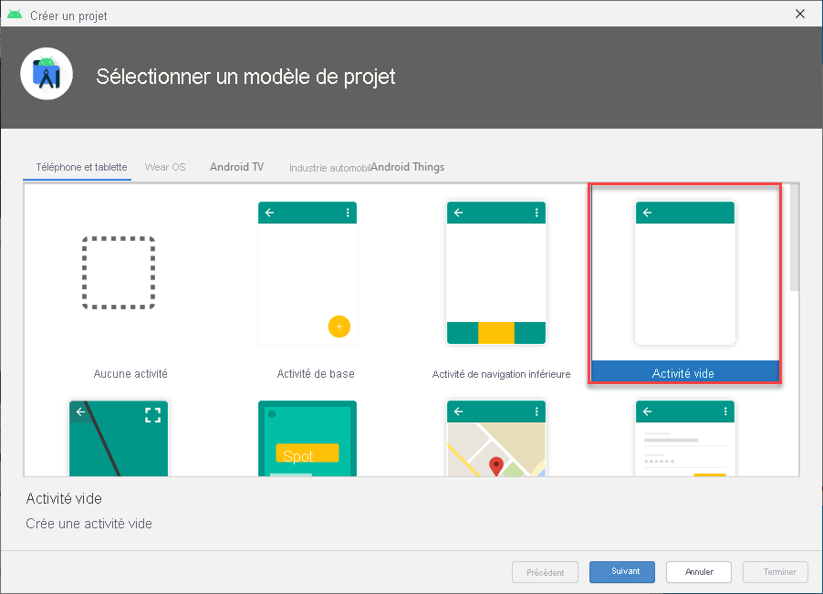
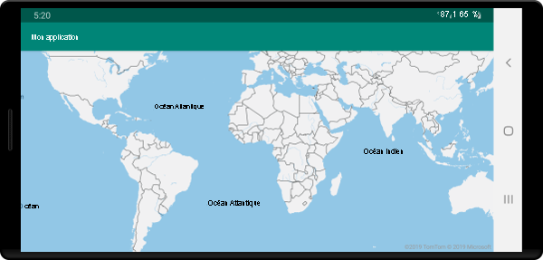

# <a name="quickstart-create-an-android-app-with-azure-maps"></a>Démarrage rapide : Créer une application Android avec Azure Maps

Cet article vous montre comment ajouter Azure Maps à une application Android. Il vous guide pas à pas durant ces étapes de base :

* Configurer votre environnement de développement.
* Créer votre propre compte Azure Maps.
* Récupérer votre clé Azure Maps primaire à utiliser dans l’application.
* Référencer les bibliothèques Azure Maps à partir du projet.
* Ajouter un contrôle Azure Maps à l’application.

## <a name="prerequisites"></a>Prérequis

1. Créez un compte Azure Maps en vous connectant au [portail Azure](https://portal.azure.com). Si vous n’avez pas d’abonnement Azure, créez un [compte gratuit](https://azure.microsoft.com/free/) avant de commencer.
2. [Créer un compte Azure Maps](quick-demo-map-app.md#create-an-azure-maps-account)
3. [Obtenir une clé d’abonnement principale](quick-demo-map-app.md#get-the-primary-key-for-your-account), également appelée clé primaire ou clé d’abonnement. Pour plus d’informations sur l’authentification dans Azure Maps, voir [Gérer l’authentification dans Azure Maps](how-to-manage-authentication.md).
4. [Téléchargez Android Studio](https://developer.android.com/studio/) gratuitement sur Google.

## <a name="create-an-azure-maps-account"></a>Créer un compte Azure Maps

Créez un compte Azure Maps en effectuant les étapes suivantes :

1. En haut à gauche du [portail Azure](https://portal.azure.com), cliquez sur **Créer une ressource**.
2. Dans la zone *Rechercher dans la Place de marché*, tapez **Azure Maps**.
3. Dans les *Résultats*, sélectionnez **Azure Maps**. Cliquez sur le bouton **Créer** qui s’affiche sous la carte.
4. Sur la page **Créer un compte Maps**, entrez les valeurs suivantes :
    * *L’Abonnement* à utiliser pour ce compte.
    * Le *Groupe de ressources* pour ce compte. Vous pouvez choisir de *Créer* ou d’utiliser un groupe de ressources *Existant*.
    * Le *Nom* de votre nouveau compte.
    * Le *niveau tarifaire* pour ce compte.
    * Lisez la *Licence* et la *Déclaration de confidentialité*, puis cochez la case pour accepter les conditions.
    * Cliquez sur le bouton **Créer**.

    :::image type="content" source="./media/quick-demo-map-app/create-account.png" alt-text="Créer un compte Maps sur le portail":::

## <a name="get-the-primary-key-for-your-account"></a>Obtenir la clé primaire de votre compte

Une fois le compte Maps créé, récupérez la clé principale qui vous permet d’interroger les API Maps.

1. Ouvrez votre compte Maps dans le portail.
2. Dans la section des paramètres, sélectionnez **Authentification**.
3. Copiez la **Clé primaire** dans le Presse-papiers. Enregistrez-la localement, vous l’utiliserez plus tard dans ce didacticiel.

>[!NOTE]
> Si vous utilisez la clé d’abonnement Azure au lieu de la clé primaire Azure Maps, votre carte ne s’affiche pas correctement. En outre, pour des raisons de sécurité, il est recommandé de permuter vos clés principale et secondaire. Pour permuter les clés, mettez à jour votre application pour utiliser la clé secondaire, déployez, puis appuyez sur le bouton cycle/actualiser en regard de la clé principale pour générer une nouvelle clé principale. L’ancienne clé principale est désactivée. Pour plus d’informations sur la permutation des clés, consultez [Configurer Azure Key Vault avec la permutation des clés et l’audit](../key-vault/secrets/tutorial-rotation-dual.md)


## <a name="create-a-project-in-android-studio"></a>Créer un projet dans Android Studio

Commencez par créer un projet avec une activité vide. Suivez ces étapes pour créer un projet Android Studio :

1. Sous **Choose your project** (Choisissez votre projet), sélectionnez **Phone and Tablet** (Téléphone et tablette). Votre application s’exécutera sur ce facteur de forme.
2. Dans l’onglet **Phone and Tablet** (Téléphone et tablette), sélectionnez **Empty Activity** (Activité vide), puis sélectionnez **Next** (Suivant).
3. Sous **Configurer votre projet**, sélectionnez `API 21: Android 5.0.0 (Lollipop)` comme SDK minimum. Il s’agit de la version minimale prise en charge par Android SDK Azure Maps.
4. Acceptez les valeurs par défaut `Activity Name` et `Layout Name`, puis cliquez sur **Finish** (Terminer).

Pour obtenir de l’aide supplémentaire sur l’installation d’Android Studio et la création d’un projet, consultez la [documentation Android Studio](https://developer.android.com/studio/intro/).



## <a name="set-up-a-virtual-device"></a>Configurer un appareil virtuel

Android Studio vous permet de configurer un appareil Android virtuel sur votre ordinateur. Cela peut vous aider à tester votre application pendant le développement. Pour configurer un appareil virtuel, sélectionnez l’icône du gestionnaire d’appareil virtuel Android (AVD, Android Virtual Device) dans le coin supérieur droit de votre écran de projet, puis sélectionnez **Create Virtual Device** (Créer un appareil virtuel). Vous pouvez également accéder au gestionnaire AVD en sélectionnant **Tools (Outils)**  > **Android** > **AVD Manager (Gestionnaire AVD)** à partir de la barre d’outils. Dans la catégorie **Phones** (Téléphones), sélectionnez **Nexus 5X** et cliquez sur **Next** (Suivant).

Pour en savoir plus sur la configuration d’un appareil virtuel Android, consultez la [documentation Android Studio](https://developer.android.com/studio/run/managing-avds).


## <a name="install-the-azure-maps-android-sdk"></a>Installer Android SDK Azure Maps

L’étape suivante de la création de votre application consiste à installer Android SDK Azure Maps. Pour installer le Kit de développement logiciel (SDK), procédez comme suit :

1. Ouvrez le fichier **build.gradle** de niveau supérieur et ajoutez le code suivant à la section de bloc **all projects** (tous les projets), **repositories** (référentiels) :

    ```gradle
    maven {
        url "https://atlas.microsoft.com/sdk/android"
    }
    ```

2. Modifiez l’élément **app/build.gradle** et ajoutez-y le code suivant :

    1. Assurez-vous que la version **minSdkVersion** de votre projet est l’API 21 ou une version ultérieure.

    2. Ajoutez le code suivant à la section Android :

        ```gradle
        compileOptions {
            sourceCompatibility JavaVersion.VERSION_1_8
            targetCompatibility JavaVersion.VERSION_1_8
        }
        ```

    3. Mettez à jour votre bloc de dépendances et ajoutez une nouvelle ligne de dépendance d’implémentation pour la dernière version d’Android SDK Azure Maps :

        ```gradle
        implementation "com.azure.android:azure-maps-control:1.0.0"
        ```

        > [!Note]
        > Vous pouvez définir le numéro de version sur « 0+ » afin que votre code pointe toujours vers la dernière version.

    4. Accédez à **Fichier** dans la barre d’outils, puis cliquez sur **Synchroniser le projet avec les fichiers Gradle**.
3. Ajoutez un fragment de carte à l’activité principale (res \> layout \> activity\_main.xml) :

    ```xml
    <com.azure.android.maps.control.MapControl
        android:id="@+id/mapcontrol"
        android:layout_width="match_parent"
        android:layout_height="match_parent"
        />
    ```

::: zone pivot="programming-language-java-android"

4. Dans le fichier **MainActivity.java**, vous devez :

    * Ajouter des importations pour le Kit de développement logiciel (SDK) Azure Maps
    * Définir vos informations d’authentification Azure Maps
    * Obtenir l’instance de contrôle de carte dans la méthode **onCreate**

    Si vous définissez les informations d’authentification sur la classe `AzureMaps` de façon globale à l’aide des méthodes `setSubscriptionKey` ou `setAadProperties`, vous n’aurez pas besoin d’ajouter vos informations d’authentification à chaque affichage.

    Le contrôle de carte contient ses propres méthodes de cycle de vie pour la gestion du cycle de vie OpenGL d’Android. Ces méthodes de cycle de vie doivent être appelées directement à partir de l’activité contenante. Pour que votre application appelle correctement les méthodes de cycle de vie du contrôle de carte, vous devez substituer les méthodes de cycle de vie suivantes dans l’activité qui contient le contrôle de carte. Vous devez aussi appeler la méthode de contrôle de carte correspondante.

    * `onCreate(Bundle)`
    * `onDestroy()`
    * `onLowMemory()`
    * `onPause()`
    * `onResume()`
    * `onSaveInstanceState(Bundle)`
    * `onStart()`
    * `onStop()`

    Modifiez le fichier **MainActivity.java** comme suit :

    ```java
    package com.example.myapplication;
    
    import androidx.appcompat.app.AppCompatActivity;
    import com.azure.android.maps.control.AzureMaps;
    import com.azure.android.maps.control.MapControl;
    import com.azure.android.maps.control.layer.SymbolLayer;
    import com.azure.android.maps.control.options.MapStyle;
    import com.azure.android.maps.control.source.DataSource;
    
    public class MainActivity extends AppCompatActivity {
        
    static {
        AzureMaps.setSubscriptionKey("<Your Azure Maps subscription key>");

        //Alternatively use Azure Active Directory authenticate.
        //AzureMaps.setAadProperties("<Your aad clientId>", "<Your aad AppId>", "<Your aad Tenant>");
    }

    MapControl mapControl;

    @Override
    protected void onCreate(Bundle savedInstanceState) {
        super.onCreate(savedInstanceState);
        setContentView(R.layout.activity_main);

        mapControl = findViewById(R.id.mapcontrol);

        mapControl.onCreate(savedInstanceState);

        //Wait until the map resources are ready.
        mapControl.onReady(map -> {
            //Add your post map load code here.

        });
    }

    @Override
    public void onResume() {
        super.onResume();
        mapControl.onResume();
    }

    @Override
    protected void onStart(){
        super.onStart();
        mapControl.onStart();
    }

    @Override
    public void onPause() {
        super.onPause();
        mapControl.onPause();
    }

    @Override
    public void onStop() {
        super.onStop();
        mapControl.onStop();
    }

    @Override
    public void onLowMemory() {
        super.onLowMemory();
        mapControl.onLowMemory();
    }

    @Override
    protected void onDestroy() {
        super.onDestroy();
        mapControl.onDestroy();
    }

    @Override
    protected void onSaveInstanceState(Bundle outState) {
        super.onSaveInstanceState(outState);
        mapControl.onSaveInstanceState(outState);
    }}
    ```

    > [!NOTE]
    > Après avoir accompli les étapes précédentes, vous pouvez recevoir des avertissements d’Android Studio concernant certaines parties du code. Pour résoudre ces avertissements, importez les classes référencées dans `MainActivity.java`.
    > Vous pouvez importer automatiquement ces classes en sélectionnant `Alt` + `Enter` (`Option` + `Return` sur un Mac).

::: zone-end

::: zone pivot="programming-language-kotlin"

4. Dans le fichier **MainActivity.kt**, vous devez :

    * Ajouter des importations pour le Kit de développement logiciel (SDK) Azure Maps
    * Définir vos informations d’authentification Azure Maps
    * Obtenir l’instance de contrôle de carte dans la méthode **onCreate**

    Si vous définissez les informations d’authentification sur la classe `AzureMaps` de façon globale à l’aide des méthodes `setSubscriptionKey` ou `setAadProperties`, vous n’aurez pas besoin d’ajouter vos informations d’authentification à chaque affichage.

    Le contrôle de carte contient ses propres méthodes de cycle de vie pour la gestion du cycle de vie OpenGL d’Android. Ces méthodes de cycle de vie doivent être appelées directement à partir de l’activité contenante. Pour que votre application appelle correctement les méthodes de cycle de vie du contrôle de carte, vous devez substituer les méthodes de cycle de vie suivantes dans l’activité qui contient le contrôle de carte. Vous devez aussi appeler la méthode de contrôle de carte correspondante.

    * `onCreate(Bundle)`
    * `onDestroy()`
    * `onLowMemory()`
    * `onPause()`
    * `onResume()`
    * `onSaveInstanceState(Bundle)`
    * `onStart()`
    * `onStop()`

    Modifiez le fichier **MainActivity.kt** comme suit :

    ```kotlin
    package com.example.myapplication;

    import androidx.appcompat.app.AppCompatActivity
    import android.os.Bundle
    import com.azure.android.maps.control.AzureMap
    import com.azure.android.maps.control.AzureMaps
    import com.azure.android.maps.control.MapControl
    import com.azure.android.maps.control.events.OnReady
    
    class MainActivity : AppCompatActivity() {
    
        companion object {
            init {
                AzureMaps.setSubscriptionKey("<Your Azure Maps subscription key>");
    
                //Alternatively use Azure Active Directory authenticate.
                //AzureMaps.setAadProperties("<Your aad clientId>", "<Your aad AppId>", "<Your aad Tenant>");
            }
        }
    
        var mapControl: MapControl? = null
    
        override fun onCreate(savedInstanceState: Bundle?) {
            super.onCreate(savedInstanceState)
            setContentView(R.layout.activity_main)
    
            mapControl = findViewById(R.id.mapcontrol)
    
            mapControl?.onCreate(savedInstanceState)
    
            //Wait until the map resources are ready.
            mapControl?.onReady(OnReady { map: AzureMap -> })
        }
    
        public override fun onStart() {
            super.onStart()
            mapControl?.onStart()
        }
    
        public override fun onResume() {
            super.onResume()
            mapControl?.onResume()
        }
    
        public override fun onPause() {
            mapControl?.onPause()
            super.onPause()
        }
    
        public override fun onStop() {
            mapControl?.onStop()
            super.onStop()
        }
    
        override fun onLowMemory() {
            mapControl?.onLowMemory()
            super.onLowMemory()
        }
    
        override fun onDestroy() {
            mapControl?.onDestroy()
            super.onDestroy()
        }
    
        override fun onSaveInstanceState(outState: Bundle) {
            super.onSaveInstanceState(outState)
            mapControl?.onSaveInstanceState(outState)
        }
    }
    ```

    > [!NOTE]
    > Après avoir accompli les étapes précédentes, vous pouvez recevoir des avertissements d’Android Studio concernant certaines parties du code. Pour résoudre ces avertissements, importez les classes référencées dans `MainActivity.kt`.
    > Vous pouvez importer automatiquement ces classes en sélectionnant `Alt` + `Enter` (`Option` + `Return` sur un Mac).

::: zone-end

5. Sélectionnez le bouton d’exécution comme illustré dans la figure suivante (ou appuyez sur `Control` + `R` sur un Mac) pour générer votre application.

    

La création de l’application par Android Studio prend quelques secondes. Une fois la création terminée, vous pouvez tester votre application dans l’appareil Android émulé. La carte doit ressembler à ceci :



## <a name="clean-up-resources"></a>Nettoyer les ressources

>[!WARNING]
> Les tutoriels répertoriés dans la section [Étapes suivantes](#next-steps) expliquent en détail comment utiliser et configurer Azure Maps avec votre compte. Si vous souhaitez suivre les tutoriels, ne nettoyez pas les ressources créées dans ce guide de démarrage rapide.

Sinon, effectuez ces étapes pour nettoyer les ressources :

1. Fermez Android Studio, puis supprimez l’application que vous avez créée.
2. Si vous avez testé l’application sur un appareil externe, désinstallez l’application de cet appareil.

Si vous n’envisagez pas de continuer à développer avec Android SDK Azure Maps :

1. Accédez à la page du portail Azure. Sélectionnez **Toutes les ressources** dans la page principale du portail. Ou cliquez sur l’icône de menu dans le coin supérieur gauche. Sélectionnez **Toutes les ressources**.
2. Cliquez sur votre compte Azure Maps. En haut de la page, cliquez sur **Supprimer**.
3. Si vous n’envisagez pas de poursuivre le développement d’applications Android, vous pouvez désinstaller Android Studio.

Pour obtenir plus d’exemples de code, consultez les guides suivants :

* [Gérer l’authentification dans Azure Maps](how-to-manage-authentication.md)
* [Change map styles in Android maps](set-android-map-styles.md) (Modifier les styles de carte dans les cartes Android)
* [Ajouter une couche de symboles](how-to-add-symbol-to-android-map.md)
* [Ajouter une couche de lignes](android-map-add-line-layer.md)
* [Ajouter une couche de polygones](how-to-add-shapes-to-android-map.md)

## <a name="next-steps"></a>Étapes suivantes

Dans ce guide de démarrage rapide, vous avez créé votre compte Azure Maps ainsi qu’une application de démonstration. Pour en savoir plus sur Azure Maps, consultez les tutoriels suivants :

> [!div class="nextstepaction"]
> [Charger des données GeoJSON dans Azure Maps](tutorial-load-geojson-file-android.md)