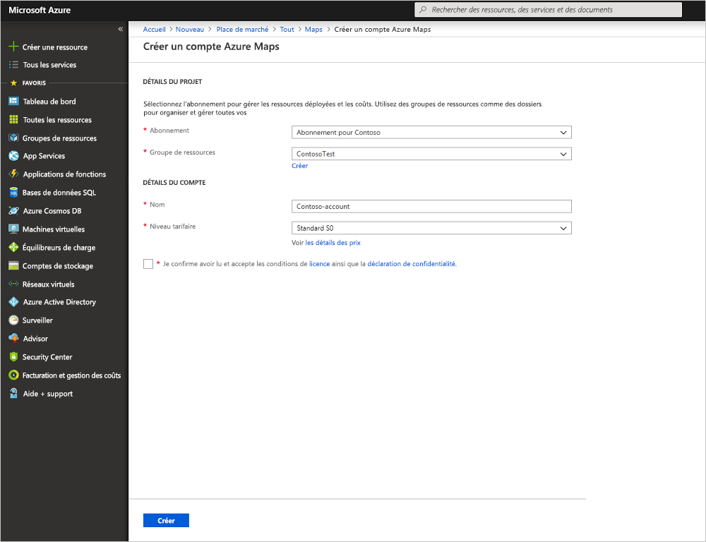
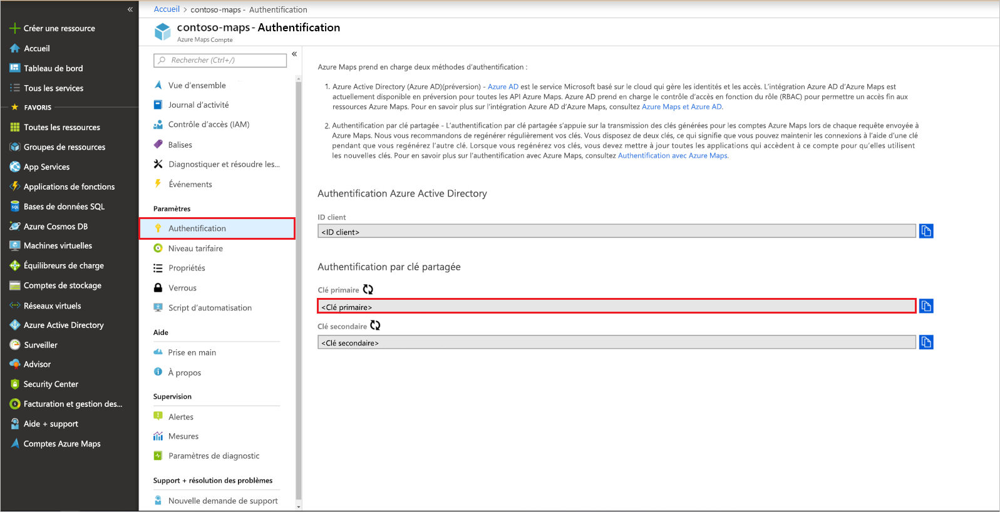
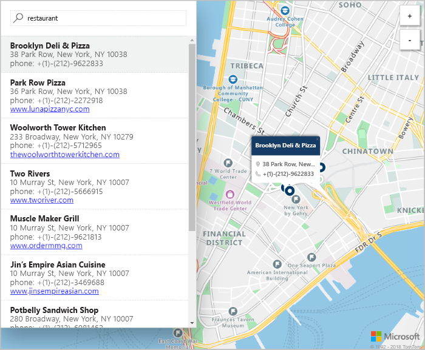

# Démarrage rapide : Créer une carte de recherche interactive avec Azure Maps

Cet article décrit les fonctionnalités d’Azure Maps qui consistent à créer une carte offrant aux utilisateurs une expérience de recherche interactive. Il vous guide pas à pas durant ces étapes de base :
* Créer votre propre compte Azure Maps.
* Obtenir votre clé de compte à utiliser dans l’application web de démonstration.

Si vous n’avez pas d’abonnement Azure, créez un [compte gratuit](https://azure.microsoft.com/free/?WT.mc_id=A261C142F) avant de commencer.

## Connectez-vous au portail Azure.

Connectez-vous au [portail Azure](https://portal.azure.com).

## Créer un compte avec Azure Maps

Créez un compte Maps en suivant la procédure suivante :

1. En haut à gauche du [portail Azure](https://portal.azure.com), cliquez sur **Créer une ressource**.
2. Dans la zone *Rechercher sur la Place de marché*, tapez **Maps**.
3. Dans les *Résultats*, sélectionnez **Maps**. Cliquez sur le bouton **Créer** qui s’affiche sous la carte.
4. Sur la page **Créer un compte Maps**, entrez les valeurs suivantes :
    * *L’Abonnement* à utiliser pour ce compte.
    * Le *Groupe de ressources* pour ce compte. Vous pouvez choisir de *Créer* ou d’utiliser un groupe de ressources *Existant*.
    * Le *Nom* de votre nouveau compte.
    * Le *niveau tarifaire* pour ce compte.
    * Lisez la *Licence* et la *Déclaration de confidentialité*, puis cochez la case pour accepter les conditions.
    * Cliquez sur le bouton **Créer**.

## Obtenir la clé primaire de votre compte

Une fois le compte Maps créé, récupérez la clé qui vous permet d’interroger les API Maps. Nous vous recommandons d’utiliser la clé primaire de votre compte comme clé d’abonnement lors de l’appel de services Azure Maps.

1. Ouvrez votre compte Maps dans le portail.
2. Dans la section des paramètres, sélectionnez **Authentification**.
3. Copiez la **Clé primaire** dans le Presse-papiers. Enregistrez-la localement, vous l’utiliserez plus tard dans ce didacticiel.

## Télécharger l’application

1. Accédez à [interactiveSearch.html](https://github.com/Azure-Samples/AzureMapsCodeSamples/blob/master/AzureMapsCodeSamples/Tutorials/interactiveSearch.html) et cliquez sur celui-ci pour en afficher le contenu dans l’interface utilisateur de GitHub. Cliquez avec le bouton droit sur le bouton **Brut**, et copiez le contenu du fichier ou utilisez « Enregistrer sous » pour télécharger le fichier.
2. Enregistrez le contenu de ce fichier localement sous le nom **AzureMapDemo.html**. Ouvrez le fichier dans un éditeur de texte.
3. Recherchez la chaîne `<Your Azure Maps Key>`. Remplacez-la par la valeur de **clé primaire** obtenue dans la section précédente.

## Ouvrir l’application

1. Ouvrez le fichier **AzureMapDemo.html** dans le navigateur de votre choix.
2. Observez la carte de la ville de Los Angeles. Effectuez un zoom avant et arrière : la carte affiche automatiquement plus ou moins d’informations selon le niveau de zoom. 
3. Modifiez le centre par défaut de la carte. Dans le fichier **AzureMapDemo.html**, recherchez la variable nommée **center**. Remplacez la paire de valeurs longitude, latitude de cette variable par les nouvelles valeurs : **[-74.0060, 40.7128]** . Enregistrez le fichier et actualisez votre navigateur.
4. Testez l’expérience de recherche interactive. Dans la zone de recherche en haut à gauche de l’application web de démonstration, recherchez **restaurants**.
5. Déplacez votre souris sur la liste des adresses et emplacements qui s’affichent sous la zone de recherche. Le repère correspondant sur la carte affiche des informations à propos de cet emplacement. Pour des raisons de confidentialité des entreprises privées, des adresses et des noms fictifs sont présentés.

    

## Nettoyer les ressources

Les tutoriels expliquent en détail comment utiliser et configurer Azure Maps avec votre compte. Si vous souhaitez suivre les tutoriels, ne nettoyez pas les ressources créées dans ce guide de démarrage rapide. Sinon, effectuez ces étapes pour nettoyer les ressources :

1. Fermez le navigateur qui exécute l’application web **AzureMapDemo.html**.
2. Dans le menu de gauche du portail Azure, sélectionnez **Toutes les ressources**. Sélectionnez ensuite votre compte Azure Maps. En haut du panneau **Toutes les ressources**, sélectionnez **Supprimer**.

## Étapes suivantes

Dans ce guide de démarrage rapide, vous avez créé votre compte Azure Maps ainsi qu’une application de démonstration. Pour en savoir plus sur Azure Maps, consultez les tutoriels suivants :

> [!div class="nextstepaction"]
> [Rechercher des points d’intérêt de proximité à l’aide d’Azure Maps](tutorial-search-location.md)

Pour obtenir d’autres exemples de code et bénéficier d’une expérience de codage interactive, consultez ces guides :

> [!div class="nextstepaction"]
> [Rechercher une adresse à l’aide du service de recherche Azure Maps](how-to-search-for-address.md)

> [!div class="nextstepaction"]
> [Utiliser la bibliothèque Map Control d’Azure Maps](how-to-use-map-control.md)
