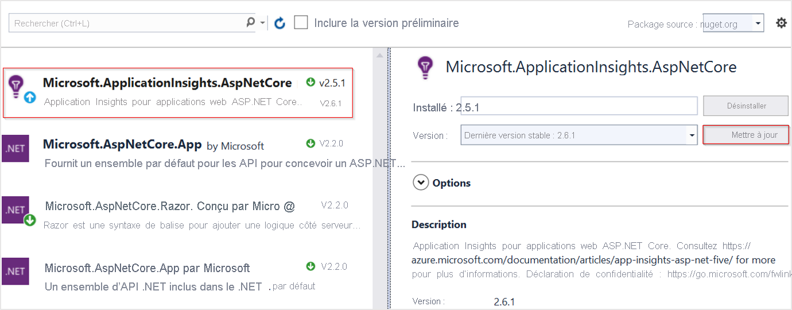

# <a name="application-insights-for-aspnet-core-applications"></a>Application Insights pour applications ASP.NET Core

Cet article décrit comment activer Application Insights pour une application [ASP.NET Core](/aspnet/core). Lorsque vous suivez les instructions de cet article, Application Insights collecte les requêtes, dépendances, exceptions, compteurs de performances, pulsations et journaux à partir de votre application ASP.NET Core.

L’exemple que nous utiliserons ici est une [application MVC](/aspnet/core/tutorials/first-mvc-app) qui cible `netcoreapp3.0`. Vous pouvez appliquer ces instructions à toutes les applications ASP.NET Core. Si vous utilisez le [service Worker](/aspnet/core/fundamentals/host/hosted-services#worker-service-template), suivez les instructions de la [ici](./worker-service.md).

## <a name="supported-scenarios"></a>Scénarios pris en charge

Le [SDK Application Insights pour ASP.NET Core](https://nuget.org/packages/Microsoft.ApplicationInsights.AspNetCore) peut surveiller vos applications peu importe où et comment elles s’exécutent. Si votre application est en cours d’exécution et dispose d’une connectivité réseau vers Azure, les données de télémétrie peuvent être collectées. La surveillance Application Insights est prise en charge partout où .NET Core est pris en charge. La prise en charge couvre les éléments suivants :
* **Système d’exploitation** : Windows, Linux ou Mac.
* **Méthode d’hébergement** : dans le processus ou en dehors du processus.
* **Méthode de déploiement** : dépendante de l’infrastructure ou autonome.
* **Serveur web** : IIS (Internet Information Server) ou Kestrel.
* **Plateforme d’hébergement** : fonctionnalité Web Apps d’Azure App Service, machine virtuelle Azure, Docker, Azure Kubernetes Service (AKS), etc.
* **Version .NET Core** : toutes les versions de .NET Core officiellement [prises en charge](https://dotnet.microsoft.com/download/dotnet-core).
* **IDE** : Visual Studio, VS Code ou ligne de commande.

> [!NOTE]
> ASP.NET Core 3. X requiert [Application Insights 2.8.0](https://www.nuget.org/packages/Microsoft.ApplicationInsights.AspNetCore/2.8.0) ou version ultérieure.

## <a name="prerequisites"></a>Prérequis

- Application ASP.NET Core fonctionnelle. Si vous avez besoin créer une application ASP.NET Core, suivez ce [didacticiel ASP.NET Core](/aspnet/core/getting-started/).
- Clé d’instrumentation Application Insights valide. Cette clé est requise pour envoyer les données de télémétrie à Application Insights. Si vous avez besoin créer une ressource Application Insights pour obtenir une instrumentation clé, consultez [Créer une ressource Application Insights](./create-new-resource.md).

## <a name="enable-application-insights-server-side-telemetry-visual-studio"></a>Activer les données de télémétrie Application Insights côté serveur (Visual Studio)

Pour Visual Studio pour Mac, utilisez l’[aide du manuel](#enable-application-insights-server-side-telemetry-no-visual-studio). Seule la version Windows de Visual Studio prend en charge cette procédure.

1. Ouvrez votre projet dans Visual Studio.

    > [!TIP]
    > Si vous le souhaitez, vous pouvez configurer un contrôle de code source pour votre projet afin de suivre les modifications apportées par Application Insights. Pour activer le contrôle de code source, sélectionnez **Fichier** > **Ajouter au contrôle de code source**.

2. Sélectionnez **Projet** > **Ajouter Application Insights Telemetry**.

3. Sélectionnez **Prise en main**. Selon votre version de Visual Studio, le texte de la sélection peut varier légèrement. Certaines versions antérieures affichent un bouton **Démarrer gratuitement** à la place.

4. Sélectionnez votre abonnement. Ensuite, sélectionnez **Ressource** > **Inscrire**.

5. Après avoir ajouté Application Insights à votre projet, vérifiez que vous utilisez la dernière version stable du SDK. Accédez à **Projet** > **Gérer les packages NuGet** > **Microsoft.ApplicationInsights.AspNetCore**. Au besoin, choisissez **Mettre à jour**.

     

6. Si vous avez suivi l’info-bulle facultative et ajouté votre projet au contrôle de code source, accédez à **Affichage** > **Team Explorer** > **Modifications**. Sélectionnez ensuite chaque fichier pour afficher une comparaison des modifications apportées par les données de télémétrie Application Insights.

## <a name="enable-application-insights-server-side-telemetry-no-visual-studio"></a>Activer les données de télémétrie Application Insights côté serveur (hors Visual Studio)

1. Installez le [package NuGet du SDK Application Insights pour ASP.NET Core](https://nuget.org/packages/Microsoft.ApplicationInsights.AspNetCore). Nous vous recommandons de toujours utiliser la dernière version stable. Recherchez les notes de publication complètes pour le SDK sur le [référentiel GitHub open source](https://github.com/Microsoft/ApplicationInsights-dotnet/releases).

    L’exemple de code suivant montre les modifications à ajouter au fichier `.csproj` de votre projet.

    ```xml
        <ItemGroup>
          <PackageReference Include="Microsoft.ApplicationInsights.AspNetCore" Version="2.13.1" />
        </ItemGroup>
    ```

2. Ajoutez `services.AddApplicationInsightsTelemetry();` à la méthode `ConfigureServices()` dans la classe `Startup`, comme dans cet exemple :

    ```csharp
        // This method gets called by the runtime. Use this method to add services to the container.
        public void ConfigureServices(IServiceCollection services)
        {
            // The following line enables Application Insights telemetry collection.
            services.AddApplicationInsightsTelemetry();
    
            // This code adds other services for your application.
            services.AddMvc();
        }
    ```

3. Configurez la clé d’instrumentation.

    Bien que vous puissiez fournir la clé d’instrumentation en tant qu’argument à `AddApplicationInsightsTelemetry`, nous vous recommandons de la spécifier dans la configuration. L’exemple de code suivant montre comment spécifier une clé d’instrumentation dans `appsettings.json`. Assurez-vous que `appsettings.json` est copié dans le dossier racine de l’application lors de la publication.

    ```json
        {
          "ApplicationInsights": {
            "InstrumentationKey": "putinstrumentationkeyhere"
          },
          "Logging": {
            "LogLevel": {
              "Default": "Warning"
            }
          }
        }
    ```

    Vous pouvez également spécifier la clé d’instrumentation dans une des variables d’environnement suivantes :

    * `APPINSIGHTS_INSTRUMENTATIONKEY`

    * `ApplicationInsights:InstrumentationKey`

    Par exemple :

    * `SET ApplicationInsights:InstrumentationKey=putinstrumentationkeyhere`

    * `SET APPINSIGHTS_INSTRUMENTATIONKEY=putinstrumentationkeyhere`

    * `APPINSIGHTS_INSTRUMENTATIONKEY` est généralement utilisé dans [Azure Web Apps](./azure-web-apps.md?tabs=net), mais peut également être utilisé dans tous les emplacements où ce SDK est pris en charge. (Si vous effectuez une analyse d’applications web sans code, ce format est requis si vous n’utilisez pas de chaînes de connexion.)

    Au lieu de définir des clés d’instrumentation, vous pouvez maintenant également utiliser des [chaînes de connexion](./sdk-connection-string.md?tabs=net).

    > [!NOTE]
    > Une clé d’instrumentation spécifiée dans le code prévaut sur la variable d’environnement `APPINSIGHTS_INSTRUMENTATIONKEY`, qui prévaut sur les autres options.

### <a name="user-secrets-and-other-configuration-providers"></a>Secrets d’utilisateur et autres fournisseurs de configuration

Si vous souhaitez stocker la clé d’instrumentation dans les secrets d’utilisateur d’ASP.NET Core ou la récupérer auprès d’un autre fournisseur de configuration, vous pouvez utiliser la surcharge avec un paramètre `Microsoft.Extensions.Configuration.IConfiguration`. Par exemple : `services.AddApplicationInsightsTelemetry(Configuration);`.
À compter de Microsoft.ApplicationInsights.AspNetCore version [2.15.0](https://www.nuget.org/packages/Microsoft.ApplicationInsights.AspNetCore), l’appel de `services.AddApplicationInsightsTelemetry()` lira automatiquement la clé d’instrumentation à partir de `Microsoft.Extensions.Configuration.IConfiguration` de l’application. Il n’est pas nécessaire de fournir explicitement `IConfiguration`.

## <a name="run-your-application"></a>Exécuter votre application

Exécutez votre application et lancez des requêtes. Les données de télémétrie doivent être transmis à Application Insights maintenant. Le kit de développement logiciel (SDK) Application Insights collecte automatiquement les requêtes web adressées à votre application, ainsi que les données de télémétrie suivantes.

### <a name="live-metrics"></a>Métriques temps réel

Les [métriques temps réel](./live-stream.md) peuvent être utilisées pour vérifier rapidement si la supervision Application Insights est correctement configurée. Quelques minutes peuvent être nécessaires avant l'apparition des données de télémétrie sur le portail et dans les analyses, mais les métriques temps réel affichent en temps quasi réel l'utilisation UC du processus en cours. Elles peuvent également afficher d'autres données de télémétrie comme les requêtes, les dépendances, les traces, etc.

### <a name="ilogger-logs"></a>Journaux ILogger

Dans la configuration par défaut sont collectés les journaux `ILogger` de gravité `Warning` et supérieure. Cette configuration est [personnalisable](#how-do-i-customize-ilogger-logs-collection).

### <a name="dependencies"></a>Les dépendances

La collecte des dépendances est activée par défaut. [Cet article](asp-net-dependencies.md#automatically-tracked-dependencies) décrit les dépendances qui sont automatiquement collectées, et présentent les étapes permettant d'effectuer un suivi manuel.

### <a name="performance-counters"></a>Compteurs de performance

La prise en charge des [compteurs de performances](./web-monitor-performance.md) dans ASP.Net Core est limitée :

* Les versions 2.4.1 et ultérieures du kit SDK collectent les compteurs de performances si l’application s’exécute dans Azure Web Apps (Windows).
* Les versions 2.7.1 et ultérieures du kit SDK collectent les compteurs de performances si l’application s’exécute dans Windows et cible `NETSTANDARD2.0` ou version ultérieure.
* Pour les applications ciblant .NET Framework, toutes les versions du SDK prennent en charge les compteurs de performances.
* Les versions 2.8.0 et ultérieures du kit de développement logiciel (SDK) prennent en charge le compteur processeur/mémoire dans Linux. Aucun autre compteur n’est pris en charge dans Linux. La méthode recommandée pour obtenir les compteurs système dans Linux (et dans d’autres environnements non-Windows) consiste à utiliser [EventCounters](#eventcounter)

### <a name="eventcounter"></a>EventCounter

`EventCounterCollectionModule` est activé par défaut. Le didacticiel [EventCounter](eventcounters.md) contient des instructions sur la configuration de la liste des compteurs à collecter.

## <a name="enable-client-side-telemetry-for-web-applications"></a>Activer les données de télémétrie côté client pour les applications web

Les étapes précédentes sont suffisantes pour commencer à collecter des données de télémétrie côté serveur. Si votre application comporte des composants côté client, suivez les étapes ci-dessous pour démarrer la collecte des [données de télémétrie d’utilisation](./usage-overview.md).

1. Dans `_ViewImports.cshtml`, ajoutez l’injection :

```cshtml
    @inject Microsoft.ApplicationInsights.AspNetCore.JavaScriptSnippet JavaScriptSnippet
```

2. Dans `_Layout.cshtml`, insérez `HtmlHelper` à la fin de la section `<head>`, mais avant tout autre script. Si vous souhaitez signaler les données de télémétrie JavaScript personnalisées à partir de la page, injectez-la par après cet extrait de code :

```cshtml
    @Html.Raw(JavaScriptSnippet.FullScript)
    </head>
```

Au lieu d’utiliser `FullScript`, vous pouvez aussi utiliser `ScriptBody` qui est disponible à partir du SDK version 2.14. Cela peut s’avérer utile si vous avez besoin de contrôler la balise `<script>` pour définir une stratégie de sécurité de contenu :

```cshtml
 <script> // apply custom changes to this script tag.
     @Html.Raw(JavaScriptSnippet.ScriptBody)
 </script>
```

Les noms de fichier `.cshtml` mentionnés précédemment proviennent d’un modèle d’application MVC par défaut. Enfin, si vous souhaitez activer correctement la surveillance côté client pour votre application, l’extrait de code JavaScript doit apparaître dans la section `<head>` de chaque page de votre application que vous souhaitez surveiller. Vous pouvez atteindre cet objectif de ce modèle d’application en ajoutant l’extrait de code JavaScript à `_Layout.cshtml`. 

Si votre projet n’inclut pas `_Layout.cshtml`, vous pouvez toujours ajouter la [surveillance côté client](./website-monitoring.md). Pour ce faire, ajoutez l’extrait de code JavaScript dans un fichier équivalent qui contrôle l’élément `<head>` de toutes les pages au sein de votre application. Vous pouvez également ajouter l’extrait de code à plusieurs pages, mais cette solution est difficile à gérer, et nous ne la recommandons pas généralement.

## <a name="configure-the-application-insights-sdk"></a>Configurer le SDK Application Insights

Vous pouvez personnaliser le SDK Application Insights pour ASP.NET Core afin de modifier la configuration par défaut. Les utilisateurs du SDK Application Insights ASP.NET peuvent maîtriser la modification de configuration à l’aide de `ApplicationInsights.config` ou en modifiant `TelemetryConfiguration.Active`. Pour ASP.NET Core, presque toutes les modifications de configuration sont effectuées dans la méthode `ConfigureServices()` de votre classe `Startup.cs`, sauf instruction contraire. Pour plus d’informations, consultez les sections suivantes.

> [!NOTE]
> Dans les applications ASP.NET Core, car la modification de la configuration en altérant `TelemetryConfiguration.Active` n’est pas prise en charge.

### <a name="using-applicationinsightsserviceoptions"></a>Utilisation d’ApplicationInsightsServiceOptions

Vous pouvez modifier quelques paramètres courants en passant de `ApplicationInsightsServiceOptions` à `AddApplicationInsightsTelemetry`, comme dans cet exemple :

```csharp
public void ConfigureServices(IServiceCollection services)
{
    Microsoft.ApplicationInsights.AspNetCore.Extensions.ApplicationInsightsServiceOptions aiOptions
                = new Microsoft.ApplicationInsights.AspNetCore.Extensions.ApplicationInsightsServiceOptions();
    // Disables adaptive sampling.
    aiOptions.EnableAdaptiveSampling = false;

    // Disables QuickPulse (Live Metrics stream).
    aiOptions.EnableQuickPulseMetricStream = false;
    services.AddApplicationInsightsTelemetry(aiOptions);
}
```

Liste complète des paramètres dans `ApplicationInsightsServiceOptions`

|Paramètre | Description | Default
|---------------|-------|-------
|EnablePerformanceCounterCollectionModule  | Activer/Désactiver `PerformanceCounterCollectionModule` | true
|EnableRequestTrackingTelemetryModule   | Activer/Désactiver `RequestTrackingTelemetryModule` | true
|EnableEventCounterCollectionModule   | Activer/Désactiver `EventCounterCollectionModule` | true
|EnableDependencyTrackingTelemetryModule   | Activer/Désactiver `DependencyTrackingTelemetryModule` | true
|EnableAppServicesHeartbeatTelemetryModule  |  Activer/Désactiver `AppServicesHeartbeatTelemetryModule` | true
|EnableAzureInstanceMetadataTelemetryModule   |  Activer/Désactiver `AzureInstanceMetadataTelemetryModule` | true
|EnableQuickPulseMetricStream | Active/désactive la fonctionnalité LiveMetrics | true
|EnableAdaptiveSampling | Active/désactive l’échantillonnage adaptatif | true
|EnableHeartbeat | Active/désactive la fonctionnalité des pulsations, qui envoie régulièrement (toutes les 15 minutes, par défaut) une métrique personnalisée nommée « HeartBeatState » avec des informations sur le runtime, telles que la version de .NET, des informations relatives à l’environnement Azure, le cas échéant, etc. | true
|AddAutoCollectedMetricExtractor | Active/désactive l’extracteur AutoCollectedMetrics, qui est un TelemetryProcessor qui envoie des métriques pré-agrégées sur les demandes/dépendances avant l’échantillonnage. | true
|RequestCollectionOptions.TrackExceptions | Active/désactive la création de rapports de suivi des exceptions non gérées par le module de collecte des demandes. | false dans NETSTANDARD2.0 (car les exceptions sont suivies avec ApplicationInsightsLoggerProvider), true dans le cas contraire.
|EnableDiagnosticsTelemetryModule | Active/désactive `DiagnosticsTelemetryModule`. La désactivation de cet élément entraîne l’abandon des paramètres suivants : `EnableHeartbeat`, `EnableAzureInstanceMetadataTelemetryModule`, `EnableAppServicesHeartbeatTelemetryModule`. | true

Consultez les [paramètres configurables dans `ApplicationInsightsServiceOptions`](https://github.com/microsoft/ApplicationInsights-dotnet/blob/develop/NETCORE/src/Shared/Extensions/ApplicationInsightsServiceOptions.cs) pour obtenir la liste la plus à jour.

### <a name="configuration-recommendation-for-microsoftapplicationinsightsaspnetcore-sdk-2150--above"></a>Recommandation de configuration pour le kit SDK Microsoft.ApplicationInsights.AspNetCore 2.15.0 et versions ultérieures

À partir du kit SDK Microsoft.ApplicationInsights.AspNetCore version [2.15.0](https://www.nuget.org/packages/Microsoft.ApplicationInsights.AspNetCore/2.15.0), il est recommandé de configurer tous les paramètres disponibles dans `ApplicationInsightsServiceOptions`, y compris instrumentationkey à l’aide de l’instance `IConfiguration` des applications. Les paramètres doivent se trouver sous la section « ApplicationInsights », comme indiqué dans l’exemple ci-dessous. La section suivante extraite du fichier appsettings.json configure la clé d’instrumentation, elle désactive également l’échantillonnage adaptatif et la collecte des compteurs de performances.

```json
{
    "ApplicationInsights": {
    "InstrumentationKey": "putinstrumentationkeyhere",
    "EnableAdaptiveSampling": false,
    "EnablePerformanceCounterCollectionModule": false
    }
}
```

Si l’objet `services.AddApplicationInsightsTelemetry(aiOptions)` est utilisé, il remplace les paramètres à partir de `Microsoft.Extensions.Configuration.IConfiguration`.

### <a name="sampling"></a>échantillonnage

Le SDK Application Insights pour ASP.NET Core prend en charge l’échantillonnage à taux fixe et adaptatif. L’échantillonnage adaptatif est activé par défaut.

Pour plus d'informations, voir la [configuration de l’échantillonnage adaptatif pour les applications ASP.NET Core](./sampling.md#configuring-adaptive-sampling-for-aspnet-core-applications).

### <a name="adding-telemetryinitializers"></a>Ajout de TelemetryInitializers

Utilisez les [Initialiseurs de télémétrie](./api-filtering-sampling.md#addmodify-properties-itelemetryinitializer) lorsque vous souhaitez enrichir les données de télémétrie avec des informations supplémentaires.

Ajoutez un nouvel élément `TelemetryInitializer` au conteneur `DependencyInjection`, comme indiqué dans le code suivant. Le SDK ne repère automatiquement tous les éléments `TelemetryInitializer` qui sont ajoutés au conteneur `DependencyInjection`.

```csharp
public void ConfigureServices(IServiceCollection services)
{
    services.AddSingleton<ITelemetryInitializer, MyCustomTelemetryInitializer>();
}
```

### <a name="removing-telemetryinitializers"></a>Suppression de TelemetryInitializers

Les initialiseurs de télémétrie sont présents par défaut. Pour supprimer tout ou partie des initialiseurs de télémétrie, utilisez l’exemple de code suivant *après* avoir appelé `AddApplicationInsightsTelemetry()`.

```csharp
public void ConfigureServices(IServiceCollection services)
{
    services.AddApplicationInsightsTelemetry();

    // Remove a specific built-in telemetry initializer
    var tiToRemove = services.FirstOrDefault<ServiceDescriptor>
                        (t => t.ImplementationType == typeof(AspNetCoreEnvironmentTelemetryInitializer));
    if (tiToRemove != null)
    {
        services.Remove(tiToRemove);
    }

    // Remove all initializers
    // This requires importing namespace by using Microsoft.Extensions.DependencyInjection.Extensions;
    services.RemoveAll(typeof(ITelemetryInitializer));
}
```

### <a name="adding-telemetry-processors"></a>Ajout de processeurs de télémétrie

Vous pouvez ajouter des processeurs de télémétrie personnalisés à `TelemetryConfiguration` à l’aide de la méthode d’extension `AddApplicationInsightsTelemetryProcessor` sur `IServiceCollection`. Des processeurs de télémétrie sont utilisés dans les [scénarios de filtrage avancés](./api-filtering-sampling.md#itelemetryprocessor-and-itelemetryinitializer). Utilisez l’exemple suivant.

```csharp
public void ConfigureServices(IServiceCollection services)
{
    // ...
    services.AddApplicationInsightsTelemetry();
    services.AddApplicationInsightsTelemetryProcessor<MyFirstCustomTelemetryProcessor>();

    // If you have more processors:
    services.AddApplicationInsightsTelemetryProcessor<MySecondCustomTelemetryProcessor>();
}
```

### <a name="configuring-or-removing-default-telemetrymodules"></a>Configuration ou suppression de l’élément TelemetryModules par défaut

Application Insights utilise les modules de télémétrie pour collecter automatiquement des informations de télémétrie utiles sur des charges de travail spécifiques sans qu’un suivi manuel de l’utilisateur ne soit nécessaire.

Les modules de collecte automatique suivants sont activés par défaut. Ces modules sont chargés de collecter automatiquement les données de télémétrie. Vous pouvez les désactiver ou les configurer pour modifier leur comportement par défaut.

* `RequestTrackingTelemetryModule` - Collecte RequestTelemetry à partir des demandes web entrantes.
* `DependencyTrackingTelemetryModule` - Collecte [DependencyTelemetry](./asp-net-dependencies.md) à partir des appels http sortants et des appels SQL.
* `PerformanceCollectorModule` - Collecte les compteurs PerformanceCounters Windows.
* `QuickPulseTelemetryModule` - Collecte les données de télémétrie à afficher dans le portail des métriques en temps réel.
* `AppServicesHeartbeatTelemetryModule` - Collecte les pulsations (envoyées en tant que métriques personnalisées) à propos de l'environnement Azure App Service où l'application est hébergée.
* `AzureInstanceMetadataTelemetryModule` - Collecte les pulsations (envoyées en tant que métriques personnalisées) à propos de l'environnement de machines virtuelles Azure où l'application est hébergée.
* `EventCounterCollectionModule` - Collecte les compteurs [EventCounter.](eventcounters.md) Ce module est une nouvelle fonctionnalité disponible dans les versions 2.8.0 et ultérieures du kit de développement logiciel (SDK).

Pour configurer tout `TelemetryModule` par défaut, utilisez la méthode d’extension `ConfigureTelemetryModule<T>` sur `IServiceCollection`, comme illustré dans l’exemple suivant.

```csharp
using Microsoft.ApplicationInsights.DependencyCollector;
using Microsoft.ApplicationInsights.Extensibility.PerfCounterCollector;

public void ConfigureServices(IServiceCollection services)
{
    services.AddApplicationInsightsTelemetry();

    // The following configures DependencyTrackingTelemetryModule.
    // Similarly, any other default modules can be configured.
    services.ConfigureTelemetryModule<DependencyTrackingTelemetryModule>((module, o) =>
            {
                module.EnableW3CHeadersInjection = true;
            });

    // The following removes all default counters from EventCounterCollectionModule, and adds a single one.
    services.ConfigureTelemetryModule<EventCounterCollectionModule>(
            (module, o) =>
            {
                module.Counters.Add(new EventCounterCollectionRequest("System.Runtime", "gen-0-size"));
            }
        );

    // The following removes PerformanceCollectorModule to disable perf-counter collection.
    // Similarly, any other default modules can be removed.
    var performanceCounterService = services.FirstOrDefault<ServiceDescriptor>(t => t.ImplementationType == typeof(PerformanceCollectorModule));
    if (performanceCounterService != null)
    {
        services.Remove(performanceCounterService);
    }
}
```

À partir de la version 2.12.2, [`ApplicationInsightsServiceOptions`](#using-applicationinsightsserviceoptions) contient une option facile permettant de désactiver n’importe lequel des modules par défaut.

### <a name="configuring-a-telemetry-channel"></a>Configuration d’un canal de télémétrie

Le canal de télémétrie [par défaut](./telemetry-channels.md) est `ServerTelemetryChannel`. Vous pouvez le remplacer, comme le montre l’exemple suivant.

```csharp
using Microsoft.ApplicationInsights.Channel;

    public void ConfigureServices(IServiceCollection services)
    {
        // Use the following to replace the default channel with InMemoryChannel.
        // This can also be applied to ServerTelemetryChannel.
        services.AddSingleton(typeof(ITelemetryChannel), new InMemoryChannel() {MaxTelemetryBufferCapacity = 19898 });

        services.AddApplicationInsightsTelemetry();
    }
```

### <a name="disable-telemetry-dynamically"></a>Désactiver la télémétrie dynamiquement

Si vous souhaitez désactiver la télémétrie de manière conditionnelle et dynamique, vous pouvez résoudre l’instance `TelemetryConfiguration` avec le conteneur d’injection de dépendance ASP.net n’importe où dans votre code et définir l’indicateur `DisableTelemetry` sur celle-ci.

```csharp
    public void ConfigureServices(IServiceCollection services)
    {
        services.AddApplicationInsightsTelemetry();
    }

    public void Configure(IApplicationBuilder app, IHostingEnvironment env, TelemetryConfiguration configuration)
    {
        configuration.DisableTelemetry = true;
        ...
    }
```

Le code ci-dessus n'empêche pas les modules de collecte automatique de collecter des données de télémétrie. Seul l’envoi de données de télémétrie à Application Insights est désactivé avec l’approche ci-dessus. Si vous ne souhaitez pas utiliser un module de collecte automatique particulier, il est préférable de [supprimer le module de télémétrie](#configuring-or-removing-default-telemetrymodules).

## <a name="frequently-asked-questions"></a>Forum aux questions

### <a name="does-application-insights-support-aspnet-core-3x"></a>Le service Application Insights prend-il en charge ASP.NET Core 3.X ?

Oui. Procédez à une mise à jour vers la version 2.8.0 ou ultérieure du [kit de développement logiciel (SDK) Application Insights pour ASP.NET Core](https://nuget.org/packages/Microsoft.ApplicationInsights.AspNetCore). Les versions antérieures du kit de développement logiciel (SDK) ne prennent pas en charge ASP.NET Core 3.X.

En outre, si vous utilisez les instructions basées sur Visual Studio disponibles [ici](#enable-application-insights-server-side-telemetry-visual-studio), l'intégration requiert une mise à jour vers la dernière version de Visual Studio 2019 (16.3.0). Les versions antérieures de Visual Studio ne prennent pas en charge l'intégration automatique des applications ASP.NET Core 3.X.

### <a name="how-can-i-track-telemetry-thats-not-automatically-collected"></a>Comment puis-je suivre les données de télémétrie qui ne sont pas automatiquement collectées ?

Obtenez une instance de `TelemetryClient` à l’aide de l’injection de constructeur et appelez la méthode `TrackXXX()` requise dessus. Nous ne recommandons pas de créer d’autres instances `TelemetryClient` ou `TelemetryConfiguration` dans une application ASP.NET Core. Une instance singleton de `TelemetryClient` est déjà inscrite dans le conteneur `DependencyInjection`, qui partage `TelemetryConfiguration` avec le reste de la télémétrie. La création d’une instance `TelemetryClient` est recommandée uniquement si celle-ci a besoin d’une configuration distincte du reste de la télémétrie.

L’exemple suivant montre comment suivre des données de télémétrie supplémentaires à partir d’un contrôleur.

```csharp
using Microsoft.ApplicationInsights;

public class HomeController : Controller
{
    private TelemetryClient telemetry;

    // Use constructor injection to get a TelemetryClient instance.
    public HomeController(TelemetryClient telemetry)
    {
        this.telemetry = telemetry;
    }

    public IActionResult Index()
    {
        // Call the required TrackXXX method.
        this.telemetry.TrackEvent("HomePageRequested");
        return View();
    }
```

Pour plus d’informations sur la création de rapports personnalisés pour les données dans Application Insights, consultez la [documentation de référence sur l’API des métriques personnalisées Application Insights](./api-custom-events-metrics.md). Une approche similaire peut être utilisée pour envoyer des mesures personnalisées à Application Insights à l’aide de [l’API GetMetric](./get-metric.md).

### <a name="how-do-i-customize-ilogger-logs-collection"></a>Comment personnaliser la collection de journaux ILogger ?

Par défaut, seuls les journaux de gravité `Warning` et supérieure sont capturés automatiquement. Pour modifier ce comportement, remplacez explicitement la configuration de la journalisation pour le fournisseur `ApplicationInsights` (cf. ci-dessous).
La configuration suivante permet à ApplicationInsights de capturer tous les journaux de gravité `Information` et supérieure.

```json
{
  "Logging": {
    "LogLevel": {
      "Default": "Warning"
    },
    "ApplicationInsights": {
      "LogLevel": {
        "Default": "Information"
      }
    }
  }
}
```

Il est important de noter que la configuration suivante ne permettra pas au fournisseur ApplicationInsights de capturer les journaux `Information`. En effet, le kit SDK ajoute un filtre de journalisation par défaut, qui indique à `ApplicationInsights` de capturer uniquement le niveau `Warning` et supérieur. C’est pourquoi un remplacement explicite est nécessaire pour ApplicationInsights.

```json
{
  "Logging": {
    "LogLevel": {
      "Default": "Information"
    }
  }
}
```

En savoir plus sur la [Configuration ILogger](ilogger.md#control-logging-level).

### <a name="some-visual-studio-templates-used-the-useapplicationinsights-extension-method-on-iwebhostbuilder-to-enable-application-insights-is-this-usage-still-valid"></a>Certains modèles Visual Studio utilisaient la méthode d’extension UseApplicationInsights() sur IWebHostBuilder pour activer Application Insights. Cette syntaxe est-elle toujours valide ?

Bien que la méthode d'extension `UseApplicationInsights()` soit toujours prise en charge, elle est considérée comme obsolète à partir de la version 2.8.0 du kit de développement logiciel (SDK) Application Insights. Elle sera supprimée dans la prochaine version majeure du kit de développement logiciel (SDK). La méthode recommandée pour activer les données de télémétrie Application Insights consiste à utiliser la commande `AddApplicationInsightsTelemetry()` car elle fournit des surcharges permettant de contrôler certaines configurations. En outre, dans les applications ASP.NET Core 3.X, `services.AddApplicationInsightsTelemetry()` est le seul moyen d'activer Application Insights.

### <a name="im-deploying-my-aspnet-core-application-to-web-apps-should-i-still-enable-the-application-insights-extension-from-web-apps"></a>Je déploie mon application ASP.NET Core dans Web Apps. Dois-je toujours activer l’extension Application Insights à partir de Web Apps ?

Si le SDK est installé au moment de la génération, comme indiqué dans cet article, vous n’avez pas besoin activer l’[extension Application Insights](./azure-web-apps.md) à partir du portail App Service. Même si l’extension est installée, elle se désactive quand elle détecte que le SDK est déjà ajouté à l’application. Si vous activez Application Insights à partir de l’extension, il est inutile d’installer et de mettre à jour le SDK. Mais si vous activez Application Insights en suivant les instructions de cet article, vous bénéficiez de davantage de flexibilité pour plusieurs raisons :

   * Les données de télémétrie Application Insights continueront à fonctionner :
       * sur tous les systèmes d’exploitation, notamment Windows, Linux et Mac ;
       * dans tous les modes de publication, notamment le mode autonome ou le mode dépendant de l’infrastructure ;
       * dans toutes les versions cibles de .Net Framework, y compris le .NET Framework complet ;
       * avec toutes les options d’hébergement, notamment Web Apps, les machines virtuelles, Linux, les conteneurs, Azure Kubernetes Service et l’hébergement non Azure.
       * dans toutes les versions de .NET Core, y compris les préversions.
   * Vous pouvez voir les données de télémétrie localement lorsque vous déboguez à partir de Visual Studio.
   * Vous pouvez suivre des données de télémétrie personnalisées supplémentaires à l’aide de l’API `TrackXXX()`.
   * Vous avez le contrôle total de la configuration.

### <a name="can-i-enable-application-insights-monitoring-by-using-tools-like-status-monitor"></a>Puis-je activer la surveillance Application Insights à l’aide d’outils tels que Status Monitor ?

Non. [Status Monitor](./monitor-performance-live-website-now.md) et [Status Monitor version 2](./status-monitor-v2-overview.md) prennent actuellement en charge ASP.NET 4.x uniquement.

### <a name="if-i-run-my-application-in-linux-are-all-features-supported"></a>Si j’exécute mon application sous Linux, toutes les fonctionnalités sont-elles prises en charge ?

Oui. La prise en charge de fonctionnalités pour le SDK est la même sur toutes les plateformes, avec les exceptions suivantes :

* Le kit de développement logiciel (SDK) collecte des [compteurs d’événements](./eventcounters.md) sur Linux car les [compteurs de performances](./performance-counters.md) sont uniquement pris en charge dans Windows. La plupart des métriques sont identiques.
* Même si `ServerTelemetryChannel` est activé par défaut, si l’application est exécutée sous Linux ou macOS, le canal ne crée pas automatiquement un dossier de stockage local pour conserver temporairement les données de télémétrie s’il existe des problèmes de réseau. En raison de cette limitation, les données de télémétrie sont perdues en cas de problèmes temporaires de réseau ou de serveur. Pour contourner ce problème, configurez un dossier local pour le canal :

```csharp
using Microsoft.ApplicationInsights.Channel;
using Microsoft.ApplicationInsights.WindowsServer.TelemetryChannel;

    public void ConfigureServices(IServiceCollection services)
    {
        // The following will configure the channel to use the given folder to temporarily
        // store telemetry items during network or Application Insights server issues.
        // User should ensure that the given folder already exists
        // and that the application has read/write permissions.
        services.AddSingleton(typeof(ITelemetryChannel),
                                new ServerTelemetryChannel () {StorageFolder = "/tmp/myfolder"});
        services.AddApplicationInsightsTelemetry();
    }
```

Cette limitation ne s’applique pas à partir de la version [2.15.0](https://www.nuget.org/packages/Microsoft.ApplicationInsights.AspNetCore/2.15.0) et des versions plus récentes.

### <a name="is-this-sdk-supported-for-the-new-net-core-3x-worker-service-template-applications"></a>Ce kit de développement logiciel (SDK) est-il pris en charge par les nouvelles applications de modèle de service Worker .NET Core 3.X ?

Ce kit de développement logiciel (SDK) nécessite `HttpContext`, et ne fonctionne donc pas dans les applications autres que HTTP, y compris les applications de service Worker .NET Core 3.X. Reportez-vous à [ce document](worker-service.md) pour activer Application Insights dans ces applications à l'aide du nouveau kit de développement logiciel (SDK) Microsoft.ApplicationInsights.WorkerService.

## <a name="open-source-sdk"></a>Kit de développement logiciel (SDK) open source

* [Lisez et contribuez au code](https://github.com/microsoft/ApplicationInsights-dotnet).

Pour obtenir les mises à jour et correctifs de bogues les plus récents, [consultez les notes de publication](./release-notes.md).

## <a name="next-steps"></a>Étapes suivantes

* [Explorez les flux d’utilisateurs](./usage-flows.md) pour comprendre comment les utilisateurs naviguent dans votre application.
* [Configurez la collecte de captures instantanées](./snapshot-debugger.md) pour voir l’état du code source et des variables au moment où une exception est levée.
* [Utilisez l’API](./api-custom-events-metrics.md) pour envoyer vos propres événements et mesures pour obtenir une vue détaillée des performances et de l’utilisation de votre application.
* Utilisez des [tests de disponibilité](./monitor-web-app-availability.md) pour vérifier votre application en permanence dans le monde entier.
* [Injection de dépendances dans ASP.NET Core](/aspnet/core/fundamentals/dependency-injection)
