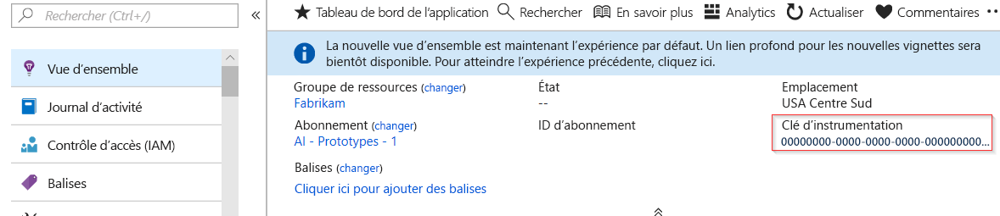
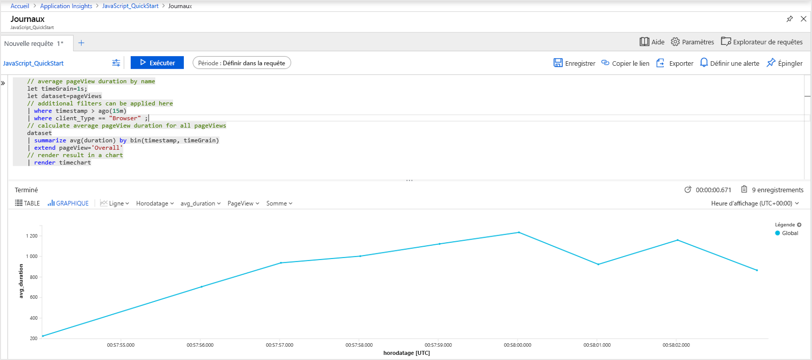
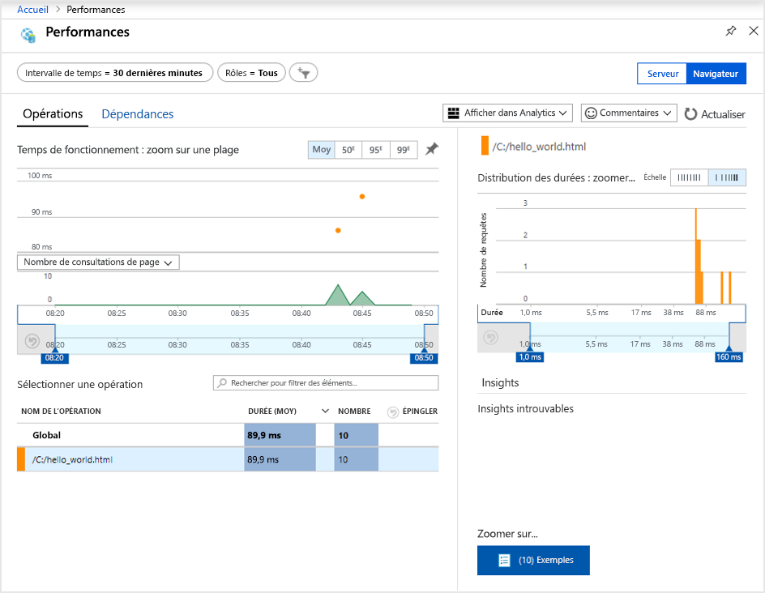
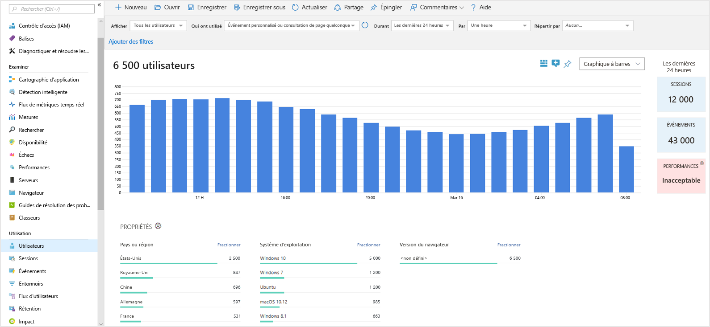
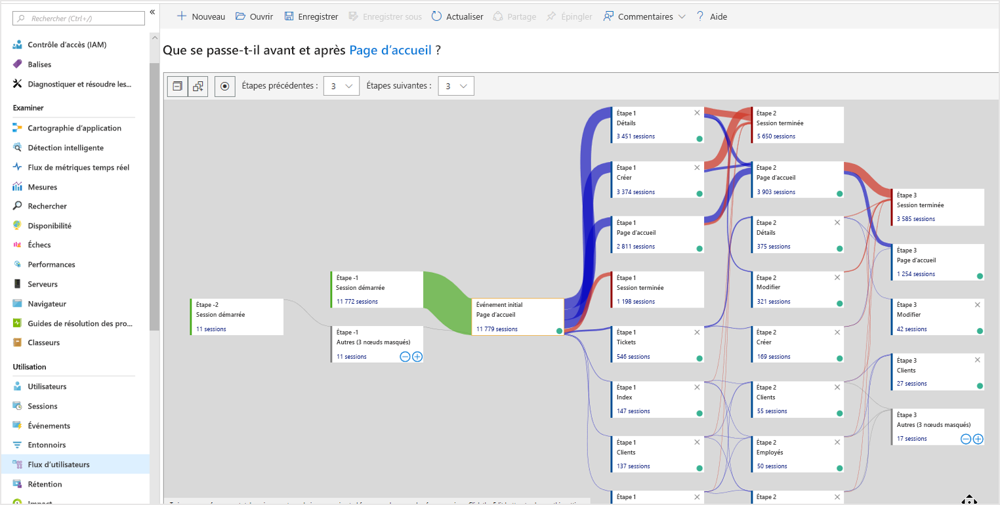

# <a name="quickstart-start-monitoring-your-website-with-azure-monitor-application-insights"></a>Démarrage rapide : Commencez à superviser votre site web avec Azure Monitor Application Insights

Dans ce guide de démarrage rapide, vous allez apprendre à ajouter le SDK JavaScript Application Insights open source à votre site web. Vous apprendrez également à mieux comprendre l’expérience côté client/navigateur pour les visiteurs de votre site web.

Azure Monitor Application Insights vous permet de surveiller facilement la disponibilité, les performances et l’utilisation de votre site web. De plus, vous pouvez rapidement identifier et diagnostiquer les erreurs dans votre application sans attendre qu’un utilisateur ne les signale. Application Insights offre des fonctionnalités de supervision côté serveur et côté client/navigateur.

## <a name="prerequisites"></a>Prérequis

* Compte Azure avec un abonnement actif. [Créez un compte gratuitement](https://azure.microsoft.com/free/?ref=microsoft.com&utm_source=microsoft.com&utm_medium=docs&utm_campaign=visualstudio).
* Un site web auquel vous pouvez ajouter le SDK JavaScript Application Insights.

## <a name="enable-application-insights"></a>Activer Application Insights

Application Insights permet de recueillir les données de télémétrie à partir de n’importe quelle application connectée à Internet et exécutée localement ou dans le cloud. Pour afficher ces données, effectuez les étapes suivantes :

1. Connectez-vous au [portail Azure](https://portal.azure.com/).
1. Sélectionnez **Créer une ressource** > **Outils de gestion** > **Application Insights**.

   > [!NOTE]
   >Si c’est la première fois que vous créez une ressource Application Insights, consultez [Créer une ressource Application Insights](https://docs.microsoft.com/azure/azure-monitor/app/create-new-resource).
1. Quand une boîte de configuration s’affiche, utilisez le tableau suivant pour renseigner les champs d’entrée :

    | Paramètres        | Valeur           | Description  |
   | ------------- |:-------------|:-----|
   | **Nom**      | Valeur globalement unique | Nom identifiant l’application que vous superviser. |
   | **Groupe de ressources**     | myResourceGroup      | Nom du nouveau groupe de ressources devant héberger les données Application Insights. Vous pouvez créer un groupe de ressources ou utiliser un groupe existant. |
   | **Lieu** | USA Est | Choisissez un emplacement près de chez vous ou proche de l’endroit où votre application est hébergée. |
1. Sélectionnez **Create** (Créer).

## <a name="create-an-html-file"></a>Créer un fichier HTML

1. Sur votre ordinateur local, créez un fichier appelé ``hello_world.html``. Pour cet exemple, créez le fichier à la racine du lecteur C afin qu’il ressemble à ``C:\hello_world.html``.
1. Copiez et collez le script suivant dans ``hello_world.html`` :

    ```html
    <!DOCTYPE html>
    <html>
    <head>
    <title>Azure Monitor Application Insights</title>
    </head>
    <body>
    <h1>Azure Monitor Application Insights Hello World!</h1>
    <p>You can use the Application Insights JavaScript SDK to perform client/browser-side monitoring of your website. To learn about more advanced JavaScript SDK configurations, visit the <a href="https://github.com/Microsoft/ApplicationInsights-JS/blob/master/API-reference.md" title="API Reference">API reference</a>.</p>
    </body>
    </html>
    ```

## <a name="configure-application-insights-sdk"></a>Configurer le SDK Application Insights

1. Sélectionnez **Vue d’ensemble** > **Éléments principaux**, puis copiez la **clé d’instrumentation** de votre application.

   

1. Ajoutez le script suivant à votre fichier ``hello_world.html`` avant la balise de fermeture ``</head>`` :

   ```javascript
   <script type="text/javascript">
      var sdkInstance="appInsightsSDK";window[sdkInstance]="appInsights";var aiName=window[sdkInstance],aisdk=window[aiName]||function(e){function n(e){t[e]=function(){var n=arguments;t.queue.push(function(){t[e].apply(t,n)})}}var t={config:e};t.initialize=!0;var i=document,a=window;setTimeout(function(){var n=i.createElement("script");n.src=e.url||"https://az416426.vo.msecnd.net/scripts/b/ai.2.min.js",i.getElementsByTagName("script")[0].parentNode.appendChild(n)});try{t.cookie=i.cookie}catch(e){}t.queue=[],t.version=2;for(var r=["Event","PageView","Exception","Trace","DependencyData","Metric","PageViewPerformance"];r.length;)n("track"+r.pop());n("startTrackPage"),n("stopTrackPage");var s="Track"+r[0];if(n("start"+s),n("stop"+s),n("setAuthenticatedUserContext"),n("clearAuthenticatedUserContext"),n("flush"),!(!0===e.disableExceptionTracking||e.extensionConfig&&e.extensionConfig.ApplicationInsightsAnalytics&&!0===e.extensionConfig.ApplicationInsightsAnalytics.disableExceptionTracking)){n("_"+(r="onerror"));var o=a[r];a[r]=function(e,n,i,a,s){var c=o&&o(e,n,i,a,s);return!0!==c&&t["_"+r]({message:e,url:n,lineNumber:i,columnNumber:a,error:s}),c},e.autoExceptionInstrumented=!0}return t}(
      {
         instrumentationKey:"INSTRUMENTATION_KEY"
      }
      );window[aiName]=aisdk,aisdk.queue&&0===aisdk.queue.length&&aisdk.trackPageView({});
   </script>
   ```

1. Modifiez ``hello_world.html`` et ajoutez votre clé d’instrumentation.

1. Ouvrez ``hello_world.html`` dans une session de navigateur locale. Cette action crée une seule vue de page. Vous pouvez actualiser votre navigateur pour générer plusieurs vues de page de test.

## <a name="monitor-your-website-in-the-azure-portal"></a>Superviser votre site web dans le portail Azure

1. Rouvrez la page de **Vue d’ensemble** d’Application Insights dans le portail Azure afin d’afficher les détails de votre application en cours d’exécution. La page **Vue d’ensemble** vous permet de récupérer votre clé d’instrumentation.

   Les quatre graphiques par défaut sur la page de présentation sont limités aux données d’application côté serveur. Étant donné que nous instrumentons les interactions côté client/navigateur avec le SDK JavaScript, cette vue particulière s’applique seulement si un SDK côté serveur est également installé.

1. Sélectionnez **Analytique** .  Cette action ouvre ainsi **Analytics**, lequel fournit un langage de requête enrichi permettant d’analyser toutes les données collectées par Application Insights. Pour afficher les données associées aux requêtes de navigateur côté client, exécutez la requête suivante :

    ```kusto
    // average pageView duration by name
    let timeGrain=1s;
    let dataset=pageViews
    // additional filters can be applied here
    | where timestamp > ago(15m)
    | where client_Type == "Browser" ;
    // calculate average pageView duration for all pageViews
    dataset
    | summarize avg(duration) by bin(timestamp, timeGrain)
    | extend pageView='Overall'
    // render result in a chart
    | render timechart
    ```

   

1. Revenez à la page **Vue d’ensemble**. Sous l’en-tête **Examiner**, sélectionnez **Navigateur**, puis **Performances**.  Les métriques portant sur les performances de votre site web apparaissent. Il existe une vue correspondante dédiée à l’analyse des échecs et des exceptions dans votre site web. Vous pouvez sélectionner **Exemples** pour accéder aux [détails de transactions de bout en bout](../../azure-monitor/app/transaction-diagnostics.md).

   

1. Dans le menu Application Insights principal, sous l’en-tête **Utilisation**, sélectionnez [**Utilisateurs**](../../azure-monitor/app/usage-segmentation.md) pour commencer à explorer les [outils d’analytique du comportement des utilisateurs](../../azure-monitor/app/usage-overview.md). Étant donné que nous testons à partir d’une seule machine, nous ne voyons les données que d’un seul utilisateur. Pour un site web actif, la distribution des utilisateurs peut se présenter comme suit :

     

1. Pour un site web plus complexe avec plusieurs pages, vous pouvez utiliser l’outil [**Flux d’utilisateurs**](../../azure-monitor/app/usage-flows.md) pour effectuer le suivi du chemin emprunté par les visiteurs dans les différentes parties de votre site web.

   

Pour en savoir plus les configurations plus complexes pour la supervision des sites web, consultez la [Documentation de référence de l’API du kit SDK JavaScript](https://github.com/Microsoft/ApplicationInsights-JS/blob/master/API-reference.md).

## <a name="clean-up-resources"></a>Nettoyer les ressources

Si vous souhaitez continuer à utiliser d’autres guides de démarrage rapide ou tutoriels, ne nettoyez pas les ressources créées dans le cadre de ce guide de démarrage rapide. Sinon, vous pouvez effectuer les étapes suivantes pour supprimer toutes les ressources créées par ce guide de démarrage rapide dans le portail Azure.

> [!NOTE]
> Si vous avez utilisé un groupe de ressources existant, les instructions suivantes ne fonctionneront pas. Au lieu de cela, vous pouvez simplement supprimer la ressource Application Insights. N’oubliez pas que quand vous supprimez un groupe de ressources, toutes les ressources sous-jacentes qui sont membres de ce groupe sont également supprimées.

1. Dans le menu gauche du portail Azure, sélectionnez **Groupes de ressources**, puis **myResourceGroup** ou le nom de votre groupe de ressources temporaire.
1. Dans la page de votre groupe de ressources, sélectionnez **Supprimer**, entrez **myResourceGroup** dans la zone de texte, puis sélectionnez **Supprimer**.

## <a name="next-steps"></a>Étapes suivantes

> [!div class="nextstepaction"]
> [Rechercher et diagnostiquer des problèmes de performances](https://docs.microsoft.com/azure/application-insights/app-insights-analytics)
