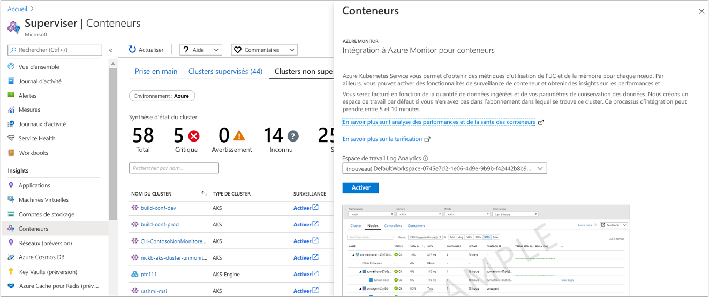

# <a name="enable-monitoring-of-azure-kubernetes-service-aks-cluster-already-deployed"></a>Activer la surveillance d’un cluster Azure Kubernetes Service (AKS) déjà déployé

Cet article explique comment configurer Azure Monitor pour les conteneurs afin de surveiller un cluster Kubernetes managé hébergé sur [Azure Kubernetes Service](https://docs.microsoft.com/azure/aks/) et déjà déployé dans votre abonnement.

Vous pouvez activer la surveillance d’un cluster AKS déjà déployé à l’aide d’une des méthodes prises en charge :

* Azure CLI
* Terraform
* [À partir d’Azure Monitor](#enable-from-azure-monitor-in-the-portal) ou [directement depuis le cluster AKS](#enable-directly-from-aks-cluster-in-the-portal) dans le portail Azure
* Avec le [modèle Azure Resource Manager fourni](#enable-using-an-azure-resource-manager-template), à l’aide de la cmdlet Azure PowerShell `New-AzResourceGroupDeployment` ou avec Azure CLI.

## <a name="sign-in-to-the-azure-portal"></a>Connectez-vous au portail Azure.

Connectez-vous au [portail Azure](https://portal.azure.com).

## <a name="enable-using-azure-cli"></a>Activer à l’aide d’Azure CLI

L’étape suivante permet la supervision de votre cluster AKS à l’aide d’Azure CLI. Dans cet exemple, vous n'êtes pas obligé de créer ou de spécifier un espace de travail existant. Cette commande simplifie le processus en créant un espace de travail par défaut dans le groupe de ressources par défaut de l’abonnement cluster AKS s’il n’existe pas dans la région.  L’espace de travail créé par défaut est semblable au format de *DefaultWorkspace-\<GUID>-\<Région>* .  

```azurecli
az aks enable-addons -a monitoring -n MyExistingManagedCluster -g MyExistingManagedClusterRG  
```

La sortie doit ressembler à ce qui suit :

```azurecli
provisioningState       : Succeeded
```

### <a name="integrate-with-an-existing-workspace"></a>Intégrer avec un espace de travail existant

Si vous préférez effectuer une intégration avec un espace de travail existant, effectuez les étapes suivantes pour identifier tout d’abord l’ID de ressource complet de votre espace de travail Log Analytics requis pour le paramètre `--workspace-resource-id`, puis exécutez la commande pour activer l’extension de supervision par rapport à l’espace de travail spécifié.  

1. Affichez la liste de tous les abonnements auxquels vous avez accès à l’aide de la commande suivante :

    ```azurecli
    az account list --all -o table
    ```

    La sortie doit ressembler à ce qui suit :

    ```azurecli
    Name                                  CloudName    SubscriptionId                        State    IsDefault
    ------------------------------------  -----------  ------------------------------------  -------  -----------
    Microsoft Azure                       AzureCloud   68627f8c-91fO-4905-z48q-b032a81f8vy0  Enabled  True
    ```

    Copiez la valeur de **SubscriptionId**.

2. Basculez vers l’abonnement qui héberge l’espace de travail Log Analytics à l’aide de la commande suivante :

    ```azurecli
    az account set -s <subscriptionId of the workspace>
    ```

3. L’exemple suivant affiche la liste des espaces de travail de vos abonnements au format JSON par défaut.

    ```
    az resource list --resource-type Microsoft.OperationalInsights/workspaces -o json
    ```

    Dans la sortie, recherchez le nom de l’espace de travail, puis copiez l’ID de ressource complet de cet espace de travail Log Analytics sous le champ **id**.

4. Exécutez la commande suivante pour activer l’extension de supervision, en remplaçant la valeur du paramètre `--workspace-resource-id`. La valeur de chaîne doit être comprise entre les guillemets doubles :

    ```azurecli
    az aks enable-addons -a monitoring -n ExistingManagedCluster -g ExistingManagedClusterRG --workspace-resource-id "/subscriptions/<SubscriptionId>/resourceGroups/<ResourceGroupName>/providers/Microsoft.OperationalInsights/workspaces/<WorkspaceName>"
    ```

    La sortie doit ressembler à ce qui suit :

    ```azurecli
    provisioningState       : Succeeded
    ```

## <a name="enable-using-terraform"></a>Activer à l’aide de Terraform

1. Ajoutez le profil de module complémentaire **oms_agent** à la [ressource azurerm_kubernetes_cluster](https://www.terraform.io/docs/providers/azurerm/d/kubernetes_cluster.html#addon_profile) existante.

   ```
   addon_profile {
    oms_agent {
      enabled                    = true
      log_analytics_workspace_id = "${azurerm_log_analytics_workspace.test.id}"
     }
   }
   ```

2. Ajoutez [azurerm_log_analytics_solution](https://www.terraform.io/docs/providers/azurerm/r/log_analytics_solution.html) en suivant les étapes décrites dans la documentation Terraform.

## <a name="enable-from-azure-monitor-in-the-portal"></a>Activer à partir d’Azure Monitor dans le portail

Pour activer la supervision de votre cluster AKS dans le portail Azure à partir d’Azure Monitor, effectuez les étapes suivantes :

1. Dans le Portail Azure, sélectionnez **Surveiller**.

2. Sélectionnez **Conteneurs** dans la liste.

3. Dans la page **Monitor - Conteneurs**, sélectionnez **Clusters non analysés**.

4. Dans la liste des clusters non surveillés, recherchez le conteneur dans la liste et cliquez sur **Activer**.   

5. Dans la page **Onboarding to Container Health and Logs** (Intégration de l’intégrité des conteneurs et aux journaux), si vous disposez d’un espace de travail Log Analytics dans le même abonnement que le cluster, sélectionnez-le dans la liste déroulante.  
    La liste présélectionne l’espace de travail par défaut et l’emplacement où le conteneur AKS est déployé dans l’abonnement.

    

    >[!NOTE]
    >Si vous souhaitez créer un espace de travail Log Analytics pour stocker les données de supervision du cluster, suivez les instructions de [Créer un espace de travail Log Analytics](../../azure-monitor/learn/quick-create-workspace.md). Veillez à créer l’espace de travail dans le même abonnement que le conteneur AKS.

Une fois que vous avez activé la surveillance, 15 minutes peuvent s’écouler avant que vous puissiez voir les métriques d’intégrité du cluster.

## <a name="enable-directly-from-aks-cluster-in-the-portal"></a>Activer directement à partir d’un cluster AKS dans le portail

Pour activer la surveillance directement depuis votre cluster AKS dans le portail Azure, procédez comme suit :

1. Dans le portail Azure, sélectionnez **Tous les services**.

2. Dans la liste des ressources, commencez à taper **Conteneurs**.  Au fur et à mesure de votre saisie, la liste est filtrée.

3. Sélectionnez **Services Kubernetes**.  

    

4. Dans la liste des conteneurs, sélectionnez un conteneur.

5. Dans la vue d’ensemble du conteneur, sélectionnez **Conteneurs Monitor**.  

6. Dans la page **Intégration à Azure Monitor pour conteneurs**, si vous disposez d’un espace de travail Log Analytics dans le même abonnement que le cluster, sélectionnez-le dans la liste déroulante.  
    La liste présélectionne l’espace de travail par défaut et l’emplacement où le conteneur AKS est déployé dans l’abonnement.

    

    >[!NOTE]
    >Si vous souhaitez créer un espace de travail Log Analytics pour stocker les données de supervision du cluster, suivez les instructions de [Créer un espace de travail Log Analytics](../../azure-monitor/learn/quick-create-workspace.md). Veillez à créer l’espace de travail dans le même abonnement que le conteneur AKS.

Une fois que vous avez activé la surveillance, 15 minutes peuvent s’écouler avant que vous ne puissiez voir les données opérationnelles du cluster.

## <a name="enable-using-an-azure-resource-manager-template"></a>Activer à l’aide d’un modèle Azure Resource Manager

Cette méthode inclut deux modèles JSON. Le premier modèle spécifie la configuration permettant d’activer la surveillance, tandis que l’autre modèle contient des valeurs de paramètre que vous configurez pour spécifier les éléments suivants :

* L’ID de ressource du conteneur AKS
* Le groupe de ressources dans lequel le cluster est déployé

>[!NOTE]
>Le modèle doit être déployé dans le même groupe de ressources que le cluster.
>

L’espace de travail Log Analytics doit être créé avant d’activer la surveillance à l’aide d’Azure PowerShell ou CLI. Pour créer l’espace de travail, vous pouvez en configurer un via [Azure Resource Manager](../../azure-monitor/platform/template-workspace-configuration.md), [PowerShell](../scripts/powershell-sample-create-workspace.md?toc=%2fpowershell%2fmodule%2ftoc.json) ou le [portail Azure](../../azure-monitor/learn/quick-create-workspace.md).

Si vous n’êtes pas familiarisé avec le déploiement de ressources à l’aide d’un modèle, consultez les rubriques suivantes :

* [Déployer des ressources à l’aide de modèles Resource Manager et d’Azure PowerShell](../../azure-resource-manager/templates/deploy-powershell.md)

* [Déployer des ressources à l’aide de modèles Resource Manager et de l’interface de ligne de commande Azure](../../azure-resource-manager/templates/deploy-cli.md)

Si vous avez choisi d’utiliser Azure CLI, vous devez d’abord l’installer et l’utiliser localement. Vous devez exécuter Azure CLI version 2.0.59 ou une version ultérieure. Pour identifier votre version, exécutez `az --version`. Si vous devez installer ou mettre à niveau Azure CLI, consultez [Installer Azure CLI](https://docs.microsoft.com/cli/azure/install-azure-cli).

### <a name="create-and-execute-a-template"></a>Créer et exécuter un modèle

1. Copiez et collez la syntaxe JSON suivante dans votre fichier :

    ```json
    {
      "$schema": "https://schema.management.azure.com/schemas/2015-01-01/deploymentTemplate.json#",
      "contentVersion": "1.0.0.0",
      "parameters": {
        "aksResourceId": {
          "type": "string",
          "metadata": {
            "description": "AKS Cluster Resource ID"
          }
        },
        "aksResourceLocation": {
          "type": "string",
          "metadata": {
            "description": "Location of the AKS resource e.g. \"East US\""
          }
        },
        "aksResourceTagValues": {
          "type": "object",
          "metadata": {
            "description": "Existing all tags on AKS Cluster Resource"
          }
        },
        "workspaceResourceId": {
          "type": "string",
          "metadata": {
            "description": "Azure Monitor Log Analytics Resource ID"
          }
        }
      },
      "resources": [
        {
          "name": "[split(parameters('aksResourceId'),'/')[8]]",
          "type": "Microsoft.ContainerService/managedClusters",
          "location": "[parameters('aksResourceLocation')]",
          "tags": "[parameters('aksResourceTagValues')]",
          "apiVersion": "2018-03-31",
          "properties": {
            "mode": "Incremental",
            "id": "[parameters('aksResourceId')]",
            "addonProfiles": {
              "omsagent": {
                "enabled": true,
                "config": {
                  "logAnalyticsWorkspaceResourceID": "[parameters('workspaceResourceId')]"
                }
              }
            }
          }
        }
      ]
    }
    ```

2. Enregistrez ce fichier en tant que **existingClusterOnboarding.json** dans un dossier local.

3. Collez la syntaxe JSON suivante dans votre fichier :

    ```json
    {
      "$schema": "https://schema.management.azure.com/schemas/2015-01-01/deploymentParameters.json#",
      "contentVersion": "1.0.0.0",
      "parameters": {
        "aksResourceId": {
          "value": "/subscriptions/<SubscriptionId>/resourcegroups/<ResourceGroup>/providers/Microsoft.ContainerService/managedClusters/<ResourceName>"
        },
        "aksResourceLocation": {
          "value": "<aksClusterLocation>"
        },
        "workspaceResourceId": {
          "value": "/subscriptions/<SubscriptionId>/resourceGroups/<ResourceGroup>/providers/Microsoft.OperationalInsights/workspaces/<workspaceName>"
        },
        "aksResourceTagValues": {
          "value": {
            "<existing-tag-name1>": "<existing-tag-value1>",
            "<existing-tag-name2>": "<existing-tag-value2>",
            "<existing-tag-nameN>": "<existing-tag-valueN>"
          }
        }
      }
    }
    ```

4. Modifiez **aksResourceId** et **aksResourceLocation** à l’aide des valeurs situées sur la page **Vue d’ensemble d’AKS** du cluster AKS. La valeur de **workspaceResourceId** est l’ID de ressource complet de votre espace de travail Log Analytics, qui inclut le nom de l’espace de travail.

    Modifiez les valeurs d’**aksResourceTagValues** pour qu’elles correspondent aux valeurs de balises existantes spécifiées pour le cluster AKS.

5. Enregistrez ce fichier en tant que **existingClusterParam.json** dans un dossier local.

6. Vous êtes prêt à déployer ce modèle.

   * Pour effectuer un déploiement avec Azure PowerShell, utilisez les commandes suivantes dans le dossier qui contient le modèle :

       ```powershell
       New-AzResourceGroupDeployment -Name OnboardCluster -ResourceGroupName <ResourceGroupName> -TemplateFile .\existingClusterOnboarding.json -TemplateParameterFile .\existingClusterParam.json
       ```

       Le changement de configuration peut prendre quelques minutes. Lorsqu’il est terminé, un message similaire à celui-ci s’affiche avec les résultats :

       ```powershell
       provisioningState       : Succeeded
       ```

   * Pour effectuer un déploiement avec Azure CLI, exécutez les commandes suivantes :

       ```azurecli
       az login
       az account set --subscription "Subscription Name"
       az group deployment create --resource-group <ResourceGroupName> --template-file ./existingClusterOnboarding.json --parameters @./existingClusterParam.json
       ```

       Le changement de configuration peut prendre quelques minutes. Lorsqu’il est terminé, un message similaire à celui-ci s’affiche avec les résultats :

       ```azurecli
       provisioningState       : Succeeded
       ```

       Une fois que vous avez activé la surveillance, 15 minutes peuvent s’écouler avant que vous puissiez voir les métriques d’intégrité du cluster.

## <a name="verify-agent-and-solution-deployment"></a>Vérifier le déploiement de l’agent et de la solution

Avec la version *06072018* de l’agent (ou ultérieure), vous pouvez vérifier que l’agent et la solution ont été déployés correctement. Avec les versions antérieures de l’agent, vous pouvez uniquement vérifier le déploiement de l’agent.

### <a name="agent-version-06072018-or-later"></a>Agent version 06072018 ou ultérieure

Pour vérifier que l’agent a été correctement déployé, exécutez la commande suivante :

```
kubectl get ds omsagent --namespace=kube-system
```

La sortie doit ressembler à la suivante, qui indique que l’agent a été correctement déployé :

```
User@aksuser:~$ kubectl get ds omsagent --namespace=kube-system
NAME       DESIRED   CURRENT   READY     UP-TO-DATE   AVAILABLE   NODE SELECTOR                 AGE
omsagent   2         2         2         2            2           beta.kubernetes.io/os=linux   1d
```  

Pour vérifier le déploiement de la solution, exécutez la commande suivante :

```
kubectl get deployment omsagent-rs -n=kube-system
```

La sortie doit ressembler à la suivante, qui indique que l’agent a été correctement déployé :

```
User@aksuser:~$ kubectl get deployment omsagent-rs -n=kube-system
NAME       DESIRED   CURRENT   UP-TO-DATE   AVAILABLE    AGE
omsagent   1         1         1            1            3h
```

### <a name="agent-version-earlier-than-06072018"></a>Versions de l’agent antérieures à la version 06072018

Pour vérifier que la version de l’agent Log Analytics antérieure à la version *06072018* a été correctement déployée, exécutez la commande suivante :  

```
kubectl get ds omsagent --namespace=kube-system
```

La sortie doit ressembler à la suivante, qui indique que l’agent a été correctement déployé :  

```
User@aksuser:~$ kubectl get ds omsagent --namespace=kube-system
NAME       DESIRED   CURRENT   READY     UP-TO-DATE   AVAILABLE   NODE SELECTOR                 AGE
omsagent   2         2         2         2            2           beta.kubernetes.io/os=linux   1d
```  

## <a name="view-configuration-with-cli"></a>Afficher la configuration avec l’interface de ligne de commande

Utilisez la commande `aks show` pour obtenir des détails comme l’activation ou non de la solution, le resourceID de l’espace de travail Log Analytics, et un résumé détaillé du cluster.  

```azurecli
az aks show -g <resourceGroupofAKSCluster> -n <nameofAksCluster>
```

Au bout de quelques minutes, la commande se termine et renvoie des informations formatées JSON sur la solution.  Les résultats de la commande doivent afficher le profil de module complémentaire de supervision et ressemblent à l’exemple de sortie suivant :

```
"addonProfiles": {
    "omsagent": {
      "config": {
        "logAnalyticsWorkspaceResourceID": "/subscriptions/<WorkspaceSubscription>/resourceGroups/<DefaultWorkspaceRG>/providers/Microsoft.OperationalInsights/workspaces/<defaultWorkspaceName>"
      },
      "enabled": true
    }
  }
```

## <a name="next-steps"></a>Étapes suivantes

* Si vous rencontrez des problèmes en tentant d’intégrer la solution, consultez le [guide de résolution des problèmes](container-insights-troubleshoot.md)

* Une fois l’analyse activée pour collecter l’utilisation des ressources et l’intégrité de votre cluster Azure Kubernetes et charges de travail s’y exécutant, découvrez [comment utiliser](container-insights-analyze.md) Azure Monitor pour les conteneurs.
