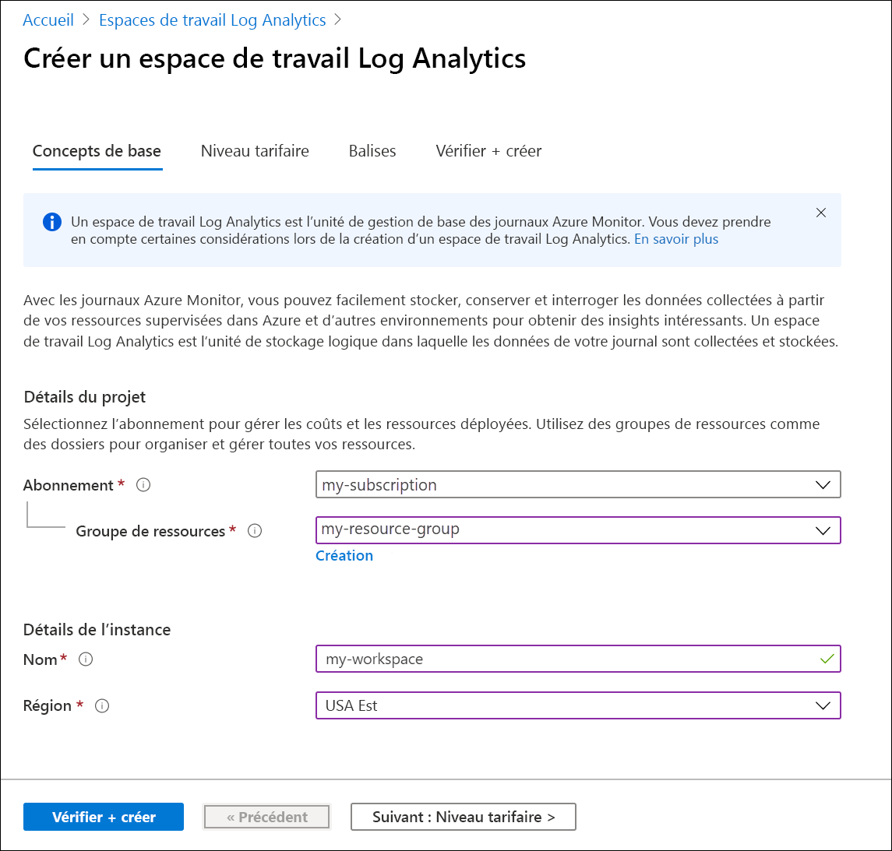
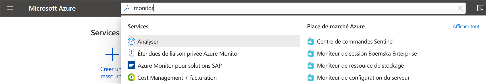
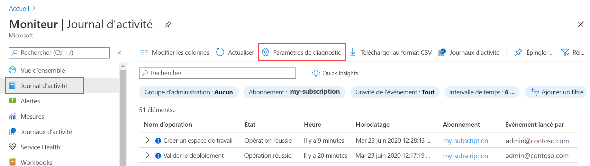
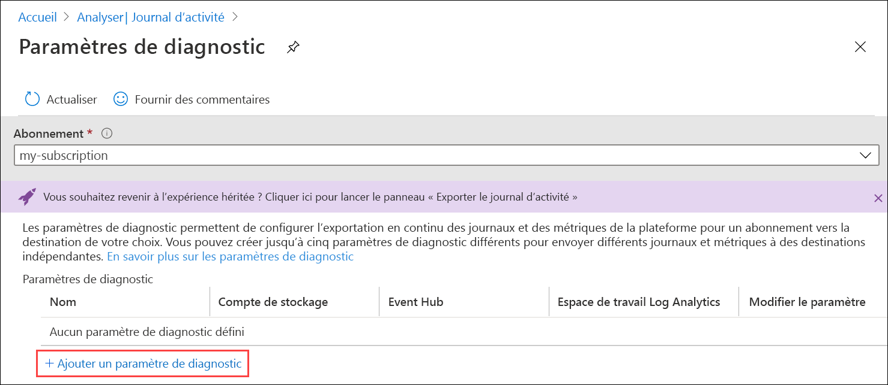
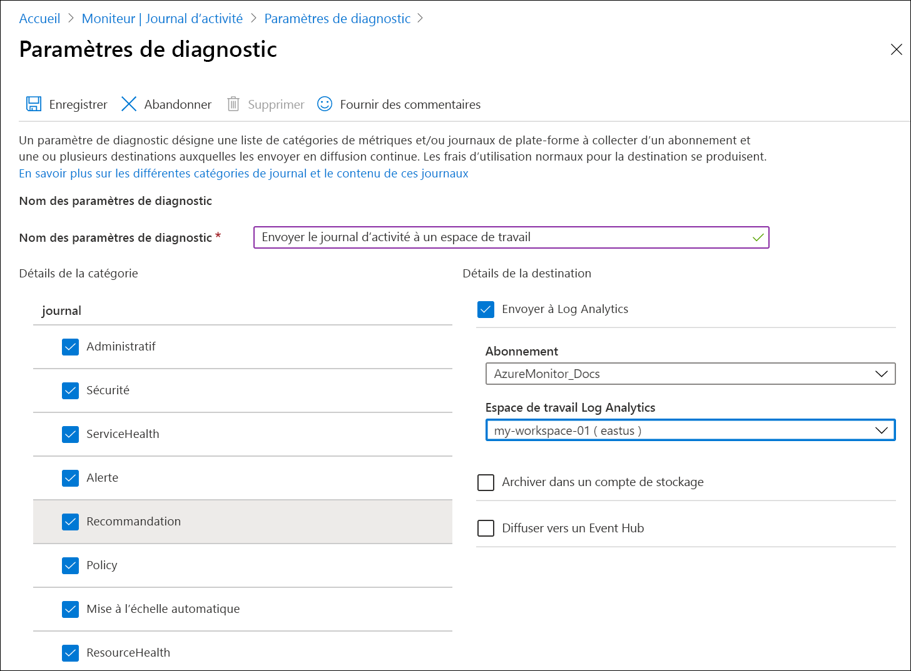
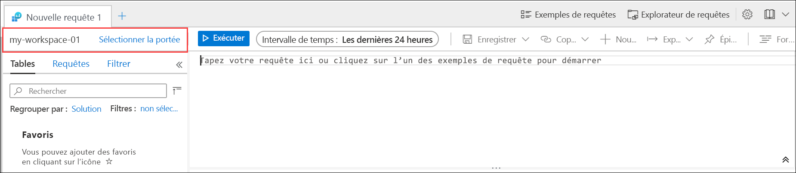
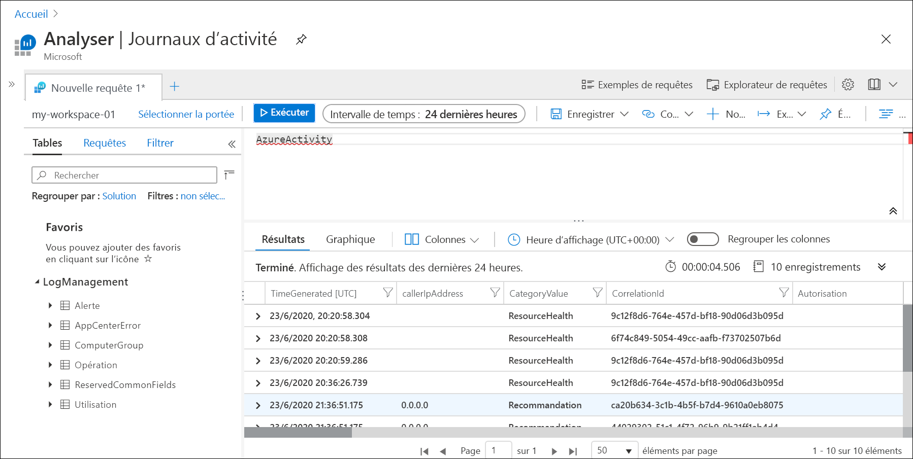
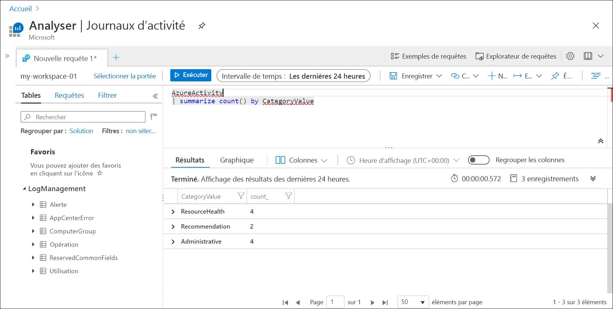

# Envoyer le journal d’activité Azure à un espace de travail Log Analytics à l’aide du portail Azure
Le journal d’activité est un journal de plateforme dans Azure qui fournit des insights de tous les événements de niveau abonnement. Les informations qu’il contient indiquent, par exemple, à quel moment une ressource a été modifiée ou qu’une machine virtuelle a été démarrée. Vous pouvez afficher le journal d’activité dans le portail Azure ou récupérer des entrées avec PowerShell et l’interface CLI. Ce guide de démarrage rapide montre comment utiliser le portail Azure pour créer un espace de travail Log Analytics et un paramètre de diagnostic afin d’envoyer le journal d’activité aux journaux Azure Monitor, où vous pouvez l’analyser à l’aide de [requêtes de journal](../log-query/log-query-overview.md) et activer d’autres fonctionnalités comme les [alertes de journal](../platform/alerts-log-query.md) et les [classeurs](../platform/workbooks-overview.md). 

## Se connecter au portail Azure
Connectez-vous au portail Azure sur [https://portal.azure.com](https://portal.azure.com). 

## Créer un espace de travail Log Analytics
Dans le portail Azure, recherchez puis sélectionnez **Espaces de travail Log Analytics**. 

  
Cliquez sur **Ajouter**, puis fournissez des valeurs pour le **Groupe de ressources**, le **Nom** de l’espace de travail et l’**Emplacement**. Le nom de l’espace de travail doit être unique parmi tous les abonnements Azure.

Cliquez sur **Vérifier + créer** pour passer en revue les paramètres, puis sur **Créer** pour créer l’espace de travail. Cette action sélectionne le niveau tarifaire par défaut **Paiement à l’utilisation**, ce qui n’entraîne pas aucun changement tant que vous ne commencez pas à collecter une quantité suffisante de données. La collecte du journal d’activité n’est pas facturée.

## Créer un paramètre de diagnostic
Dans le portail Azure, recherchez puis sélectionnez **Superviser**. 

Sélectionnez **Journal d’activité**. Vous devez normalement voir les événements récents relatifs à l’abonnement actuel. Cliquez sur **Paramètres de diagnostic** pour voir les paramètres de diagnostic de l’abonnement.

Cliquez sur **Ajouter un paramètre de diagnostic** pour créer un paramètre. 

Tapez un nom, par exemple *Envoyer le journal d’activité à l’espace de travail*. Sélectionnez chacune des catégories. Sélectionnez **Envoyer à Log Analytics** comme seule destination, puis spécifiez l’espace de travail que vous avez créé. Cliquez sur **Enregistrer** pour créer le paramètre de diagnostic, puis fermez la page.

## Générer des données de journal
Seules les nouvelles entrées du journal d’activité sont envoyées à l’espace de travail Log Analytics. Par conséquent, effectuez certaines actions dans votre abonnement qui seront journalisées, comme le démarrage ou l’arrêt d’une machine virtuelle, ou la création ou la modification d’une autre ressource. Vous devrez peut-être attendre quelques minutes pour que le paramètre de diagnostic soit créé et pour que les données soient écrites initialement dans l’espace de travail. Après ce délai, tous les événements écrits dans le journal d’activité sont envoyés à l’espace de travail en quelques secondes.

## Récupérer des données avec une requête de journal

Sélectionnez **Journaux** dans le menu **Azure Monitor**. Fermez la page **Exemples de requêtes**. Si l’étendue n’est pas définie sur l’espace de travail que vous avez créé, cliquez sur **Sélectionner l’étendue**, puis recherchez-la.

Dans la fenêtre de requête, tapez `AzureActivity`, puis cliquez sur **Exécuter**. Il s’agit d’une requête simple qui retourne tous les enregistrements de la table *AzureActivity*, laquelle contient tous les enregistrements envoyés à partir du journal d’activité.

Développez l’un des enregistrements pour voir ses propriétés détaillées.

Essayez une requête plus complexe, telle que `AzureActivity | summarize count() by CategoryValue` qui donne un nombre d’événements résumés par catégorie.

## Étapes suivantes
Dans ce guide de démarrage rapide, vous avez configuré le journal d’activité à envoyer à un espace de travail Log Analytics. Vous pouvez à présent configurer d’autres données à collecter dans l’espace de travail, où vous pouvez les analyser à l’aide de [requêtes de journal](../log-query/log-query-overview.md) dans Azure Monitor et tirer parti de fonctionnalités telles que les [alertes de journal](../platform/alerts-log-query.md) et les [classeurs ](../platform/workbooks-overview.md). Vous devez ensuite collecter les [journaux de ressources](../platform/resource-logs.md) à partir de vos ressources Azure qui complètent les données du journal d’activité en fournissant des insights sur les opérations qui ont été effectuées au sein de chaque ressource.

> [!div class="nextstepaction"]
> [Collecter et analyser des journaux de ressources avec Azure Monitor](tutorial-resource-logs.md)
