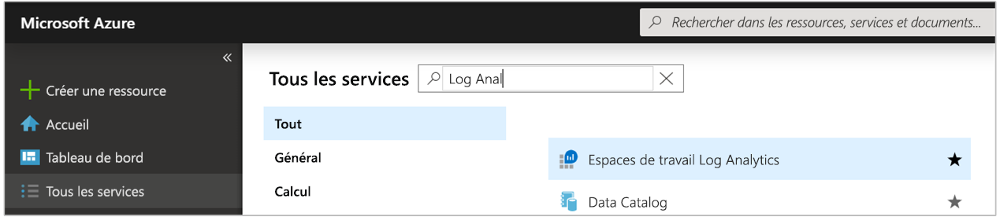
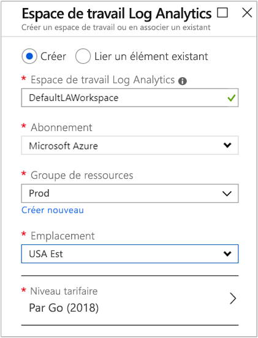
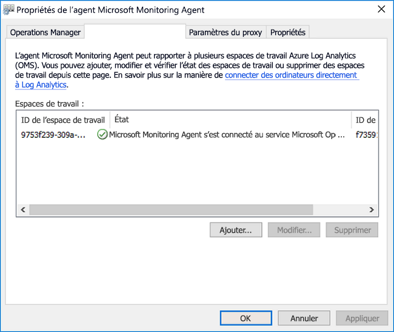
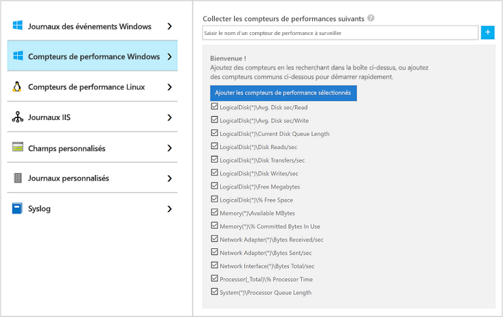
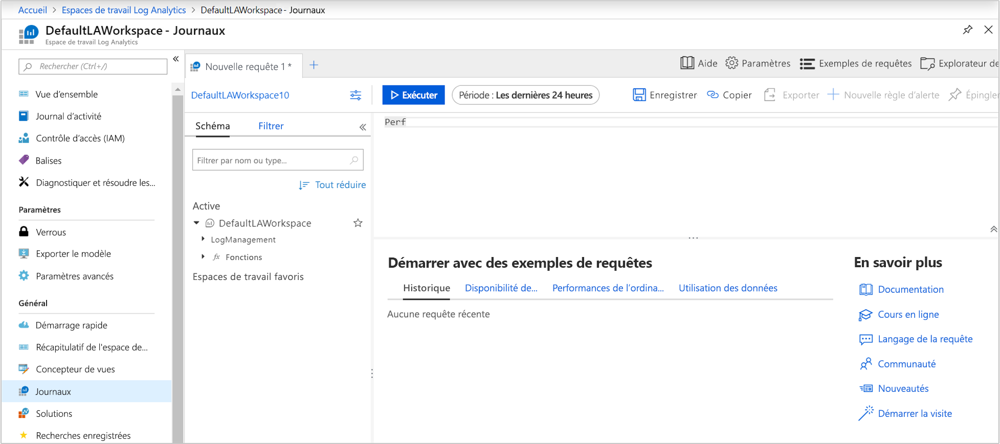
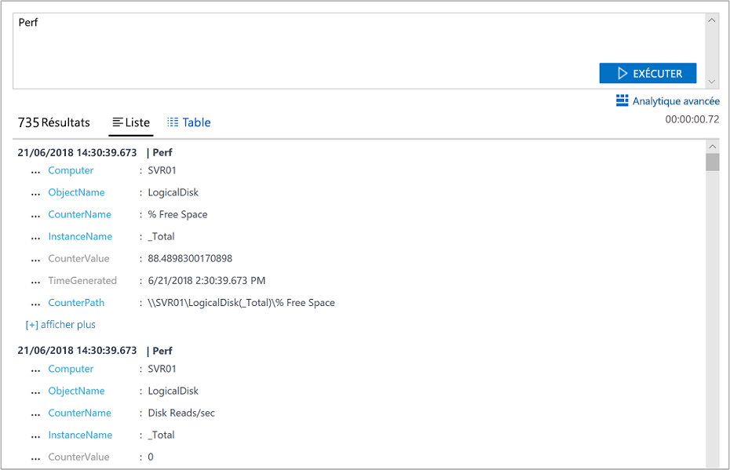
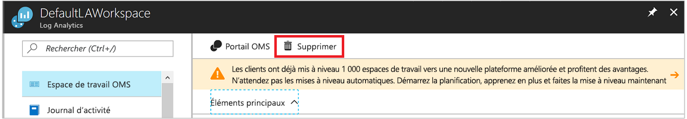

# Collecter des données à partir d’un ordinateur Windows dans un environnement hybride avec Azure Monitor

[Azure Monitor](../overview.md) est capable de collecter des données directement à partir de vos ordinateurs Windows physiques ou virtuels de votre environnement dans un espace de travail Log Analytics pour ensuite procéder à une analyse et à une mise en corrélation détaillées. L’installation de l’[agent Log Analytics](../platform/log-analytics-agent.md) permet à Azure Monitor de collecter des données à partir d’un centre de données ou d’un autre environnement cloud. Ce guide de démarrage rapide montre comment configurer et collecter des données à partir de votre ordinateur Windows en quelques étapes simples. Pour obtenir des informations sur les machines virtuelles Windows Azure, consultez [Collecter des données sur les machines virtuelles Azure](./quick-collect-azurevm.md).  

Pour comprendre la configuration prise en charge, consultez [Systèmes d’exploitation pris en charge](../platform/agents-overview.md#supported-operating-systems) et [Configuration du pare-feu réseau](../platform/log-analytics-agent.md#network-requirements).
 
Si vous n’avez pas d’abonnement Azure, créez un [compte gratuit](https://azure.microsoft.com/free/?WT.mc_id=A261C142F) avant de commencer.

## Se connecter au portail Azure

Connectez-vous au portail Azure sur [https://portal.azure.com](https://portal.azure.com). 

## Créer un espace de travail

1. Dans le portail Azure, sélectionnez **Tous les services**. Dans la liste de ressources, saisissez **Log Analytics**. Au fur et à mesure de la saisie, la liste est filtrée. Sélectionnez **Espaces de travail Log Analytics**.

       

2. Cliquez sur **Créer**, puis sélectionnez des options pour les éléments suivants :

   * Attribuez un nom au nouvel **Espace de travail Log Analytics** comme *DefaultLAWorkspace*.  
   * Dans la liste déroulante **Abonnement**, sélectionnez un abonnement à lier si la valeur par défaut sélectionnée n’est pas appropriée.
   * Pour **Groupe de ressources**, sélectionnez un groupe de ressources existant qui contient une ou plusieurs machines virtuelles Azure.  
   * Sélectionnez l’**Emplacement** dans lequel vos machines virtuelles sont déployées.  Pour en savoir plus, découvrez dans quelles [régions Log Analytics est disponible](https://azure.microsoft.com/regions/services/).
   * Si vous créez un espace de travail dans un nouvel abonnement créé après le 2 avril 2018, il utilisera automatiquement le plan tarifaire *Par Go* et l’option pour sélectionner un niveau de tarification ne sera pas disponible.  Si vous créez un espace de travail pour un abonnement existant créé avant le 2 avril ou pour un abonnement lié à une inscription EA existante, sélectionnez le niveau tarifaire de votre choix.  Pour plus d’informations sur les différents niveaux proposés, consultez le [détail des tarifs de Log Analytics](https://azure.microsoft.com/pricing/details/log-analytics/).
  
         

3. Une fois que vous avez entré les informations requises dans le volet **Espace de travail Log Analytics**, sélectionnez **OK**.  

Pendant que les informations sont vérifiées et l’espace de travail créé, vous pouvez suivre la progression sous **Notifications** dans le menu. 

## Obtenir l’ID et la clé de l’espace de travail

Avant d’installer l’agent Log Analytics pour Windows (aussi appelé Microsoft Monitoring Agent (MMA)), vous avez besoin de l’ID d’espace de travail et de la clé de votre espace de travail Log Analytics. L’Assistant Installation a besoin de ces informations pour configurer correctement l’agent et faire en sorte qu’il puisse communiquer avec Azure Monitor.  

1. En haut à gauche dans le portail Azure, sélectionnez **Tous les services**. Dans la zone de recherche, entrez **Log Analytics**. Lorsque vous écrivez, au fur et à mesure de votre saisie, la liste est filtrée. Sélectionnez **Espaces de travail Log Analytics**.

2. Dans votre liste d’espaces de travail Log Analytics, sélectionnez l’espace de travail créé précédemment. (Vous l’avez peut-être nommé **DefaultLAWorkspace**.)

3. Sélectionnez **Paramètres avancés** :

    
  
4. Sélectionnez **Sources connectées**, puis **Serveurs Windows**.

5. Copiez les valeurs à droite de l’**ID de l’espace de travail** et de la **Clé primaire**. Collez-les dans votre éditeur favori.

## Installer l’agent pour Windows

Les étapes suivantes servent à installer et à configurer l’agent pour Log Analytics dans Azure et dans Azure Government. Vous allez utiliser le programme d’installation de Microsoft Monitoring Agent pour installer l’agent sur votre ordinateur.

1. Dans la continuité de l’ensemble des étapes précédentes, sur la page **serveurs Windows**, sélectionnez sous **Télécharger l’agent Windows** la version que vous souhaitez télécharger. Sélectionnez la version appropriée de l’architecture de processeur de votre système d’exploitation Windows.

2. Exécutez le programme d’installation pour installer l’agent sur votre ordinateur.

3. Sur la page d’**accueil**, sélectionnez **Suivant**.

4. Sur la page **Termes du contrat de licence**, lisez la licence, puis sélectionnez **J’accepte**.

5. Sur la page **Dossier de destination**, modifiez ou conservez le dossier d’installation par défaut, puis sélectionnez **Suivant**.

6. Sur la page **Options d’installation de l’agent**, connectez l’agent à Azure Log Analytics, puis sélectionnez **Suivant**.

7. Dans la page **Azure Log Analytics**, effectuez les étapes suivantes :

   1. Collez l’**ID de l’espace de travail** et la **Clé d’espace de travail (clé primaire)** que vous avez copiés précédemment. Si l’ordinateur doit communiquer avec un espace de travail Log Analytics dans Azure Government, sélectionnez **Azure – Gouvernement des États-Unis** dans la liste **Azure Cloud**.  
   2. Si l’ordinateur a besoin de communiquer avec le service Log Analytics par le biais d’un serveur proxy, sélectionnez **Avancé**, puis indiquez l’URL et le numéro de port du serveur proxy. Si votre serveur proxy requiert une authentification, entrez le nom d’utilisateur et un mot de passe l’authentification auprès du serveur proxy, puis sélectionnez **Suivant**.  

8. Sélectionnez **Suivant** une fois que vous avez ajouté les paramètres de configuration :

    

9. Sur la page **Prêt pour l’installation**, vérifiez vos choix, puis sélectionnez **Installer**.

10. Sur la page **Configuration effectuée**, sélectionnez **Terminer**.

Lorsque l’installation et la configuration sont effectuées, Microsoft Monitoring Agent apparaît dans le panneau de configuration. Vous pouvez examiner votre configuration et vérifier que l’agent est connecté à l’espace de travail Log Analytics. Une fois connecté, sous l'onglet **Azure Log Analytics**, l’agent affiche le message suivant : **Microsoft Monitoring Agent s'est correctement connecté au service Microsoft Log Analytics.**   

## Collecter les données d’événements et de performances

Azure Monitor peut collecter les événements que vous spécifiez à partir du journal des événements Windows et des compteurs de performance en vue d’une analyse et d’un reporting à plus long terme. Il peut également prendre des mesures lorsqu’il détecte une condition particulière. Pour configurer la collecte d’événements à partir du journal des événements Windows, ainsi que plusieurs compteurs de performances courants avec lesquels commencer, procédez comme suit.  

1. En bas à gauche du portail Azure, sélectionnez **Plus de services**. Dans la zone de recherche, entrez **Log Analytics**. Lorsque vous écrivez, au fur et à mesure de votre saisie, la liste est filtrée. Sélectionnez **Espaces de travail Log Analytics**.

2. Sélectionnez **Paramètres avancés** :

    
 
3. Sélectionnez **Données**, puis **Journaux des événements Windows**.  

4. Vous pouvez ajouter un journal d’événements en entrant le nom de ce journal. Entrez **Système**, puis sélectionnez le signe plus **+** .  

5. Dans le tableau, sélectionnez les niveaux de gravité **Erreur** et **Avertissement**.

6. En haut de la page, sélectionnez **Enregistrer**.

7. Sélectionnez **Compteurs de performances Windows** pour activer la collecte des compteurs de performances sur un ordinateur Windows.

8. Quand vous procédez à la configuration initiale des compteurs de performances Windows pour un nouvel espace de travail Log Analytics, la possibilité vous est offerte de créer rapidement plusieurs compteurs courants. Chaque option est répertoriée, avec une case à cocher en regard :

    .
    
    Sélectionnez **Ajouter les compteurs de performances sélectionnés**. Les compteurs sont ajoutés et prédéfinis avec un intervalle d’échantillonnage de collecte de dix secondes.

9. En haut de la page, sélectionnez **Enregistrer**.

## Afficher les données collectées

À présent que vous avez activé la collecte de données, exécutons une recherche simple dans les journaux pour voir certaines données de l’ordinateur cible.  

1. Dans l’espace de travail sélectionné, dans le volet gauche, sélectionnez **Journaux**.

2. Dans la page de requête Journaux, tapez `Perf` dans l’éditeur de requête et sélectionnez **Exécuter**.
 
    

    Par exemple, la requête présentée dans cette image a retourné 10 000 enregistrements de performances. Vos résultats seront bien moins abondants.

    

## Nettoyer les ressources

Vous pouvez supprimer l’agent de votre ordinateur ainsi que l’espace de travail Log Analytics si vous n’en avez plus besoin.  

Pour supprimer l’agent, procédez comme suit :

1. Ouvrez le Panneau de configuration.

2. Ouvrez **Programmes et fonctionnalités**.

3. Dans **Programmes et fonctionnalités**, sélectionnez **Microsoft Monitoring Agent**, puis **Désinstaller**.

Pour supprimer l’espace de travail Log Analytics que vous avez créé précédemment, sélectionnez-le et, dans la page des ressources, cliquez sur **Supprimer** :

## Étapes suivantes

Maintenant que vous collectez des données opérationnelles et de performances à partir de votre ordinateur Windows, vous pouvez commencer aisément à explorer et à analyser les données que vous collectez et à agir en conséquence, *gratuitement*.  

Pour savoir comment consulter et analyser les données, passez au didacticiel suivant :

> [!div class="nextstepaction"]
> [Consulter ou analyser les données dans Log Analytics](../log-query/log-analytics-tutorial.md)