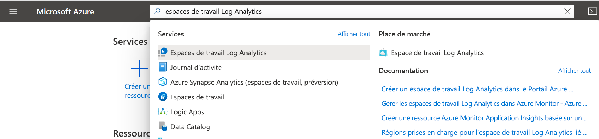

# Créer un espace de travail Log Analytics dans le portail Azure
Utilisez le menu **Espaces de travail Log Analytics** pour créer un espace de travail Log Analytics à l’aide du portail Azure. Un espace de travail Log Analytics est un environnement unique pour les données de journal d’activité Azure Monitor. Chaque espace de travail dispose d’un référentiel de données et d’une configuration propres. Les sources de données et les solutions sont configurées de façon à stocker leurs données dans un espace de travail particulier. Vous devez avoir un espace de travail Log Analytics si vous souhaitez collecter des données à partir des sources suivantes :

* Ressources Azure dans votre abonnement
* Ordinateurs locaux surveillés par System Center Operations Manager
* Regroupements d’appareils à partir de Configuration Manager 
* Données de diagnostics ou de journaux du Stockage Azure

Pour les autres sources, telles que les machines virtuelles Azure et les machines virtuelles Windows ou Linux dans votre environnement, consultez les rubriques suivantes :

*  [Collect data from Azure virtual machines](./quick-collect-azurevm.md) (Collecter des données à partir de machines virtuelles Azure) 
*  [Collect data from hybrid Linux computer](./quick-collect-linux-computer.md) (Collecter des données à partir d’un ordinateur Linux hybride)
*  [Collect data from hybrid Windows computer](quick-collect-windows-computer.md) (Collecter des données à partir d’un ordinateur Windows hybride)

Si vous n’avez pas d’abonnement Azure, créez un [compte gratuit](https://azure.microsoft.com/free/?WT.mc_id=A261C142F) avant de commencer.

## Se connecter au portail Azure
Connectez-vous au portail Azure sur [https://portal.azure.com](https://portal.azure.com). 

## Créer un espace de travail
1. Dans le portail Azure, cliquez sur **Tous les services** . Dans la liste de ressources, saisissez **Log Analytics** . Au fur et à mesure de la saisie, la liste est filtrée. Sélectionnez **Espaces de travail Log Analytics** .

    
  
2. Cliquez sur **Ajouter** , puis sélectionnez les options pour les éléments suivants :

   * Attribuez un nom au nouvel **Espace de travail Log Analytics** comme *DefaultLAWorkspace* . Ce nom doit être globalement unique sur l’ensemble des abonnements Azure Monitor.
   * Dans la liste déroulante **Abonnement** , sélectionnez un abonnement à lier si la valeur par défaut sélectionnée n’est pas appropriée.
   * Pour **Groupe de ressources** , choisissez d’utiliser un groupe de ressources déjà configuré ou créez-en un.  
   * Sélectionnez un **Emplacement** disponible.  Pour plus d’informations, consultez les [régions dans lesquelles Log Analytics est disponible](https://azure.microsoft.com/regions/services/) et recherchez Azure Monitor à partir du champ **Rechercher un produit** .  
   * Si vous créez un espace de travail dans un nouvel abonnement créé après le 2 avril 2018, il utilisera automatiquement le plan tarifaire *Par Go* et l’option pour sélectionner un niveau de tarification ne sera pas disponible.  Si vous créez un espace de travail pour un abonnement existant créé avant le 2 avril, ou pour un abonnement lié à une inscription à un Contrat Entreprise existante, sélectionnez le niveau tarifaire de votre choix.  Pour plus d’informations sur les différents niveaux proposés, consultez le [détail des tarifs de Log Analytics](https://azure.microsoft.com/pricing/details/log-analytics/).

          

3. Après avoir entré les informations requises dans le volet **Espace de travail Log Analytics** , cliquez sur **OK** .  

Pendant que les informations sont vérifiées et l’espace de travail créé, vous pouvez suivre la progression sous **Notifications** dans le menu. 

## Dépannage
Lorsque vous créez un espace de travail qui a été supprimé au cours des 14 derniers jours et qui se trouve dans l’[état de suppression réversible](../platform/delete-workspace.md#soft-delete-behavior), l’opération peut avoir des résultats différents en fonction de la configuration de votre espace de travail :
1. Si vous fournissez les mêmes nom d’espace de travail, groupe de ressources, abonnement et région que dans l’espace de travail supprimé, votre espace de travail est récupéré avec ses données, sa configuration et ses agents connectés.
2. Si vous utilisez le même nom d’espace de travail, mais un groupe de ressources, un abonnement ou une région différents, vous recevez le message erreur : *Ce nom d’espace de travail est déjà utilisé. Essayez un autre nom.* . Pour annuler la suppression réversible afin de supprimer définitivement votre espace de travail et d’en créer un nouveau sous le même nom, procédez comme suit pour récupérer l’espace de travail avant d’effectuer la suppression définitive :
   - [Récupérer](../platform/delete-workspace.md#recover-workspace) votre espace de travail
   - [Supprimer définitivement](../platform/delete-workspace.md#permanent-workspace-delete) votre espace de travail
   - Créer un espace de travail en reprenant le même nom d’espace de travail

## Étapes suivantes
Disposant à présent d’un espace de travail, vous pouvez configurer la collecte des données de télémétrie de surveillance, exécuter des recherches dans les journaux pour analyser ces données et ajouter une solution de gestion pour fournir des données et insights analytiques supplémentaires. 

* Pour créer des règles d’alerte et analyser l’intégrité de votre espace de travail, consultez [Analyser l’intégrité de l’espace de travail Log Analytics dans Azure Monitor](../platform/monitor-workspace.md). 
* Pour activer la collecte de données à partir de ressources Azure avec Diagnostics Azure ou le stockage Azure, consultez [Collecter des journaux d’activité et des métriques des services Azure à utiliser dans Log Analytics](../platform/resource-logs.md#send-to-log-analytics-workspace).
