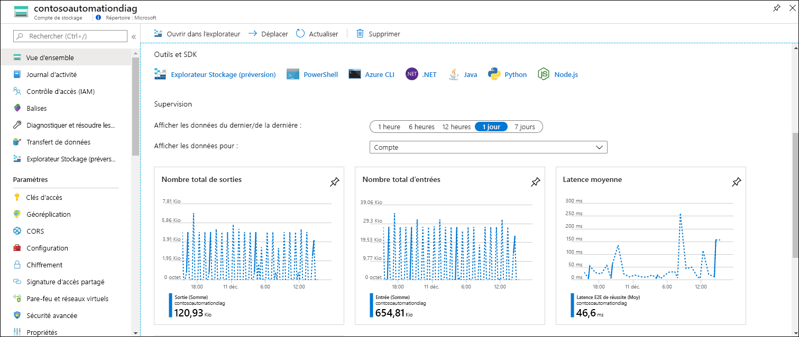
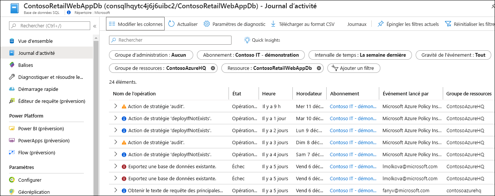
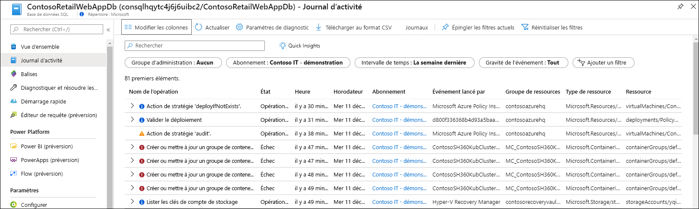
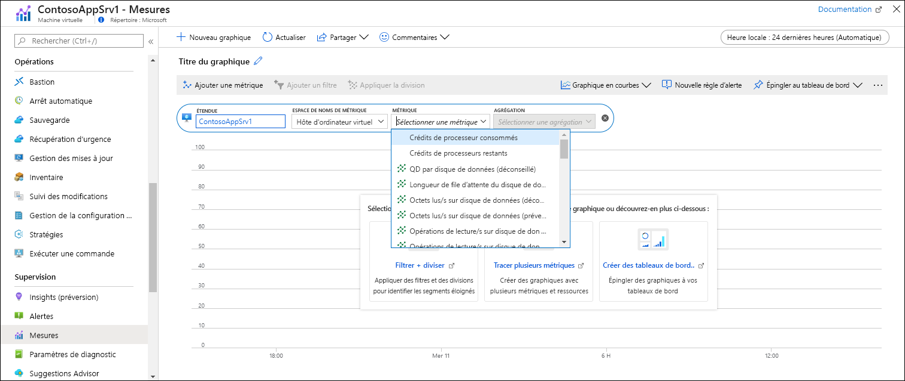
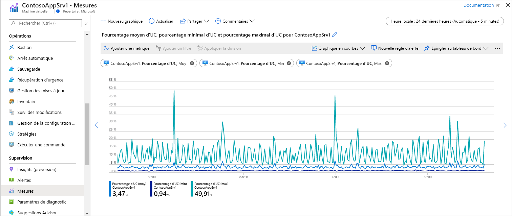

# Démarrage rapide : Superviser une ressource Azure avec Azure Monitor
[Azure Monitor](../overview.md) commence à collecter des données des ressources Azure dès le moment de leur création. Ce guide de démarrage rapide décrit brièvement les données qui sont collectées automatiquement pour une ressource particulière et explique comment les afficher dans le portail Azure. Ensuite, vous pouvez ajouter une configuration pour collecter des données supplémentaires. À partir du menu d’Azure Monitor, vous pouvez utiliser les mêmes outils pour accéder aux données collectées pour toutes les ressources dans votre abonnement.

Pour obtenir une description plus détaillée des données de supervision collectées à partir des ressources Azure, consultez [Supervision de ressources Azure avec Azure Monitor](../insights/monitor-azure-resource.md).

## Se connecter au portail Azure

Connectez-vous au portail Azure sur [https://portal.azure.com](https://portal.azure.com). 

## Page Vue d’ensemble
De nombreux services incluent des données de supervision dans leur page **Vue d’ensemble**, offrant un aperçu rapide de leur fonctionnement. En général, cela se base sur un sous-ensemble de métriques de plateforme stockées dans les métriques Azure Monitor.

1. Localisez une ressource Azure dans votre abonnement.
2. Accédez à la page **Vue d’ensemble** et regardez si des données de performances sont affichées. Ces données sont fournies par Azure Monitor. L’exemple ci-dessous montre la page **Vue d’ensemble** pour un compte de stockage Azure. Comme vous pouvez le voir, plusieurs métriques différentes y sont affichées.

    

3. Vous pouvez cliquer sur chacun des graphiques pour afficher les données dans Metrics Explorer, comme cela est décrit plus bas.

## Afficher le journal d’activité
Le journal d’activité fournit des insights sur les opérations sur chaque ressource Azure dans l’abonnement. Ces informations indiquent notamment quand une ressource a été créée ou modifiée, quand un travail a démarré ou quand une opération particulière s’est produite.

1. En haut du menu de votre ressource, sélectionnez **Journal d’activité**.
2. Le filtre est actuellement appliqué sur les événements liés à votre ressource. Si vous ne voyez aucun événement, essayez de changer le paramètre **Intervalle de temps** pour élargir la plage de temps prise en compte.

    

4. Si vous souhaitez voir les événements d’autres ressources dans votre abonnement, modifiez les critères du filtre ou supprimez les propriétés de filtre.

    

## Afficher les mesures
Les métriques sont des valeurs numériques qui décrivent certains aspects de votre ressource à un moment donné. Azure Monitor collecte automatiquement les métriques de plateforme à intervalles d’une minute à partir de toutes les ressources Azure. Vous pouvez voir ces métriques dans Metrics Explorer.

1. Dans la section **Supervision** du menu de votre ressource, sélectionnez **Métriques**. Metrics Explorer s’ouvre avec l’étendue définie sur votre ressource.
2. Cliquez sur **Ajouter une métrique** pour ajouter une métrique au graphique.
   
   
   
4. Sélectionnez une valeur **Métrique** dans la liste déroulante, puis une valeur **Agrégation**. Ces valeurs définissent la manière dont les valeurs collectées seront échantillonnées sur chaque intervalle de temps.

    

5. Cliquez sur **Ajouter une métrique** pour ajouter des combinaisons de métrique et d’agrégation supplémentaires au graphique.

    

## Étapes suivantes
Dans ce guide de démarrage rapide, vous avez affiché le journal d’activité et les métriques pour une ressource Azure qui sont collectées automatiquement par Azure Monitor. Passez au guide de démarrage rapide suivant, qui vous montre comment collecter le journal d’activité dans un espace de travail Log Analytics dans lequel il peut être analysé à l’aide de [requêtes de journal](../log-query/log-query-overview.md).

> [!div class="nextstepaction"]
> [Envoyer le journal d’activité Azure à un espace de travail Log Analytics]()

