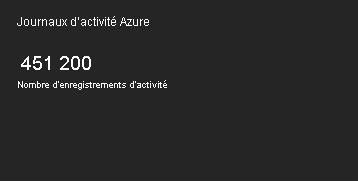

# Collecter et analyser les journaux d’activité Azure dans l’espace de travail Log Analytics dans Azure Monitor

> [!WARNING]
> Vous pouvez maintenant collecter le journal d’activité dans un espace de travail Log Analytics à l’aide d’un paramètre de diagnostic de la même façon que vous collectez les journaux de ressources. Consultez [Collecter et analyser les journaux d’activité Azure dans l’espace de travail Log Analytics dans Azure Monitor](diagnostic-settings-legacy.md).

Le [journal d’activité Azure](platform-logs-overview.md) apporte des insights sur les événements liés aux abonnements qui se sont produits dans votre abonnement Azure. Cet article explique comment collecter le journal d’activité dans un espace de travail Log Analytics et utiliser la [solution de supervision](../insights/solutions.md) Activity Log Analytics, qui fournit des requêtes et des vues pour analyser ces données. 

Connecter le journal d’activité à un espace de travail Log Analytics offre les avantages suivants :

- Consolider le journal d’activité à partir de plusieurs abonnements Azure dans un même emplacement à des fins d'analyse.
- Stocker les entrées du journal d’activité au-delà de 90 jours.
- Mettre en corrélation les données du journal d'activité avec d’autres données d’analyse collectées par Azure Monitor.
- Utiliser les [requêtes de journal](../log-query/log-query-overview.md) pour effectuer des analyses complexes et obtenir des informations détaillées sur les entrées du journal d’activité.

## Se connecter à l’espace de travail Log Analytics
Un seul espace de travail peut être connecté au journal d’activité de plusieurs abonnements dans le même abonné Azure. Pour une collecte dans plusieurs locataires, consultez [Collecter les journaux d’activité Azure de différents abonnements dans un espace de travail Log Analytics dans différents locataires Azure Active Directory](activity-log-collect-tenants.md).

> [!IMPORTANT]
> Une erreur peut se produire lors de la procédure suivante si les fournisseurs de ressources Microsoft.OperationalInsights et Microsoft.OperationsManagement ne sont pas inscrits pour votre abonnement. Consultez [Fournisseurs et types de ressources Azure](../../azure-resource-manager/management/resource-providers-and-types.md) pour inscrire ces fournisseurs.

Suivez la procédure ci-dessous pour connecter le journal d’activité à votre espace de travail Log Analytics :

1. À partir du menu **Espaces de travail Log Analytics** du portail Azure, sélectionnez l’espace de travail pour collecter le journal d’activité.
1. Dans la section **Sources de données de l’espace de travail** du menu de l’espace de travail, sélectionnez **Journal d’activité Azure**.
1. Cliquez sur l’abonnement que vous souhaitez connecter.

    

1. Cliquez sur **Connecter** pour connecter le journal d’activité de l’abonnement à l’espace de travail sélectionné. Si l’abonnement est déjà connecté à un autre espace de travail, cliquez d'abord sur **Déconnecter** pour le déconnecter.

    

## Analyser dans l'espace de travail Log Analytics
Lorsque vous connectez un journal d’activité à un espace de travail Log Analytics, les entrées sont écrites dans l’espace de travail dans une table appelée **AzureActivity** que vous pouvez récupérer à l'aide d'une [requête de journal](../log-query/log-query-overview.md). La structure de cette table varie selon la [catégorie de l’entrée de journal](activity-log-view.md#categories-in-the-activity-log). Consultez [Schéma d’événements du journal d’activité](activity-log-schema.md) pour obtenir une description de chaque catégorie.

## Solution de supervision Activity Log Analytics
La solution de supervision Activity Log Analytics inclut plusieurs requêtes de journal et vues pour analyser les enregistrements du journal d’activité dans votre espace de travail Log Analytics.

### Installer la solution
Suivez la procédure décrite dans [Installer une solution de supervision](../insights/solutions.md#install-a-monitoring-solution) pour installer la solution **Activity Log Analytics**. Aucune configuration supplémentaire n'est requise.

### Utiliser la solution
Les solutions de supervision sont accessibles à partir du menu **Superviser** du portail Azure. Sélectionnez **Plus** dans la section **Insights** pour ouvrir la page **Vue d’ensemble** avec les vignettes des solutions. La vignette **Azure Activity Log** affiche le nombre d'enregistrements **AzureActivity** dans votre espace de travail.

Cliquez sur la vignette **Journaux d’activité Azure** pour ouvrir l'affichage **Journaux d’activité Azure**. La vue inclut les composants de visualisation dans le tableau suivant. Chaque partie répertorie jusqu'à 10 éléments répondant à ses critères en ce qui concerne l’intervalle de temps spécifié. Vous pouvez exécuter une requête de journal qui renvoie tous les enregistrements correspondants en cliquant sur **Afficher tout** en bas du composant.

| Composant de visualisation | Description |
| --- | --- |
| Entrées de journal d’activité Azure | Affiche un graphique à barres du plus grand nombre d’enregistrements d’entrée de journal d’activité Azure pour la période sélectionnée et la liste des 10 premiers appelants d’activité. Cliquez sur le graphique à barres pour exécuter une recherche dans les journaux de `AzureActivity`. Cliquez sur un élément appelant pour exécuter une recherche dans les journaux qui renvoie toutes les entrées de journal d’activité pour cet élément. |
| Journaux d’activité par état | Affiche un graphique en anneau de l’état des journaux d’activité Azure pour la période sélectionnée et la liste des 10 premiers enregistrements d'état. Cliquez sur le graphique pour exécuter une requête de journal pour `AzureActivity | summarize AggregatedValue = count() by ActivityStatus`. Cliquez sur un élément d’état pour exécuter une recherche dans les journaux qui renvoie toutes les entrées de journal d’activité pour cet enregistrement d’état. |
| Journaux d’activité par ressource | Affiche le nombre total de ressources avec les journaux d’activité et répertorie les dix premières ressources avec le nombre d’enregistrements pour chaque ressource. Cliquez sur la zone Total pour exécuter une recherche dans les journaux de `AzureActivity | summarize AggregatedValue = count() by Resource`, qui affiche toutes les ressources Azure disponibles pour la solution. Cliquez sur une ressource pour exécuter une requête de journal qui renvoie tous les enregistrements d’activité pour cette ressource. |
| Journaux d’activité par fournisseur de ressources | Affiche le nombre total de fournisseurs de ressources qui génèrent des journaux d’activité et répertorie les dix premiers. Cliquez sur la zone Total pour exécuter une requête de journal pour `AzureActivity | summarize AggregatedValue = count() by ResourceProvider`, qui affiche tous les fournisseurs de ressources Azure. Cliquez sur un fournisseur de ressources pour exécuter une requête de journal qui renvoie tous les enregistrements d’activité pour ce fournisseur. |

## Étapes suivantes

- Découvrez plus en détail le [journal d’activité](platform-logs-overview.md).
- Apprenez-en davantage sur la [plateforme de données Azure Monitor](data-platform.md).
- Utilisez les [requêtes de journal](../log-query/log-query-overview.md) pour afficher des informations détaillées provenant de votre journal d’activité.
