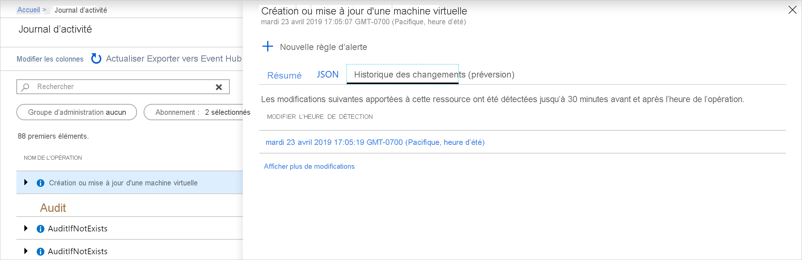

# <a name="view-and-retrieve-azure-activity-log-events"></a>Afficher et récupérer les événements du journal d’activité Azure

Le [journal d’activité Azure](activity-logs-overview.md) apporte des insights sur les événements liés aux abonnements qui se sont produits dans Azure. Cet article fournit des détails sur les différentes méthodes d'affichage et de récupération des événements du journal d’activité.

## <a name="azure-portal"></a>Portail Azure
Affichez le journal d’activité de toutes les ressources à partir du menu **Surveiller** dans le portail Azure. Affichez le journal d’activité d’une ressource particulière à partir de l’option **Journal d’activité** disponible dans le menu de cette ressource.


Vous pouvez filtrer les événements du journal d’activité en fonction des champs suivants :

* **Intervalle de temps** : heure de début et de fin des événements.
* **Catégorie** : catégorie d’événement comme décrit dans [Catégories du journal d’activité](activity-logs-overview.md#categories-in-the-activity-log).
* **Abonnement**: un ou plusieurs noms d’abonnements Azure.
* **Groupe de ressources** : un ou plusieurs groupes de ressources au sein de ces abonnements.
* **Ressource (nom)**  : nom d’une ressource spécifique.
* **Type de ressource** : type de ressource, par exemple, _Microsoft.Compute/virtualmachines_.
* **Nom de l’opération** : nom d’une opération Azure Resource Manager, par exemple, _Microsoft.SQL/servers/Write_.
* **Gravité** : Niveau de gravité de l’événement. Les valeurs disponibles sont _Information_, _Avertissement_, _Erreur_, _Critique_.
* **Événement lancé par** : utilisateur qui a effectué l’opération.
* **Recherche libre** : zone de recherche textuelle libre qui permet de rechercher une chaîne dans les champs de tous les événements.

### <a name="view-change-history"></a>Afficher l'historique des modifications

Lorsque vous examinez le journal d’activité, il peut être utile de voir les modifications apportées au moment de l'événement. L'**historique des modifications** vous permet d'afficher ces informations. Sélectionnez un événement du journal d’activité sur lequel vous souhaitez vous pencher. Sélectionnez l'onglet **Historique des modifications (préversion)** pour afficher les modifications associées à cet événement.



Si des modifications ont été apportées à l’événement, la liste des modifications que vous pouvez sélectionner s'affiche. Vous accédez à la page **Historique des modifications (préversion)** . Les modifications apportées à la ressource s'affichent sur cette page. Comme vous pouvez le constater dans l'exemple suivant, nous sommes en mesure de voir que la taille de la machine virtuelle a changé, ainsi que sa taille avant et après la modification.


Pour en savoir plus sur l’historique des modifications, consultez [Obtenir les modifications des ressources](../../governance/resource-graph/how-to/get-resource-changes.md).


## <a name="log-analytics-workspace"></a>Espace de travail Log Analytics
Cliquez sur **Journaux** en haut de la page **Journal d’activité** pour ouvrir la [solution de supervision Activity Log Analytics](activity-log-collect.md) pour l’abonnement. Vous pourrez ainsi afficher les données d'analyse du journal d'activité et exécuter des [requêtes de journal](../log-query/log-query-overview.md) avec la table **AzureActivity**. Si votre journal d’activité n’est pas connecté à un espace de travail Log Analytics, vous serez invité à procéder à cette configuration.


## <a name="powershell"></a>PowerShell
Utilisez la cmdlet [Get-AzLog](https://docs.microsoft.com/powershell/module/az.monitor/get-azlog) pour récupérer le journal d’activité à partir de PowerShell. Voici quelques exemples courants.

> [!NOTE]
> `Get-AzLog` fournit uniquement 15 jours d'historique. Utilisez le paramètre **-MaxEvents** pour interroger les N derniers événements, au-delà de 15 jours. Pour accéder aux événements antérieurs à 15 jours, utilisez l'API REST ou le kit de développement logiciel (SDK). Si vous n'incluez pas **StartTime**, la valeur par défaut est **EndTime** moins une heure. Si vous n'incluez pas **EndTime**, la valeur par défaut est l'heure actuelle. Toutes les heures sont exprimées en heure UTC.


Obtenir les entrées de journal créées après une date/heure donnée :

```powershell
Get-AzLog -StartTime 2016-03-01T10:30
```

Obtenir les entrées de journal entre une plage de dates/heures :

```powershell
Get-AzLog -StartTime 2015-01-01T10:30 -EndTime 2015-01-01T11:30
```

Obtenir les entrées de journal à partir d'un groupe de ressources spécifique :

```powershell
Get-AzLog -ResourceGroup 'myrg1'
```

Obtenir les entrées de journal à partir d'un fournisseur de ressources spécifique entre une plage de dates/heures :

```powershell
Get-AzLog -ResourceProvider 'Microsoft.Web' -StartTime 2015-01-01T10:30 -EndTime 2015-01-01T11:30
```

Obtenir les entrées de journal avec un appelant spécifique :

```powershell
Get-AzLog -Caller 'myname@company.com'
```

Obtenir les 1 000 derniers événements :

```powershell
Get-AzLog -MaxEvents 1000
```


## <a name="cli"></a>Interface de ligne de commande
Utilisez [az monitor activity-log](cli-samples.md#view-activity-log-for-a-subscription) pour récupérer le journal d’activité à partir de l’interface CLI. Voici quelques exemples courants.


Affichez toutes les options disponibles.

```azurecli
az monitor activity-log list -h
```

Obtenir les entrées de journal à partir d'un groupe de ressources spécifique :

```azurecli
az monitor activity-log list --resource-group <group name>
```

Obtenir les entrées de journal avec un appelant spécifique :

```azurecli
az monitor activity-log list --caller myname@company.com
```

Obtenir les journaux par appelant, sur un type de ressource, dans une plage de dates :

```azurecli
az monitor activity-log list --resource-provider Microsoft.Web \
    --caller myname@company.com \
    --start-time 2016-03-08T00:00:00Z \
    --end-time 2016-03-16T00:00:00Z
```

## <a name="rest-api"></a>API REST
Utilisez l'[API REST Azure Monitor](https://docs.microsoft.com/rest/api/monitor/) pour récupérer le journal d’activité à partir d’un client REST. Voici quelques exemples courants.

Obtenir les journaux d’activité avec filter :

``` HTTP
GET https://management.azure.com/subscriptions/089bd33f-d4ec-47fe-8ba5-0753aa5c5b33/providers/microsoft.insights/eventtypes/management/values?api-version=2015-04-01&$filter=eventTimestamp ge '2018-01-21T20:00:00Z' and eventTimestamp le '2018-01-23T20:00:00Z' and resourceGroupName eq 'MSSupportGroup'
```

Obtenir les journaux d’activité avec filter et select :

```HTTP
GET https://management.azure.com/subscriptions/089bd33f-d4ec-47fe-8ba5-0753aa5c5b33/providers/microsoft.insights/eventtypes/management/values?api-version=2015-04-01&$filter=eventTimestamp ge '2015-01-21T20:00:00Z' and eventTimestamp le '2015-01-23T20:00:00Z' and resourceGroupName eq 'MSSupportGroup'&$select=eventName,id,resourceGroupName,resourceProviderName,operationName,status,eventTimestamp,correlationId,submissionTimestamp,level
```

Obtenir les journaux d’activité avec select :

```HTTP
GET https://management.azure.com/subscriptions/089bd33f-d4ec-47fe-8ba5-0753aa5c5b33/providers/microsoft.insights/eventtypes/management/values?api-version=2015-04-01&$select=eventName,id,resourceGroupName,resourceProviderName,operationName,status,eventTimestamp,correlationId,submissionTimestamp,level
```

Obtenir les journaux d’activité sans filter ou select :

```HTTP
GET https://management.azure.com/subscriptions/089bd33f-d4ec-47fe-8ba5-0753aa5c5b33/providers/microsoft.insights/eventtypes/management/values?api-version=2015-04-01
```


## <a name="next-steps"></a>Étapes suivantes

* [Consulter une vue d’ensemble du journal d’activité](activity-logs-overview.md)
* [Archiver le journal d’activité vers le stockage ou le diffuser en continu dans Event Hubs](activity-log-export.md)
* [Stream the Azure Activity Log to Event Hubs (Diffuser en continu le journal d’activités Azure vers Event Hubs)](activity-logs-stream-event-hubs.md)
* [Archiver le journal d’activité Azure dans le stockage](archive-activity-log.md)

