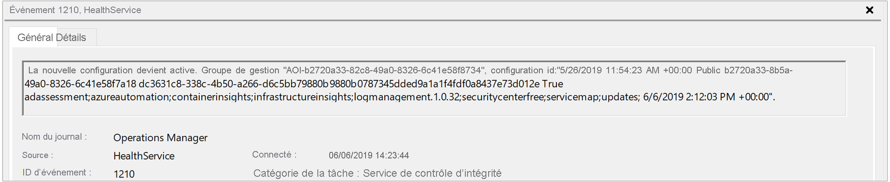

# <a name="how-to-troubleshoot-issues-with-the-log-analytics-agent-for-windows"></a>Guide pratique pour résoudre les problèmes liés à l’agent Log Analytics pour Windows 

Cet article fournit une assistance sur les erreurs que vous pourriez rencontrer avec l’agent Log Analytics pour Windows dans Azure Monitor et suggère des solutions possibles pour les résoudre.

Si aucune de ces étapes ne fonctionne, les canaux de support suivants sont également disponibles :

* Les clients bénéficiant d’un support Premier peuvent ouvrir une demande de support auprès du [Support Premier](https://premier.microsoft.com/).
* Les clients titulaires d’un contrat de support Azure peuvent ouvrir une demande de support [sur le portail Azure](https://manage.windowsazure.com/?getsupport=true).
* Visitez la page de commentaires de Log Analytics pour consulter les idées et bogues soumis sur [https://aka.ms/opinsightsfeedback](https://aka.ms/opinsightsfeedback) ou en partager de nouveaux. 

## <a name="important-troubleshooting-sources"></a>Sources importantes de résolution des problèmes

 Pour faciliter la résolution des problèmes liés à l’agent Log Analytics pour Windows, l’agent enregistre les événements dans le journal des événements Windows, en particulier sous *Application et services\Operations Manager*.  

## <a name="connectivity-issues"></a>Problèmes de connectivité

Si l’agent communique via un serveur proxy ou un pare-feu, des restrictions peuvent empêcher la communication à partir de l’ordinateur source et du service Azure Monitor. Si la communication est bloquée, à cause d’une configuration incorrecte, l’inscription auprès d’un espace de travail peut échouer quand vous tentez d’installer l’agent ou de configurer l’agent après l’installation pour envoyer les rapports à un espace de travail supplémentaire. La communication avec l’agent peut échouer après une inscription réussie. Cette section décrit les méthodes permettant de résoudre des problèmes de ce type avec l’agent Windows.

Vérifiez que le pare-feu et le proxy sont configurés pour autoriser les URL et les ports suivants, indiqués dans le tableau ci-dessous. Confirmez également que l’inspection HTTP n’est pas activée pour le trafic web, car cela peut empêcher un canal TLS sécurisé entre l’agent et Azure Monitor.  

|Ressource de l'agent|Ports |Sens |Ignorer l’inspection HTTPS|
|------|---------|--------|--------|   
|*.ods.opinsights.azure.com |Port 443 |Règle de trafic sortant|Oui |  
|*.oms.opinsights.azure.com |Port 443 |Règle de trafic sortant|Oui |  
|*.blob.core.windows.net |Port 443 |Règle de trafic sortant|Oui |  
|*.agentsvc.azure-automation.net |Port 443 |Règle de trafic sortant|Oui |  

Pour obtenir les informations relatives au pare-feu nécessaires pour Azure Government, consultez [Azure Government Monitoring + Management](../../azure-government/compare-azure-government-global-azure.md#azure-monitor). Si vous envisagez d’utiliser le Runbook Worker hybride Azure Automation pour vous connecter et vous inscrire auprès du service Automation afin d’utiliser des runbooks et des solutions de gestion dans votre environnement, il doit avoir accès au numéro de port et aux URL décrites dans la section [Configurer votre réseau pour le Runbook Worker hybride](../../automation/automation-hybrid-runbook-worker.md#network-planning). 

Plusieurs méthodes vous permettent de vérifier si l’agent communique correctement avec Azure Monitor.

- Activez l’[évaluation d’intégrité de l’agent Azure Log Analytics](../insights/solution-agenthealth.md) dans l’espace de travail. Dans le tableau de bord Agent Health, consultez la colonne **Nombre d’agents inactifs** pour voir rapidement si l’agent est répertorié.  

- Exécutez la requête suivante pour vérifier que l’agent envoie une pulsation à l’espace de travail auquel il doit rendre compte. Remplacez `<ComputerName>` par le nom réel de la machine.

    ```
    Heartbeat 
    | where Computer like "<ComputerName>"
    | summarize arg_max(TimeGenerated, * ) by Computer 
    ```

    Si l’ordinateur communique avec le service, la requête doit retourner un résultat. Si la requête n’a pas retourné de résultat, vérifiez tout d’abord que l’agent est configuré pour rendre compte à l’espace de travail correct. S’il est configuré correctement, passez à l’étape 3 et inspectez le journal des événements Windows pour déterminer si l’agent consigne le problème qui peut l’empêcher de communiquer avec Azure Monitor.

- Une autre méthode permettant d’identifier un problème de connectivité consiste à exécuter l’outil **TestCloudConnectivity**. L’outil est installé par défaut avec l’agent dans le dossier *%SystemRoot%\Program Files\Microsoft Monitoring Agent\Agent*. À partir d’une invite de commandes avec élévation de privilèges, accédez au dossier et exécutez l’outil. L’outil retourne les résultats et met en évidence là où le test a échoué (par exemple, s’il était lié à un port/URL particulier qui était bloqué). 

    

- Filtrez le journal des événements *Operations Manager* par **Sources d’événements** - *Modules du service de contrôle d’intégrité*, *HealthService* et *Connecteur de service*, et filtrez par **Niveau d’événement** *Avertissement* et *Erreur* pour vérifier s’il contient des événements écrits, issus du tableau suivant. Si tel est le cas, passez en revue les étapes de résolution incluses pour chaque événement possible.

    |ID de l’événement |Source |Description |Résolution |
    |---------|-------|------------|-----------|
    |2133 & 2129 |Service de contrôle d’intégrité |Échec de la connexion de l’agent au service |Cette erreur peut se produire lorsque l’agent ne peut pas communiquer directement ou via un pare-feu/serveur proxy avec le service Azure Monitor. Vérifiez les paramètres de proxy de l’agent ou que le pare-feu/proxy réseau autorise le trafic TCP de l’ordinateur au service.|
    |2138 |Modules du service de contrôle d’intégrité |Le proxy requiert une authentification |Configurez les paramètres de proxy de l’agent et spécifiez le nom d’utilisateur/mot de passe requis pour s’authentifier auprès du serveur proxy. |
    |2129 |Modules du service de contrôle d’intégrité |Échec de la connexion/Échec de la négociation TLS |Vérifiez vos paramètres TCP/IP de carte réseau et les paramètres de proxy de l’agent.|
    |2127 |Modules du service de contrôle d’intégrité |Échec d’envoi de données avec code d'erreur reçu |Si cela se produit uniquement périodiquement pendant la journée, il peut s’agir d’une simple anomalie aléatoire qui peut être ignorée. Surveillez pour comprendre la fréquence à laquelle cela se produit. Si cela se produit souvent au cours de la journée, vérifiez tout d’abord votre configuration réseau et les paramètres de proxy. Si la description inclut le code d’erreur HTTP 404 et qu’il s’agit de la première fois où l’agent tente d’envoyer des données au service, elle inclura une erreur 500 avec un code d’erreur 404 interne. 404 signifie qu’un élément est introuvable, ce qui indique que la zone de stockage pour le nouvel espace de travail est toujours en cours de provisionnement. Lors de la tentative suivante, les données seront correctement écrites dans l’espace de travail, comme prévu. Une erreur HTTP 403 peut indiquer un problème d’autorisation ou d’informations d’identification. Des informations supplémentaires sont incluses avec l’erreur 403 pour aider à résoudre le problème.|
    |4000 |Connecteur de service |Échec de la résolution de nom DNS |La machine n’a pas pu résoudre l’adresse Internet utilisée lors de l’envoi de données au service. Cela peut être des paramètres de résolution DNS sur votre machine, des paramètres de proxy incorrects ou peut-être un problème DNS temporaire avec votre fournisseur. Si cela se produit régulièrement, cela peut provenir d’un problème temporaire de réseau.|
    |4001 |Connecteur de service |La connexion au service a échoué. |Cette erreur peut se produire lorsque l’agent ne peut pas communiquer directement ou via un pare-feu/serveur proxy avec le service Azure Monitor. Vérifiez les paramètres de proxy de l’agent ou que le pare-feu/proxy réseau autorise le trafic TCP de l’ordinateur au service.|
    |4002 |Connecteur de service |Le service a retourné le code d’état HTTP 403 en réponse à une requête. Vérifiez l’intégrité du service auprès de l’administrateur de service. La requête sera retentée ultérieurement. |Cette erreur est consignée pendant la phase d’inscription initiale de l’agent et vous verrez une URL semblable à ce qui suit : *https://\<workspaceID>.oms.opinsights.azure.com/AgentService.svc/AgentTopologyRequest*. Une erreur 403 se rapporte à une interdiction et peut résulter d’une erreur de saisie de la clé ou de l’ID de l’espace de travail, ou d’une date et d’une heure incorrectes sur l’ordinateur. Si l’heure est à +/-15 minutes de l’heure actuelle, l’intégration échoue. Pour corriger ce problème, mettez à jour la date et/ou le fuseau horaire de votre ordinateur Windows.|

## <a name="data-collection-issues"></a>Problèmes de collecte de données

Une fois que l’agent est installé et rend compte à son ou ses espaces de travail configurés, il peut cesser de recevoir la configuration, de collecter ou de transférer les performances, les journaux ou d’autres données au service selon ce qui est activé et qui cible l’ordinateur. Il est nécessaire de déterminer si :

- Est-ce un type de données spécifique ou toutes les données qui ne sont pas disponibles dans l’espace de travail ?
- Le type de données est-il spécifié par une solution ou spécifié dans le cadre de la configuration de la collecte des données d’espace de travail ?
- Combien d’ordinateurs sont-ils affectés ? Un seul ou plusieurs ordinateurs rendent-ils compte à l’espace de travail ?
- Cela fonctionnait-il et a-t-il cessé à un moment précis de la journée ou cela n’a-t-il jamais été collecté ? 
- La requête de recherche dans les journaux que vous utilisez est-elle syntaxiquement correcte ? 
- L’agent a-t-il jamais reçu sa configuration à partir d’Azure Monitor ?

La première étape du dépannage consiste à déterminer si l’ordinateur envoie un événement de pulsation.

```
Heartbeat 
    | where Computer like "<ComputerName>"
    | summarize arg_max(TimeGenerated, * ) by Computer
```

Si la requête retourne des résultats, vous devez déterminer si un type de données particulier n’est pas collecté et transféré au service. Cela peut être dû à l’agent qui ne reçoit pas la configuration mise à jour du service ou à certains autres symptôme empêchant l’agent de fonctionner normalement. Procédez comme suit pour poursuivre le dépannage.

1. Ouvrez une invite de commandes avec élévation de privilèges sur l’ordinateur et redémarrez le service de l’agent en tapant `net stop healthservice && net start healthservice`.
2. Ouvrez le journal des événements *Operations Manager* et recherchez les **ID d’événements** *7023, 7024, 7025, 7028* et *1210* à partir de **Source d’événement** *HealthService*.  Ces événements indiquent que l’agent reçoit correctement la configuration d’Azure Monitor et surveillent activement l’ordinateur. La description de l’événement d’ID 1210 spécifie également sur sa dernière ligne toutes les solutions et les informations qui sont incluses dans l’étendue de la supervision sur l’agent.  

    

3. Si après quelques minutes, vous ne voyez pas les données attendues dans les résultats de la requête ou la visualisation, selon que vous affichez les données à partir d’une solution ou d’Insight, à partir du journal des événements *Operations Manager*, recherchez **Sources d’événement** *HealthService* et *Modules de service de contrôle d’intégrité*, et filtrez par **Niveau d’événement** *Avertissement* et *Erreur* pour vérifier s’il contient des événements écrits, issus du tableau suivant.

    |ID de l’événement |Source |Description |Résolution |
    |---------|-------|------------|
    |8000 |HealthService |Cet événement spécifie si un flux de travail lié aux performances, à un événement ou à un autre type de données collectées est dans l’incapacité de transférer au service pour ingestion à l’espace de travail. | L’événement d’ID 2136 issu de la source HealthService est écrit avec cet événement et peut indiquer que l’agent ne peut pas communiquer avec le service, probablement en raison d’une configuration incorrecte des paramètres de proxy et d’authentification, d’une panne de réseau ou du fait que le pare-feu/proxy du réseau n’autorise pas le trafic TCP de l’ordinateur au service.| 
    |10102 et 10103 |Modules du service de contrôle d’intégrité |Le flux de travail n’a pas pu résoudre la source de données. |Cela peut se produire si l’instance ou le compteur de performances spécifié n’existe pas sur l’ordinateur ou est incorrectement défini dans les paramètres de données de l’espace de travail. S’il s’agit d’un [compteur de performances](data-sources-performance-counters.md#configuring-performance-counters) spécifié par l’utilisateur, vérifiez que les informations spécifiées suivent le format correct et existent sur les ordinateurs cibles. |
    |26002 |Modules du service de contrôle d’intégrité |Le flux de travail n’a pas pu résoudre la source de données. |Cela peut se produire si le journal des événements Windows spécifié n’existe pas sur l’ordinateur. Cette erreur peut être ignorée en toute sécurité si l’ordinateur n’est pas censé avoir ce journal des événements inscrit. Sinon, s’il s’agit d’un [journal des événements](data-sources-windows-events.md#configuring-windows-event-logs) spécifié par l’utilisateur, vérifiez que les informations spécifiées sont correctes. |
