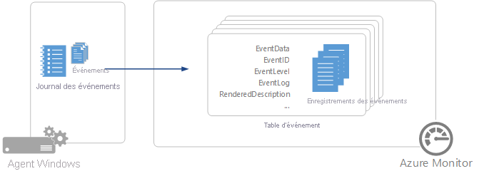

# Collecter les sources de données du journal des événements Windows avec l’agent Log Analytics
Les journaux d’événements Windows sont les [sources de données](agent-data-sources.md) les plus courantes pour les agents Log Analytics sur Windows puisque de nombreuses applications écrivent dans le journal des événements Windows.  Vous pouvez collecter des événements à partir de journaux d’activité standard tels que Système et Application, ou spécifier des journaux d’activité personnalisés créés par les applications que vous souhaitez surveiller.

> [!IMPORTANT]
> Cet article traite de la collecte d’événements Windows avec l’[agent Log Analytics](log-analytics-agent.md), qui est un des agents utilisés par Azure Monitor. D’autres agents collectent des données différentes et sont configurés différemment. Pour obtenir la liste des agents disponibles et les données qu’ils peuvent collecter, consultez [Vue d’ensemble des agents Azure Monitor](agents-overview.md).

     

## Configuration des journaux d’événements Windows
Configurez les journaux d’événements Windows à partir du [menu Données dans les paramètres avancés](agent-data-sources.md#configuring-data-sources) de l’espace de travail Log Analytics.

Azure Monitor collecte uniquement les événements des journaux d’événements Windows spécifiés dans les paramètres.  Vous pouvez ajouter un journal d’événements en tapant le nom du journal puis en cliquant sur **+** .  Pour chaque journal, seuls les événements avec les niveaux de gravité sélectionnés sont collectés.  Vérifiez les niveaux de gravité du journal que vous souhaitez collecter.  Vous ne pouvez pas fournir d’autres critères supplémentaires pour filtrer les événements.

Lorsque vous tapez le nom d’un journal d’événements, Azure Monitor suggère des noms communs de journaux d’événements. Si le journal que vous voulez ajouter n’apparaît pas dans la liste, vous pouvez l’ajouter en saisissant le nom complet du journal. Vous trouverez le nom complet du journal à l’aide de l’Observateur d’événements. Dans l’Observateur d’événements, ouvrez la page *Propriétés* du journal et copiez la chaîne du champ *Nom complet*.

> [!NOTE]
> Les événements critiques du journal d’événements Windows auront un niveau de gravité « Erreur » dans les journaux d’Azure Monitor.

## Collecte de données
Azure Monitor collecte chaque événement correspondant à un niveau de gravité sélectionné à partir d’un journal d’événements surveillé à mesure que l’événement est créé.  L’agent enregistre sa position dans chaque journal des événements à partir duquel il collecte.  Si l’agent est mis hors connexion pendant un moment, il collecte les événements à partir de là où il s’était arrêté, même si ces événements ont été créés lorsque l’agent était hors connexion.  Il est possible que ces événements ne soient pas collectés si des événements non collectés d’un journal sont écrasés pendant que l’agent est hors connexion.

>[!NOTE]
>Azure Monitor ne collecte pas les événements d’audit créés par SQL Server à partir de la source *MSSQLSERVER* avec l’ID d’événement 18453 qui contient les mots clés - *Classic* ou *Audit Success* et le mot clé *0xa0000000000000*.
>

## Propriétés des enregistrements d’événements Windows
Les enregistrements d'événements Windows sont de type **Événement** et possèdent les propriétés affichées dans le tableau suivant :

| Propriété | Description |
|:--- |:--- |
| Computer |Nom de l'ordinateur à partir duquel l'événement a été collecté. |
| EventCategory |Catégorie de l’événement. |
| EventData |Toutes les données d'événement au format brut. |
| EventID |Numéro de l’événement. |
| EventLevel |Gravité de l'événement au format numérique. |
| EventLevelName |Gravité de l'événement au format texte. |
| EventLog |Nom du journal des événements à partir duquel l'événement a été collecté. |
| ParameterXml |Valeurs des paramètres d'événement au format XML. |
| ManagementGroupName |Nom du groupe d’administration pour les agents System Center Operations Manager.  Pour les autres agents, cette valeur est `AOI-<workspace ID>`. |
| RenderedDescription |Description de l'événement avec les valeurs de paramètres |
| Source |Source de l'événement. |
| SourceSystem |Type d’agent auprès duquel l’événement a été collecté.   Ops Manager – Agent Windows, connexion directe ou géré par Operations Manager   Linux – Tous les agents Linux    AzureStorage – Diagnostics Azure |
| TimeGenerated |Date et heure de création de l’événement dans Windows. |
| UserName |Nom d'utilisateur du compte qui a consigné l'événement. |

## Requêtes de journaux avec des événements Windows
Le tableau suivant fournit plusieurs exemples de requêtes qui extraient des enregistrements d’événements Windows.

| Requête | Description |
|:---|:---|
| Événement |Tous les événements Windows. |
| Événement &#124; où valeur EventLevelName == « erreur » |Tous les événements Windows avec la gravité de l'erreur. |
| Événement &#124; résumer count() par source |Nombre d’événements Windows par source. |
| Événement &#124; où valeur EventLevelName == « erreur » &#124; résumer count() par source |Nombre d’événements d’erreur Windows par source. |

## Étapes suivantes
* Configurez Log Analytics pour collecter d’autres [sources de données](agent-data-sources.md) à analyser.
* Découvrez les [requêtes dans les journaux](../log-query/log-query-overview.md) pour analyser les données collectées à partir de sources de données et de solutions.  
* Configurez la [collecte des compteurs de performances](data-sources-performance-counters.md) à partir de vos agents Windows.
