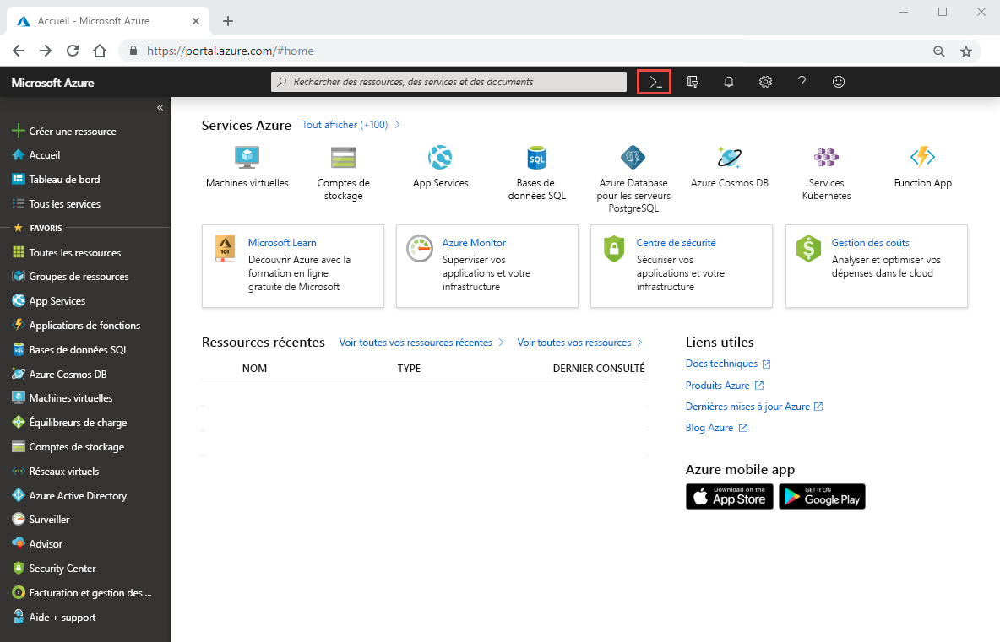

# Démarrage rapide : Configurer Azure NetApp Files et créer un volume NFS 

Cet article explique comment configurer Azure NetApp Files et créer un volume rapidement. 

Lors de ce démarrage rapide, vous allez configurer les éléments suivants :

- Inscription à Azure NetApp Files et au fournisseur de ressources NetApp
- Un compte NetApp
- Un pool de capacités
- Un volume NFS pour Azure NetApp Files

Si vous n’avez pas d’abonnement Azure, créez un [compte gratuit](https://azure.microsoft.com/free/?WT.mc_id=A261C142F) avant de commencer.

## Avant de commencer 

> [!IMPORTANT] 
> Vous devez avoir accès au service Azure NetApp Files.  Pour demander l’accès au service, consultez la [page de soumission d’une liste d’attente Azure NetApp Files](https://forms.office.com/Pages/ResponsePage.aspx?id=v4j5cvGGr0GRqy180BHbR8cq17Xv9yVBtRCSlcD_gdVUNUpUWEpLNERIM1NOVzA5MzczQ0dQR1ZTSS4u).  Vous devez attendre un e-mail de confirmation officiel de l’équipe Azure NetApp Files avant de continuer. 

## S’inscrire à Azure NetApp Files et au fournisseur de ressources NetApp

1. Dans le portail Azure, cliquez sur l’icône Azure Cloud Shell en haut à droite.

    

2. Spécifiez l’abonnement qui a été mis en liste verte pour Azure NetApp Files :
    
        az account set --subscription <subscriptionId>

3. Inscrivez le fournisseur de ressources Azure : 
    
        az provider register --namespace Microsoft.NetApp --wait  

    Le processus d’inscription peut prendre du temps.

## Créer un compte NetApp

1. Dans la zone de recherche du portail Azure, entrez **Azure NetApp Files**, puis sélectionnez **Azure NetApp Files (préversion)** dans la liste qui s’affiche.

      

2. Cliquez sur **+Ajouter** pour créer un nouveau compte NetApp.

     

3. Dans la fenêtre Nouveau compte NetApp, entrez les informations suivantes : 
   1. Entrez **myaccount1** comme nom de compte. 
   2. Sélectionnez votre abonnement.
   3. Sélectionnez **Créer** pour créer un groupe de ressources. Entrez **myRG1** comme nom du groupe de ressources. Cliquez sur **OK**. 
   4. Sélectionnez l’emplacement de votre compte.  

        

      

4. Cliquez sur **Créer** pour créer votre compte NetApp.

## Configurer un pool de capacité

1. Dans le panneau de gestion Azure NetApp Files, sélectionnez votre compte NetApp (**myaccount1**).

      

2. Dans le panneau de gestion Azure NetApp Files de votre compte NetApp, cliquez sur **Pools de capacités**.

      

3. Cliquez sur **+ Ajouter des pools**. 

      

4. Fournissez des informations pour le pool de capacités : 
    1. Entrez **mypool1** comme nom du pool.
    2. Sélectionnez **Premium** pour le niveau de service. 
    3. Spécifiez **4 (Tio)** pour la taille du pool. 

5. Cliquez sur **OK**.

## Créer un volume NFS pour Azure NetApp Files

1. Dans le panneau de gestion Azure NetApp Files de votre compte NetApp, cliquez sur **Volumes**.

      

2. Cliquez sur **+ Ajouter un volume**.

      

3. Dans la fenêtre Créer un volume, spécifiez les informations concernant le nouveau volume : 
   1. Entrez **myvol1** comme nom du volume. 
   3. Sélectionnez votre pool de capacités (**mypool1**).
   4. Utilisez la valeur par défaut du quota. 
   5. Sous Réseau virtuel, cliquez sur **Créer** pour créer un réseau virtuel Azure.  Ensuite, renseignez les informations suivantes :
       * Entrez **myvnet1** comme nom du réseau virtuel.
       * Spécifiez un espace d’adressage pour votre paramètre, par exemple, 10.7.0.0/16
       * Entrez **myANFsubnet** comme nom du sous-réseau.
       * Spécifiez la plage d’adresses du sous-réseau, par exemple, 10.7.0.0/24. Notez que vous ne pouvez pas partager le sous-réseau dédié avec d’autres ressources.
       * Sélectionnez **Microsoft.NetApp/volumes** pour la délégation de sous-réseau.
       * Cliquez sur **OK** pour créer le réseau virtuel.
   6. Dans le sous-réseau, sélectionnez le réseau virtuel qui vient d’être créé (**myvnet1**) comme sous-réseau délégué.

        

        

4. Cliquez sur **Protocole**, puis sélectionnez **NFS** comme type de protocole pour le volume.   

    Entrez **myfilepath1** comme chemin de fichier à utiliser pour créer le chemin d’exportation du nouveau volume. 

    

5. Cliquez sur **Revoir + créer**.

      

5. Passez en revue les informations concernant le volume, puis cliquez sur **Créer**.  
    Le volume créé s’affiche dans le panneau Volumes.

      

## Supprimer des ressources

Lorsque vous avez terminé et si vous le souhaitez, vous pouvez supprimer le groupe de ressources. La suppression d’un groupe de ressources est irréversible.  

> [!IMPORTANT]
> Toutes les ressources dans les groupes de ressources vont être définitivement supprimés et une annulation n’est pas possible. 

1. Dans la zone de recherche du portail Azure, entrez **Azure NetApp Files**, puis sélectionnez **Azure NetApp Files** dans la liste qui s’affiche.

2. Dans la liste des abonnements, cliquez sur le groupe de ressources (myRG1) que vous souhaitez supprimer. 

    

3. Dans la page du groupe de ressources, cliquez sur **Supprimer le groupe de ressources**.

     

    Une fenêtre s’ouvre et affiche un avertissement concernant les ressources qui seront supprimées avec le groupe de ressources.

4. Entrez le nom du groupe de ressources (myRG1) pour confirmer que vous souhaitez supprimer définitivement le groupe de ressources et toutes les ressources qu’il contient, puis cliquez sur **Supprimer**.

     

## Étapes suivantes  

> [!div class="nextstepaction"]
> [Gérer les volumes avec Azure NetApp Files](azure-netapp-files-manage-volumes.md)  
