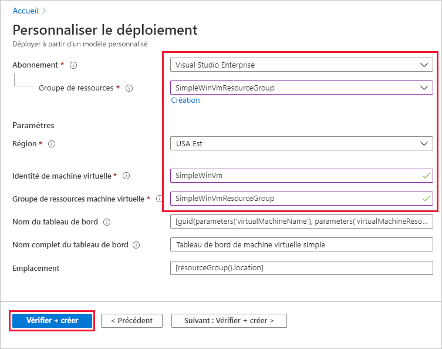
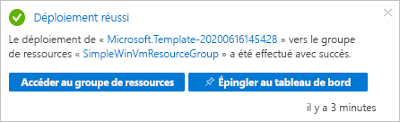
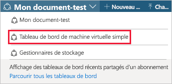
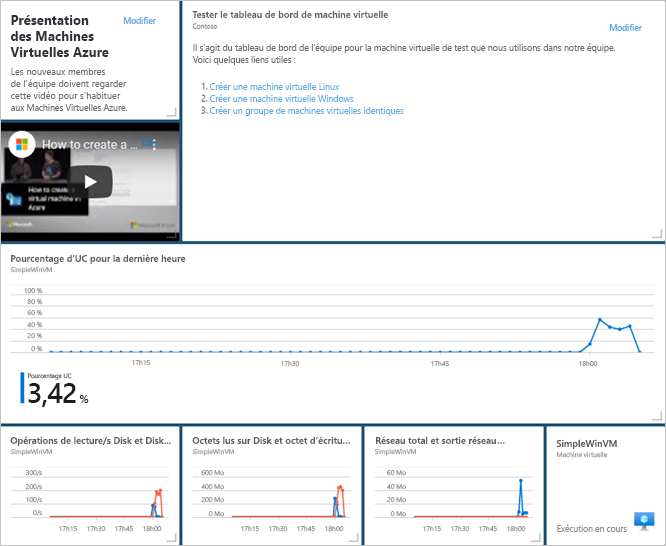
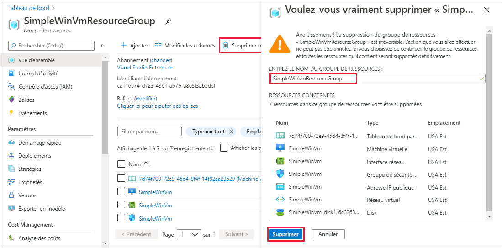

# <a name="quickstart-create-a-dashboard-in-the-azure-portal-by-using-an-arm-template"></a>Démarrage rapide : Créer un tableau de bord dans le portail Azure à l’aide d’un modèle ARM

Dans le portail Azure, un tableau de bord est une vue ciblée et organisée de vos ressources cloud. Ce guide de démarrage rapide porte essentiellement sur le processus de déploiement d’un modèle ARM (Azure Resource Manager) en vue de créer un tableau de bord. Le tableau de bord affiche les performances d’une machine virtuelle, ainsi que des liens et des informations statiques.

[!INCLUDE [About Azure Resource Manager](../../includes/resource-manager-quickstart-introduction.md)]

Si votre environnement remplit les prérequis et que vous êtes déjà familiarisé avec l’utilisation des modèles ARM, sélectionnez le bouton **Déployer sur Azure**. Le modèle s’ouvre dans le portail Azure.

[](https://portal.azure.com/#create/Microsoft.Template/uri/https%3A%2F%2Fraw.githubusercontent.com%2FAzure%2Fazure-quickstart-templates%2Fmaster%2F101-azure-portal-dashboard%2Fazuredeploy.json)

## <a name="prerequisites"></a>Prérequis

- Si vous n’avez pas d’abonnement Azure, créez un [compte gratuit](https://azure.microsoft.com/free/?WT.mc_id=A261C142F) avant de commencer.
- Une machine virtuelle existante.

## <a name="create-a-virtual-machine"></a>Création d'une machine virtuelle

Le tableau de bord que vous créez dans la prochaine partie de ce guide de démarrage rapide nécessite une machine virtuelle existante. Créez une machine virtuelle en effectuant les étapes suivantes.

1. Dans le portail Azure, sélectionnez Cloud Shell.

    

1. Copiez la commande suivante, puis entrez-la à l’invite de commandes pour créer un groupe de ressources.

    ```powershell
    New-AzResourceGroup -Name SimpleWinVmResourceGroup -Location EastUS
    ```

    

1. Copiez la commande suivante, puis entrez-la à l’invite de commandes pour créer une machine virtuelle dans le groupe de ressources.

    ```powershell
    New-AzVm `
        -ResourceGroupName "SimpleWinVmResourceGroup" `
        -Name "SimpleWinVm" `
        -Location "East US" 
    ```

1. Entrez un nom d’utilisateur et un mot de passe pour la machine virtuelle. Il s’agit d’un nouveau nom d’utilisateur et d’un nouveau mot de passe. Ce n’est pas, par exemple, le compte que vous utilisez pour vous connecter à Azure. Pour plus d’informations, consultez les [exigences relatives aux noms d’utilisateur](../virtual-machines/windows/faq.md#what-are-the-username-requirements-when-creating-a-vm) et les [exigences relatives aux mots de passe](../virtual-machines/windows/faq.md#what-are-the-password-requirements-when-creating-a-vm).

    Le déploiement de la machine virtuelle commence alors et prend quelques minutes. Une fois le déploiement terminé, passez à la section suivante.

## <a name="review-the-template"></a>Vérifier le modèle

Le modèle utilisé dans ce démarrage rapide est tiré des [modèles de démarrage rapide Azure](https://azure.microsoft.com/resources/templates/101-azure-portal-dashboard/). Le modèle utilisé pour cet article est trop long pour être affiché ici. Pour voir le modèle, consultez [azuredeploy.json](https://raw.githubusercontent.com/Azure/azure-quickstart-templates/master/101-azure-portal-dashboard/azuredeploy.json). Une ressource Azure est définie dans le modèle, [Microsoft.Portal/dashboards](/azure/templates/microsoft.portal/dashboards) - Créer un tableau de bord dans le portail Azure.

## <a name="deploy-the-template"></a>Déployer le modèle

1. Cliquez sur l’image ci-après pour vous connecter à Azure et ouvrir un modèle.

    [](https://portal.azure.com/#create/Microsoft.Template/uri/https%3A%2F%2Fraw.githubusercontent.com%2FAzure%2Fazure-quickstart-templates%2Fmaster%2F101-azure-portal-dashboard%2Fazuredeploy.json)

1. Sélectionnez ou entrez les valeurs suivantes, puis sélectionnez **Vérifier + créer**.

    

    À moins qu’elles ne soient spécifiées, utilisez les valeurs par défaut pour créer le tableau de bord.

    * **Abonnement** : sélectionnez un abonnement Azure.
    * **Groupe de ressources** : sélectionnez **SimpleWinVmResourceGroup**.
    * **Emplacement** : sélectionnez **USA Est**.
    * **Nom de la machine virtuelle** : entrez **SimpleWinVm**.
    * **Groupe de ressources de la machine virtuelle** : entrez **SimpleWinVmResourceGroup**.

1. Sélectionnez **Créer** ou **Acheter**. Une fois le tableau de bord correctement déployé, vous recevez une notification :

    

Le portail Azure est utilisé pour déployer le modèle. Outre le portail Azure, vous pouvez également utiliser Azure PowerShell, Azure CLI et l’API REST. Pour découvrir d’autres méthodes de déploiement, consultez [Déployer des modèles](../azure-resource-manager/templates/deploy-powershell.md).

## <a name="review-deployed-resources"></a>Vérifier les ressources déployées

Vérifiez que le tableau de bord a été correctement créé et que vous pouvez voir les données de la machine virtuelle.

1. Dans le portail Azure, sélectionnez **Tableau de bord**.

    

1. Dans la page Tableau de bord, sélectionnez **Tableau de bord Machine virtuelle simple**.

    

1. Examinez le tableau de bord créé par le modèle ARM. Vous pouvez voir qu’une partie du contenu est statique, mais il y a également des graphiques qui indiquent les performances de la machine virtuelle que vous avez créée au début.

    

## <a name="clean-up-resources"></a>Nettoyer les ressources

Si vous voulez supprimer la machine virtuelle et le tableau de bord associé, supprimez le groupe de ressources qui les contient.

1. Dans le portail Azure, recherchez **SimpleWinVmResourceGroup**, puis sélectionnez-le dans les résultats de la recherche.

1. Dans la page **SimpleWinVmResourceGroup**, sélectionnez **Supprimer le groupe de ressources**, entrez le nom du groupe de ressources à confirmer, puis sélectionnez **Supprimer**.

    

## <a name="next-steps"></a>Étapes suivantes

Pour plus d’informations sur les tableaux de bord dans le portail Azure, consultez :

> [!div class="nextstepaction"]
> [Créer et partager des tableaux de bord dans le portail Azure](azure-portal-dashboards.md)