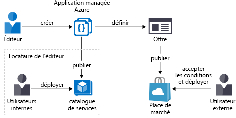
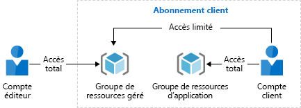

# Vue d’ensemble des applications gérées Azure

Les applications managées Azure vous permettent de proposer aux consommateurs des solutions cloud faciles à déployer et à utiliser. Vous implémentez l’infrastructure et fournissez l’assistance en continu. Pour rendre une application managée accessible à tous les clients, vous devez la publier sur la Place de marché Azure. Pour la rendre accessible uniquement aux utilisateurs de votre organisation, vous devez la publier dans un catalogue interne. 

Une application gérée est similaire à un modèle de solution de la Place de marché à une importante différence près. Dans une application managée, les ressources sont déployées vers un groupe de ressources géré par l’éditeur de l’application. Le groupe de ressources est présent dans l’abonnement du consommateur, mais une identité du locataire de l’éditeur a accès au groupe de ressources. En tant qu’éditeur, vous spécifiez le coût de l’assistance en continu de la solution.

> [!NOTE]
> Jusqu’à présent, la documentation des fournisseurs personnalisés Azure était incluse dans la documentation des applications managées. Cette documentation se trouve maintenant dans [Fournisseurs personnalisés Azure](../custom-providers/overview.md).

## Avantages des applications gérées

Les applications managées offrent de nombreux avantages pour les utilisateurs de vos solutions. Ils n’ont besoin d’aucune compétence en matière d’infrastructure cloud pour utiliser votre solution. Les consommateurs disposent d’un accès limité aux ressources critiques, vous n’avez donc pas à vous soucier de faire des erreurs concernant la gestion. 

Les applications managées vous permettent d’établir une relation suivie avec vos consommateurs. Vous définissez des conditions pour la gestion de l’application, et tous les frais sont gérés par le biais de la facturation Azure.

Bien que les clients déploient ces applications gérées dans leurs abonnements, ils n’ont pas à en gérer la maintenance ni à les mettre à jour. Vous pouvez vous assurer que tous les clients utilisent des versions approuvées. Les clients n’ont pas besoin d’acquérir des connaissances techniques propres aux applications pour les gérer. Les clients obtiennent automatiquement les mises à jour des applications sans avoir à se soucier de la résolution et du diagnostic des problèmes liés aux applications. 

Pour les équipes informatiques, les applications managées permettent d’offrir des solutions préapprouvées aux utilisateurs de l’organisation. Vous savez que ces solutions sont conformes aux normes de l’organisation.

Les applications managées prennent en charge les [identités managées pour les ressources Azure](./publish-managed-identity.md).

## Types d’applications managées

Vous pouvez publier votre application managée en interne ou en externe.

### Catalogue de services

Le catalogue de services est un catalogue interne des solutions approuvées pour les utilisateurs d’une organisation. Vous l’utilisez pour garantir la conformité avec les normes organisationnelles tout en fournissant des solutions à l’organisation. Les employés utilisent le catalogue pour découvrir facilement les applications recommandées et approuvées par leur service informatique. Ils voient les applications managées que d’autres personnes dans leur organisation partagent avec eux.

Pour plus d’informations sur la publication d’une application managée de catalogue de services, consultez [Créer une application de catalogue de services](publish-service-catalog-app.md).

### Marketplace

Les fournisseurs souhaitant facturer leurs services peuvent mettre une application managée à disposition sur la Place de marché Azure. Une fois que le fournisseur a publié une application, les utilisateurs peuvent y accéder en dehors de l’organisation. Avec cette approche, les fournisseurs de services managés, les éditeurs de logiciels indépendants et les intégrateurs de système peuvent proposer leurs solutions à tous les clients Azure.

Pour plus d’informations sur la publication d’une application managée sur la Place de marché, consultez [Créer une application de Place de marché](publish-marketplace-app.md).

## Groupes de ressources pour les applications managées

En règle générale, les ressources d’une application managée résident dans deux groupes de ressources. Le consommateur gère l’un des groupes de ressources, tandis que l’éditeur gère l’autre. Lors de la définition de l’application managée, l’éditeur spécifie les niveaux d’accès. L’éditeur peut demander une affectation de rôle permanente, ou un [accès juste-à-temps](request-just-in-time-access.md) dans le cadre d’une affectation limitée à une période.

La restriction de l’accès aux [opérations de données](../../role-based-access-control/role-definitions.md) n’est actuellement pas prise en charge pour tous les fournisseurs de données dans Azure.

L’illustration suivante montre un scénario dans lequel l’éditeur demande le rôle de propriétaire pour le groupe de ressources managé. L’éditeur a placé un verrou en lecture seule sur ce groupe de ressources pour le consommateur. Les identités de l’éditeur qui ont accès au groupe de ressources managé sont exemptées du verrou.

### Groupe de ressources d’application

Ce groupe de ressources contient l’instance de l’application managée. Ce groupe de ressources ne peut contenir qu’une seule ressource. Le type de ressource de l’application managée est **Microsoft.Solutions/applications**.

Le consommateur dispose d’un accès complet au groupe de ressources et l’utilise pour gérer le cycle de vie de l’application managée.

### Groupe de ressources géré

Ce groupe de ressources contient toutes les ressources exigées par l’application managée. Il contient par exemple les machines virtuelles, les comptes de stockage et les réseaux virtuels pour la solution. Le consommateur dispose d’un accès limité à ce groupe de ressources, car il ne gère pas les ressources individuelles pour l’application managée. L’accès de l’éditeur à ce groupe de ressources correspond au rôle spécifié dans la définition de l’application managée. Par exemple, l’éditeur peut demander le rôle Propriétaire ou Contributeur pour ce groupe de ressources. L’accès est limité de façon permanente ou à une période spécifique.

Lors de la publication de l’[application managée sur la Place de marché](publish-marketplace-app.md), l’éditeur peut donner aux consommateurs la possibilité d’effectuer des actions spécifiques sur les ressources du groupe de ressources managé. Par exemple, l’éditeur peut spécifier que les consommateurs peuvent redémarrer des machines virtuelles. Toutes les autres actions autres que les actions de lecture sont encore refusées.

Quand le consommateur supprime l’application managée, le groupe de ressources managé est également supprimé.

## Azure Policy

Vous pouvez appliquer une stratégie [Azure Policy](../../governance/policy/overview.md) à votre application managée. Vous appliquez des stratégies pour vous assurer que les instances déployées de votre application managée sont conformes aux exigences en matière de sécurité et de données. Si votre application interagit avec des données sensibles, assurez-vous que vous avez évalué comment il convient de la protéger. Par exemple, si votre application interagit avec des données d’Office 365, appliquez une stratégie pour vous assurer que le chiffrement des données est activé.

## Étapes suivantes

Dans cet article, vous avez pris connaissance des avantages de l’utilisation des applications managées. Consultez l’article suivant pour créer une définition d’application managée.

> [!div class="nextstepaction"]
> [Démarrage rapide : Publier une définition d’application managée Azure](publish-service-catalog-app.md)
