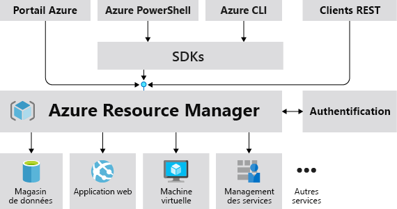

# Qu’est-ce qu’Azure Resource Manager ?

Azure Resource Manager est le service de déploiement et de gestion d’Azure. Il fournit une couche de gestion qui vous permet de créer, de mettre à jour et de supprimer des ressources dans votre compte Azure. Vous utilisez des fonctionnalités de gestion, telles que le contrôle d’accès, les verrous et les étiquettes, pour sécuriser et organiser vos ressources après le déploiement.

Pour en savoir plus sur les modèles Azure Resource Manager, consultez [Vue d’ensemble du déploiement de modèles](../templates/overview.md).

## Couche de gestion cohérente

Quand un utilisateur envoie une requête à partir d’un outil, d’une API ou d’un kit SDK Azure, Resource Manager reçoit la requête. Il authentifie et autorise la requête. Resource Manager envoie la requête au service Azure, qui effectue l’action demandée. Comme toutes les demandes sont gérées via la même API, vous voyez des résultats cohérents et des capacités cohérentes dans tous les différents outils.

L’image suivante montre le rôle qu’Azure Resource Manager joue dans la gestion des requêtes Azure.

Toutes les fonctionnalités disponibles dans le portail sont également disponibles via PowerShell, Azure CLI, les API REST et les SDK clients. Les fonctionnalités initialement publiées par le biais des API seront représentées dans le portail dans les 180 jours après la publication de la version initiale.

## Terminologie

Si vous êtes un nouvel utilisateur d’Azure Resource Manager, vous pouvez ne pas connaître certains termes.

* **ressource** : élément gérable disponible dans Azure. Les machines virtuelles, les comptes de stockage, les applications web, les bases de données et les réseaux virtuels sont des exemples de ressources. Les groupes de ressources, les abonnements, les groupes d’administration et les étiquettes sont également des exemples de ressources.
* **groupe de ressources** : conteneur réunissant les ressources associées d’une solution Azure. Le groupe de ressources inclut les ressources que vous voulez gérer en tant que groupe. Vous déterminez quelles sont les ressources qui appartiennent à un groupe de ressources en fonction de ce qui convient le mieux à votre organisation. Voir [Groupes de ressources](#resource-groups).
* **fournisseur de ressources** : service qui fournit des ressources Azure. Par exemple, Microsoft.Compute est un fournisseur de ressources courant, qui fournit la ressource de machine virtuelle. Microsoft.Storage est un autre fournisseur de ressources courant. Consultez [Fournisseurs et types de ressources](resource-providers-and-types.md).
* **Modèle Resource Manager** : fichier JSON (JavaScript Object Notation) qui définit une ou plusieurs ressources à déployer dans un groupe de ressources, un abonnement, un groupe d’administration ou un locataire. Le modèle peut être utilisé pour déployer les ressources de manière cohérente et répétée. Consultez [Vue d’ensemble du déploiement de modèles](../templates/overview.md).
* **syntaxe déclarative** : syntaxe qui vous permet de déclarer « Voici ce que je souhaite créer » sans avoir à écrire la séquence de commandes de programmation pour le créer. Le modèle Resource Manager est un exemple de syntaxe déclarative. Dans le fichier, vous définissez les propriétés afin de déployer l’infrastructure vers Azure.  Consultez [Vue d’ensemble du déploiement de modèles](../templates/overview.md).

## Avantages de l’utilisation de Resource Manager

Avec Resource Manager, vous pouvez :

* Gérer votre infrastructure à l’aide de modèles déclaratifs plutôt que de scripts

* Déployer, gérer et superviser toutes les ressources de votre solution sous forme de groupe, plutôt qu’individuellement

* Redéployer votre solution tout au long du cycle de vie de développement et vérifier que vos ressources sont déployées dans un état cohérent

* Définir les dépendances entre les ressources pour qu’elles soient déployées dans le bon ordre

* Appliquer le contrôle d’accès à tous les services, car le contrôle d’accès en fonction du rôle Azure (Azure RBAC) est intégré de manière native à la plateforme de gestion.

* Appliquer des étiquettes aux ressources pour organiser de manière logique toutes les ressources de votre abonnement

* Clarifier la facturation de votre organisation en affichant les coûts d’un groupe de ressources qui partagent la même étiquette

## Comprendre la portée

Azure fournit quatre niveaux d’étendue : [Groupes d’administration](../../governance/management-groups/overview.md), Abonnements, [Groupes de ressource](#resource-groups) et Ressources. L’image suivante représente un exemple de ces couches.

Vous appliquez les paramètres de gestion à tous ces niveaux de l’étendue. Le niveau que vous sélectionnez détermine à quel point le paramètre est appliqué. Les niveaux inférieurs héritent des paramètres des niveaux supérieurs. Par exemple, Lorsque vous appliquez une [stratégie](../../governance/policy/overview.md) à l’abonnement, cette stratégie est appliquée à tous les groupes de ressources et les ressources de votre abonnement. Lorsque vous appliquez une stratégie sur le groupe de ressources, cette stratégie est appliquée sur le groupe de ressources et toutes ses ressources. Toutefois, un autre groupe de ressources ne dispose pas de cette affectation de stratégie.

Vous pouvez déployer des modèles sur des locataires, des groupes d’administration, des abonnements ou des groupes de ressources.

## Groupes de ressources

Lorsque vous définissez votre groupe de ressources, vous devez prendre en compte certains facteurs importants :

* Toutes les ressources de votre groupe de ressources doivent partager le même cycle de vie. Les opérations de déploiement, de mise à jour et de suppression porteront sur toutes les ressources du groupe. Si l’une des ressources, comme un serveur, doit exister dans un autre cycle de déploiement, elle doit se trouver à un autre groupe de ressources.

* Chaque ressource ne peut exister que dans un seul groupe de ressources.

* Vous pouvez à tout moment ajouter ou supprimer une ressource au niveau d’un groupe de ressources.

* Vous pouvez déplacer une ressource d’un groupe de ressources vers un autre groupe. Pour plus d’informations, consultez la page [Déplacement de ressources vers un nouveau groupe de ressources ou un abonnement](move-resource-group-and-subscription.md).

* Les ressources d’un groupe de ressources peuvent se trouver dans des régions autres que celle du groupe de ressources.

* Lorsque vous créez un groupe de ressources, vous devez indiquer un emplacement pour ce groupe. Vous vous demandez peut-être « Pourquoi un groupe de ressources a-t-il besoin un emplacement ? Et, si les ressources peuvent avoir des emplacements différents de celui du groupe de ressources, pourquoi l’emplacement du groupe de ressources a-t-il une importance ? ». Le groupe de ressources stocke des métadonnées sur les ressources. Lorsque vous spécifiez un emplacement pour le groupe de ressources, vous indiquez où stocker ces métadonnées. Pour des raisons de conformité, vous devrez peut-être vous assurer que vos données sont stockées dans une région particulière.

   Si la région du groupe de ressources est temporairement indisponible, vous ne pourrez pas mettre à jour les ressources du groupe, car les métadonnées ne seront pas disponibles. Les ressources des autres régions continueront de fonctionner comme prévu, mais vous ne pourrez pas les mettre à jour. Pour plus d’informations sur la conception d’applications fiables, consultez [Concevoir des applications Azure fiables](/azure/architecture/checklist/resiliency-per-service).

* Un groupe de ressources peut être utilisé pour définir l’étendue du contrôle d’accès des actions administratives. Pour gérer un groupe de ressources, vous pouvez affecter des [stratégies Azure](../../governance/policy/overview.md), des [rôles Azure](../../role-based-access-control/role-assignments-portal.md) ou des [verrous de ressources](lock-resources.md).

* Vous pouvez [appliquer des étiquettes](tag-resources.md) à un groupe de ressources. Les ressources présentes dans le groupe de ressources n’héritent pas de ces étiquettes.

* Une ressource peut se connecter à des ressources se trouvant dans d’autres groupes de ressources. Ce scénario est courant quand les deux ressources sont liées mais qu’elles ne partagent pas le même cycle de vie. Par exemple, vous pouvez avoir une application web qui se connecte à une base de données se trouvant dans un groupe de ressources différent.

* Quand vous supprimez un groupe de ressources, toutes les ressources présentes dans ce groupe sont également supprimées. Pour obtenir des informations sur la façon dont Azure Resource Manager orchestre ces suppressions, consultez [Suppression d’un groupe de ressources et de ressources Azure Resource Manager](delete-resource-group.md).

* Vous pouvez déployer jusqu’à 800 instances d’un type de ressource dans chaque groupe de ressources. Certains types de ressources sont [exemptés de la limite de 800 instances](resources-without-resource-group-limit.md).

* Certaines ressources peuvent exister en dehors d’un groupe de ressources. Ces ressources sont déployées dans l’[abonnement](../templates/deploy-to-subscription.md), le [groupe d’administration](../templates/deploy-to-management-group.md) ou le [locataire](../templates/deploy-to-tenant.md). Seuls des types de ressources spécifiques sont pris en charge dans ces étendues.

* Pour créer un groupe de ressources, vous pouvez utiliser le [portail](manage-resource-groups-portal.md#create-resource-groups), [PowerShell](manage-resource-groups-powershell.md#create-resource-groups), [Azure CLI](manage-resource-groups-cli.md#create-resource-groups) ou un [modèle Azure Resource Manager (ARM)](../templates/deploy-to-subscription.md#resource-groups).

## Résilience d’Azure Resource Manager

Le service Azure Resource Manager est conçu pour la résilience et la disponibilité continue. Les opérations Resource Manager et du plan de contrôle (demandes envoyées à management.azure.com) dans l’API REST sont :

* Distribuées dans différentes régions. Certains services sont régionaux.

* Distribuées dans différentes zones de disponibilité (et régions) dans les localisations qui ont plusieurs zones de disponibilité.

* Non dépendantes d’un seul centre de données logique.

* Jamais arrêtées pour des activités de maintenance.

Cette résilience s’applique aux services qui reçoivent des demandes par le biais de Resource Manager. Par exemple, Key Vault bénéficie de cette résilience.

## Étapes suivantes

* Pour en savoir plus sur le déplacement des ressources, consultez [Déplacer des ressources vers un nouveau groupe de ressources ou un nouvel abonnement](move-resource-group-and-subscription.md).

* Pour en savoir plus sur la catégorisation des ressources, consultez [Organisation des ressources Azure à l’aide d’étiquettes](tag-resources.md).

* Pour en savoir plus sur le verrouillage des ressources, consultez [Verrouiller les ressources pour empêcher les modifications inattendues](lock-resources.md).
