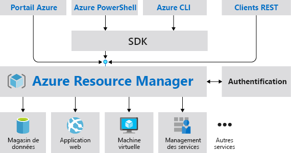
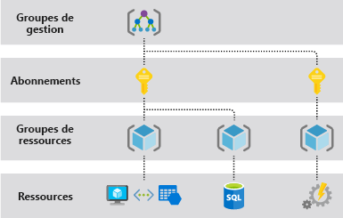
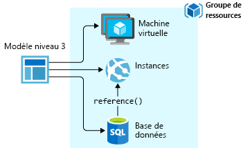
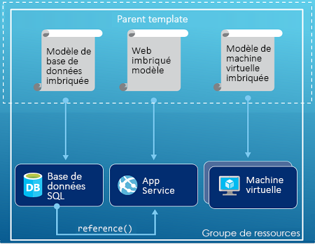
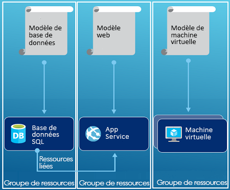

# <a name="azure-resource-manager-overview"></a>Présentation d’Azure Resource Manager

Azure Resource Manager est le service de déploiement et de gestion d’Azure. Il fournit une couche de gestion cohérente qui vous permet de créer, mettre à jour et supprimer des ressources dans votre abonnement Azure. Vous pouvez utiliser ses fonctionnalités de contrôle d’accès, d’audit et de marquage pour sécuriser et organiser vos ressources après déploiement.

Lorsque vous effectuez des actions via le portail, PowerShell, Azure CLI, les API REST ou les kits SDK client, l’API Azure Resource Manager traite votre demande. Comme toutes les demandes sont gérées via la même API, vous voyez des résultats cohérents et des capacités cohérentes dans tous les différents outils. Toutes les fonctionnalités disponibles dans le portail sont également disponibles via PowerShell, Azure CLI, les API REST et les SDK clients. Les fonctionnalités initialement publiées par le biais des API seront représentées dans le portail dans les 180 jours après la publication de la version initiale.

L’illustration suivante montre comment tous ces outils interagissent avec l’API Azure Resource Manager. L’API transmet les requêtes au service Resource Manager, qui authentifie et autorise les requêtes. Ensuite, Resource Manager route les requêtes vers le service approprié.



## <a name="terminology"></a>Terminologie

Si vous êtes un nouvel utilisateur d’Azure Resource Manager, vous pouvez ne pas connaître certains termes.

* **ressource** : élément gérable disponible dans Azure. Les machines virtuelles, les comptes de stockage, les applications web, les bases de données et les réseaux virtuels sont des exemples de ressources.
* **groupe de ressources** : conteneur réunissant les ressources associées d’une solution Azure. Le groupe de ressources inclut les ressources que vous voulez gérer en tant que groupe. Pour déterminer comment allouer des ressources aux groupes de ressources, choisissez l’approche la plus pertinente pour votre organisation. Voir [Groupes de ressources](#resource-groups).
* **fournisseur de ressources** : service qui fournit des ressources Azure. Par exemple, un fournisseur de ressources courant est **Microsoft.Compute**, qui fournit la ressource de machine virtuelle. **Microsoft.Storage** est un autre fournisseur de ressources courant. Voir [Fournisseurs de ressources](#resource-providers).
* **Modèle Resource Manager** : fichier JSON (JavaScript Object Notation) qui définit une ou plusieurs ressources à déployer dans un groupe de ressources ou un abonnement. Le modèle peut être utilisé pour déployer les ressources de manière cohérente et répétée. Voir [Déploiement de modèle](#template-deployment).
* **syntaxe déclarative** : syntaxe qui vous permet de déclarer « Voici ce que je souhaite créer » sans avoir à écrire la séquence de commandes de programmation pour le créer. Le modèle Resource Manager est un exemple de syntaxe déclarative. Dans le fichier, vous définissez les propriétés afin de déployer l’infrastructure vers Azure.

## <a name="the-benefits-of-using-resource-manager"></a>Avantages de l’utilisation de Resource Manager

Resource Manager offre plusieurs avantages :

* Vous pouvez déployer, gérer et surveiller toutes les ressources de votre solution comme un groupe, plutôt que de les gérer individuellement.
* Vous pouvez déployer votre solution à plusieurs reprises tout au long du cycle de vie de développement et avoir ainsi l’assurance que vos ressources présentent un état cohérent lors de leur déploiement.
* Vous pouvez gérer votre infrastructure à l’aide de modèles déclaratifs plutôt que de scripts.
* Vous pouvez définir les dépendances entre les ressources afin de les déployer dans le bon ordre.
* Vous pouvez appliquer le contrôle d’accès à tous les services dans votre groupe de ressources, car le contrôle d’accès en fonction du rôle (RBAC) est intégré en mode natif à la plateforme de gestion.
* Vous pouvez appliquer des balises aux ressources pour organiser logiquement toutes les ressources de votre abonnement.
* Vous pouvez clarifier la facturation de votre organisation en affichant les coûts d’un groupe de ressources partageant la même balise.

## <a name="understand-management-scope"></a>Comprendre l’étendue de la gestion

Azure fournit quatre niveaux d’étendue de gestion : [Groupes d’administration](../governance/management-groups/index.md), Abonnements, [Groupes de ressource](#resource-groups) et Ressources. L’image suivante représente un exemple de ces couches.



Vous appliquez les paramètres de gestion à tous ces niveaux de l’étendue. Le niveau que vous sélectionnez détermine à quel point le paramètre est appliqué. Les niveaux inférieurs héritent des paramètres des niveaux supérieurs. Par exemple, Lorsque vous appliquez une [stratégie](../governance/policy/overview.md) à l’abonnement, cette stratégie est appliquée à tous les groupes de ressources et les ressources de votre abonnement. Lorsque vous appliquez une stratégie sur le groupe de ressources, cette stratégie est appliquée sur le groupe de ressources et toutes ses ressources. Toutefois, un autre groupe de ressources ne dispose pas de cette affectation de stratégie.

## <a name="guidance"></a>Assistance

Les suggestions suivantes vous aideront à tirer le meilleur parti de Resource Manager lorsque vous travaillez avec vos solutions.

* Définissez et déployez votre infrastructure via la syntaxe déclarative dans les modèles du Resource Manager, et non via des commandes impératives.
* Définissez toutes les étapes de déploiement et de configuration dans le modèle. Aucune étape manuelle ne devrait intervenir dans la configuration de votre solution.
* Exécutez des commandes impératives pour gérer vos ressources, par exemple démarrer ou arrêter une application ou une machine.
* Organisez des ressources avec le même cycle de vie dans un groupe de ressources. Utilisez des balises pour toute organisation des ressources.

Pour obtenir des conseils sur l’utilisation de Resource Manager par les entreprises pour gérer efficacement les abonnements, voir [Structure d’Azure Enterprise - Gouvernance normative de l’abonnement](/azure/architecture/cloud-adoption-guide/subscription-governance?toc=%2fazure%2fazure-resource-manager%2ftoc.json).

Pour obtenir des suggestions sur la création de modèles Resource Manager, consultez [Bonnes pratiques relatives aux modèles Azure Resource Manager](template-best-practices.md).

## <a name="resource-groups"></a>Groupes de ressources
Lorsque vous définissez votre groupe de ressources, vous devez prendre en compte certains facteurs importants :

* Toutes les ressources de votre groupe doivent partager le même cycle de vie. Les opérations de déploiement, de mise à jour et de suppression porteront sur toutes les ressources du groupe. Si l’une des ressources, comme un serveur de base de données, doit exister dans un autre cycle de déploiement, elle doit appartenir à un autre groupe de ressources.
* Chaque ressource ne peut exister que dans un seul groupe de ressources.
* Vous pouvez à tout moment ajouter ou supprimer une ressource au niveau d’un groupe de ressources.
* Vous pouvez déplacer une ressource d’un groupe de ressources vers un autre groupe. Pour plus d’informations, consultez la page [Déplacement de ressources vers un nouveau groupe de ressources ou un abonnement](resource-group-move-resources.md).
* Un groupe de ressources peut contenir des ressources figurant dans différentes régions.
* Un groupe de ressources peut être utilisé pour définir l’étendue du contrôle d’accès des actions administratives.
* Une ressource peut interagir avec celles d’autres groupes de ressources. Cette interaction est courante quand les deux ressources sont liées, mais qu’elles ne partagent pas le même cycle de vie (par exemple, des applications web connectées à une base de données).

Lorsque vous créez un groupe de ressources, vous devez indiquer un emplacement pour ce groupe. Vous vous demandez peut-être « Pourquoi un groupe de ressources a-t-il besoin un emplacement ? Et, si les ressources peuvent avoir des emplacements différents de celui du groupe de ressources, pourquoi l’emplacement du groupe de ressources a-t-il une importance ? ». Le groupe de ressources stocke des métadonnées sur les ressources. Quand vous spécifiez un emplacement pour le groupe de ressources, vous indiquez donc où stocker ces métadonnées. Pour des raisons de conformité, vous devrez peut-être vous assurer que vos données sont stockées dans une région particulière.

Si la région du groupe de ressources est temporairement indisponible, vous ne pourrez pas mettre à jour les ressources du groupe, car les métadonnées ne seront pas disponibles. Les ressources des autres régions continueront de fonctionner comme prévu, mais vous ne pourrez pas les mettre à jour. Pour réduire les risques, placez votre groupe de ressources et vos ressources dans la même région.

## <a name="resource-providers"></a>Fournisseurs de ressources

Chaque fournisseur de ressources propose un ensemble de ressources et d’opérations pour utiliser ces ressources. Par exemple, si vous voulez stocker des clés et des secrets, vous travaillez avec le fournisseur de ressources **Microsoft.KeyVault** . Ce fournisseur de ressources offre un type de ressource appelé **coffres** pour créer le coffre de clés.

Le nom d’un type de ressource est au format : **{fournisseur de ressources}/{type de ressource}** . Le type de ressource pour un coffre de clés est **Microsoft.KeyVault/vaults**.

Avant de commencer à déployer vos ressources, vous devez connaître les fournisseurs de ressources disponibles. Connaître les noms des fournisseurs de ressources et des ressources vous permettra de mieux définir les ressources que vous allez déployer dans Azure. En outre, vous devez connaître les emplacements valides et les versions d’API pour chaque type de ressource. Pour plus d’informations, consultez [les types et les fournisseurs de ressources](resource-manager-supported-services.md).

Pour connaître toutes les opérations proposées par les fournisseurs de ressources, consultez les [API REST Azure](/rest/api/azure/).

## <a name="template-deployment"></a>Déploiement de modèle

Avec Resource Manager, vous pouvez créer un modèle (au format JSON) définissant l’infrastructure et la configuration de votre solution Azure. Un modèle vous permet de déployer votre solution à plusieurs reprises tout au long de son cycle de vie pour avoir la garantie que vos ressources présentent un état cohérent lors de leur déploiement.

Pour en savoir plus sur le format du modèle et la manière de le construire, consultez [Comprendre la structure et la syntaxe des modèles Azure Resource Manager](resource-group-authoring-templates.md). Pour afficher la syntaxe JSON pour les types de ressources, voir [Définir des ressources dans les modèles Azure Resource Manager](/azure/templates/).

Resource Manager traite le modèle comme toute autre requête. Il analyse le modèle et convertit sa syntaxe en opérations API REST pour les fournisseurs de ressources appropriés. Par exemple, lorsque Resource Manager reçoit un modèle avec la définition de ressource suivante :

```json
"resources": [
  {
    "apiVersion": "2016-01-01",
    "type": "Microsoft.Storage/storageAccounts",
    "name": "mystorageaccount",
    "location": "westus",
    "sku": {
      "name": "Standard_LRS"
    },
    "kind": "Storage",
    "properties": {
    }
  }
]
```

Il convertit la définition en opération API REST suivante, qui est envoyée au fournisseur de ressources Microsoft.Storage :

```HTTP
PUT
https://management.azure.com/subscriptions/{subscriptionId}/resourceGroups/{resourceGroupName}/providers/Microsoft.Storage/storageAccounts/mystorageaccount?api-version=2016-01-01
REQUEST BODY
{
  "location": "westus",
  "properties": {
  }
  "sku": {
    "name": "Standard_LRS"
  },
  "kind": "Storage"
}
```

La manière dont vous définissez les modèles et les groupes de ressources dépend entièrement de vous et de la façon dont vous voulez gérer votre solution. Par exemple, vous pouvez déployer votre application à trois niveaux via un modèle unique pour un groupe de ressources unique.



Cependant, il est inutile de définir toute votre infrastructure dans un seul modèle. Il peut être judicieux de diviser les exigences de votre déploiement dans un ensemble de modèles ciblés destinés à un usage particulier. Vous pouvez facilement réutiliser ces modèles pour différentes solutions. Pour déployer une solution particulière, créez un modèle de référence qui relie tous les modèles requis. L’illustration suivante montre comment déployer une solution à trois niveaux via un modèle parent qui inclut trois modèles imbriqués.



Si vos niveaux vont avoir des cycles de vie distincts, vous pouvez déployer les trois niveaux dans des groupes de ressources séparés. Notez que les ressources peuvent toujours être liées aux ressources dans d’autres groupes.



Pour plus d’informations sur les modèles imbriqués, consultez [Utilisation de modèles liés avec Azure Resource Manager](resource-group-linked-templates.md).

Azure Resource Manager analyse les dépendances pour vérifier que les ressources sont créées dans l’ordre approprié. Si une ressource dépend d’une valeur d’une autre ressource (par exemple, une machine virtuelle ayant besoin d’un compte de stockage pour les disques), vous devez définir une dépendance. Pour plus d’informations, consultez [Définition de dépendances dans des modèles Azure Resource Manager](resource-group-define-dependencies.md).

Vous pouvez également utiliser le modèle pour les mises à jour de l’infrastructure. Par exemple, vous pouvez ajouter une ressource à votre solution et ajouter des règles de configuration pour les ressources qui sont déjà déployées. Si le modèle définit une ressource qui existe déjà, Resource Manager met à jour la ressource existante au lieu d’en créer une nouvelle.

Resource Manager fournit des extensions pour les cas qui nécessitent des opérations supplémentaires, comme l’installation d’un logiciel spécifique non inclus dans la configuration. Si vous utilisez déjà un service de gestion de configuration, comme DSC, Chef ou Puppet, vous pouvez continuer à travailler avec ce service en utilisant des extensions. Pour plus d’informations sur les extensions de machines virtuelles, consultez la page [À propos des extensions et des fonctionnalités des machines virtuelles](../virtual-machines/windows/extensions-features.md?toc=%2fazure%2fvirtual-machines%2fwindows%2ftoc.json).

Lorsque vous créez une solution à partir du portail, cette solution inclut automatiquement un modèle de déploiement. Vous n’êtes pas contraint de créer votre modèle à partir de zéro, car vous pouvez partir du modèle de votre solution et le personnaliser en fonction de vos besoins spécifiques. Pour obtenir un exemple, consultez [Démarrage rapide : Créer et déployer des modèles Azure Resource Manager à l’aide du portail Azure](./resource-manager-quickstart-create-templates-use-the-portal.md). Vous pouvez également récupérer un modèle pour un groupe de ressources existant en exportant l’état actuel du groupe de ressources ou en affichant le modèle utilisé pour un déploiement particulier. L’affichage du [modèle exporté](./manage-resource-groups-portal.md#export-resource-groups-to-templates) est un moyen utile pour en découvrir plus sur sa syntaxe.

Pour finir, le modèle devient partie intégrante du code source de votre application. Vous pouvez l’archiver dans votre référentiel de code source et le mettre à jour à mesure que votre application évolue. Le modèle est modifiable par le biais de Visual Studio.

Une fois votre modèle défini, vous êtes prêt à déployer vos ressources dans Azure. Pour déployer les ressources, consultez les articles suivants :

* [Déployer des ressources à l’aide de modèles Resource Manager et d’Azure PowerShell](resource-group-template-deploy.md)
* [Déployer des ressources à l’aide de modèles Resource Manager et de l’interface de ligne de commande Azure](resource-group-template-deploy-cli.md)
* [Déployer des ressources à l’aide de modèles Resource Manager et du Portail Azure](resource-group-template-deploy-portal.md)
* [Déployer des ressources à l’aide de modèles Resource Manager et de l’API REST Resource Manager](resource-group-template-deploy-rest.md)

## <a name="safe-deployment-practices"></a>Pratiques de déploiement sécurisé

Lorsque vous déployez un service complexe vers Azure, vous devrez peut-être déployer votre service dans plusieurs régions et contrôler son intégrité avant de passer à l’étape suivante. Utilisez [Azure Deployment Manager](deployment-manager-overview.md) pour coordonner un déploiement intermédiaire du service. Avec un déploiement intermédiaire de votre service, vous pouvez rechercher des problèmes potentiels avant le déploiement dans toutes les régions. Si vous n’avez pas besoin de ces précautions, les opérations de déploiement dans la section précédente constituent la meilleure option.

Deployment Manager est actuellement en préversion publique.

## <a name="resiliency-of-azure-resource-manager"></a>Résilience d’Azure Resource Manager

Le service Azure Resource Manager est conçu pour la résilience et la disponibilité continue. Les opérations Resource Manager et du plan de contrôle (demandes envoyées à management.azure.com) dans l’API REST sont :

* Distribuées dans différentes régions. Certains services sont régionaux.

* Distribuées dans différentes zones de disponibilité (et régions) dans les localisations qui ont plusieurs zones de disponibilité.

* Non dépendantes d’un seul centre de données logique.

* Jamais arrêtées pour des activités de maintenance.

Cette résilience s’applique aux services qui reçoivent des demandes par le biais de Resource Manager. Par exemple, Key Vault bénéficie de cette résilience.

[!INCLUDE [arm-tutorials-quickstarts](../../includes/resource-manager-tutorials-quickstarts.md)]

## <a name="next-steps"></a>Étapes suivantes

Dans cet article, vous avez appris à utiliser Azure Resource Manager pour les tâches de déploiement, de gestion et de contrôle d’accès des ressources sur Azure. Passez à l’article suivant pour apprendre à créer votre premier modèle Azure Resource Manager.

> [!div class="nextstepaction"]
> [Démarrage rapide : Créer et déployer des modèles Azure Resource Manager à l’aide du portail Azure](./resource-manager-quickstart-create-templates-use-the-portal.md)
